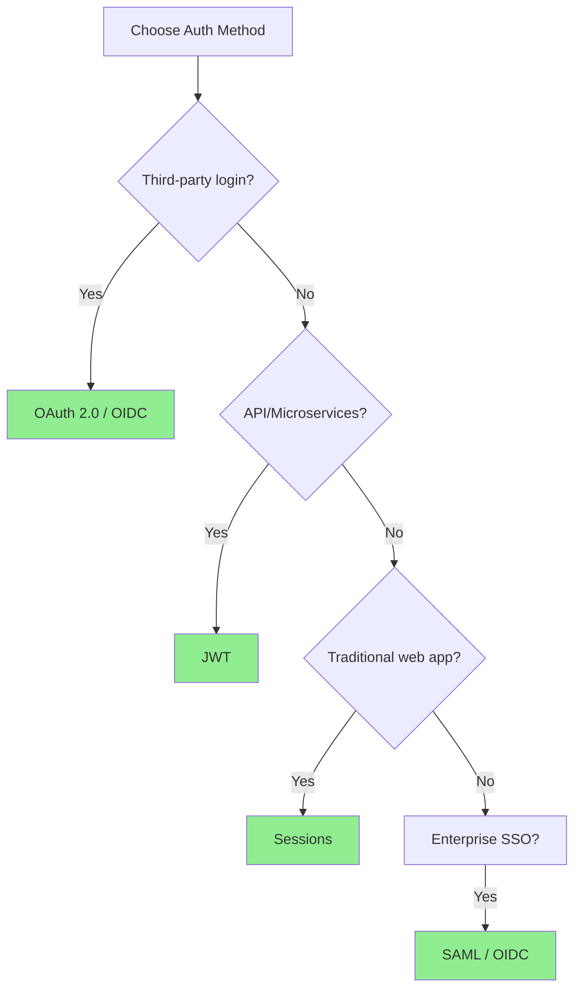
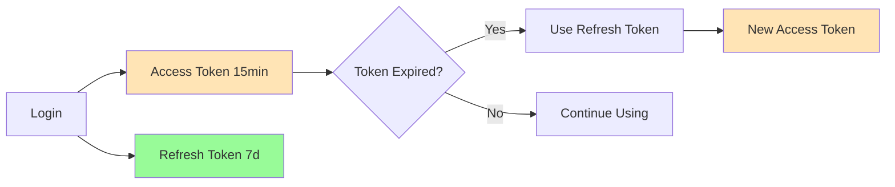
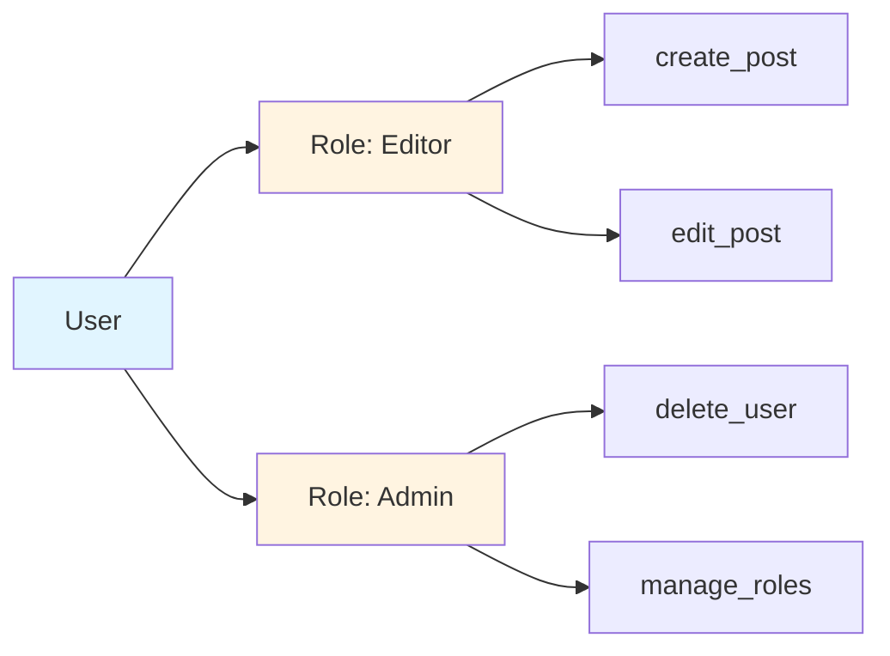

Core authentication and authorization concepts overview. This page provides a quick reference and links to detailed guides.

## Quick Reference

### Authentication vs Authorization

**Authentication (AuthN)**: *Who are you?*
- Verifying identity
- Credentials: username/password, tokens, biometrics
- Result: User identity established

**Authorization (AuthZ)**: *What can you do?*
- Verifying permissions
- Access control: roles, permissions, policies
- Result: Access granted or denied

---

## Authentication Methods

Detailed guide: [Authentication Methods](../auth-methods/)

### Method Comparison

| Method | Stateless | Scalability | Revocation | Mobile | Complexity |
|--------|-----------|-------------|------------|--------|------------|
| **Session** | ❌ | ⭐⭐ | ✅ Instant | ⭐⭐ | ⭐ Low |
| **JWT** | ✅ | ⭐⭐⭐⭐⭐ | ❌ (use short TTL) | ⭐⭐⭐⭐⭐ | ⭐⭐ Medium |
| **OAuth 2.0** | ✅ | ⭐⭐⭐⭐⭐ | ✅ | ⭐⭐⭐⭐⭐ | ⭐⭐⭐⭐ High |
| **OIDC** | ✅ | ⭐⭐⭐⭐⭐ | ✅ | ⭐⭐⭐⭐⭐ | ⭐⭐⭐⭐ High |
| **SAML** | ✅ | ⭐⭐⭐ | ✅ | ⭐ | ⭐⭐⭐⭐⭐ Very High |

### Quick Decision Tree



**Coverage:**
- Session-Based Authentication
- Token-Based (JWT)
- OAuth 2.0
- OpenID Connect (OIDC)
- SAML 2.0

---

## Authorization Models

Detailed guide: [Authorization Models](../authorization-models/)

### Model Comparison

| Model | Granularity | Complexity | Scalability | Use Case |
|-------|-------------|------------|-------------|----------|
| **RBAC** | Coarse | Low | Good | General web apps |
| **ABAC** | Fine | High | Excellent | Complex compliance |
| **ACL** | Fine | Medium | Poor | File systems, documents |

**Coverage:**
- Role-Based Access Control (RBAC)
- Attribute-Based Access Control (ABAC)
- Access Control Lists (ACL)
- Hybrid approaches

---

## Security Best Practices

Detailed guide: [Authentication Security](../auth-security/)

### Essential Security Checklist

```text
✅ Passwords hashed with bcrypt/Argon2 (cost ≥ 12)
✅ HTTPS enforced everywhere
✅ Rate limiting on authentication endpoints
✅ CSRF protection enabled
✅ Secure cookie flags (HttpOnly, Secure, SameSite)
✅ JWT with short expiration + refresh tokens
✅ MFA available for sensitive operations
✅ Authorization checks on every endpoint
✅ Regular security audits
```

### Token Storage Recommendation

| Storage | Security | Recommendation |
|---------|----------|----------------|
| LocalStorage | ❌ Vulnerable to XSS | Avoid |
| SessionStorage | ❌ Vulnerable to XSS | Temporary data only |
| HttpOnly Cookie | ✅ Protected | ✅ Best for web |
| Memory only | ✅ Most secure | ✅ SPAs (lost on refresh) |

**Coverage:**
- Password security (hashing, policies)
- Token storage strategies
- CSRF protection
- Multi-Factor Authentication (MFA)
- JWT vulnerabilities
- Common attack vectors

---

## Common Patterns

### Token Refresh Flow



### RBAC Structure



---

## Quick Implementation Examples

### Session-Based (Express.js)

```javascript
const session = require('express-session');

app.use(session({
    secret: process.env.SESSION_SECRET,
    resave: false,
    saveUninitialized: false,
    cookie: {
        httpOnly: true,
        secure: true,
        sameSite: 'strict',
        maxAge: 3600000 // 1 hour
    }
}));
```

### JWT (Python)

```python
import jwt
from datetime import datetime, timedelta

# Create token
token = jwt.encode({
    'sub': user_id,
    'exp': datetime.utcnow() + timedelta(minutes=15),
    'iat': datetime.utcnow()
}, secret_key, algorithm='HS256')

# Verify token
payload = jwt.decode(token, secret_key, algorithms=['HS256'])
```

### RBAC Check

```python
def has_permission(user, permission):
    for role in user.roles:
        if permission in role.permissions:
            return True
    return False

# Usage
if has_permission(current_user, 'delete_post'):
    delete_post(post_id)
```

---

## Related Resources

- [Authentication Methods](../auth-methods/) - Detailed comparison and implementation
- [Authorization Models](../authorization-models/) - RBAC, ABAC, ACL explained
- [Authentication Security](../auth-security/) - Security best practices and vulnerabilities
- [OAuth 2.0 Spec](https://oauth.net/2/)
- [JWT.io](https://jwt.io/)
- [OWASP Authentication Cheat Sheet](https://cheatsheetseries.owasp.org/cheatsheets/Authentication_Cheat_Sheet.html)
