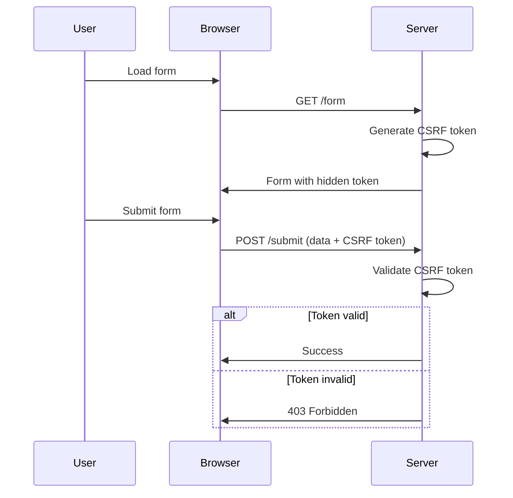
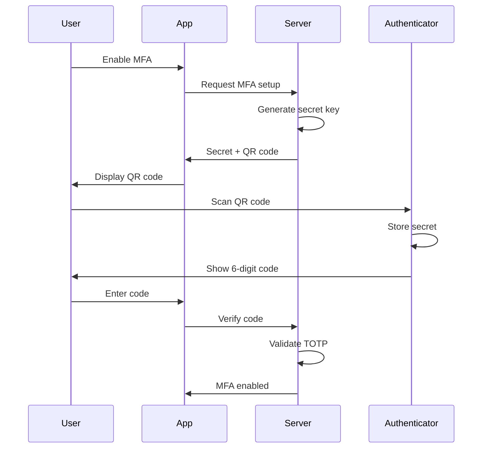
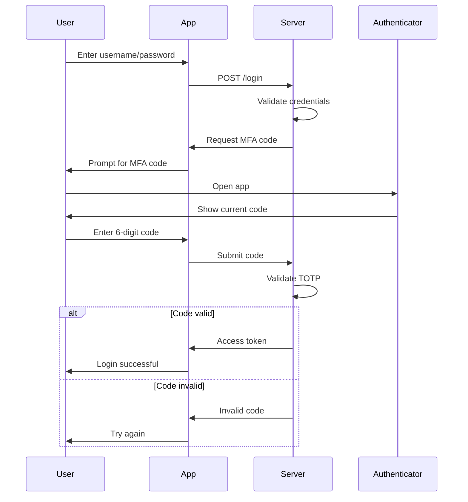
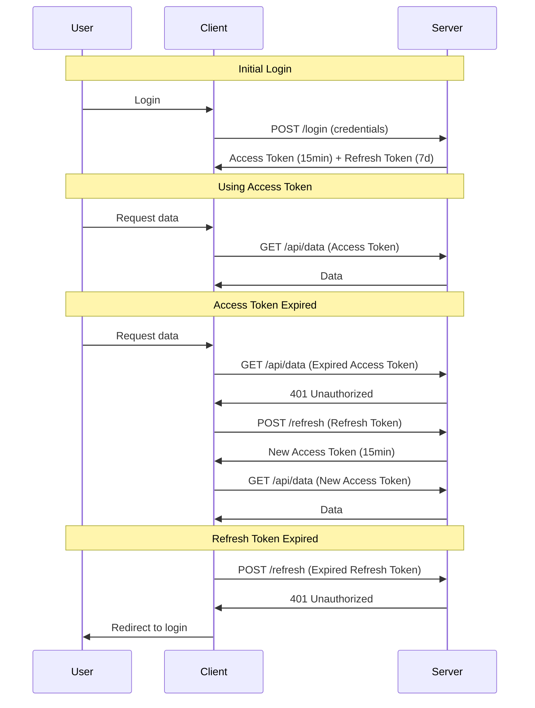

Security best practices for authentication: password security, token storage, CSRF protection, MFA, and common vulnerabilities.

## Password Security

### Best Practices

```text
✅ DO:
- Use bcrypt, scrypt, or Argon2 for hashing
- Minimum 12 characters
- Require complexity (upper, lower, number, symbol)
- Implement rate limiting on login
- Use HTTPS only
- Implement account lockout after failed attempts
- Check against breach databases (Have I Been Pwned)

❌ DON'T:
- Store passwords in plain text
- Use MD5 or SHA1 for passwords
- Email passwords to users
- Allow common passwords (password123, qwerty)
- Use reversible encryption
```

### Password Hashing Example

```python
import bcrypt

# Hashing a password
password = "user_password"
salt = bcrypt.gensalt(rounds=12)  # Cost factor: 12
hashed = bcrypt.hashpw(password.encode('utf-8'), salt)

# Verifying a password
def verify_password(plain_password, hashed_password):
    return bcrypt.checkpw(
        plain_password.encode('utf-8'),
        hashed_password
    )
```

```javascript
// Node.js with bcrypt
const bcrypt = require('bcrypt');

// Hash password
const saltRounds = 12;
const hash = await bcrypt.hash(password, saltRounds);

// Verify password
const match = await bcrypt.compare(password, hash);
```

### Password Policy Example

```python
import re

def validate_password(password):
    if len(password) < 12:
        return False, "Password must be at least 12 characters"
    
    if not re.search(r'[A-Z]', password):
        return False, "Password must contain uppercase letter"
    
    if not re.search(r'[a-z]', password):
        return False, "Password must contain lowercase letter"
    
    if not re.search(r'\d', password):
        return False, "Password must contain number"
    
    if not re.search(r'[!@#$%^&*(),.?":{}|<>]', password):
        return False, "Password must contain special character"
    
    # Check against common passwords
    if password.lower() in COMMON_PASSWORDS:
        return False, "Password is too common"
    
    return True, "Password is valid"
```

---

## Token Storage

### Storage Options Comparison

| Location | XSS Vulnerable | CSRF Vulnerable | Best For |
|----------|----------------|-----------------|----------|
| **LocalStorage** | ✅ Yes | ❌ No | ❌ Avoid for auth tokens |
| **SessionStorage** | ✅ Yes | ❌ No | Temporary data only |
| **Cookie (HttpOnly)** | ❌ No | ✅ Yes | Session tokens (with CSRF protection) |
| **Cookie (HttpOnly + Secure + SameSite)** | ❌ No | ❌ No | ✅ Best for web apps |
| **Memory only** | ❌ No | ❌ No | ✅ SPAs (lost on refresh) |

### Recommended Cookie Configuration

```text
Set-Cookie: token=abc123; HttpOnly; Secure; SameSite=Strict; Max-Age=3600; Path=/
```

**Flags Explained:**
- `HttpOnly`: Prevents JavaScript access (XSS protection)
- `Secure`: Only sent over HTTPS
- `SameSite=Strict`: Prevents CSRF attacks
- `Max-Age`: Token lifetime in seconds
- `Path=/`: Cookie scope

### Implementation Examples

```javascript
// Express.js (Node.js)
res.cookie('token', jwtToken, {
    httpOnly: true,
    secure: process.env.NODE_ENV === 'production',
    sameSite: 'strict',
    maxAge: 3600000 // 1 hour in milliseconds
});
```

```python
# Flask (Python)
response.set_cookie(
    'token',
    jwt_token,
    httponly=True,
    secure=True,
    samesite='Strict',
    max_age=3600
)
```

```go
// Go
http.SetCookie(w, &http.Cookie{
    Name:     "token",
    Value:    jwtToken,
    HttpOnly: true,
    Secure:   true,
    SameSite: http.SameSiteStrictMode,
    MaxAge:   3600,
    Path:     "/",
})
```

---

## CSRF Protection

### What is CSRF?

Cross-Site Request Forgery: Attacker tricks user into making unwanted requests to a site where they're authenticated.

### Attack Example

```html
<!-- Malicious site -->

<!-- Browser automatically sends cookies! -->
```

### Protection Methods

#### 1. CSRF Tokens (Synchronizer Token Pattern)



**Implementation:**

```python
# Flask with Flask-WTF
from flask_wtf.csrf import CSRFProtect

app = Flask(__name__)
app.config['SECRET_KEY'] = 'your-secret-key'
csrf = CSRFProtect(app)

# In template
<form method="POST">
    {{ csrf_token() }}
    <!-- form fields -->
</form>
```

```javascript
// Express.js with csurf
const csrf = require('csurf');
const csrfProtection = csrf({ cookie: true });

app.get('/form', csrfProtection, (req, res) => {
    res.render('form', { csrfToken: req.csrfToken() });
});

app.post('/submit', csrfProtection, (req, res) => {
    // CSRF token automatically validated
});
```

#### 2. SameSite Cookies

```text
Set-Cookie: session=abc; SameSite=Strict
```

- `Strict`: Cookie never sent on cross-site requests
- `Lax`: Cookie sent on top-level navigation (GET only)
- `None`: Cookie sent on all requests (requires Secure flag)

#### 3. Double Submit Cookie

```text
1. Server sets CSRF token in cookie
2. Client reads cookie, sends in custom header
3. Server validates cookie matches header
```

```javascript
// Client-side
const csrfToken = getCookie('csrf_token');
fetch('/api/data', {
    method: 'POST',
    headers: {
        'X-CSRF-Token': csrfToken
    },
    body: JSON.stringify(data)
});
```

#### 4. Custom Headers (for APIs)

```javascript
// CORS prevents cross-origin custom headers
fetch('/api/data', {
    method: 'POST',
    headers: {
        'X-Requested-With': 'XMLHttpRequest'
    }
});
```

---

## Multi-Factor Authentication (MFA)

### Authentication Factors

1. **Something you know**: Password, PIN
2. **Something you have**: Phone, hardware token, authenticator app
3. **Something you are**: Fingerprint, face recognition

### TOTP (Time-based One-Time Password)

```text
Shared Secret → HMAC-SHA1(Secret, Time) → 6-digit code
```

#### Setup Flow



#### Login Flow with MFA



#### Implementation Example

```python
import pyotp
import qrcode

# Generate secret
secret = pyotp.random_base32()

# Generate QR code
totp_uri = pyotp.totp.TOTP(secret).provisioning_uri(
    name='user@example.com',
    issuer_name='MyApp'
)
qrcode.make(totp_uri).save('qr_code.png')

# Verify code
def verify_totp(secret, code):
    totp = pyotp.TOTP(secret)
    return totp.verify(code, valid_window=1)  # Allow 30s window
```

```javascript
// Node.js with speakeasy
const speakeasy = require('speakeasy');
const QRCode = require('qrcode');

// Generate secret
const secret = speakeasy.generateSecret({
    name: 'MyApp (user@example.com)'
});

// Generate QR code
QRCode.toDataURL(secret.otpauth_url, (err, dataUrl) => {
    // Display dataUrl as image
});

// Verify code
const verified = speakeasy.totp.verify({
    secret: secret.base32,
    encoding: 'base32',
    token: userCode,
    window: 1
});
```

### Backup Codes

```python
import secrets

def generate_backup_codes(count=10):
    codes = []
    for _ in range(count):
        code = '-'.join([
            secrets.token_hex(2).upper()
            for _ in range(3)
        ])
        codes.append(code)
    return codes

# Example output: ['A3-F7-2B', 'D9-1C-8E', ...]

# Store hashed
import bcrypt
hashed_codes = [bcrypt.hashpw(code.encode(), bcrypt.gensalt()) 
                for code in codes]
```

---

## Token Refresh Pattern



### Benefits

- Short-lived access tokens limit damage if stolen
- Can revoke refresh tokens server-side
- Balance security and UX

### Storage Strategy

- **Access Token**: Memory (SPA) or HttpOnly cookie
- **Refresh Token**: HttpOnly, Secure, SameSite cookie (longer TTL)

### Implementation Example

```javascript
// Client-side token refresh
async function fetchWithAuth(url, options = {}) {
    let response = await fetch(url, {
        ...options,
        headers: {
            ...options.headers,
            'Authorization': `Bearer ${accessToken}`
        }
    });
    
    if (response.status === 401) {
        // Try to refresh token
        const refreshed = await refreshAccessToken();
        if (refreshed) {
            // Retry original request
            response = await fetch(url, {
                ...options,
                headers: {
                    ...options.headers,
                    'Authorization': `Bearer ${accessToken}`
                }
            });
        } else {
            // Redirect to login
            window.location.href = '/login';
        }
    }
    
    return response;
}

async function refreshAccessToken() {
    const response = await fetch('/api/refresh', {
        method: 'POST',
        credentials: 'include' // Send refresh token cookie
    });
    
    if (response.ok) {
        const data = await response.json();
        accessToken = data.access_token;
        return true;
    }
    return false;
}
```

---

## Common Vulnerabilities

### 1. JWT Vulnerabilities

**Algorithm Confusion Attack:**

```json
// Attacker changes header
{
  "alg": "none",  // Changed from "RS256"
  "typ": "JWT"
}
```

**Mitigation:**

```python
# Always specify and validate algorithm
import jwt

def verify_token(token):
    try:
        payload = jwt.decode(
            token,
            public_key,
            algorithms=['RS256']  # Whitelist specific algorithm
        )
        return payload
    except jwt.InvalidAlgorithmError:
        return None
```

**Other JWT Issues:**

```text
❌ Weak signing keys (< 256 bits)
❌ No expiration validation
❌ Storing sensitive data in payload (it's base64, not encrypted!)
❌ Not validating issuer (iss) and audience (aud)
```

**Best Practices:**

```python
# Generate strong key
import secrets
secret_key = secrets.token_urlsafe(32)  # 256 bits

# Create JWT with all claims
token = jwt.encode({
    'sub': user_id,
    'iat': datetime.utcnow(),
    'exp': datetime.utcnow() + timedelta(minutes=15),
    'iss': 'myapp.com',
    'aud': 'myapp.com'
}, secret_key, algorithm='HS256')

# Verify with all checks
payload = jwt.decode(
    token,
    secret_key,
    algorithms=['HS256'],
    issuer='myapp.com',
    audience='myapp.com'
)
```

### 2. Broken Access Control (IDOR)

**Insecure Direct Object References:**

```text
❌ BAD: GET /api/users/123/orders
→ Attacker changes to /api/users/456/orders
```

**Mitigation:**

```python
@app.route('/api/users/<user_id>/orders')
@login_required
def get_orders(user_id):
    # Always check authorization!
    if current_user.id != user_id and not current_user.is_admin:
        abort(403)
    
    return Orders.query.filter_by(user_id=user_id).all()
```

**Better: Use UUIDs instead of sequential IDs:**

```python
import uuid

# Generate UUID
user_id = str(uuid.uuid4())  # e.g., '550e8400-e29b-41d4-a716-446655440000'
```

### 3. Session Fixation

**Attack:** Attacker sets victim's session ID before login

**Mitigation:**

```python
# Regenerate session ID after login
@app.route('/login', methods=['POST'])
def login():
    user = authenticate(request.form['username'], request.form['password'])
    if user:
        # Regenerate session ID
        session.regenerate()
        session['user_id'] = user.id
        return redirect('/dashboard')
```

---

## Security Checklist

```text
✅ Passwords hashed with bcrypt/Argon2 (cost factor ≥ 12)
✅ HTTPS enforced (HSTS header)
✅ Rate limiting on login/API endpoints
✅ Account lockout after failed attempts
✅ CSRF protection enabled
✅ Secure cookie flags (HttpOnly, Secure, SameSite)
✅ JWT with short expiration (15 min) + refresh tokens
✅ MFA available for sensitive operations
✅ Authorization checks on every endpoint
✅ Input validation and sanitization
✅ Security headers (CSP, X-Frame-Options, etc.)
✅ Regular security audits and penetration testing
✅ Logging and monitoring for suspicious activity
```

