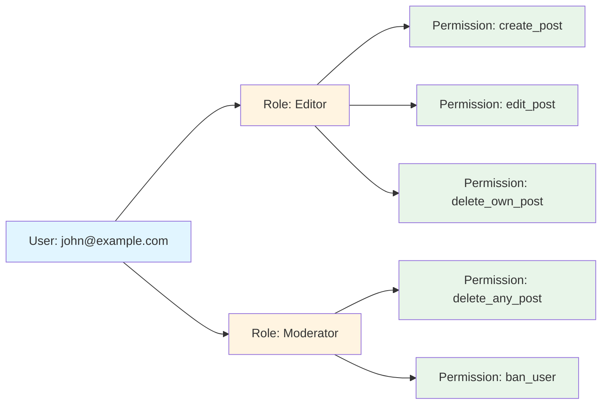

Authorization models: RBAC, ABAC, and ACL with practical examples.

## 1. Role-Based Access Control (RBAC)

Users are assigned roles, and roles have permissions.



### Example Structure

```text
User: john@example.com
Roles: [editor, moderator]

Role: editor
Permissions: [create_post, edit_post, delete_own_post]

Role: moderator
Permissions: [delete_any_post, ban_user]
```

### Implementation Example

```python
# Check if user has permission
def has_permission(user, permission):
    for role in user.roles:
        if permission in role.permissions:
            return True
    return False

# Usage
if has_permission(user, 'delete_post'):
    delete_post(post_id)
```

**Pros:**
- Simple to understand and implement
- Easy to manage for most applications
- Clear separation of concerns

**Cons:**
- Role explosion in complex systems
- Inflexible for fine-grained control
- Difficult to handle context-specific permissions

**Use Case:** Most web applications, content management systems

---

## 2. Attribute-Based Access Control (ABAC)

Access decisions based on attributes of user, resource, and environment.

### Policy Structure

```text
User Attributes + Resource Attributes + Environment → Policy Decision
```

### Example Policy

```text
Allow if:
  user.department == resource.department AND
  user.clearance_level >= resource.classification AND
  current_time.hour >= 9 AND current_time.hour <= 17
```

### Detailed Example

**User Attributes:**

```json
{
  "id": "user123",
  "department": "engineering",
  "clearance_level": 3,
  "location": "US"
}
```

**Resource Attributes:**

```json
{
  "id": "doc456",
  "department": "engineering",
  "classification": 2,
  "owner": "user123"
}
```

**Environment Attributes:**

```json
{
  "time": "14:30",
  "ip_address": "192.168.1.100",
  "device_type": "laptop"
}
```

**Policy:**

```text
ALLOW document:read IF
  user.department == document.department AND
  user.clearance_level >= document.classification AND
  time.hour >= 9 AND time.hour <= 17 AND
  user.location == "US"
```

### Implementation Example

```python
def evaluate_policy(user, resource, environment):
    # Check department match
    if user.department != resource.department:
        return False
    
    # Check clearance level
    if user.clearance_level < resource.classification:
        return False
    
    # Check business hours
    hour = environment.time.hour
    if hour < 9 or hour > 17:
        return False
    
    # Check location
    if user.location != "US":
        return False
    
    return True
```

**Pros:**
- Extremely flexible and fine-grained
- Context-aware decisions
- Scales to complex requirements

**Cons:**
- Complex to design and implement
- Harder to debug and audit
- Performance overhead for policy evaluation

**Use Case:** Healthcare, government, financial systems with complex compliance requirements

---

## 3. Access Control Lists (ACL)

Resource-centric model where each resource has a list of who can access it.

### Structure

```text
Resource → List of (User/Group, Permissions)
```

### Example

```text
Document ID: doc123
ACL:
  - user:john@example.com → [read, write]
  - user:jane@example.com → [read]
  - group:editors → [read, write, delete]
  - group:viewers → [read]
```

### File System Example

```text
/home/john/document.txt
Owner: john (rwx)
Group: staff (r-x)
Others: (r--)
```

### Implementation Example

```python
class ACL:
    def __init__(self, resource_id):
        self.resource_id = resource_id
        self.entries = []
    
    def add_entry(self, principal, permissions):
        self.entries.append({
            'principal': principal,
            'permissions': permissions
        })
    
    def check_permission(self, user, permission):
        for entry in self.entries:
            if entry['principal'] == user:
                return permission in entry['permissions']
            
            # Check group membership
            if entry['principal'].startswith('group:'):
                group = entry['principal'].split(':')[1]
                if group in user.groups:
                    return permission in entry['permissions']
        
        return False

# Usage
acl = ACL('doc123')
acl.add_entry('user:john@example.com', ['read', 'write'])
acl.add_entry('group:editors', ['read', 'write', 'delete'])

if acl.check_permission(user, 'write'):
    update_document()
```

**Pros:**
- Resource-centric (clear ownership)
- Explicit permissions
- Good for file systems and documents

**Cons:**
- Doesn't scale to many resources
- Hard to manage centrally
- Difficult to audit across resources

**Use Case:** File systems, document management, cloud storage (S3, Google Drive)

---

## Comparison

| Model | Granularity | Complexity | Scalability | Use Case |
|-------|-------------|------------|-------------|----------|
| **RBAC** | Coarse | Low | Good | General web apps |
| **ABAC** | Fine | High | Excellent | Complex compliance |
| **ACL** | Fine | Medium | Poor | File systems, documents |

---

## Hybrid Approaches

Most real-world systems combine multiple models:

### RBAC + ACL

```text
1. Check user role (RBAC)
2. If role allows, check resource ACL
3. Grant access only if both pass
```

**Example:** Google Drive
- Roles: Owner, Editor, Viewer (RBAC)
- Per-document sharing (ACL)

### RBAC + ABAC

```text
1. Base permissions from roles (RBAC)
2. Additional context checks (ABAC)
```

**Example:** Healthcare system
- Roles: Doctor, Nurse, Admin
- Context: Can only access patients in their department during shift hours

---

## Best Practices

### 1. Principle of Least Privilege

Grant minimum permissions necessary for the task.

```text
❌ BAD: Give all users admin role
✅ GOOD: Give specific permissions as needed
```

### 2. Separation of Duties

Critical operations require multiple people.

```text
Example: Financial transaction
- User A: Initiates transaction
- User B: Approves transaction
```

### 3. Regular Audits

Periodically review and revoke unnecessary permissions.

```python
# Audit script example
def audit_permissions():
    for user in all_users:
        for permission in user.permissions:
            if not permission.recently_used:
                log_warning(f"{user} has unused permission: {permission}")
```

### 4. Default Deny

Deny access by default, explicitly grant permissions.

```python
def check_access(user, resource, action):
    # Default: deny
    if not has_explicit_permission(user, resource, action):
        return False
    return True
```

