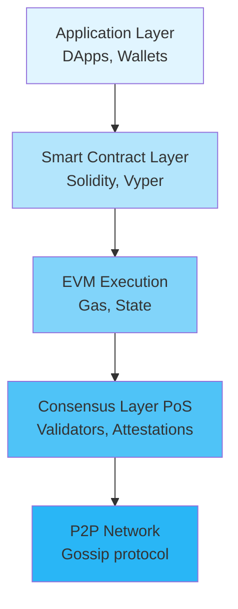
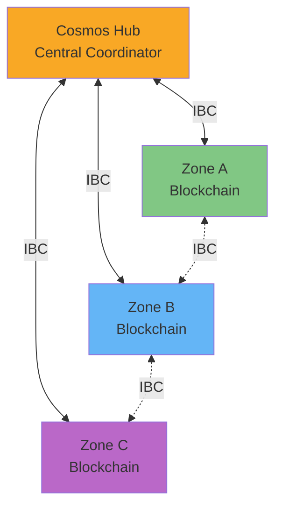
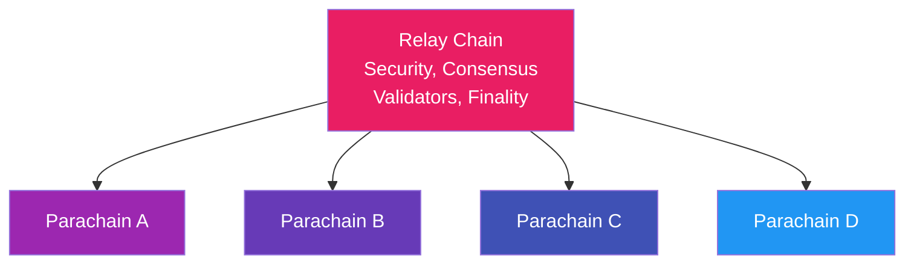
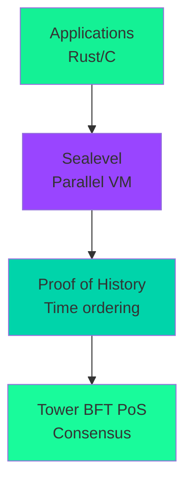
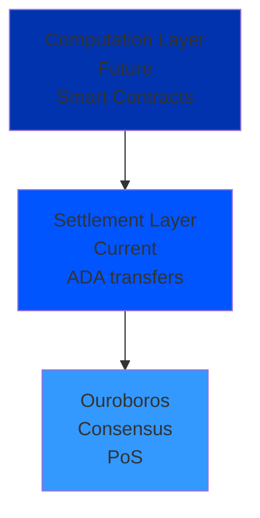

Core principles, consensus mechanisms, and key innovations of major blockchain platforms.

## Bitcoin (BTC)

### Core Principles
- **Digital gold**: Store of value, not programmable
- **Decentralization**: ~15,000 full nodes worldwide
- **Security**: Most secure blockchain (highest hash rate)
- **Simplicity**: Intentionally limited functionality

### Consensus
- **Proof of Work (PoW)**: SHA-256 mining
- **Block time**: ~10 minutes
- **Block size**: 1-4 MB (with SegWit)
- **Finality**: Probabilistic (~6 confirmations)

### Key Innovations
- **UTXO model**: Unspent Transaction Outputs
- **Script**: Stack-based, non-Turing complete
- **Lightning Network**: Layer 2 for instant payments
- **Taproot**: Privacy + smart contract improvements

### Use Cases
- Store of value
- Censorship-resistant payments
- Final settlement layer

## Ethereum (ETH)

### Core Principles
- **World computer**: Decentralized computation platform
- **Smart contracts**: Turing-complete programs
- **EVM**: Ethereum Virtual Machine
- **Account model**: Not UTXO

### Consensus
- **Proof of Stake (PoS)**: Since "The Merge" (2022)
- **Block time**: ~12 seconds
- **Finality**: ~15 minutes (2 epochs)
- **Validators**: 32 ETH stake required

### Key Innovations
- **Smart contracts**: Solidity language
- **ERC standards**: ERC-20 (tokens), ERC-721 (NFTs)
- **Layer 2**: Rollups (Optimistic, ZK)
- **Sharding**: Future scalability (Danksharding)

### Architecture

### Use Cases
- DeFi (Decentralized Finance)
- NFTs and digital assets
- DAOs (Decentralized Autonomous Organizations)
- General-purpose smart contracts

## Cosmos (ATOM)

### Core Principles
- **Internet of Blockchains**: Interconnected chains
- **Sovereignty**: Each chain controls own governance
- **Interoperability**: IBC (Inter-Blockchain Communication)
- **Modularity**: Cosmos SDK for custom chains

### Consensus
- **Tendermint BFT**: Byzantine Fault Tolerant
- **Block time**: ~6 seconds
- **Finality**: Instant (single block)
- **Validators**: Delegated Proof of Stake

### Key Innovations
- **IBC Protocol**: Cross-chain communication
- **Cosmos SDK**: Framework for building blockchains
- **Hub-and-Zone model**: Cosmos Hub connects zones
- **Shared security**: Interchain Security

### Architecture

### Use Cases
- Application-specific blockchains
- Cross-chain DeFi
- Sovereign chains with interoperability

## Polkadot (DOT)

### Core Principles
- **Shared security**: All parachains secured by relay chain
- **Heterogeneous sharding**: Different chains, different purposes
- **Cross-chain messaging**: XCM (Cross-Consensus Message)
- **Governance**: On-chain, forkless upgrades

### Consensus
- **GRANDPA + BABE**: Finality + block production
- **Block time**: ~6 seconds
- **Finality**: 1-2 blocks (~12 seconds)
- **Validators**: Nominated Proof of Stake (NPoS)

### Key Innovations
- **Relay Chain**: Central security hub
- **Parachains**: Parallel chains with shared security
- **Parathreads**: Pay-per-block parachains
- **Substrate**: Framework for building blockchains

### Architecture

### Use Cases
- Specialized blockchains with shared security
- Cross-chain applications
- Scalable multi-chain ecosystems

## Solana (SOL)

### Core Principles
- **High performance**: 65,000+ TPS theoretical
- **Low cost**: Fractions of a cent per transaction
- **Proof of History**: Novel time-keeping mechanism
- **Single global state**: No sharding

### Consensus
- **Proof of History + PoS**: Hybrid approach
- **Block time**: ~400ms
- **Finality**: ~13 seconds
- **Validators**: Permissionless PoS

### Key Innovations
- **Proof of History (PoH)**: Verifiable delay function for time
- **Sealevel**: Parallel smart contract runtime
- **Gulf Stream**: Mempool-less transaction forwarding
- **Turbine**: Block propagation protocol

### Architecture

### Use Cases
- High-frequency trading
- Gaming and NFTs
- Real-time applications
- DeFi with low fees

## Cardano (ADA)

### Core Principles
- **Research-driven**: Peer-reviewed academic approach
- **Formal methods**: Mathematical verification
- **Layered architecture**: Settlement + Computation
- **Sustainability**: Treasury system for funding

### Consensus
- **Ouroboros PoS**: Provably secure
- **Block time**: ~20 seconds
- **Finality**: Probabilistic (~15 blocks)
- **Stake pools**: Delegated staking

### Key Innovations
- **EUTXO model**: Extended UTXO with smart contracts
- **Plutus**: Haskell-based smart contracts
- **Hydra**: Layer 2 state channels
- **Catalyst**: Decentralized governance

### Architecture

### Use Cases
- Identity and credentials
- Supply chain tracking
- DeFi with formal verification
- Developing nations (financial inclusion)

## Comparison Table

| Platform | Consensus | TPS | Finality | Smart Contracts | Key Feature |
|----------|-----------|-----|----------|----------------|-------------|
| **Bitcoin** | PoW | 7 | ~60 min | Limited | Security, Store of Value |
| **Ethereum** | PoS | 15-30 | ~15 min | Yes (EVM) | Largest ecosystem |
| **Cosmos** | Tendermint BFT | 1000+ | Instant | Yes (CosmWasm) | Interoperability |
| **Polkadot** | GRANDPA+BABE | 1000+ | ~12 sec | Yes (Wasm) | Shared security |
| **Solana** | PoH+PoS | 3000+ | ~13 sec | Yes (Rust) | High performance |
| **Cardano** | Ouroboros PoS | 250 | ~5 min | Yes (Plutus) | Formal methods |

## Common Concepts

### Consensus Mechanisms
- **PoW**: Energy-intensive, secure, slow
- **PoS**: Energy-efficient, faster, economic security
- **BFT**: Instant finality, requires known validators
- **PoH**: Novel time-keeping for ordering

### Scalability Approaches
- **Layer 2**: Lightning, Rollups, State Channels
- **Sharding**: Divide network into parallel chains
- **Sidechains**: Separate chains with bridges
- **Parachains**: Shared security model

### Finality Types
- **Probabilistic**: Becomes more certain over time (Bitcoin)
- **Instant**: Single block confirmation (Tendermint)
- **Economic**: Slashing for misbehavior (PoS)

## Notes

- **Blockchain trilemma**: Decentralization, Security, Scalability - pick 2
- **Layer 1 vs Layer 2**: Base chain vs scaling solution
- **EVM compatibility**: Many chains support Ethereum contracts
- **Interoperability**: Growing focus on cross-chain communication

## Gotchas/Warnings

- ⚠️ **Finality**: Understand probabilistic vs instant finality
- ⚠️ **MEV**: Miner/Validator Extractable Value is an issue
- ⚠️ **Bridge risks**: Cross-chain bridges are attack vectors
- ⚠️ **Centralization**: Many "decentralized" chains have few validators