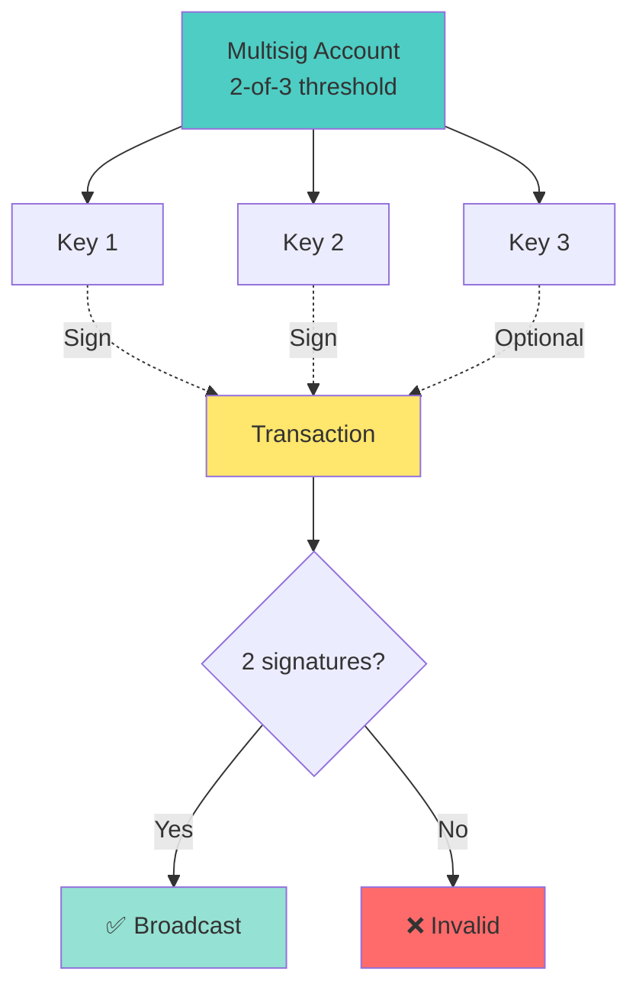
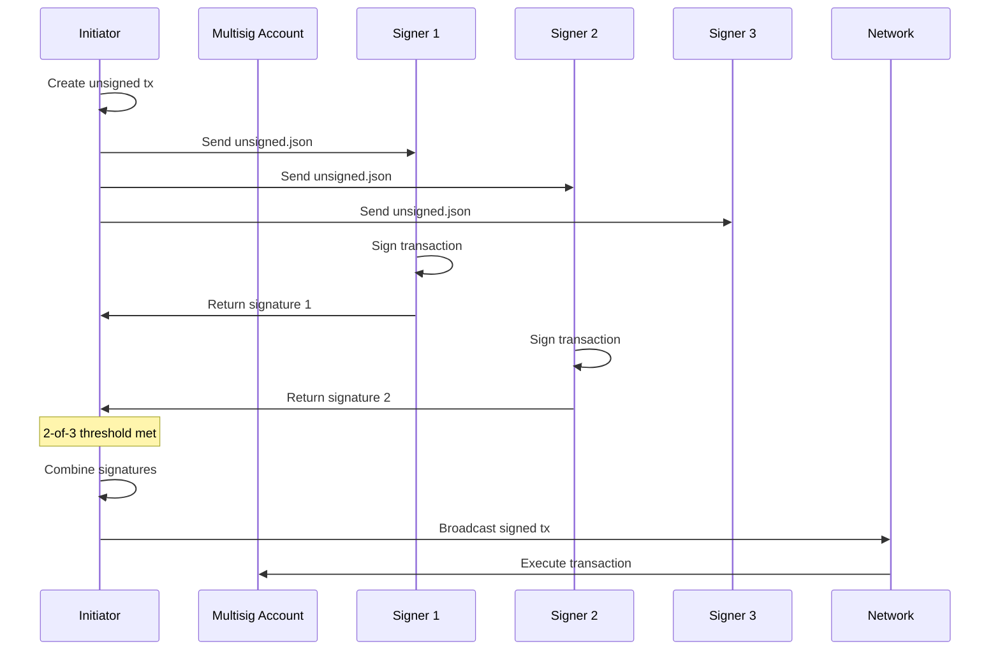
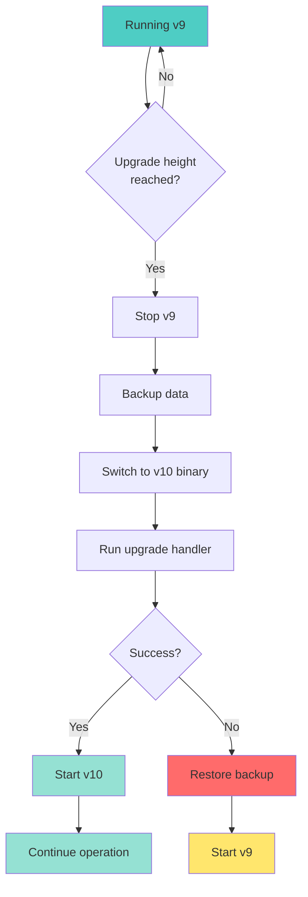

Practical Cosmos SDK operations including governance proposals, multisig accounts, and Cosmovisor setup.

---

## Governance Proposals

### Create Text Governance Proposal

```bash
# Create proposal JSON
cat > proposal.json <<EOF
{
  "title": "Enable IBC Transfer",
  "description": "This proposal enables IBC transfer module for cross-chain transactions",
  "deposit": "10000000uatom"
}
EOF

# Submit proposal
gaiad tx gov submit-proposal \
  --title "Enable IBC Transfer" \
  --description "This proposal enables IBC transfer module" \
  --type Text \
  --deposit 10000000uatom \
  --from mykey \
  --chain-id cosmoshub-4 \
  --gas auto \
  --gas-adjustment 1.5 \
  --fees 5000uatom

# Alternative: Submit from JSON file
gaiad tx gov submit-legacy-proposal \
  --proposal proposal.json \
  --from mykey \
  --chain-id cosmoshub-4
```

### Create Parameter Change Proposal

```bash
# Create param change proposal
cat > param-change.json <<EOF
{
  "title": "Increase Max Validators",
  "description": "Increase the maximum number of validators from 125 to 150",
  "changes": [
    {
      "subspace": "staking",
      "key": "MaxValidators",
      "value": "150"
    }
  ],
  "deposit": "10000000uatom"
}
EOF

# Submit parameter change proposal
gaiad tx gov submit-legacy-proposal param-change param-change.json \
  --from mykey \
  --chain-id cosmoshub-4 \
  --gas auto \
  --fees 5000uatom
```

### Create Community Pool Spend Proposal

```bash
cat > community-spend.json <<EOF
{
  "title": "Fund Development Team",
  "description": "Allocate 100,000 ATOM to development team",
  "recipient": "cosmos1abc...",
  "amount": "100000000000uatom",
  "deposit": "10000000uatom"
}
EOF

gaiad tx gov submit-legacy-proposal community-pool-spend community-spend.json \
  --from mykey \
  --chain-id cosmoshub-4
```

---

## Vote on Governance Proposal

### Query Proposals

```bash
# List all proposals
gaiad query gov proposals

# Query specific proposal
gaiad query gov proposal 42

# Query proposal status
gaiad query gov proposal 42 --output json | jq '.status'

# Query votes on proposal
gaiad query gov votes 42

# Query your vote
gaiad query gov vote 42 cosmos1abc...
```

### Cast Vote

```bash
# Vote options: yes, no, abstain, no_with_veto
gaiad tx gov vote 42 yes \
  --from mykey \
  --chain-id cosmoshub-4 \
  --gas auto \
  --fees 5000uatom

# Vote with reason (SDK v0.46+)
gaiad tx gov vote 42 yes \
  --from mykey \
  --metadata "I support this proposal because..." \
  --chain-id cosmoshub-4

# Weighted vote (SDK v0.43+)
gaiad tx gov weighted-vote 42 \
  yes=0.6,no=0.3,abstain=0.1 \
  --from mykey \
  --chain-id cosmoshub-4
```

### Deposit to Proposal

```bash
# Add deposit to reach minimum
gaiad tx gov deposit 42 10000000uatom \
  --from mykey \
  --chain-id cosmoshub-4 \
  --gas auto \
  --fees 5000uatom

# Query deposits
gaiad query gov deposits 42
```

---

## Create Software Upgrade Proposal

### Prepare Upgrade Proposal

```bash
# Create upgrade proposal JSON
cat > upgrade-proposal.json <<EOF
{
  "title": "Upgrade to v10.0.0",
  "description": "This proposal upgrades the chain to v10.0.0 with new features",
  "plan": {
    "name": "v10",
    "height": "12345000",
    "info": "https://github.com/cosmos/gaia/releases/tag/v10.0.0"
  },
  "deposit": "10000000uatom"
}
EOF

# Submit software upgrade proposal
gaiad tx gov submit-legacy-proposal software-upgrade v10 \
  --title "Upgrade to v10.0.0" \
  --description "Upgrade chain to v10.0.0" \
  --upgrade-height 12345000 \
  --upgrade-info '{"binaries":{"linux/amd64":"https://github.com/cosmos/gaia/releases/download/v10.0.0/gaiad-v10.0.0-linux-amd64"}}' \
  --deposit 10000000uatom \
  --from mykey \
  --chain-id cosmoshub-4

# Query upgrade plan
gaiad query upgrade plan
```

### Cancel Upgrade Proposal

```bash
gaiad tx gov submit-legacy-proposal cancel-software-upgrade \
  --title "Cancel v10 Upgrade" \
  --description "Cancel the v10 upgrade due to critical bug" \
  --deposit 10000000uatom \
  --from mykey \
  --chain-id cosmoshub-4
```

---

## Multisig Accounts

### Create Multisig Account

```bash
# Create multisig account (2-of-3)
gaiad keys add multisig1 \
  --multisig key1,key2,key3 \
  --multisig-threshold 2

# Show multisig address
gaiad keys show multisig1 -a

# Example output: cosmos1abc123...
```

### Multisig Account Structure



---

## Create Transaction for Signing

### Generate Unsigned Transaction

```bash
# Create unsigned transaction
gaiad tx bank send \
  cosmos1multisig... \
  cosmos1recipient... \
  1000000uatom \
  --from cosmos1multisig... \
  --chain-id cosmoshub-4 \
  --gas 200000 \
  --fees 5000uatom \
  --generate-only > unsigned.json

# View unsigned transaction
cat unsigned.json
```

### Transaction JSON Structure

```json
{
  "body": {
    "messages": [
      {
        "@type": "/cosmos.bank.v1beta1.MsgSend",
        "from_address": "cosmos1multisig...",
        "to_address": "cosmos1recipient...",
        "amount": [{"denom": "uatom", "amount": "1000000"}]
      }
    ],
    "memo": "",
    "timeout_height": "0",
    "extension_options": [],
    "non_critical_extension_options": []
  },
  "auth_info": {
    "signer_infos": [],
    "fee": {
      "amount": [{"denom": "uatom", "amount": "5000"}],
      "gas_limit": "200000",
      "payer": "",
      "granter": ""
    }
  },
  "signatures": []
}
```

---

## Sign Transaction with Multisig

### Individual Signing

```bash
# Signer 1 signs the transaction
gaiad tx sign unsigned.json \
  --from key1 \
  --multisig cosmos1multisig... \
  --chain-id cosmoshub-4 \
  --output-document key1-signature.json

# Signer 2 signs the transaction
gaiad tx sign unsigned.json \
  --from key2 \
  --multisig cosmos1multisig... \
  --chain-id cosmoshub-4 \
  --output-document key2-signature.json

# Signer 3 signs (optional for 2-of-3)
gaiad tx sign unsigned.json \
  --from key3 \
  --multisig cosmos1multisig... \
  --chain-id cosmoshub-4 \
  --output-document key3-signature.json
```

---

## Collect Multisig Signatures

### Combine Signatures

```bash
# Collect signatures (need 2 out of 3)
gaiad tx multisign unsigned.json multisig1 \
  key1-signature.json \
  key2-signature.json \
  --chain-id cosmoshub-4 \
  --output-document signed.json

# Verify the multisig transaction
gaiad tx validate-signatures signed.json

# Broadcast the signed transaction
gaiad tx broadcast signed.json \
  --chain-id cosmoshub-4
```

### Multisig Workflow



---

## Setup Cosmovisor

### Installation

```bash
# Install Cosmovisor
go install cosmossdk.io/tools/cosmovisor/cmd/cosmovisor@latest

# Verify installation
cosmovisor version
```

### Directory Structure

```bash
# Create Cosmovisor directory structure
mkdir -p ~/.gaia/cosmovisor/genesis/bin
mkdir -p ~/.gaia/cosmovisor/upgrades

# Directory layout:
# .gaia/
# └── cosmovisor/
#     ├── genesis/
#     │   └── bin/
#     │       └── gaiad
#     └── upgrades/
#         ├── v9/
#         │   └── bin/
#         │       └── gaiad
#         └── v10/
#             └── bin/
#                 └── gaiad
```

### Setup Genesis Binary

```bash
# Copy current binary to genesis
cp $(which gaiad) ~/.gaia/cosmovisor/genesis/bin/

# Verify
~/.gaia/cosmovisor/genesis/bin/gaiad version
```

### Configure Cosmovisor

```bash
# Set environment variables
export DAEMON_NAME=gaiad
export DAEMON_HOME=$HOME/.gaia
export DAEMON_ALLOW_DOWNLOAD_BINARIES=false
export DAEMON_RESTART_AFTER_UPGRADE=true
export DAEMON_LOG_BUFFER_SIZE=512

# Add to ~/.bashrc or ~/.zshrc
cat >> ~/.bashrc <<EOF
export DAEMON_NAME=gaiad
export DAEMON_HOME=\$HOME/.gaia
export DAEMON_ALLOW_DOWNLOAD_BINARIES=false
export DAEMON_RESTART_AFTER_UPGRADE=true
EOF
```

### Prepare Upgrade Binary

```bash
# Download new version
wget https://github.com/cosmos/gaia/releases/download/v10.0.0/gaiad-v10.0.0-linux-amd64

# Create upgrade directory
mkdir -p ~/.gaia/cosmovisor/upgrades/v10/bin

# Copy binary
cp gaiad-v10.0.0-linux-amd64 ~/.gaia/cosmovisor/upgrades/v10/bin/gaiad
chmod +x ~/.gaia/cosmovisor/upgrades/v10/bin/gaiad

# Verify
~/.gaia/cosmovisor/upgrades/v10/bin/gaiad version
```

### Systemd Service

```bash
# Create systemd service
sudo tee /etc/systemd/system/cosmovisor.service > /dev/null <<EOF
[Unit]
Description=Cosmovisor daemon
After=network-online.target

[Service]
User=$USER
ExecStart=$(which cosmovisor) run start
Restart=always
RestartSec=3
LimitNOFILE=4096
Environment="DAEMON_NAME=gaiad"
Environment="DAEMON_HOME=$HOME/.gaia"
Environment="DAEMON_ALLOW_DOWNLOAD_BINARIES=false"
Environment="DAEMON_RESTART_AFTER_UPGRADE=true"

[Install]
WantedBy=multi-user.target
EOF

# Reload systemd
sudo systemctl daemon-reload

# Enable service
sudo systemctl enable cosmovisor

# Start service
sudo systemctl start cosmovisor

# Check status
sudo systemctl status cosmovisor

# View logs
sudo journalctl -u cosmovisor -f
```

### Cosmovisor Upgrade Flow



### Manual Upgrade Test

```bash
# Test upgrade manually
cosmovisor run start --home ~/.gaia

# Check current version
cosmovisor run version

# After upgrade height
# Cosmovisor automatically switches to new binary
```

---

## Advanced Multisig Operations

### Multisig Governance Vote

```bash
# Create unsigned vote transaction
gaiad tx gov vote 42 yes \
  --from cosmos1multisig... \
  --chain-id cosmoshub-4 \
  --generate-only > vote-unsigned.json

# Sign by multiple parties
gaiad tx sign vote-unsigned.json \
  --from key1 \
  --multisig cosmos1multisig... \
  --chain-id cosmoshub-4 \
  --output-document vote-sig1.json

gaiad tx sign vote-unsigned.json \
  --from key2 \
  --multisig cosmos1multisig... \
  --chain-id cosmoshub-4 \
  --output-document vote-sig2.json

# Combine and broadcast
gaiad tx multisign vote-unsigned.json multisig1 \
  vote-sig1.json vote-sig2.json \
  --chain-id cosmoshub-4 \
  --output-document vote-signed.json

gaiad tx broadcast vote-signed.json
```

### Multisig Delegation

```bash
# Create delegation transaction
gaiad tx staking delegate \
  cosmosvaloper1abc... \
  1000000uatom \
  --from cosmos1multisig... \
  --chain-id cosmoshub-4 \
  --generate-only > delegate-unsigned.json

# Follow same signing process as above
```

---

## Troubleshooting

### Common Issues

```bash
# Check account sequence
gaiad query auth account cosmos1multisig...

# If sequence mismatch, recreate transaction with correct sequence
gaiad tx bank send ... \
  --sequence 42 \
  --generate-only > unsigned.json

# Verify multisig configuration
gaiad keys show multisig1 --multisig-threshold

# Check signature validity
gaiad tx validate-signatures signed.json

# Simulate transaction before broadcasting
gaiad tx simulate signed.json
```

### Cosmovisor Debugging

```bash
# Check Cosmovisor status
cosmovisor version

# List available upgrades
ls -la ~/.gaia/cosmovisor/upgrades/

# Check current binary
cosmovisor run version

# Manual upgrade test
DAEMON_NAME=gaiad cosmovisor run start --home ~/.gaia

# View upgrade info
gaiad query upgrade plan
```

---