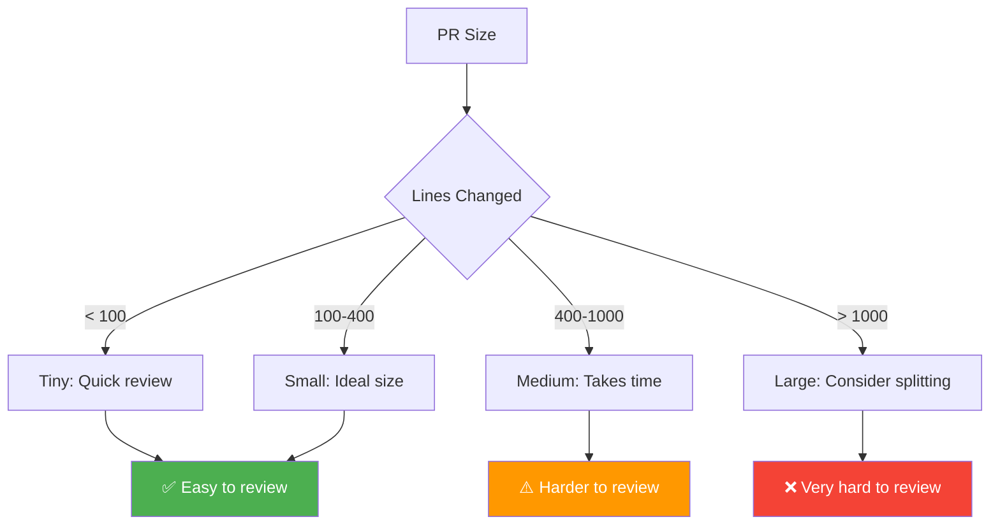

Comprehensive checklist for developers before submitting a pull request.

---

## Code Quality

```
□ Code follows project style guide and conventions
□ No commented-out code (remove or explain why it's there)
□ No debug statements (console.log, print, etc.)
□ No TODO comments without issue references
□ Variable and function names are clear and descriptive
□ Functions are small and do one thing (SRP)
□ No magic numbers (use named constants)
□ No code duplication (DRY principle)
□ Error handling is comprehensive
□ Edge cases are handled
```

---

## Tests

```
□ All new code has unit tests
□ All tests pass locally
□ Test coverage meets project requirements (e.g., >80%)
□ Integration tests added for new features
□ Edge cases are tested
□ Error cases are tested
□ Tests are readable and maintainable
□ No flaky tests
```

---

## Documentation

```
□ README updated if needed
□ API documentation updated
□ Complex logic has comments explaining "why", not "what"
□ Public functions have docstrings/JSDoc
□ CHANGELOG updated (if applicable)
□ Migration guide included for breaking changes
```

---

## Security

```
□ No sensitive data (passwords, API keys, tokens) in code
□ Input validation implemented
□ SQL injection prevention (parameterized queries)
□ XSS prevention (sanitize user input)
□ CSRF protection in place
□ Authentication and authorization checks
□ Dependencies scanned for vulnerabilities
```

---

## Performance

```
□ No N+1 queries
□ Database queries are optimized
□ Caching implemented where appropriate
□ No unnecessary API calls
□ Large lists are paginated
□ Images are optimized
□ No memory leaks
```

---

## Git Hygiene

```
□ Commits are atomic and logical
□ Commit messages are clear and descriptive
□ Branch is up-to-date with main/master
□ No merge conflicts
□ No large binary files committed
□ .gitignore is updated if needed
□ Sensitive files are not tracked
```

---

## CI/CD

```
□ All CI checks pass (linting, tests, build)
□ No warnings in build output
□ Docker image builds successfully (if applicable)
□ Deployment scripts updated (if needed)
```

---

## PR Description

```
□ Clear title that summarizes the change
□ Description explains what and why
□ Links to related issues/tickets
□ Screenshots/videos for UI changes
□ Breaking changes are highlighted
□ Migration steps documented (if needed)
□ Reviewers are assigned
□ Labels are added
```

---

## Before Submitting - Quick Checklist

1. ✅ **Self-review** your changes line by line
2. ✅ **Run all tests** locally and ensure they pass
3. ✅ **Update documentation** (README, API docs, comments)
4. ✅ **Write clear PR description** with context and reasoning
5. ✅ **Ensure CI passes** before requesting review
6. ✅ **Keep PR small** (<400 lines changed if possible)

---

## Author Best Practices

### Respond to All Comments

```
✅ Acknowledge feedback
✅ Explain your reasoning if you disagree
✅ Mark resolved comments
✅ Thank reviewers for their time
```

### Don't Take It Personally

```
✅ Remember: Review is about the code, not you
✅ Use feedback to improve
✅ Ask for clarification if needed
✅ Be open to learning
```

### Keep PRs Small

```
✅ Aim for <400 lines changed
✅ One feature/fix per PR
✅ Split large changes into multiple PRs
✅ Use feature flags for incremental rollouts
```

---

## PR Size Guidelines



---

## Common Mistakes to Avoid

- ❌ Submitting without self-review
- ❌ No tests or insufficient test coverage
- ❌ Vague or missing PR description
- ❌ Ignoring CI failures
- ❌ Mixing multiple unrelated changes
- ❌ Not updating documentation
- ❌ Leaving debug code or commented code
- ❌ Hardcoding values that should be configurable

