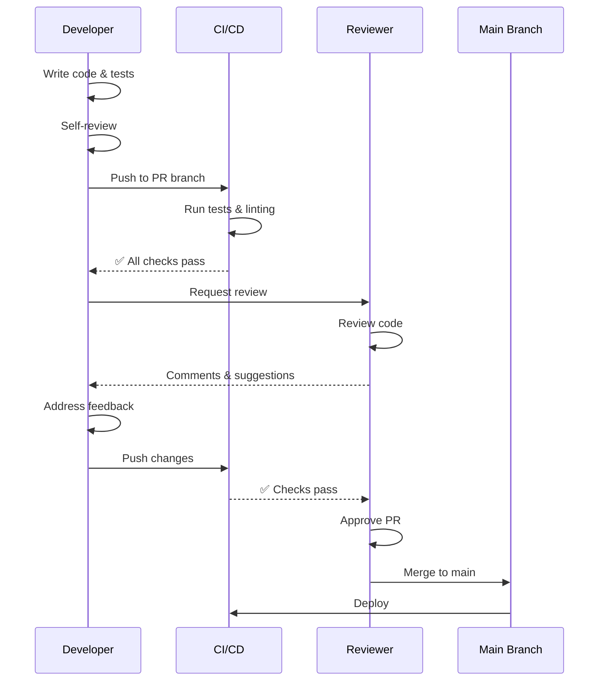

Comprehensive checklist for code reviewers to ensure thorough and constructive reviews.

---

## Functionality

```
□ Code does what it's supposed to do
□ Requirements are met
□ Edge cases are handled
□ Error handling is appropriate
□ No obvious bugs
□ Logic is sound
```

---

## Code Quality

```
□ Code is readable and maintainable
□ Naming is clear and consistent
□ Functions are small and focused
□ No code duplication
□ Follows SOLID principles
□ Design patterns are used appropriately
□ No over-engineering
□ No premature optimization
```

---

## Architecture

```
□ Changes fit the existing architecture
□ No architectural violations
□ Separation of concerns is maintained
□ Dependencies are appropriate
□ Interfaces are well-designed
□ No tight coupling
```

---

## Tests

```
□ Tests are comprehensive
□ Tests are readable
□ Tests actually test what they claim to test
□ No test duplication
□ Mocks are used appropriately
□ Test data is realistic
```

---

## Security

```
□ No security vulnerabilities
□ Input is validated
□ Output is sanitized
□ Authentication/authorization is correct
□ No sensitive data exposure
□ Dependencies are up-to-date
```

---

## Performance

```
□ No obvious performance issues
□ Algorithms are efficient
□ Database queries are optimized
□ Caching is used where appropriate
□ No memory leaks
```

---

## Documentation

```
□ Code is self-documenting
□ Complex logic is explained
□ Public APIs are documented
□ README is updated
□ Comments are helpful, not redundant
```

---

## Review Process



---

## When Reviewing - Step by Step

1. 🔍 **Understand the context** - Read PR description and linked issues
2. 🔍 **Check functionality first** - Does it work as intended?
3. 🔍 **Look for security issues** - Vulnerabilities, data exposure
4. 🔍 **Verify tests are adequate** - Coverage and quality
5. 🔍 **Review code quality** - Readability, maintainability
6. 🔍 **Check architecture** - Fits existing patterns?
7. 🔍 **Be constructive and kind** - Helpful feedback, not criticism

---

## Reviewer Best Practices

### Be Constructive

```
❌ "This code is terrible"
✅ "Consider extracting this into a separate function for better readability"

❌ "You don't know what you're doing"
✅ "This approach might cause issues with X. Have you considered Y?"

❌ "This is wrong"
✅ "I think there might be an issue here. What happens if X is null?"
```

### Ask Questions

```
✅ "Can you explain why you chose this approach?"
✅ "Have you considered the case where X happens?"
✅ "What happens if this API call fails?"
✅ "Could this be simplified by using pattern Y?"
```

### Prioritize Issues

```
🔴 Critical: Security vulnerabilities, data loss, crashes
🟡 Important: Performance issues, maintainability problems
🟢 Nice-to-have: Style preferences, minor optimizations
```

### Use Prefixes

```
[BLOCKER] Must be fixed before merge
[IMPORTANT] Should be fixed before merge
[SUGGESTION] Nice to have, not required
[QUESTION] Need clarification
[NITPICK] Style/formatting preference
[LEARNING] Educational comment, no action needed
```

---

## Review Timing

### Quick Review (<100 lines)
- **Time**: 10-15 minutes
- **Focus**: Functionality, obvious bugs, security

### Standard Review (100-400 lines)
- **Time**: 30-60 minutes
- **Focus**: All aspects, thorough check

### Large Review (>400 lines)
- **Time**: 1-2 hours or split into multiple sessions
- **Focus**: Request PR split if possible

---

## What to Look For

### Red Flags (Immediate Rejection)

- 🚩 **No tests** for new functionality
- 🚩 **Security vulnerabilities** (SQL injection, XSS, etc.)
- 🚩 **Hardcoded secrets** (API keys, passwords)
- 🚩 **No error handling** in critical paths
- 🚩 **Massive PR** (>1000 lines) without justification
- 🚩 **Breaking changes** without migration plan
- 🚩 **Fails CI/CD** checks

### Yellow Flags (Discuss Before Merging)

- ⚠️ **Unclear naming** or poor code organization
- ⚠️ **Missing documentation** for complex logic
- ⚠️ **Performance concerns** (N+1 queries, inefficient algorithms)
- ⚠️ **Architectural violations** or tight coupling
- ⚠️ **Insufficient test coverage** (<80%)
- ⚠️ **Code duplication** that could be refactored

### Green Flags (Good to Go)

- ✅ **Clear, self-documenting code**
- ✅ **Comprehensive tests** with good coverage
- ✅ **Well-structured** and follows patterns
- ✅ **Proper error handling**
- ✅ **Good documentation**
- ✅ **Small, focused changes**

---

## Communication Tips

### Positive Feedback

Don't just point out problems - acknowledge good work:

```
✅ "Nice use of the factory pattern here!"
✅ "Great test coverage on this feature"
✅ "I like how you handled this edge case"
✅ "This is much cleaner than the previous approach"
```

### Constructive Criticism

Frame suggestions positively:

```
✅ "What do you think about extracting this to a helper function?"
✅ "Have you considered using X pattern here? It might simplify this"
✅ "This works, but we might run into issues when Y happens"
```

### When to Approve vs Request Changes

**Approve:**
- All critical issues resolved
- Minor nitpicks can be addressed later
- Code meets quality standards
- You would be comfortable maintaining this code

**Request Changes:**
- Security vulnerabilities present
- Functionality doesn't work as intended
- Critical bugs or logic errors
- Architectural violations
- No tests for new code

**Comment (No Approval):**
- Have questions that need answers
- Want to see how feedback is addressed
- Waiting for other reviewers

---

## Common Reviewer Mistakes

- ❌ Being too nitpicky about style (use linters instead)
- ❌ Reviewing code you don't understand (ask questions!)
- ❌ Approving without actually reviewing
- ❌ Being harsh or condescending
- ❌ Focusing only on what's wrong, ignoring what's right
- ❌ Not explaining why something should change
- ❌ Blocking on personal preferences vs standards
- ❌ Taking too long to review (>24 hours)

