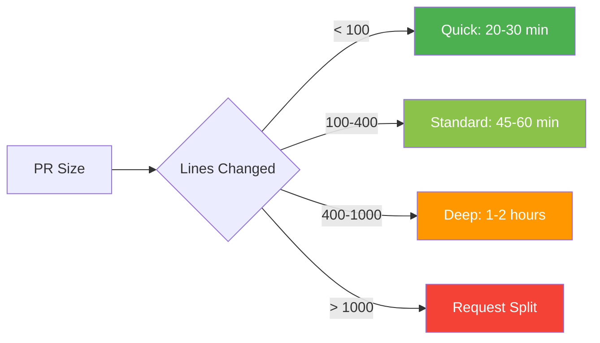

This section provides guidance on code review checklists, code smells, secure coding practices, vulnerability checks, and antipatterns.

---

## Philosophy

Ethics in code review and a clear code of conduct are crucial for maintaining a respectful and constructive environment between developers and reviewers. Mutual professionalism helps ensure that feedback is focused on code quality and security, rather than personal criticism, fostering growth and collaboration within the team.

Checklists are important tools for consistency and thoroughness in reviews—they help prevent common mistakes from being overlooked. However, treat these lists as flexible frameworks, not rigid rules. Every project and context is different. Use this guide as a template to drive helpful discussions and effective reviews, not as a set of mandatory steps to follow verbatim. Thinking critically about context and applying judgment is always encouraged.

---

## Layered Review Approach

Effective code reviews follow a structured approach, progressing from critical issues to refinements:

### Layer 1: Immediate Rejection Criteria (5 minutes)

These issues should cause immediate rejection without deep review. Fix first, then resubmit:

- 🚫 **CI/CD failures** - All automated checks must pass
- 🚫 **No tests** - New functionality requires tests
- 🚫 **Security vulnerabilities** - SQL injection, XSS, hardcoded secrets
- 🚫 **Hardcoded credentials** - API keys, passwords, tokens in code
- 🚫 **Massive PR** - >1000 lines without justification (split it up)
- 🚫 **Breaking changes** - No migration plan or documentation
- 🚫 **Merge conflicts** - Must be resolved before review

**Action**: Request changes immediately. Don't waste time on deeper review until these are fixed.

### Layer 2: Functionality & Correctness (15-30 minutes)

Once Layer 1 passes, verify the code actually works:

- ✅ Does it meet the requirements?
- ✅ Does the logic make sense?
- ✅ Are edge cases handled?
- ✅ Is error handling appropriate?
- ✅ Are there obvious bugs?

**Action**: Test the code if possible. Run it locally. Think through scenarios.

### Layer 3: Security & Data Safety (10-20 minutes)

Critical for production code:

- 🔒 Input validation
- 🔒 Output sanitization
- 🔒 Authentication/authorization
- 🔒 Data exposure risks
- 🔒 Dependency vulnerabilities

**Action**: Think like an attacker. What could go wrong?

### Layer 4: Architecture & Design (10-15 minutes)

Does it fit the system?

- 🏗️ Follows existing patterns?
- 🏗️ Proper separation of concerns?
- 🏗️ Appropriate dependencies?
- 🏗️ No tight coupling?
- 🏗️ Scalability considerations?

**Action**: Zoom out. How does this fit the bigger picture?

### Layer 5: Code Quality & Maintainability (10-15 minutes)

Will future developers (including the author) understand this?

- 📖 Clear naming
- 📖 Readable code structure
- 📖 Appropriate comments
- 📖 No code duplication
- 📖 Functions are focused

**Action**: Read the code as if you'll maintain it in 6 months.

### Layer 6: Tests & Documentation (5-10 minutes)

Supporting artifacts:

- 📝 Tests are comprehensive
- 📝 Tests are readable
- 📝 Documentation is updated
- 📝 Complex logic is explained

**Action**: Could someone else understand and extend this?

### Layer 7: Performance & Optimization (5-10 minutes)

Only if relevant to the change:

- ⚡ No obvious performance issues
- ⚡ Efficient algorithms
- ⚡ Database queries optimized
- ⚡ Caching where appropriate

**Action**: Is this fast enough? Will it scale?

### Layer 8: Nitpicks & Style (5 minutes)

Last and least important:

- 🎨 Code style (should be automated)
- 🎨 Minor naming preferences
- 🎨 Formatting (should be automated)

**Action**: Only mention if not covered by linters. Use `[NITPICK]` prefix.

---

## Review Timing Guidelines

---

## Immediate Rejection Criteria - Detailed

### 🚫 CI/CD Failures

**Why**: If automated checks fail, the code isn't ready for human review.

**Examples**:
- Linting errors
- Test failures
- Build failures
- Security scans failing

**Response**: "Please fix CI failures before requesting review."

---

### 🚫 No Tests

**Why**: Untested code is a liability. Tests are not optional.

**Exceptions**:
- Pure documentation changes
- Configuration-only changes
- Hotfixes (but tests should follow immediately)

**Response**: "Please add tests for the new functionality before I review."

---

### 🚫 Security Vulnerabilities

**Why**: Security issues can't wait. They're critical.

**Examples**:
- SQL injection: `query = "SELECT * FROM users WHERE id = " + userId`
- XSS: Unescaped user input in HTML
- Hardcoded secrets: `API_KEY = "sk_live_123456"`
- Missing authentication checks

**Response**: "[BLOCKER] Security issue: [specific vulnerability]. Must be fixed."

---

### 🚫 Massive PRs (>1000 lines)

**Why**: Large PRs are impossible to review thoroughly. Bugs hide in large diffs.

**Exceptions**:
- Generated code (migrations, API clients)
- Large refactors (but should be discussed first)
- Dependency updates

**Response**: "This PR is too large to review effectively. Please split into smaller PRs."

---

### 🚫 Breaking Changes Without Migration

**Why**: Breaking changes without a plan cause production incidents.

**Required**:
- Migration guide
- Deprecation warnings
- Backward compatibility period
- Communication plan

**Response**: "Breaking changes require a migration plan. Please document the upgrade path."

---

## Best Practices Summary

### For Reviewers

1. **Start with Layer 1** - Reject immediately if criteria not met
2. **Work through layers** - Don't skip to nitpicks
3. **Be constructive** - Explain why, not just what
4. **Prioritize issues** - Use [BLOCKER], [IMPORTANT], [SUGGESTION] prefixes
5. **Approve or request changes** - Don't leave PRs hanging
6. **Review within 24 hours** - Don't block the team

### For Developers

1. **Self-review first** - Catch obvious issues yourself
2. **Run all checks locally** - Don't rely on CI to catch everything
3. **Keep PRs small** - <400 lines is ideal
4. **Write clear descriptions** - Help reviewers understand context
5. **Respond to feedback** - Address all comments
6. **Don't take it personally** - Reviews are about code, not you

---

## Related Topics

- **Developer Checklist** - What to check before submitting
- **Reviewer Checklist** - What to look for when reviewing
- **Code Smells** - Common issues to watch for
- **Secure Coding** - Security best practices
- **Antipatterns** - Common mistakes to avoid
