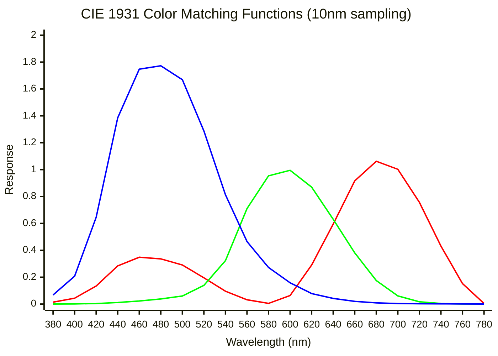
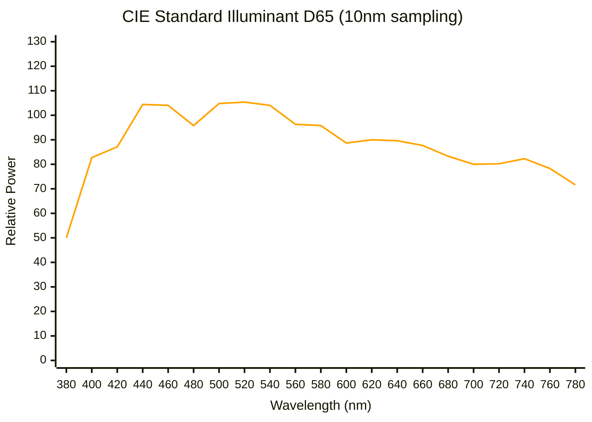
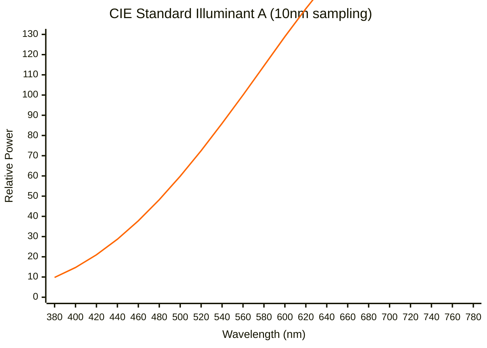

Practical guides and mathematical foundations for color science, color spaces, and image processing.

---

## Tristimulus Values & Color Matching Functions

Color perception is based on three types of cone cells in the human eye. The CIE defined standard color matching functions $\bar{x}(\lambda)$, $\bar{y}(\lambda)$, $\bar{z}(\lambda)$ that represent the response of a standard observer.

### CIE 1931 2° Standard Observer

The tristimulus values $X$, $Y$, $Z$ for a spectral power distribution (SPD) $S(\lambda)$ are calculated by:

$$
X = k \int_{380}^{780} S(\lambda) \bar{x}(\lambda) d\lambda
$$

$$
Y = k \int_{380}^{780} S(\lambda) \bar{y}(\lambda) d\lambda
$$

$$
Z = k \int_{380}^{780} S(\lambda) \bar{z}(\lambda) d\lambda
$$

Where:
- $S(\lambda)$ is the spectral power distribution (light source or reflectance × illuminant)
- $\bar{x}(\lambda)$, $\bar{y}(\lambda)$, $\bar{z}(\lambda)$ are the CIE 1931 color matching functions
- $k$ is a normalization constant (typically chosen so that $Y = 100$ for a perfect white reflector)

### Color Matching Functions (CIE 1931 2° Observer)



**Key observations:**
- $\bar{x}(\lambda)$ peaks in the red region (~600nm)
- $\bar{y}(\lambda)$ peaks in the green region (~555nm) and represents luminance
- $\bar{z}(\lambda)$ peaks in the blue region (~445nm)
- The functions overlap, meaning pure spectral colors activate multiple cone types

---

## Standard Illuminant D65 (Daylight)

D65 represents average daylight with a correlated color temperature of 6504K. It's the standard illuminant for sRGB and most digital imaging.

### D65 Spectral Power Distribution



**Characteristics:**
- Relatively flat in the visible range
- Slight peak in the blue region (shorter wavelengths)
- Used as the standard for sRGB, Adobe RGB, and most color spaces

---

## Calculating Tristimulus Values: Example

For a perfect white reflector under D65 illumination:

$$
X_{D65} = k \int_{380}^{780} D65(\lambda) \bar{x}(\lambda) d\lambda \approx 95.047
$$

$$
Y_{D65} = k \int_{380}^{780} D65(\lambda) \bar{y}(\lambda) d\lambda = 100.0
$$

$$
Z_{D65} = k \int_{380}^{780} D65(\lambda) \bar{z}(\lambda) d\lambda \approx 108.883
$$

Where $k$ is chosen so that $Y = 100$.

### Numerical Integration (Discrete Approximation)

For sampled data at wavelength intervals $\Delta\lambda$:

$$
X \approx k \sum_{i} S(\lambda_i) \bar{x}(\lambda_i) \Delta\lambda
$$

$$
Y \approx k \sum_{i} S(\lambda_i) \bar{y}(\lambda_i) \Delta\lambda
$$

$$
Z \approx k \sum_{i} S(\lambda_i) \bar{z}(\lambda_i) \Delta\lambda
$$

Typically $\Delta\lambda = 1$nm, 5nm, or 10nm depending on required accuracy.

---

## Standard Illuminant A (Incandescent)

Illuminant A represents a tungsten-filament lamp at 2856K.

### Illuminant A Spectral Power Distribution



**Characteristics:**
- Strong red/orange component (warm light)
- Increases with wavelength (more power at longer wavelengths)
- Lower blue content compared to daylight

---

## Chromaticity Diagram Concept

The chromaticity coordinates $(x, y)$ normalize tristimulus values:

$$
x = \frac{X}{X + Y + Z}, \quad y = \frac{Y}{X + Y + Z}, \quad z = \frac{Z}{X + Y + Z}
$$

Note: $x + y + z = 1$, so only two coordinates are needed.

**Standard white points:**
- **D65**: $(x, y) \approx (0.3127, 0.3290)$
- **D50**: $(x, y) \approx (0.3457, 0.3585)$
- **Illuminant A**: $(x, y) \approx (0.4476, 0.4074)$

---

## Practical Python Example

```python
import numpy as np

# Load CIE 1931 color matching functions (380-780nm, 1nm steps)
# Format: wavelength, x_bar, y_bar, z_bar
cmf = np.loadtxt('CIE_xyz_1931_2deg.csv', delimiter=',')
wavelengths = cmf[:, 0]
x_bar = cmf[:, 1]
y_bar = cmf[:, 2]
z_bar = cmf[:, 3]

# Load D65 illuminant SPD
d65 = np.loadtxt('CIE_std_illum_D65.csv', delimiter=',')
d65_wavelengths = d65[:, 0]
d65_spd = d65[:, 1]

# Interpolate to match wavelengths if needed
from scipy.interpolate import interp1d
d65_interp = interp1d(d65_wavelengths, d65_spd, bounds_error=False, fill_value=0)
d65_matched = d65_interp(wavelengths)

# Calculate tristimulus values
delta_lambda = wavelengths[1] - wavelengths[0]  # Usually 1nm
X = np.sum(d65_matched * x_bar * delta_lambda)
Y = np.sum(d65_matched * y_bar * delta_lambda)
Z = np.sum(d65_matched * z_bar * delta_lambda)

# Normalize so Y = 100
k = 100.0 / Y
X *= k
Y *= k
Z *= k

print(f"D65 White Point: X={X:.3f}, Y={Y:.3f}, Z={Z:.3f}")
# Expected: X≈95.047, Y=100.0, Z≈108.883

# Calculate chromaticity coordinates
x_chrom = X / (X + Y + Z)
y_chrom = Y / (X + Y + Z)
print(f"Chromaticity: x={x_chrom:.4f}, y={y_chrom:.4f}")
# Expected: x≈0.3127, y≈0.3290
```

---

## Data Sources

High-resolution spectral data used in these examples:
- CIE 1931 2° Standard Observer color matching functions (1nm resolution, 380-780nm)
- CIE Standard Illuminants (D65, D50, A) spectral power distributions

---

## Further Reading

- [CIE 1931 Color Space - Wikipedia](https://en.wikipedia.org/wiki/CIE_1931_color_space)
- [Standard Illuminant - Wikipedia](https://en.wikipedia.org/wiki/Standard_illuminant)
- [Colorimetry - Wikipedia](https://en.wikipedia.org/wiki/Colorimetry)
- [CIE Technical Reports](http://www.cie.co.at/)
