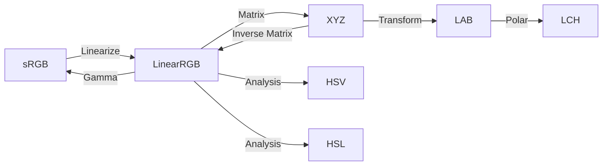

Fast lookup for color space conversion formulas and workflows.

## Conversion Workflow



---

## Quick Conversion Table

| From | To | Steps | Key Formula |
|------|----|----|-------------|
| sRGB | LAB | 1. Linearize<br/>2. RGB→XYZ<br/>3. XYZ→LAB | See [RGB & Gamma](../rgb-gamma/), [CIE XYZ](../cie-xyz/), [CIE LAB](../cie-lab/) |
| sRGB | HSV | 1. Normalize<br/>2. RGB→HSV | See [HSV/HSL](../hsv-hsl/) |
| LAB | sRGB | 1. LAB→XYZ<br/>2. XYZ→RGB<br/>3. Gamma correct | Reverse of above |
| HSV | sRGB | 1. HSV→RGB<br/>2. Denormalize | See [HSV/HSL](../hsv-hsl/) |

---

## Common Conversions

### sRGB (8-bit) to LAB

```python
def srgb8_to_lab(r, g, b):
    # 1. Normalize to [0, 1]
    r, g, b = r/255, g/255, b/255
    
    # 2. Linearize (gamma decode)
    r_lin = srgb_to_linear(r)
    g_lin = srgb_to_linear(g)
    b_lin = srgb_to_linear(b)
    
    # 3. RGB to XYZ
    x, y, z = rgb_to_xyz(r_lin, g_lin, b_lin)
    
    # 4. XYZ to LAB
    L, a, b = xyz_to_lab(x, y, z)
    
    return L, a, b
```

### LAB to sRGB (8-bit)

```python
def lab_to_srgb8(L, a, b):
    # 1. LAB to XYZ
    x, y, z = lab_to_xyz(L, a, b)
    
    # 2. XYZ to linear RGB
    r_lin, g_lin, b_lin = xyz_to_rgb(x, y, z)
    
    # 3. Gamma encode
    r = linear_to_srgb(r_lin)
    g = linear_to_srgb(g_lin)
    b = linear_to_srgb(b_lin)
    
    # 4. Denormalize and clamp
    r = int(np.clip(r * 255, 0, 255))
    g = int(np.clip(g * 255, 0, 255))
    b = int(np.clip(b * 255, 0, 255))
    
    return r, g, b
```

### sRGB to HSV

```python
def srgb8_to_hsv(r, g, b):
    # Normalize
    r, g, b = r/255, g/255, b/255
    
    # Convert
    h, s, v = rgb_to_hsv(r, g, b)
    
    return h, s, v  # h in [0, 360), s, v in [0, 1]
```

---

## Transformation Matrices

### sRGB to XYZ (D65)

$$
\begin{bmatrix} X \\\\ Y \\\\ Z \end{bmatrix} = 
\begin{bmatrix}
0.4124 & 0.3576 & 0.1805 \\\\
0.2126 & 0.7152 & 0.0722 \\\\
0.0193 & 0.1192 & 0.9505
\end{bmatrix}
\begin{bmatrix} R_{linear} \\\\ G_{linear} \\\\ B_{linear} \end{bmatrix}
$$

### XYZ to sRGB (D65)

$$
\begin{bmatrix} R_{linear} \\\\ G_{linear} \\\\ B_{linear} \end{bmatrix} = 
\begin{bmatrix}
3.2406 & -1.5372 & -0.4986 \\\\
-0.9689 & 1.8758 & 0.0415 \\\\
0.0557 & -0.2040 & 1.0570
\end{bmatrix}
\begin{bmatrix} X \\\\ Y \\\\ Z \end{bmatrix}
$$

---

## Gamma Functions

### sRGB Gamma Decode (sRGB → Linear)

$$
C_{linear} = \begin{cases}
\frac{C_{sRGB}}{12.92} & \text{if } C_{sRGB} \leq 0.04045 \\
\left(\frac{C_{sRGB} + 0.055}{1.055}\right)^{2.4} & \text{otherwise}
\end{cases}
$$

### sRGB Gamma Encode (Linear → sRGB)

$$
C_{sRGB} = \begin{cases}
12.92 \times C_{linear} & \text{if } C_{linear} \leq 0.0031308 \\
1.055 \times (C_{linear})^{1/2.4} - 0.055 & \text{otherwise}
\end{cases}
$$

---

## LAB Cylindrical (LCH)

Convert LAB to polar coordinates for intuitive hue/chroma manipulation:

$$
C^* = \sqrt{(a^*)^2 + (b^*)^2}
$$

$$
H^* = \text{atan2}(b^*, a^*) \times \frac{180}{\pi}
$$

Reverse:

$$
a^* = C^* \times \cos(H^* \times \frac{\pi}{180})
$$

$$
b^* = C^* \times \sin(H^* \times \frac{\pi}{180})
$$

---

## Common Pitfalls Checklist

- [ ] **Always linearize sRGB before converting to XYZ**
- [ ] **Apply gamma correction after converting from XYZ to RGB**
- [ ] **Clamp RGB values to [0, 1] or [0, 255]**
- [ ] **Use correct illuminant** (D65 for sRGB)
- [ ] **Handle out-of-gamut colors** appropriately
- [ ] **Normalize RGB to [0, 1]** before HSV/HSL conversion
- [ ] **Check for division by zero** in HSV/HSL calculations

---

## Performance Tips

1. **Vectorize operations**: Use NumPy for batch conversions
2. **Pre-compute matrices**: Store transformation matrices as constants
3. **Use lookup tables**: For gamma correction in real-time applications
4. **Avoid unnecessary conversions**: Stay in one space as long as possible
5. **Use integer math**: For 8-bit operations when precision allows

---

## Complete Conversion Example

```python
import numpy as np

# Complete pipeline: sRGB → LAB → Modify → sRGB
def adjust_lightness(r, g, b, lightness_delta):
    """Adjust lightness in perceptually uniform LAB space"""
    # Forward: sRGB → LAB
    r_norm, g_norm, b_norm = r/255, g/255, b/255
    r_lin = srgb_to_linear(r_norm)
    g_lin = srgb_to_linear(g_norm)
    b_lin = srgb_to_linear(b_norm)
    x, y, z = rgb_to_xyz(r_lin, g_lin, b_lin)
    L, a, b_lab = xyz_to_lab(x, y, z)
    
    # Modify
    L = np.clip(L + lightness_delta, 0, 100)
    
    # Reverse: LAB → sRGB
    x, y, z = lab_to_xyz(L, a, b_lab)
    r_lin, g_lin, b_lin = xyz_to_rgb(x, y, z)
    r_norm = linear_to_srgb(r_lin)
    g_norm = linear_to_srgb(g_lin)
    b_norm = linear_to_srgb(b_lin)
    r_out = int(np.clip(r_norm * 255, 0, 255))
    g_out = int(np.clip(g_norm * 255, 0, 255))
    b_out = int(np.clip(b_norm * 255, 0, 255))
    
    return r_out, g_out, b_out
```

---

## Reference Links

- [RGB & Gamma Correction](../rgb-gamma/)
- [CIE XYZ Color Space](../cie-xyz/)
- [CIE LAB Color Space](../cie-lab/)
- [HSV/HSL Conversions](../hsv-hsl/)
- [Standard Illuminants](../illuminants/)
- [Color Difference Formulas](../color-difference/)

---

## External Resources

- [Bruce Lindbloom's Color Calculator](http://www.brucelindbloom.com/index.html?ColorCalculator.html)
- [EasyRGB Color Converter](https://www.easyrgb.com/en/convert.php)
- [Colormine.org Conversions](http://colormine.org/convert/rgb-to-lab)

