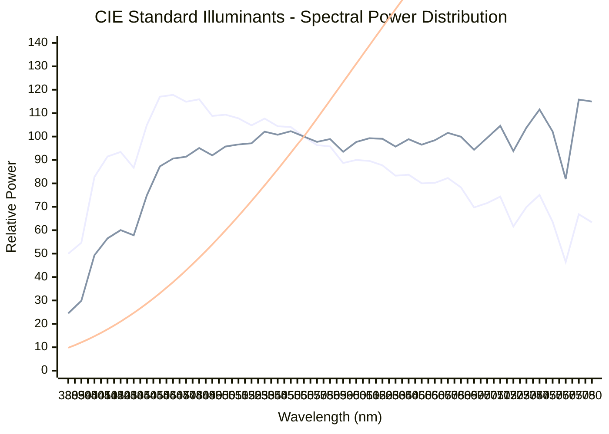

Reference light sources used in colorimetry for consistent color measurement and reproduction.

## Overview

Standard illuminants define the spectral power distribution (SPD) of light sources. They're essential for:
- Color measurement and specification
- Chromatic adaptation (adjusting colors for different lighting)
- Color matching across devices
- Quality control in manufacturing
- Color rendering index (CRI) calculations

---

## Common CIE Standard Illuminants

### D-Series (Daylight)

Represent natural daylight at different color temperatures.

| Illuminant | CCT | $X_n$ | $Y_n$ | $Z_n$ | Description |
|------------|-----|-------|-------|-------|-------------|
| **D50** | 5003K | 96.42 | 100.0 | 82.51 | Horizon daylight, printing standard |
| **D55** | 5503K | 95.68 | 100.0 | 92.15 | Mid-morning/afternoon daylight |
| **D65** | 6504K | 95.047 | 100.0 | 108.883 | Noon daylight, sRGB standard |
| **D75** | 7504K | 94.97 | 100.0 | 122.61 | North sky daylight |

### A-Series (Incandescent)

| Illuminant | CCT | $X_n$ | $Y_n$ | $Z_n$ | Description |
|------------|-----|-------|-------|-------|-------------|
| **A** | 2856K | 109.85 | 100.0 | 35.58 | Tungsten incandescent lamp |

### F-Series (Fluorescent)

| Illuminant | CCT | $X_n$ | $Y_n$ | $Z_n$ | Description |
|------------|-----|-------|-------|-------|-------------|
| **F2** | 4230K | 99.19 | 100.0 | 67.39 | Cool white fluorescent |
| **F7** | 6500K | 95.04 | 100.0 | 108.75 | Daylight fluorescent |
| **F11** | 4000K | 100.96 | 100.0 | 64.35 | Narrow-band white fluorescent |

### E (Equal Energy)

| Illuminant | CCT | $X_n$ | $Y_n$ | $Z_n$ | Description |
|------------|-----|-------|-------|-------|-------------|
| **E** | 5454K | 100.0 | 100.0 | 100.0 | Theoretical equal energy |

---

## Spectral Power Distributions

Illuminant SPDs at 5nm resolution (380-780nm):



---

## Color Temperature (CCT)

**Correlated Color Temperature** is measured in Kelvin (K):

- **< 3000K**: Warm (yellowish) - Candles, incandescent
- **3000-5000K**: Neutral - Fluorescent, morning sun
- **> 5000K**: Cool (bluish) - Daylight, overcast sky

### Approximation Formula

For Planckian radiators (blackbody):

$$
\text{CCT} \approx -449n^3 + 3525n^2 - 6823.3n + 5520.33
$$

Where $n = \frac{x - 0.3320}{y - 0.1858}$ and $(x, y)$ are chromaticity coordinates.

---

## Chromatic Adaptation

When converting colors between different illuminants, chromatic adaptation is needed.

### Bradford Transform (Most Accurate)

The Bradford transform converts XYZ values from one illuminant to another through a cone response domain (LMS):

**Step 1:** Convert XYZ to cone response (LMS)

$$
\begin{bmatrix} L \\\\ M \\\\ S \end{bmatrix} = 
\mathbf{M}_{\text{Bradford}} \cdot
\begin{bmatrix} X \\\\ Y \\\\ Z \end{bmatrix}
$$

**Step 2:** Scale cone responses

$$
\begin{bmatrix} L' \\\\ M' \\\\ S' \end{bmatrix} = 
\begin{bmatrix} 
\frac{L_{\text{dest}}}{L_{\text{src}}} & 0 & 0 \\\\
0 & \frac{M_{\text{dest}}}{M_{\text{src}}} & 0 \\\\
0 & 0 & \frac{S_{\text{dest}}}{S_{\text{src}}}
\end{bmatrix} \cdot
\begin{bmatrix} L \\\\ M \\\\ S \end{bmatrix}
$$

**Step 3:** Convert back to XYZ

$$
\begin{bmatrix} X' \\\\ Y' \\\\ Z' \end{bmatrix} = 
\mathbf{M}_{\text{Bradford}}^{-1} \cdot
\begin{bmatrix} L' \\\\ M' \\\\ S' \end{bmatrix}
$$

Where:

$$
\mathbf{M}_{\text{Bradford}} = \begin{bmatrix}
0.8951 & 0.2664 & -0.1614 \\\\
-0.7502 & 1.7135 & 0.0367 \\\\
0.0389 & -0.0685 & 1.0296
\end{bmatrix}
$$

---

## Color Rendering Index (CRI)

CRI measures how accurately a light source renders colors compared to a reference illuminant (typically D65 or A).

### CRI Calculation Method

**Step 1:** Select 8 test color samples (TCS01-TCS08)

These are standardized Munsell color samples covering the hue circle.

**Step 2:** Calculate tristimulus values under test and reference illuminants

For each test sample $i$:

$$
X_i^{\text{test}}, Y_i^{\text{test}}, Z_i^{\text{test}} = \int S_{\text{test}}(\lambda) R_i(\lambda) \bar{x}(\lambda) d\lambda, \ldots
$$

$$
X_i^{\text{ref}}, Y_i^{\text{ref}}, Z_i^{\text{ref}} = \int S_{\text{ref}}(\lambda) R_i(\lambda) \bar{x}(\lambda) d\lambda, \ldots
$$

**Step 3:** Convert to CIE 1960 UCS (u, v) coordinates

$$
u = \frac{4X}{X + 15Y + 3Z}
$$

$$
v = \frac{6Y}{X + 15Y + 3Z}
$$

**Step 4:** Apply chromatic adaptation

Adapt test illuminant colors to reference illuminant using von Kries transform.

**Step 5:** Convert to CIE 1964 W*U*V* color space

$$
W^* = 25Y^{1/3} - 17
$$

$$
U^* = 13W^*(u - u_n)
$$

$$
V^* = 13W^*(v - v_n)
$$

**Step 6:** Calculate color difference for each sample

$$
\Delta E_i = \sqrt{(U^*_{test} - U^*_{ref})^2 + (V^*_{test} - V^*_{ref})^2 + (W^*_{test} - W^*_{ref})^2}
$$

**Step 7:** Calculate special color rendering index for each sample

$$
R_i = 100 - 4.6\Delta E_i
$$

**Step 8:** Calculate general CRI (Ra)

$$
\text{CRI (Ra)} = \frac{1}{8}\sum_{i=1}^{8} R_i
$$

### CRI Interpretation

- **CRI > 90**: Excellent (museum, art gallery, medical)
- **CRI 80-90**: Good (home, office, retail)
- **CRI 70-80**: Fair (industrial, outdoor)
- **CRI < 70**: Poor (street lighting, parking)

### Python Implementation

```python
import numpy as np

def calculate_cri_single_sample(spd_test, spd_ref, reflectance, cmf_x, cmf_y, cmf_z, wavelengths):
    """
    Calculate CRI for a single test color sample
    
    Parameters:
    - spd_test: Test illuminant SPD
    - spd_ref: Reference illuminant SPD (D65 or A)
    - reflectance: Test color sample reflectance
    - cmf_x, cmf_y, cmf_z: CIE 1931 color matching functions
    - wavelengths: Wavelength array
    
    Returns:
    - R_i: Special color rendering index for this sample
    """
    delta_lambda = wavelengths[1] - wavelengths[0]
    
    # Calculate XYZ for test illuminant
    X_test = np.sum(spd_test * reflectance * cmf_x) * delta_lambda
    Y_test = np.sum(spd_test * reflectance * cmf_y) * delta_lambda
    Z_test = np.sum(spd_test * reflectance * cmf_z) * delta_lambda
    
    # Calculate XYZ for reference illuminant
    X_ref = np.sum(spd_ref * reflectance * cmf_x) * delta_lambda
    Y_ref = np.sum(spd_ref * reflectance * cmf_y) * delta_lambda
    Z_ref = np.sum(spd_ref * reflectance * cmf_z) * delta_lambda
    
    # Convert to CIE 1960 UCS
    def xyz_to_uv(X, Y, Z):
        denom = X + 15*Y + 3*Z
        u = 4*X / denom if denom != 0 else 0
        v = 6*Y / denom if denom != 0 else 0
        return u, v
    
    u_test, v_test = xyz_to_uv(X_test, Y_test, Z_test)
    u_ref, v_ref = xyz_to_uv(X_ref, Y_ref, Z_ref)
    
    # Calculate white point
    X_n_test = np.sum(spd_test * cmf_x) * delta_lambda
    Y_n_test = np.sum(spd_test * cmf_y) * delta_lambda
    Z_n_test = np.sum(spd_test * cmf_z) * delta_lambda
    u_n, v_n = xyz_to_uv(X_n_test, Y_n_test, Z_n_test)
    
    # Convert to W*U*V*
    def uv_to_wuv(u, v, Y, u_n, v_n):
        W = 25 * (Y ** (1/3)) - 17
        U = 13 * W * (u - u_n)
        V = 13 * W * (v - v_n)
        return W, U, V
    
    W_test, U_test, V_test = uv_to_wuv(u_test, v_test, Y_test, u_n, v_n)
    W_ref, U_ref, V_ref = uv_to_wuv(u_ref, v_ref, Y_ref, u_n, v_n)
    
    # Calculate color difference
    delta_E = np.sqrt((U_test - U_ref)**2 + (V_test - V_ref)**2 + (W_test - W_ref)**2)
    
    # Calculate special CRI
    R_i = 100 - 4.6 * delta_E
    
    return R_i

def calculate_cri(spd_test, spd_ref, tcs_reflectances, cmf_x, cmf_y, cmf_z, wavelengths):
    """
    Calculate general CRI (Ra) using 8 test color samples
    
    Parameters:
    - spd_test: Test illuminant SPD
    - spd_ref: Reference illuminant SPD
    - tcs_reflectances: List of 8 TCS reflectance spectra
    - cmf_x, cmf_y, cmf_z: Color matching functions
    - wavelengths: Wavelength array
    
    Returns:
    - Ra: General color rendering index (average of 8 samples)
    """
    R_values = []
    
    for i, reflectance in enumerate(tcs_reflectances[:8]):
        R_i = calculate_cri_single_sample(
            spd_test, spd_ref, reflectance,
            cmf_x, cmf_y, cmf_z, wavelengths
        )
        R_values.append(R_i)
    
    # General CRI is the average of 8 special indices
    Ra = np.mean(R_values)
    
    return Ra

# Example usage:
# wavelengths = np.arange(380, 781, 5)  # 5nm resolution
# spd_test = load_spd("test_led.csv")
# spd_ref = load_spd("D65.csv")
# tcs_reflectances = load_tcs_samples()  # Load 8 TCS samples
# cmf_x, cmf_y, cmf_z = load_cmf()
# 
# cri = calculate_cri(spd_test, spd_ref, tcs_reflectances, cmf_x, cmf_y, cmf_z, wavelengths)
# print(f"CRI (Ra): {cri:.1f}")
```

---

## Practical Implementation

### Python

```python
import numpy as np

# Standard illuminants (2° observer, normalized to Y=100)
ILLUMINANTS = {
    'A':   np.array([109.850, 100.0, 35.585]),
    'D50': np.array([96.422, 100.0, 82.521]),
    'D55': np.array([95.682, 100.0, 92.149]),
    'D65': np.array([95.047, 100.0, 108.883]),
    'D75': np.array([94.972, 100.0, 122.638]),
    'E':   np.array([100.0, 100.0, 100.0]),
    'F2':  np.array([99.187, 100.0, 67.395]),
    'F7':  np.array([95.044, 100.0, 108.755]),
    'F11': np.array([100.966, 100.0, 64.370]),
}

def get_illuminant(name='D65'):
    """Get XYZ values for a standard illuminant"""
    return ILLUMINANTS.get(name.upper(), ILLUMINANTS['D65'])

# Bradford chromatic adaptation matrix
BRADFORD = np.array([
    [ 0.8951,  0.2664, -0.1614],
    [-0.7502,  1.7135,  0.0367],
    [ 0.0389, -0.0685,  1.0296]
])

BRADFORD_INV = np.linalg.inv(BRADFORD)

def chromatic_adaptation(xyz, src_illuminant='D65', dst_illuminant='D50'):
    """
    Adapt XYZ color from one illuminant to another using Bradford transform
    """
    src_white = get_illuminant(src_illuminant)
    dst_white = get_illuminant(dst_illuminant)
    
    # Convert whites to cone response domain (LMS)
    src_lms = BRADFORD @ src_white
    dst_lms = BRADFORD @ dst_white
    
    # Convert color to LMS
    color_lms = BRADFORD @ xyz
    
    # Scale factors
    scale = dst_lms / src_lms
    
    # Apply scaling
    adapted_lms = scale * color_lms
    
    # Convert back to XYZ
    xyz_adapted = BRADFORD_INV @ adapted_lms
    
    return xyz_adapted
```

### Go

```go
package color

var Illuminants = map[string]XYZ{
    "A":   {109.850, 100.0, 35.585},
    "D50": {96.422, 100.0, 82.521},
    "D55": {95.682, 100.0, 92.149},
    "D65": {95.047, 100.0, 108.883},
    "D75": {94.972, 100.0, 122.638},
    "E":   {100.0, 100.0, 100.0},
    "F2":  {99.187, 100.0, 67.395},
    "F7":  {95.044, 100.0, 108.755},
    "F11": {100.966, 100.0, 64.370},
}

func GetIlluminant(name string) XYZ {
    if ill, ok := Illuminants[name]; ok {
        return ill
    }
    return Illuminants["D65"] // Default
}
```

---

## Use Cases by Illuminant

### D65
- **sRGB, Adobe RGB**: Standard for computer displays
- **HDTV**: Broadcast standard
- **Photography**: Digital camera white balance "daylight"

### D50
- **Printing**: ICC profile connection space
- **ProPhoto RGB**: Wide-gamut color space
- **Color management**: Industry standard for graphic arts

### A
- **Photography**: Tungsten/incandescent white balance
- **Testing**: Simulating indoor lighting
- **Color rendering index**: Reference for warm lighting

### F-Series
- **Retail**: Simulating store lighting
- **Office**: Fluorescent lighting conditions
- **Color rendering**: Testing under artificial light

---

## Important Notes

1. **Always specify the illuminant** when measuring or specifying colors
2. **D65 is most common** for digital imaging and displays
3. **D50 is standard** for print and graphic arts
4. **Chromatic adaptation** is necessary when converting between illuminants
5. **Observer angle** (2° or 10°) also affects XYZ values
6. **CRI is illuminant-specific** - always compare against appropriate reference

---

## Further Reading

- [Standard Illuminant - Wikipedia](https://en.wikipedia.org/wiki/Standard_illuminant)
- [CIE Illuminants](http://www.cie.co.at/)
- [Bruce Lindbloom's Chromatic Adaptation](http://www.brucelindbloom.com/index.html?Eqn_ChromAdapt.html)
- [Color Rendering Index - CIE 13.3](https://cie.co.at/publications/method-measuring-and-specifying-colour-rendering-properties-light-sources)
