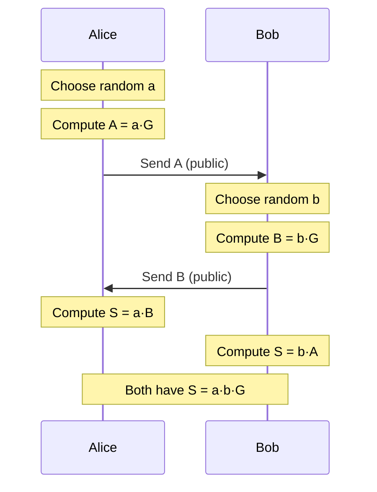

Asymmetric (public-key) cryptography with mathematical foundations, including RSA, ECC, and key exchange protocols.

---

## Mathematical Foundation

### Public-Key Cryptosystem

A public-key cryptosystem consists of:

$$
\begin{aligned}
(pk, sk) &\leftarrow KeyGen() \\
C &= Encrypt(pk, M) \\
M &= Decrypt(sk, C)
\end{aligned}
$$

Where:
- $pk$: Public key (can be shared)
- $sk$: Private/secret key (must be kept secret)
- $M$: Message
- $C$: Ciphertext

**Property**: $Decrypt(sk, Encrypt(pk, M)) = M$

---

## RSA (Rivest-Shamir-Adleman)

### Key Generation

1. Choose two large primes $p$ and $q$ (e.g., 1024 bits each)
2. Compute $n = p \cdot q$ (modulus)
3. Compute $\phi(n) = (p-1)(q-1)$ (Euler's totient)
4. Choose $e$ such that $\gcd(e, \phi(n)) = 1$ (commonly $e = 65537$)
5. Compute $d = e^{-1} \mod \phi(n)$ (private exponent)

$$
\begin{aligned}
\text{Public key:} \quad & (n, e) \\
\text{Private key:} \quad & (n, d)
\end{aligned}
$$

### Encryption

$$
C = M^e \mod n
$$

### Decryption

$$
M = C^d \mod n
$$

### Why It Works

By Euler's theorem:

$$
M^{\phi(n)} \equiv 1 \pmod{n} \quad \text{if } \gcd(M, n) = 1
$$

Since $e \cdot d \equiv 1 \pmod{\phi(n)}$, we have $e \cdot d = k \cdot \phi(n) + 1$:

$$
\begin{aligned}
C^d &= (M^e)^d = M^{ed} \\
&= M^{k \cdot \phi(n) + 1} \\
&= M \cdot (M^{\phi(n)})^k \\
&\equiv M \cdot 1^k \equiv M \pmod{n}
\end{aligned}
$$

### Security

**Hard problem**: Integer factorization

Given $n = p \cdot q$, finding $p$ and $q$ is computationally hard.

**Best known algorithm**: General Number Field Sieve (GNFS)

**Complexity**: $O(e^{(\ln n)^{1/3} (\ln \ln n)^{2/3}})$

**Key sizes**:
- 2048 bits: ~112-bit security
- 3072 bits: ~128-bit security
- 4096 bits: ~140-bit security

---

## Elliptic Curve Cryptography (ECC)

### Elliptic Curve Definition

Curve over $\mathbb{F}_p$ (prime field):

$$
y^2 = x^3 + ax + b \pmod{p}
$$

**Example**: secp256k1 (Bitcoin):

$$
y^2 = x^3 + 7 \pmod{p}
$$

Where $p = 2^{256} - 2^{32} - 2^9 - 2^8 - 2^7 - 2^6 - 2^4 - 1$

### Point Addition

For points $P = (x_1, y_1)$ and $Q = (x_2, y_2)$:

**If $P \neq Q$** (point addition):

$$
\begin{aligned}
\lambda &= \frac{y_2 - y_1}{x_2 - x_1} \mod p \\
x_3 &= \lambda^2 - x_1 - x_2 \mod p \\
y_3 &= \lambda(x_1 - x_3) - y_1 \mod p
\end{aligned}
$$

**If $P = Q$** (point doubling):

$$
\begin{aligned}
\lambda &= \frac{3x_1^2 + a}{2y_1} \mod p \\
x_3 &= \lambda^2 - 2x_1 \mod p \\
y_3 &= \lambda(x_1 - x_3) - y_1 \mod p
\end{aligned}
$$

### Scalar Multiplication

$$
Q = k \cdot P = \underbrace{P + P + \cdots + P}_{k \text{ times}}
$$

**Computed efficiently** using double-and-add algorithm: $O(\log k)$

### ECDH (Elliptic Curve Diffie-Hellman)

1. Agree on curve parameters $(p, a, b, G, n)$
2. Alice: $a \leftarrow random$, $A = a \cdot G$
3. Bob: $b \leftarrow random$, $B = b \cdot G$
4. Alice computes: $S = a \cdot B = a \cdot (b \cdot G)$
5. Bob computes: $S = b \cdot A = b \cdot (a \cdot G)$

$$
S = a \cdot b \cdot G \quad \text{(shared secret)}
$$



### Security

**Hard problem**: Elliptic Curve Discrete Logarithm Problem (ECDLP)

Given $Q = k \cdot P$, finding $k$ is computationally hard.

**Best known algorithm**: Pollard's rho

**Complexity**: $O(\sqrt{n})$ where $n$ is the order of the curve

**Key sizes** (equivalent security):
- 256-bit ECC ≈ 3072-bit RSA ≈ 128-bit security
- 384-bit ECC ≈ 7680-bit RSA ≈ 192-bit security

**Advantage**: Much smaller keys for same security!

---

## Modern Curves

### Curve25519 (X25519 for key exchange)

Montgomery curve:

$$
y^2 = x^3 + 486662x^2 + x \pmod{2^{255} - 19}
$$

**Advantages**:
- Fast (optimized for modern CPUs)
- Side-channel resistant
- Safe by design (no weak points)

### Ed25519 (EdDSA for signatures)

Edwards curve (birationally equivalent to Curve25519):

$$
-x^2 + y^2 = 1 - \frac{121665}{121666}x^2y^2 \pmod{2^{255} - 19}
$$

---

## Python Implementation

### RSA

```python
from cryptography.hazmat.primitives.asymmetric import rsa, padding
from cryptography.hazmat.primitives import hashes

# Generate key pair
private_key = rsa.generate_private_key(
    public_exponent=65537,
    key_size=2048
)
public_key = private_key.public_key()

# Encrypt
message = b"Secret message"
ciphertext = public_key.encrypt(
    message,
    padding.OAEP(
        mgf=padding.MGF1(algorithm=hashes.SHA256()),
        algorithm=hashes.SHA256(),
        label=None
    )
)

# Decrypt
plaintext = private_key.decrypt(
    ciphertext,
    padding.OAEP(
        mgf=padding.MGF1(algorithm=hashes.SHA256()),
        algorithm=hashes.SHA256(),
        label=None
    )
)
```

### X25519 (Key Exchange)

```python
from cryptography.hazmat.primitives.asymmetric import x25519

# Alice
alice_private = x25519.X25519PrivateKey.generate()
alice_public = alice_private.public_key()

# Bob
bob_private = x25519.X25519PrivateKey.generate()
bob_public = bob_private.public_key()

# Derive shared secret
alice_shared = alice_private.exchange(bob_public)
bob_shared = bob_private.exchange(alice_public)

assert alice_shared == bob_shared  # Same secret!

# Derive encryption key from shared secret
from cryptography.hazmat.primitives.kdf.hkdf import HKDF
from cryptography.hazmat.primitives import hashes

key = HKDF(
    algorithm=hashes.SHA256(),
    length=32,
    salt=None,
    info=b'handshake data',
).derive(alice_shared)
```

### ECDH with secp256k1

```python
from cryptography.hazmat.primitives.asymmetric import ec

# Generate keys
private_key = ec.generate_private_key(ec.SECP256K1())
public_key = private_key.public_key()

# Peer's public key
peer_public_key = ec.generate_private_key(ec.SECP256K1()).public_key()

# Derive shared secret
shared_secret = private_key.exchange(ec.ECDH(), peer_public_key)
```

---

## Hybrid Encryption

**Problem**: RSA/ECC are slow for large data

**Solution**: Combine symmetric + asymmetric

```python
from cryptography.hazmat.primitives.ciphers.aead import AESGCM
import os

def hybrid_encrypt(plaintext, recipient_public_key):
    # 1. Generate random symmetric key
    aes_key = AESGCM.generate_key(bit_length=256)
    
    # 2. Encrypt data with AES
    aesgcm = AESGCM(aes_key)
    nonce = os.urandom(12)
    ciphertext = aesgcm.encrypt(nonce, plaintext, None)
    
    # 3. Encrypt AES key with RSA
    encrypted_key = recipient_public_key.encrypt(
        aes_key,
        padding.OAEP(
            mgf=padding.MGF1(algorithm=hashes.SHA256()),
            algorithm=hashes.SHA256(),
            label=None
        )
    )
    
    return encrypted_key, nonce, ciphertext

def hybrid_decrypt(encrypted_key, nonce, ciphertext, private_key):
    # 1. Decrypt AES key with RSA
    aes_key = private_key.decrypt(
        encrypted_key,
        padding.OAEP(
            mgf=padding.MGF1(algorithm=hashes.SHA256()),
            algorithm=hashes.SHA256(),
            label=None
        )
    )
    
    # 2. Decrypt data with AES
    aesgcm = AESGCM(aes_key)
    plaintext = aesgcm.decrypt(nonce, ciphertext, None)
    
    return plaintext
```

---

## Comparison

| Algorithm | Key Size | Speed | Security Basis | Use Case |
|-----------|----------|-------|----------------|----------|
| **RSA-2048** | 2048 bits | Slow | Factorization | Legacy, TLS |
| **RSA-4096** | 4096 bits | Very slow | Factorization | High security |
| **ECC-256** | 256 bits | Fast | ECDLP | Modern, mobile |
| **X25519** | 256 bits | Very fast | ECDLP | Key exchange |
| **Ed25519** | 256 bits | Very fast | ECDLP | Signatures |

---