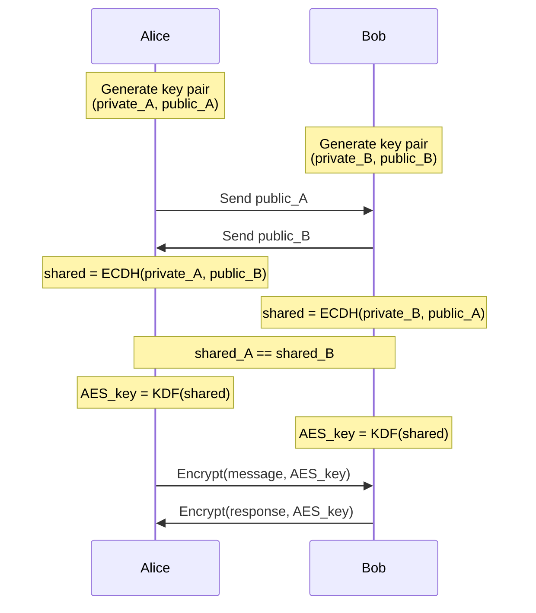

Encrypt and decrypt data using public/private key pairs and derive symmetric keys from ECC key pairs.

---

## RSA Encryption (OpenSSL)

```bash
# Generate RSA key pair
openssl genrsa -out private.pem 4096
openssl rsa -in private.pem -pubout -out public.pem

# Encrypt file with public key
openssl rsautl -encrypt -pubin -inkey public.pem -in message.txt -out encrypted.bin

# Decrypt file with private key
openssl rsautl -decrypt -inkey private.pem -in encrypted.bin -out decrypted.txt

# For larger files, use hybrid encryption (RSA + AES)
# Generate random AES key
openssl rand -base64 32 > aes.key

# Encrypt file with AES
openssl enc -aes-256-cbc -salt -in largefile.txt -out largefile.enc -pass file:aes.key

# Encrypt AES key with RSA
openssl rsautl -encrypt -pubin -inkey public.pem -in aes.key -out aes.key.enc

# Decrypt AES key with RSA
openssl rsautl -decrypt -inkey private.pem -in aes.key.enc -out aes.key.dec

# Decrypt file with AES
openssl enc -d -aes-256-cbc -in largefile.enc -out largefile.dec -pass file:aes.key.dec
```

---

## RSA Encryption (pkeyutl - Modern)

```bash
# Encrypt with public key
openssl pkeyutl -encrypt -pubin -inkey public.pem -in message.txt -out encrypted.bin

# Decrypt with private key
openssl pkeyutl -decrypt -inkey private.pem -in encrypted.bin -out decrypted.txt

# With OAEP padding (recommended)
openssl pkeyutl -encrypt -pubin -inkey public.pem -pkeyopt rsa_padding_mode:oaep \
  -pkeyopt rsa_oaep_md:sha256 -in message.txt -out encrypted.bin

openssl pkeyutl -decrypt -inkey private.pem -pkeyopt rsa_padding_mode:oaep \
  -pkeyopt rsa_oaep_md:sha256 -in encrypted.bin -out decrypted.txt
```

---

## ECDH Key Exchange

```bash
# Alice generates key pair
openssl ecparam -name prime256v1 -genkey -noout -out alice_private.pem
openssl ec -in alice_private.pem -pubout -out alice_public.pem

# Bob generates key pair
openssl ecparam -name prime256v1 -genkey -noout -out bob_private.pem
openssl ec -in bob_private.pem -pubout -out bob_public.pem

# Alice derives shared secret using Bob's public key
openssl pkeyutl -derive -inkey alice_private.pem -peerkey bob_public.pem -out alice_shared.bin

# Bob derives shared secret using Alice's public key
openssl pkeyutl -derive -inkey bob_private.pem -peerkey alice_public.pem -out bob_shared.bin

# Both shared secrets are identical
diff alice_shared.bin bob_shared.bin  # No output = identical

# Derive AES key from shared secret
openssl dgst -sha256 -binary alice_shared.bin > aes.key

# Encrypt with derived key
openssl enc -aes-256-cbc -salt -in message.txt -out encrypted.bin -pass file:aes.key

# Decrypt with derived key
openssl enc -d -aes-256-cbc -in encrypted.bin -out decrypted.txt -pass file:aes.key
```

---

## GPG/PGP Encryption

```bash
# Encrypt for recipient
gpg --encrypt --recipient recipient@example.com message.txt
# Creates message.txt.gpg

# Encrypt (ASCII armor)
gpg --encrypt --armor --recipient recipient@example.com message.txt
# Creates message.txt.asc

# Encrypt for multiple recipients
gpg --encrypt --recipient alice@example.com --recipient bob@example.com message.txt

# Encrypt and sign
gpg --encrypt --sign --recipient recipient@example.com message.txt

# Decrypt
gpg --decrypt message.txt.gpg > decrypted.txt

# Decrypt and verify signature
gpg --decrypt message.txt.gpg
```

---

## Age Encryption (Modern Alternative)

```bash
# Install age
sudo apt install age

# Generate key pair
age-keygen -o key.txt
# Public key: age1ql3z7hjy54pw3hyww5ayyfg7zqgvc7w3j2elw8zmrj2kg5sfn9aqmcac8p

# Encrypt with public key
age -r age1ql3z7hjy54pw3hyww5ayyfg7zqgvc7w3j2elw8zmrj2kg5sfn9aqmcac8p \
  -o encrypted.age message.txt

# Decrypt with private key
age -d -i key.txt encrypted.age > decrypted.txt

# Encrypt for multiple recipients
age -r age1... -r age1... -o encrypted.age message.txt
```

---

## Python: RSA Encryption

```python
from cryptography.hazmat.primitives.asymmetric import rsa, padding
from cryptography.hazmat.primitives import hashes, serialization
from cryptography.hazmat.backends import default_backend

# Generate key pair
private_key = rsa.generate_private_key(
    public_exponent=65537,
    key_size=4096,
    backend=default_backend()
)
public_key = private_key.public_key()

# Encrypt with public key
message = b"Hello, World!"
ciphertext = public_key.encrypt(
    message,
    padding.OAEP(
        mgf=padding.MGF1(algorithm=hashes.SHA256()),
        algorithm=hashes.SHA256(),
        label=None
    )
)

print(f"Encrypted: {ciphertext.hex()[:64]}...")

# Decrypt with private key
plaintext = private_key.decrypt(
    ciphertext,
    padding.OAEP(
        mgf=padding.MGF1(algorithm=hashes.SHA256()),
        algorithm=hashes.SHA256(),
        label=None
    )
)

print(f"Decrypted: {plaintext.decode()}")
```

---

## Python: ECDH Key Exchange

```python
from cryptography.hazmat.primitives.asymmetric import ec
from cryptography.hazmat.primitives import hashes, serialization
from cryptography.hazmat.primitives.kdf.hkdf import HKDF
from cryptography.hazmat.primitives.ciphers import Cipher, algorithms, modes
from cryptography.hazmat.backends import default_backend
import os

# Alice generates key pair
alice_private = ec.generate_private_key(ec.SECP256R1(), default_backend())
alice_public = alice_private.public_key()

# Bob generates key pair
bob_private = ec.generate_private_key(ec.SECP256R1(), default_backend())
bob_public = bob_private.public_key()

# Alice derives shared secret
alice_shared = alice_private.exchange(ec.ECDH(), bob_public)

# Bob derives shared secret
bob_shared = bob_private.exchange(ec.ECDH(), alice_public)

# Both shared secrets are identical
assert alice_shared == bob_shared

# Derive AES key from shared secret using HKDF
def derive_key(shared_secret):
    return HKDF(
        algorithm=hashes.SHA256(),
        length=32,
        salt=None,
        info=b'handshake data',
        backend=default_backend()
    ).derive(shared_secret)

aes_key = derive_key(alice_shared)

# Encrypt with derived key
def encrypt_message(key, plaintext):
    iv = os.urandom(16)
    cipher = Cipher(
        algorithms.AES(key),
        modes.CBC(iv),
        backend=default_backend()
    )
    encryptor = cipher.encryptor()
    
    # Pad plaintext to block size
    pad_length = 16 - (len(plaintext) % 16)
    padded = plaintext + bytes([pad_length] * pad_length)
    
    ciphertext = encryptor.update(padded) + encryptor.finalize()
    return iv + ciphertext

# Decrypt with derived key
def decrypt_message(key, ciphertext):
    iv = ciphertext[:16]
    actual_ciphertext = ciphertext[16:]
    
    cipher = Cipher(
        algorithms.AES(key),
        modes.CBC(iv),
        backend=default_backend()
    )
    decryptor = cipher.decryptor()
    
    padded = decryptor.update(actual_ciphertext) + decryptor.finalize()
    
    # Remove padding
    pad_length = padded[-1]
    return padded[:-pad_length]

# Example usage
message = b"Hello, World!"
encrypted = encrypt_message(aes_key, message)
decrypted = decrypt_message(aes_key, encrypted)

print(f"Original: {message}")
print(f"Encrypted: {encrypted.hex()[:64]}...")
print(f"Decrypted: {decrypted}")
```

---

## Python: Hybrid Encryption (RSA + AES)

```python
from cryptography.hazmat.primitives.asymmetric import rsa, padding
from cryptography.hazmat.primitives import hashes, serialization
from cryptography.hazmat.primitives.ciphers import Cipher, algorithms, modes
from cryptography.hazmat.backends import default_backend
import os

class HybridEncryption:
    def __init__(self):
        # Generate RSA key pair
        self.private_key = rsa.generate_private_key(
            public_exponent=65537,
            key_size=4096,
            backend=default_backend()
        )
        self.public_key = self.private_key.public_key()
    
    def encrypt(self, plaintext: bytes) -> tuple:
        """Encrypt using hybrid encryption (RSA + AES)"""
        # Generate random AES key
        aes_key = os.urandom(32)
        iv = os.urandom(16)
        
        # Encrypt data with AES
        cipher = Cipher(
            algorithms.AES(aes_key),
            modes.CBC(iv),
            backend=default_backend()
        )
        encryptor = cipher.encryptor()
        
        # Pad plaintext
        pad_length = 16 - (len(plaintext) % 16)
        padded = plaintext + bytes([pad_length] * pad_length)
        
        ciphertext = encryptor.update(padded) + encryptor.finalize()
        
        # Encrypt AES key with RSA
        encrypted_key = self.public_key.encrypt(
            aes_key,
            padding.OAEP(
                mgf=padding.MGF1(algorithm=hashes.SHA256()),
                algorithm=hashes.SHA256(),
                label=None
            )
        )
        
        return encrypted_key, iv, ciphertext
    
    def decrypt(self, encrypted_key: bytes, iv: bytes, ciphertext: bytes) -> bytes:
        """Decrypt using hybrid encryption"""
        # Decrypt AES key with RSA
        aes_key = self.private_key.decrypt(
            encrypted_key,
            padding.OAEP(
                mgf=padding.MGF1(algorithm=hashes.SHA256()),
                algorithm=hashes.SHA256(),
                label=None
            )
        )
        
        # Decrypt data with AES
        cipher = Cipher(
            algorithms.AES(aes_key),
            modes.CBC(iv),
            backend=default_backend()
        )
        decryptor = cipher.decryptor()
        
        padded = decryptor.update(ciphertext) + decryptor.finalize()
        
        # Remove padding
        pad_length = padded[-1]
        return padded[:-pad_length]

# Example usage
hybrid = HybridEncryption()

message = b"This is a long message that needs hybrid encryption!"
encrypted_key, iv, ciphertext = hybrid.encrypt(message)

print(f"Original: {message}")
print(f"Encrypted key: {encrypted_key.hex()[:64]}...")
print(f"IV: {iv.hex()}")
print(f"Ciphertext: {ciphertext.hex()[:64]}...")

decrypted = hybrid.decrypt(encrypted_key, iv, ciphertext)
print(f"Decrypted: {decrypted}")
```

---

## ECDH Flow Diagram



---

## Key Exchange Mathematics

For ECDH on curve \( E \) with generator \( G \):

**Alice**:
- Private key: \( a \in \mathbb{Z}_n \)
- Public key: \( A = aG \)

**Bob**:
- Private key: \( b \in \mathbb{Z}_n \)
- Public key: \( B = bG \)

**Shared Secret**:

$$
\text{Alice computes: } S = aB = a(bG) = abG
$$

$$
\text{Bob computes: } S = bA = b(aG) = abG
$$

$$
\therefore S_{\text{Alice}} = S_{\text{Bob}}
$$

---

## Best Practices

1. **RSA Encryption**:
   - Use OAEP padding (not PKCS#1 v1.5)
   - Use 4096-bit keys minimum
   - Use hybrid encryption for large data
   - Never encrypt same data twice

2. **ECDH**:
   - Use strong curves (P-256, P-384, Curve25519)
   - Use HKDF to derive keys from shared secret
   - Include context info in KDF
   - Use authenticated encryption (GCM)

3. **General**:
   - Always use authenticated encryption
   - Generate new IV for each encryption
   - Use secure random number generator
   - Verify recipient's public key

---