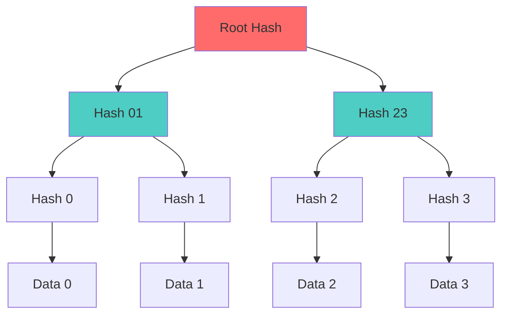

Cryptographic hash functions with mathematical properties and practical implementations.

---

## Mathematical Definition

A cryptographic hash function $H: \{0,1\}^* \to \{0,1\}^n$ maps arbitrary-length input to fixed-length output.

$$
H(m) = h
$$

Where:
- $m$: Message (arbitrary length)
- $h$: Hash digest (fixed length, e.g., 256 bits)

---

## Security Properties

### 1. Preimage Resistance (One-Way)

Given $h$, computationally infeasible to find $m$ such that:

$$
H(m) = h
$$

**Complexity**: $O(2^n)$ operations

### 2. Second Preimage Resistance

Given $m_1$, computationally infeasible to find $m_2 \neq m_1$ such that:

$$
H(m_1) = H(m_2)
$$

**Complexity**: $O(2^n)$ operations

### 3. Collision Resistance

Computationally infeasible to find any $m_1 \neq m_2$ such that:

$$
H(m_1) = H(m_2)
$$

**Complexity**: $O(2^{n/2})$ operations (Birthday Paradox)

---

## Birthday Paradox

**Probability of collision** after $k$ hashes:

$$
P(collision) \approx 1 - e^{-\frac{k^2}{2 \cdot 2^n}}
$$

For 50% probability:

$$
k \approx \sqrt{2^n} = 2^{n/2}
$$

**Example**: SHA-256 ($n=256$) requires $\approx 2^{128}$ hashes for 50% collision probability.

---

## Avalanche Effect

Small change in input causes large change in output:

$$
\text{If } m' = m \oplus \Delta \text{ (1-bit change)}
$$

$$
\text{Then } H(m') \text{ differs from } H(m) \text{ in } \approx 50\% \text{ of bits}
$$

---

## Common Algorithms

| Algorithm | Output Size | Security | Speed | Use Case |
|-----------|-------------|----------|-------|----------|
| **SHA-256** | 256 bits | High | Fast | General purpose, Bitcoin |
| **SHA-3** | Variable | High | Moderate | Modern alternative |
| **BLAKE2** | Variable | High | Very fast | Zcash, general |
| **BLAKE3** | 256 bits | High | Fastest | Modern, parallel |
| **MD5** | 128 bits | ❌ Broken | Fast | Legacy only |
| **SHA-1** | 160 bits | ❌ Weak | Fast | Deprecated |

---

## Python Implementation

```python
import hashlib

# SHA-256
data = b"Hello, World!"
hash_sha256 = hashlib.sha256(data).hexdigest()
print(f"SHA-256: {hash_sha256}")

# SHA-3
hash_sha3 = hashlib.sha3_256(data).hexdigest()
print(f"SHA-3: {hash_sha3}")

# BLAKE2
hash_blake2 = hashlib.blake2b(data, digest_size=32).hexdigest()
print(f"BLAKE2: {hash_blake2}")

# Verify integrity
def verify_hash(data, expected_hash):
    computed = hashlib.sha256(data).hexdigest()
    return computed == expected_hash

# File hashing
def hash_file(filename):
    sha256 = hashlib.sha256()
    with open(filename, 'rb') as f:
        for chunk in iter(lambda: f.read(4096), b""):
            sha256.update(chunk)
    return sha256.hexdigest()
```

---

## Merkle Trees



**Construction**:

$$
\begin{aligned}
H_0 &= H(\text{Data}_0) \\
H_1 &= H(\text{Data}_1) \\
H_{01} &= H(H_0 \| H_1) \\
\text{Root} &= H(H_{01} \| H_{23})
\end{aligned}
$$

---

## Hash-Based Message Authentication

### HMAC Construction

$$
\text{HMAC}(K, m) = H\left((K \oplus opad) \| H((K \oplus ipad) \| m)\right)
$$

Where:
- $K$: Secret key
- $opad$: Outer padding ($0x5c$ repeated)
- $ipad$: Inner padding ($0x36$ repeated)
- $\|$: Concatenation

```python
import hmac
import hashlib

key = b"secret-key"
message = b"message"

# Create HMAC
mac = hmac.new(key, message, hashlib.sha256).digest()

# Verify HMAC (constant-time comparison)
def verify_hmac(message, mac, key):
    expected = hmac.new(key, message, hashlib.sha256).digest()
    return hmac.compare_digest(mac, expected)
```

---

## Applications

### 1. Data Integrity

```python
# Download verification
import requests
import hashlib

url = "https://example.com/file.zip"
expected_hash = "abc123..."

response = requests.get(url)
computed_hash = hashlib.sha256(response.content).hexdigest()

if computed_hash == expected_hash:
    print("File integrity verified!")
```

### 2. Proof of Work (Bitcoin)

Find nonce $n$ such that:

$$
H(\text{block\_header} \| n) < \text{target}
$$

```python
def proof_of_work(block_header, target):
    nonce = 0
    while True:
        data = f"{block_header}{nonce}".encode()
        hash_result = hashlib.sha256(data).hexdigest()
        if int(hash_result, 16) < target:
            return nonce
        nonce += 1
```

### 3. Commitment Schemes

Commit to value without revealing it:

$$
\text{commit}(x, r) = H(x \| r)
$$

Later reveal $x$ and $r$ to verify.

---