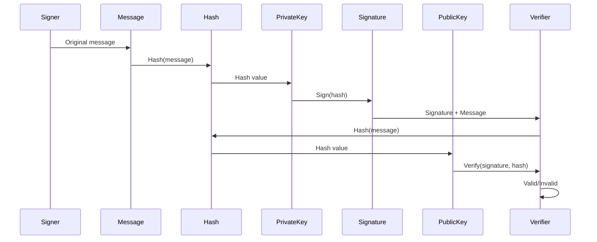

Hash and digitally sign text using public/private key pairs.

---

## Hash Text (OpenSSL)

```bash
# SHA-256 hash
echo -n "Hello, World!" | openssl dgst -sha256
echo -n "Hello, World!" | openssl sha256

# SHA-512 hash
echo -n "Hello, World!" | openssl dgst -sha512

# Hash file
openssl dgst -sha256 file.txt

# Output in hex
openssl dgst -sha256 -hex file.txt

# Output in binary
openssl dgst -sha256 -binary file.txt > hash.bin
```

---

## Sign with RSA

```bash
# Generate RSA key pair
openssl genrsa -out private.pem 4096
openssl rsa -in private.pem -pubout -out public.pem

# Sign text file
echo "Hello, World!" > message.txt
openssl dgst -sha256 -sign private.pem -out signature.bin message.txt

# Sign with base64 encoding
openssl dgst -sha256 -sign private.pem message.txt | base64 > signature.b64

# Verify signature
openssl dgst -sha256 -verify public.pem -signature signature.bin message.txt
# Output: Verified OK

# Verify base64 signature
base64 -d signature.b64 | openssl dgst -sha256 -verify public.pem -signature /dev/stdin message.txt
```

---

## Sign with ECDSA

```bash
# Generate ECC key pair
openssl ecparam -name prime256v1 -genkey -noout -out private.pem
openssl ec -in private.pem -pubout -out public.pem

# Sign text file
echo "Hello, World!" > message.txt
openssl dgst -sha256 -sign private.pem -out signature.bin message.txt

# Verify signature
openssl dgst -sha256 -verify public.pem -signature signature.bin message.txt
# Output: Verified OK
```

---

## Sign with Ed25519

```bash
# Generate Ed25519 key pair
openssl genpkey -algorithm Ed25519 -out private.pem
openssl pkey -in private.pem -pubout -out public.pem

# Sign text file
echo "Hello, World!" > message.txt
openssl pkeyutl -sign -inkey private.pem -out signature.bin -rawin -in message.txt

# Verify signature
openssl pkeyutl -verify -pubin -inkey public.pem -sigfile signature.bin -rawin -in message.txt
# Output: Signature Verified Successfully
```

---

## Sign with SSH Keys

```bash
# Generate SSH key
ssh-keygen -t ed25519 -f ~/.ssh/id_ed25519 -N ""

# Sign file
ssh-keygen -Y sign -f ~/.ssh/id_ed25519 -n file message.txt

# Creates message.txt.sig

# Verify signature (need allowed_signers file)
echo "user@host $(cat ~/.ssh/id_ed25519.pub)" > allowed_signers
ssh-keygen -Y verify -f allowed_signers -I user@host -n file -s message.txt.sig < message.txt
# Output: Good "file" signature for user@host with ED25519 key...
```

---

## GPG/PGP Signing

```bash
# Sign file (detached signature)
gpg --detach-sign --armor message.txt
# Creates message.txt.asc

# Sign file (clear-sign)
gpg --clear-sign message.txt
# Creates message.txt.asc with message included

# Sign file (embedded signature)
gpg --sign message.txt
# Creates message.txt.gpg (binary)

# Verify detached signature
gpg --verify message.txt.asc message.txt

# Verify clear-signed message
gpg --verify message.txt.asc

# Verify embedded signature (extracts message)
gpg --decrypt message.txt.gpg
```

---

## Python: Hash Text

```python
import hashlib

# SHA-256
text = "Hello, World!"
hash_obj = hashlib.sha256(text.encode())
print(hash_obj.hexdigest())

# SHA-512
hash_obj = hashlib.sha512(text.encode())
print(hash_obj.hexdigest())

# BLAKE2
hash_obj = hashlib.blake2b(text.encode())
print(hash_obj.hexdigest())

# Hash file
def hash_file(filename):
    sha256 = hashlib.sha256()
    with open(filename, 'rb') as f:
        for chunk in iter(lambda: f.read(4096), b''):
            sha256.update(chunk)
    return sha256.hexdigest()

print(hash_file('message.txt'))
```

---

## Python: Sign with RSA

```python
from cryptography.hazmat.primitives import hashes, serialization
from cryptography.hazmat.primitives.asymmetric import rsa, padding
from cryptography.hazmat.backends import default_backend

# Generate key pair
private_key = rsa.generate_private_key(
    public_exponent=65537,
    key_size=4096,
    backend=default_backend()
)
public_key = private_key.public_key()

# Message to sign
message = b"Hello, World!"

# Sign message
signature = private_key.sign(
    message,
    padding.PSS(
        mgf=padding.MGF1(hashes.SHA256()),
        salt_length=padding.PSS.MAX_LENGTH
    ),
    hashes.SHA256()
)

print(f"Signature: {signature.hex()}")

# Verify signature
try:
    public_key.verify(
        signature,
        message,
        padding.PSS(
            mgf=padding.MGF1(hashes.SHA256()),
            salt_length=padding.PSS.MAX_LENGTH
        ),
        hashes.SHA256()
    )
    print("Signature is valid!")
except Exception as e:
    print(f"Signature is invalid: {e}")
```

---

## Python: Sign with ECDSA

```python
from cryptography.hazmat.primitives import hashes, serialization
from cryptography.hazmat.primitives.asymmetric import ec
from cryptography.hazmat.backends import default_backend

# Generate key pair
private_key = ec.generate_private_key(ec.SECP256R1(), default_backend())
public_key = private_key.public_key()

# Message to sign
message = b"Hello, World!"

# Sign message
signature = private_key.sign(
    message,
    ec.ECDSA(hashes.SHA256())
)

print(f"Signature: {signature.hex()}")

# Verify signature
try:
    public_key.verify(
        signature,
        message,
        ec.ECDSA(hashes.SHA256())
    )
    print("Signature is valid!")
except Exception as e:
    print(f"Signature is invalid: {e}")
```

---

## Python: Sign with Ed25519

```python
from cryptography.hazmat.primitives.asymmetric import ed25519
from cryptography.hazmat.primitives import serialization

# Generate key pair
private_key = ed25519.Ed25519PrivateKey.generate()
public_key = private_key.public_key()

# Message to sign
message = b"Hello, World!"

# Sign message
signature = private_key.sign(message)

print(f"Signature: {signature.hex()}")

# Verify signature
try:
    public_key.verify(signature, message)
    print("Signature is valid!")
except Exception as e:
    print(f"Signature is invalid: {e}")
```

---

## Complete Python Example

```python
#!/usr/bin/env python3
"""
Digital signature example with multiple algorithms
"""

from cryptography.hazmat.primitives import hashes, serialization
from cryptography.hazmat.primitives.asymmetric import rsa, ec, ed25519, padding
from cryptography.hazmat.backends import default_backend
import base64

class Signer:
    def __init__(self, algorithm='rsa'):
        self.algorithm = algorithm
        self._generate_keys()
    
    def _generate_keys(self):
        if self.algorithm == 'rsa':
            self.private_key = rsa.generate_private_key(
                public_exponent=65537,
                key_size=4096,
                backend=default_backend()
            )
        elif self.algorithm == 'ecdsa':
            self.private_key = ec.generate_private_key(
                ec.SECP256R1(),
                default_backend()
            )
        elif self.algorithm == 'ed25519':
            self.private_key = ed25519.Ed25519PrivateKey.generate()
        else:
            raise ValueError(f"Unknown algorithm: {self.algorithm}")
        
        self.public_key = self.private_key.public_key()
    
    def sign(self, message: bytes) -> bytes:
        if self.algorithm == 'rsa':
            return self.private_key.sign(
                message,
                padding.PSS(
                    mgf=padding.MGF1(hashes.SHA256()),
                    salt_length=padding.PSS.MAX_LENGTH
                ),
                hashes.SHA256()
            )
        elif self.algorithm == 'ecdsa':
            return self.private_key.sign(
                message,
                ec.ECDSA(hashes.SHA256())
            )
        elif self.algorithm == 'ed25519':
            return self.private_key.sign(message)
    
    def verify(self, message: bytes, signature: bytes) -> bool:
        try:
            if self.algorithm == 'rsa':
                self.public_key.verify(
                    signature,
                    message,
                    padding.PSS(
                        mgf=padding.MGF1(hashes.SHA256()),
                        salt_length=padding.PSS.MAX_LENGTH
                    ),
                    hashes.SHA256()
                )
            elif self.algorithm == 'ecdsa':
                self.public_key.verify(
                    signature,
                    message,
                    ec.ECDSA(hashes.SHA256())
                )
            elif self.algorithm == 'ed25519':
                self.public_key.verify(signature, message)
            return True
        except Exception:
            return False
    
    def export_public_key(self) -> str:
        pem = self.public_key.public_bytes(
            encoding=serialization.Encoding.PEM,
            format=serialization.PublicFormat.SubjectPublicKeyInfo
        )
        return pem.decode()

# Example usage
if __name__ == "__main__":
    message = b"Hello, World!"
    
    for algo in ['rsa', 'ecdsa', 'ed25519']:
        print(f"\n=== {algo.upper()} ===")
        signer = Signer(algo)
        
        # Sign
        signature = signer.sign(message)
        print(f"Signature: {base64.b64encode(signature).decode()[:64]}...")
        
        # Verify
        is_valid = signer.verify(message, signature)
        print(f"Valid: {is_valid}")
        
        # Verify tampered message
        tampered = b"Hello, World!!"
        is_valid = signer.verify(tampered, signature)
        print(f"Tampered valid: {is_valid}")
```

---

## Signature Verification Flow



---