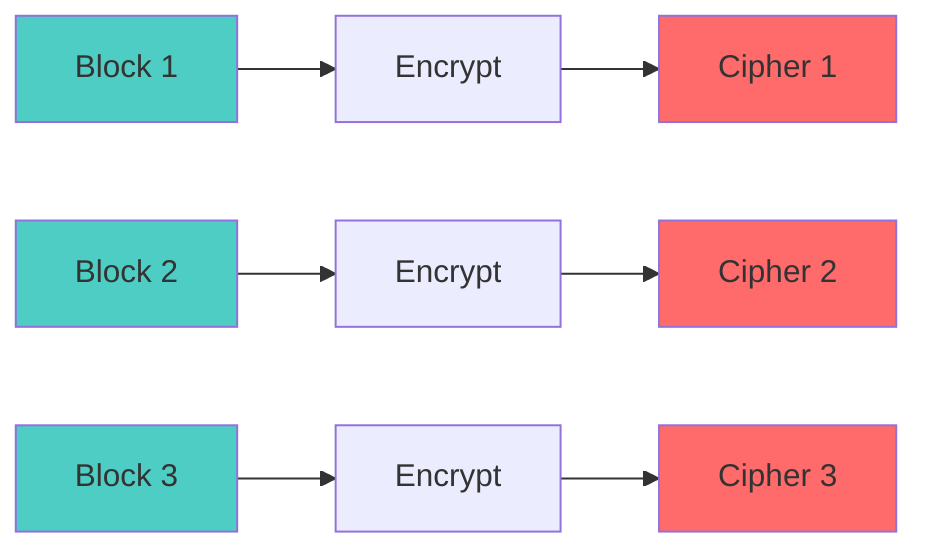
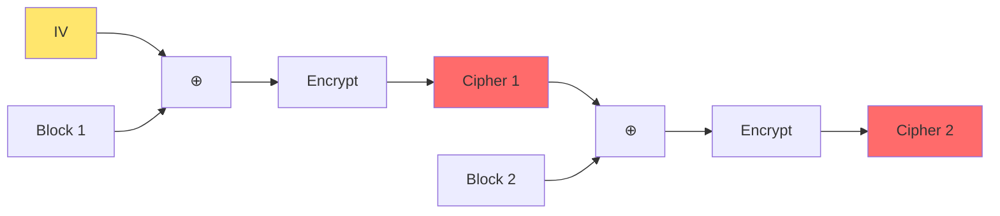
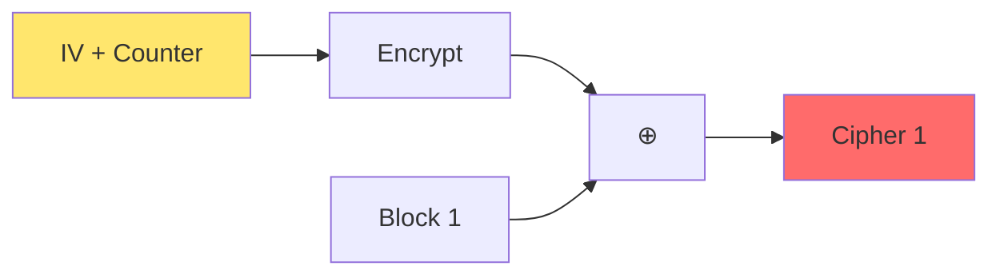

Symmetric encryption algorithms with mathematical foundations and practical implementations.

---

## Mathematical Definition

Symmetric encryption uses the same key for encryption and decryption:

$$
\begin{aligned}
C &= E_K(P) \quad \text{(Encryption)} \\
P &= D_K(C) \quad \text{(Decryption)}
\end{aligned}
$$

Where:
- $P$: Plaintext
- $C$: Ciphertext
- $K$: Secret key
- $E_K$: Encryption function with key $K$
- $D_K$: Decryption function with key $K$

**Property**: $D_K(E_K(P)) = P$

---

## Block Ciphers

### AES (Advanced Encryption Standard)

**Block size**: 128 bits  
**Key sizes**: 128, 192, or 256 bits  
**Rounds**: 10, 12, or 14 (depending on key size)

#### AES Round Function

$$
\text{Round}(State, RoundKey) = MixColumns(ShiftRows(SubBytes(State))) \oplus RoundKey
$$

**Operations**:
1. **SubBytes**: $S(x)$ - Non-linear substitution using S-box
2. **ShiftRows**: Cyclically shift rows
3. **MixColumns**: Matrix multiplication in $GF(2^8)$
4. **AddRoundKey**: XOR with round key

$$
MixColumns: \begin{bmatrix} 2 & 3 & 1 & 1 \\ 1 & 2 & 3 & 1 \\ 1 & 1 & 2 & 3 \\ 3 & 1 & 1 & 2 \end{bmatrix} \times \begin{bmatrix} s_0 \\ s_1 \\ s_2 \\ s_3 \end{bmatrix}
$$

(All operations in $GF(2^8)$)

---

## Modes of Operation

### ECB (Electronic Codebook) - ❌ Never Use!

$$
C_i = E_K(P_i)
$$

**Problem**: Same plaintext blocks → same ciphertext blocks (patterns leak)



### CBC (Cipher Block Chaining)

$$
\begin{aligned}
C_0 &= IV \\
C_i &= E_K(P_i \oplus C_{i-1})
\end{aligned}
$$

$$
P_i = D_K(C_i) \oplus C_{i-1}
$$



**Requires**: Random IV, HMAC for authentication

### CTR (Counter Mode)

$$
C_i = P_i \oplus E_K(IV \| i)
$$



**Advantages**: Parallelizable, no padding needed

### GCM (Galois/Counter Mode) - ✅ Recommended

$$
\begin{aligned}
C_i &= P_i \oplus E_K(IV \| i) \\
T &= GHASH_H(A, C) \quad \text{(Authentication tag)}
\end{aligned}
$$

Where $H = E_K(0^{128})$ and $GHASH$ is polynomial evaluation in $GF(2^{128})$:

$$
GHASH_H(X) = X_1 \cdot H^n \oplus X_2 \cdot H^{n-1} \oplus \cdots \oplus X_n \cdot H
$$

**Provides**: Confidentiality + Integrity + Authentication (AEAD)

---

## Stream Ciphers

### ChaCha20

**State**: 512 bits (16 words of 32 bits)

$$
\begin{bmatrix}
\text{constant} & \text{constant} & \text{constant} & \text{constant} \\
\text{key} & \text{key} & \text{key} & \text{key} \\
\text{key} & \text{key} & \text{key} & \text{key} \\
\text{counter} & \text{nonce} & \text{nonce} & \text{nonce}
\end{bmatrix}
$$

**Quarter Round**:

$$
\begin{aligned}
a &\leftarrow a + b; \quad d \leftarrow (d \oplus a) \lll 16 \\
c &\leftarrow c + d; \quad b \leftarrow (b \oplus c) \lll 12 \\
a &\leftarrow a + b; \quad d \leftarrow (d \oplus a) \lll 8 \\
c &\leftarrow c + d; \quad b \leftarrow (b \oplus c) \lll 7
\end{aligned}
$$

After 20 rounds, XOR with plaintext:

$$
C = P \oplus \text{ChaCha20}(Key, Nonce, Counter)
$$

---

## Python Implementation

### AES-GCM (Recommended)

```python
from cryptography.hazmat.primitives.ciphers.aead import AESGCM
import os

# Generate key
key = AESGCM.generate_key(bit_length=256)
aesgcm = AESGCM(key)

# Encrypt
nonce = os.urandom(12)  # 96-bit nonce
plaintext = b"Secret message"
associated_data = b"metadata"  # Optional, authenticated but not encrypted

ciphertext = aesgcm.encrypt(nonce, plaintext, associated_data)

# Decrypt
decrypted = aesgcm.decrypt(nonce, ciphertext, associated_data)
```

### ChaCha20-Poly1305

```python
from cryptography.hazmat.primitives.ciphers.aead import ChaCha20Poly1305

# Generate key
key = ChaCha20Poly1305.generate_key()
chacha = ChaCha20Poly1305(key)

# Encrypt
nonce = os.urandom(12)
ciphertext = chacha.encrypt(nonce, plaintext, associated_data)

# Decrypt
decrypted = chacha.decrypt(nonce, ciphertext, associated_data)
```

### AES-CBC with HMAC

```python
from cryptography.hazmat.primitives.ciphers import Cipher, algorithms, modes
from cryptography.hazmat.primitives import hmac, hashes
import os

def encrypt_aes_cbc_hmac(plaintext, enc_key, mac_key):
    # Encrypt
    iv = os.urandom(16)
    cipher = Cipher(algorithms.AES(enc_key), modes.CBC(iv))
    encryptor = cipher.encryptor()
    
    # Pad plaintext (PKCS7)
    pad_length = 16 - (len(plaintext) % 16)
    padded = plaintext + bytes([pad_length] * pad_length)
    
    ciphertext = encryptor.update(padded) + encryptor.finalize()
    
    # MAC
    h = hmac.HMAC(mac_key, hashes.SHA256())
    h.update(iv + ciphertext)
    tag = h.finalize()
    
    return iv, ciphertext, tag

def decrypt_aes_cbc_hmac(iv, ciphertext, tag, enc_key, mac_key):
    # Verify MAC first
    h = hmac.HMAC(mac_key, hashes.SHA256())
    h.update(iv + ciphertext)
    h.verify(tag)
    
    # Decrypt
    cipher = Cipher(algorithms.AES(enc_key), modes.CBC(iv))
    decryptor = cipher.decryptor()
    padded = decryptor.update(ciphertext) + decryptor.finalize()
    
    # Remove padding
    pad_length = padded[-1]
    return padded[:-pad_length]
```

---

## Security Considerations

### Nonce/IV Requirements

| Mode | IV/Nonce | Reuse Impact |
|------|----------|--------------|
| **CBC** | Random, unpredictable | Pattern leakage |
| **CTR** | Unique (can be counter) | ❌ **Catastrophic** - key recovery |
| **GCM** | Unique | ❌ **Catastrophic** - auth bypass |

**Never reuse nonce with same key in CTR/GCM!**

### Padding Oracle Attack (CBC)

If decryption errors leak padding validity:

$$
\text{Attacker can decrypt } C \text{ without knowing } K
$$

**Mitigation**: Use authenticated encryption (GCM) or constant-time MAC verification.

---

## Performance Comparison

| Algorithm | Speed (GB/s) | Hardware Accel | Use Case |
|-----------|--------------|----------------|----------|
| **AES-GCM** | ~4 (AES-NI) | Yes (x86) | General purpose |
| **ChaCha20** | ~1-2 | No | Mobile, ARM |
| **AES-CBC** | ~3 (AES-NI) | Yes | Legacy |

---