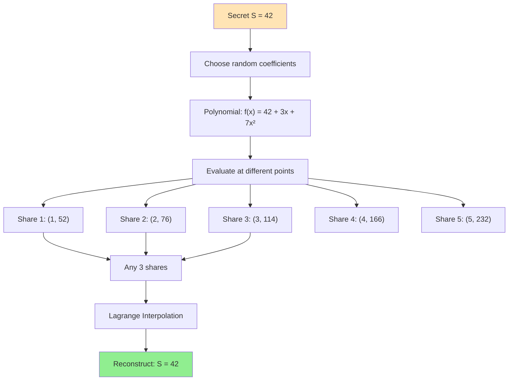
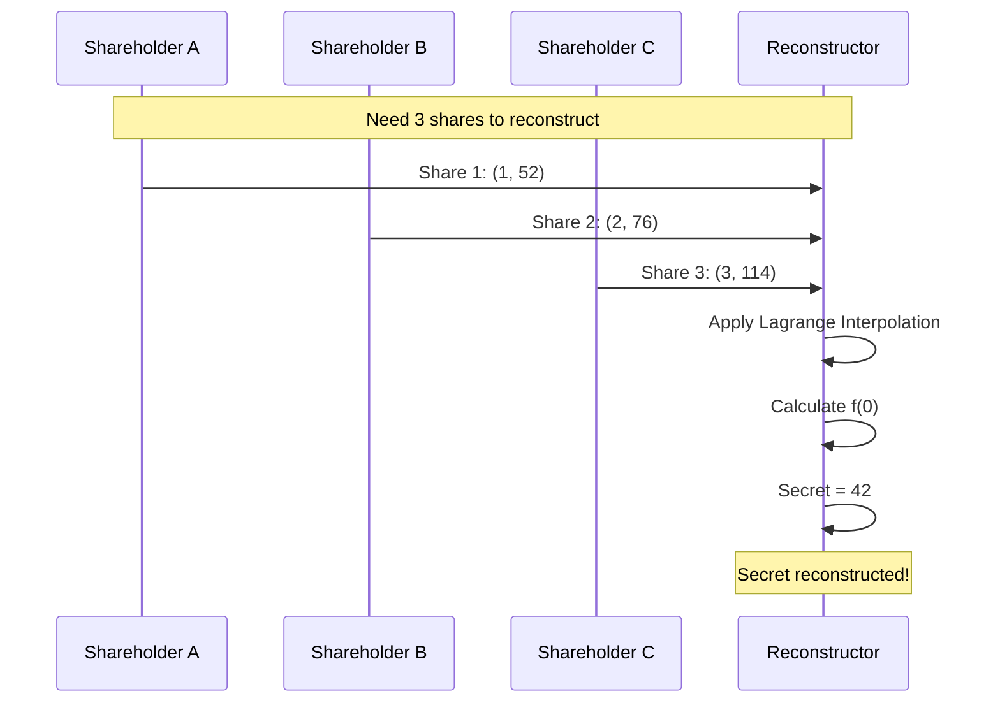

Key sharding splits a secret into multiple shares where a threshold of shares is needed to reconstruct the original secret.

## Overview

**Secret Sharing** (also called key sharding) divides a secret $S$ into $n$ shares such that:
- Any $t$ shares can reconstruct $S$ (threshold)
- Fewer than $t$ shares reveal nothing about $S$

**Notation**: $(t, n)$-threshold scheme
- $n$ = total number of shares
- $t$ = minimum shares needed to reconstruct
- Example: $(3, 5)$ means 3 out of 5 shares needed

---

## Shamir's Secret Sharing (SSS)

Most widely used secret sharing scheme, based on polynomial interpolation.

### Mathematical Foundation

**Key Insight**: A polynomial of degree $t-1$ is uniquely determined by $t$ points.

For a $(t, n)$-threshold scheme:

1. **Secret**: $S$ (the constant term)
2. **Polynomial**: $f(x) = S + a_1x + a_2x^2 + \cdots + a_{t-1}x^{t-1}$
3. **Shares**: $(i, f(i))$ for $i = 1, 2, \ldots, n$

### Visual Explanation



### Algorithm Steps

#### Share Generation

```python
import random
from typing import List, Tuple

class ShamirSecretSharing:
    def __init__(self, prime):
        """Initialize with a large prime for modular arithmetic"""
        self.prime = prime
    
    def generate_shares(self, secret: int, threshold: int, num_shares: int) -> List[Tuple[int, int]]:
        """
        Generate shares for secret
        
        Args:
            secret: The secret to share
            threshold: Minimum shares needed to reconstruct
            num_shares: Total number of shares to create
        
        Returns:
            List of (x, y) share tuples
        """
        if threshold > num_shares:
            raise ValueError("Threshold cannot exceed number of shares")
        
        # Generate random coefficients for polynomial of degree (threshold - 1)
        coefficients = [secret] + [random.randrange(1, self.prime) 
                                    for _ in range(threshold - 1)]
        
        # Generate shares by evaluating polynomial at different points
        shares = []
        for x in range(1, num_shares + 1):
            y = self._evaluate_polynomial(coefficients, x)
            shares.append((x, y))
        
        return shares
    
    def _evaluate_polynomial(self, coefficients: List[int], x: int) -> int:
        """Evaluate polynomial at point x using Horner's method"""
        result = 0
        for coef in reversed(coefficients):
            result = (result * x + coef) % self.prime
        return result
    
    def reconstruct_secret(self, shares: List[Tuple[int, int]]) -> int:
        """
        Reconstruct secret from shares using Lagrange interpolation
        
        Args:
            shares: List of at least threshold (x, y) tuples
        
        Returns:
            The reconstructed secret
        """
        if len(shares) < 2:
            raise ValueError("Need at least 2 shares")
        
        # Lagrange interpolation at x=0 (to get constant term)
        secret = 0
        for i, (x_i, y_i) in enumerate(shares):
            numerator = 1
            denominator = 1
            
            for j, (x_j, _) in enumerate(shares):
                if i != j:
                    numerator = (numerator * (0 - x_j)) % self.prime
                    denominator = (denominator * (x_i - x_j)) % self.prime
            
            # Modular division using Fermat's little theorem
            lagrange_coef = (numerator * self._mod_inverse(denominator, self.prime)) % self.prime
            secret = (secret + y_i * lagrange_coef) % self.prime
        
        return secret
    
    def _mod_inverse(self, a: int, m: int) -> int:
        """Compute modular multiplicative inverse using extended Euclidean algorithm"""
        def extended_gcd(a, b):
            if a == 0:
                return b, 0, 1
            gcd, x1, y1 = extended_gcd(b % a, a)
            x = y1 - (b // a) * x1
            y = x1
            return gcd, x, y
        
        _, x, _ = extended_gcd(a % m, m)
        return (x % m + m) % m

# Example usage
prime = 2**127 - 1  # Mersenne prime
sss = ShamirSecretSharing(prime)

# Split secret into 5 shares, need 3 to reconstruct
secret = 42424242424242
shares = sss.generate_shares(secret, threshold=3, num_shares=5)

print("Generated shares:")
for i, (x, y) in enumerate(shares, 1):
    print(f"  Share {i}: ({x}, {y})")

# Reconstruct from any 3 shares
reconstructed = sss.reconstruct_secret(shares[:3])
print(f"\nReconstructed secret: {reconstructed}")
print(f"Original secret:      {secret}")
print(f"Match: {reconstructed == secret}")
```

#### Lagrange Interpolation Formula

For shares $(x_1, y_1), (x_2, y_2), \ldots, (x_t, y_t)$:

$$
S = f(0) = \sum_{i=1}^{t} y_i \prod_{j=1, j \neq i}^{t} \frac{0 - x_j}{x_i - x_j}
$$

Simplified for $x = 0$:

$$
S = \sum_{i=1}^{t} y_i \prod_{j=1, j \neq i}^{t} \frac{-x_j}{x_i - x_j}
$$

---

## Reconstruction Process



---

## Practical Implementation

### Encoding Arbitrary Data

```python
def encode_bytes_to_int(data: bytes) -> int:
    """Convert bytes to integer for secret sharing"""
    return int.from_bytes(data, byteorder='big')

def decode_int_to_bytes(value: int, length: int) -> bytes:
    """Convert integer back to bytes"""
    return value.to_bytes(length, byteorder='big')

# Example: Share a password
password = b"MySecretPassword123!"
secret_int = encode_bytes_to_int(password)

# Generate shares
shares = sss.generate_shares(secret_int, threshold=3, num_shares=5)

# Reconstruct
reconstructed_int = sss.reconstruct_secret(shares[:3])
reconstructed_password = decode_int_to_bytes(reconstructed_int, len(password))

print(f"Original:      {password}")
print(f"Reconstructed: {reconstructed_password}")
```

### Splitting Large Secrets

```python
def split_large_secret(data: bytes, chunk_size: int, threshold: int, num_shares: int):
    """Split large data into chunks and share each chunk"""
    chunks = [data[i:i+chunk_size] for i in range(0, len(data), chunk_size)]
    
    all_shares = [[] for _ in range(num_shares)]
    
    for chunk in chunks:
        secret_int = encode_bytes_to_int(chunk)
        chunk_shares = sss.generate_shares(secret_int, threshold, num_shares)
        
        for i, share in enumerate(chunk_shares):
            all_shares[i].append(share)
    
    return all_shares

def reconstruct_large_secret(shares_list: List[List[Tuple[int, int]]], chunk_size: int) -> bytes:
    """Reconstruct large data from chunked shares"""
    num_chunks = len(shares_list[0])
    reconstructed_data = b''
    
    for chunk_idx in range(num_chunks):
        chunk_shares = [shares[chunk_idx] for shares in shares_list]
        secret_int = sss.reconstruct_secret(chunk_shares)
        
        # Handle last chunk (might be shorter)
        if chunk_idx == num_chunks - 1:
            # Determine actual length
            chunk_bytes = decode_int_to_bytes(secret_int, chunk_size)
            chunk_bytes = chunk_bytes.rstrip(b'\x00')  # Remove padding
        else:
            chunk_bytes = decode_int_to_bytes(secret_int, chunk_size)
        
        reconstructed_data += chunk_bytes
    
    return reconstructed_data
```

---

## Security Properties

### Information-Theoretic Security

**Theorem**: With fewer than $t$ shares, an attacker gains **zero information** about the secret.

**Proof Intuition**:
- With $t-1$ shares, infinitely many polynomials pass through those points
- Each polynomial gives a different value at $x=0$ (the secret)
- All possible secrets are equally likely

### Example (2-of-3 scheme)

```text
Shares: (1, 52), (2, 76), (3, 114)

With 1 share (1, 52):
  - Secret could be 0, 1, 2, ..., any value
  - No information gained

With 2 shares (1, 52), (2, 76):
  - Unique line passes through these points
  - Line intersects y-axis at secret value
  - Secret fully determined: S = 42
```

---

## Variants and Extensions

### 1. Verifiable Secret Sharing (VSS)

Allows shareholders to verify their shares are consistent without revealing the secret.

```python
class VerifiableSecretSharing(ShamirSecretSharing):
    def generate_shares_with_commitments(self, secret, threshold, num_shares, generator, prime):
        """Generate shares with commitments for verification"""
        coefficients = [secret] + [random.randrange(1, prime) 
                                    for _ in range(threshold - 1)]
        
        # Generate commitments: C_i = g^(a_i) mod p
        commitments = [pow(generator, coef, prime) for coef in coefficients]
        
        # Generate shares
        shares = []
        for x in range(1, num_shares + 1):
            y = self._evaluate_polynomial(coefficients, x)
            shares.append((x, y))
        
        return shares, commitments
    
    def verify_share(self, share, commitments, generator, prime):
        """Verify a share against commitments"""
        x, y = share
        
        # Compute expected commitment: C = ∏ C_i^(x^i)
        expected = 1
        for i, commitment in enumerate(commitments):
            expected = (expected * pow(commitment, pow(x, i, prime), prime)) % prime
        
        # Check: g^y = expected
        actual = pow(generator, y, prime)
        return actual == expected
```

### 2. Proactive Secret Sharing

Periodically refresh shares without changing the secret.

```python
def refresh_shares(old_shares, threshold, num_shares, prime):
    """Refresh shares without changing the secret"""
    # Generate random polynomial with zero constant term
    zero_poly_coeffs = [0] + [random.randrange(1, prime) 
                               for _ in range(threshold - 1)]
    
    # Add zero polynomial to each share
    new_shares = []
    for x, y in old_shares:
        delta = evaluate_polynomial(zero_poly_coeffs, x, prime)
        new_y = (y + delta) % prime
        new_shares.append((x, new_y))
    
    return new_shares
```

### 3. Hierarchical Secret Sharing

Different shareholders have different "weights" or importance levels.

```text
Example: (3, 5) scheme with hierarchy
- CEO: weight 2 (counts as 2 shares)
- CFO: weight 2
- CTO: weight 1
- COO: weight 1
- Board Member: weight 1

CEO + CTO = 3 shares ✓
CFO + Board Member = 3 shares ✓
CTO + COO + Board = 3 shares ✓
```

---

## Use Cases

### 1. Cryptocurrency Wallet Backup

```text
Problem: Single seed phrase is single point of failure

Solution: (3, 5) secret sharing
- Split seed phrase into 5 shares
- Store in different locations
- Need any 3 to recover wallet
- Lose 2 shares? Still safe!
```

### 2. Organizational Key Management

```text
Company root CA private key:
- (3, 5) shares distributed to executives
- No single person can sign certificates
- Requires quorum for critical operations
```

### 3. Secure Multi-Party Computation

```text
Compute f(x, y, z) where:
- Alice has x
- Bob has y
- Charlie has z
- Nobody learns others' inputs

Use secret sharing to distribute inputs
```

### 4. Disaster Recovery

```text
Database encryption key:
- (2, 3) shares
- Share 1: On-site safe
- Share 2: Off-site backup facility
- Share 3: Cloud HSM
- Any 2 locations accessible → recover key
```

---

## Implementation Best Practices

### 1. Choose Appropriate Prime

```python
# Good primes for secret sharing
PRIMES = {
    'small': 2**31 - 1,           # Mersenne prime (32-bit)
    'medium': 2**61 - 1,          # Mersenne prime (64-bit)
    'large': 2**127 - 1,          # Mersenne prime (128-bit)
    'crypto': 2**256 - 189        # Large prime for cryptographic use
}

# Choose based on secret size
def choose_prime(secret_bytes):
    secret_bits = len(secret_bytes) * 8
    if secret_bits <= 30:
        return PRIMES['small']
    elif secret_bits <= 60:
        return PRIMES['medium']
    elif secret_bits <= 126:
        return PRIMES['large']
    else:
        return PRIMES['crypto']
```

### 2. Secure Random Number Generation

```python
import secrets

def generate_secure_coefficients(threshold, prime):
    """Use cryptographically secure RNG"""
    return [secrets.randbelow(prime) for _ in range(threshold - 1)]
```

### 3. Share Distribution

```text
✅ DO:
- Use secure channels for distribution
- Encrypt shares during transmission
- Label shares clearly (but don't reveal secret)
- Document threshold and total shares
- Store shares in geographically distributed locations

❌ DON'T:
- Send all shares via same channel
- Store multiple shares together
- Use predictable share identifiers
- Forget which scheme was used
```

### 4. Metadata Management

```python
class ShareMetadata:
    def __init__(self, threshold, total_shares, share_id, scheme_version):
        self.threshold = threshold
        self.total_shares = total_shares
        self.share_id = share_id
        self.scheme_version = scheme_version
        self.created_at = datetime.now()
    
    def to_json(self):
        return {
            'threshold': self.threshold,
            'total_shares': self.total_shares,
            'share_id': self.share_id,
            'scheme_version': self.scheme_version,
            'created_at': self.created_at.isoformat()
        }

# Store metadata with each share (doesn't reveal secret)
share_with_metadata = {
    'metadata': metadata.to_json(),
    'share': (x, y)
}
```

---

## Comparison with Other Schemes

| Scheme | Security | Complexity | Flexibility | Use Case |
|--------|----------|------------|-------------|----------|
| **Shamir's Secret Sharing** | Information-theoretic | Medium | High | General purpose |
| **Blakley's Scheme** | Information-theoretic | High | Low | Geometric interpretation |
| **XOR Secret Sharing** | Computational | Very Low | Low | Only (n, n) threshold |
| **Threshold Signatures** | Computational | High | Medium | Signing without reconstruction |

---

## Common Pitfalls

### 1. Insufficient Prime Size

```python
# ❌ BAD: Prime too small for secret
secret = 2**128
prime = 2**31 - 1  # Only 31 bits!
# Secret will be reduced modulo prime, losing information

# ✅ GOOD: Prime larger than secret
secret = 2**128
prime = 2**256 - 189  # 256 bits
```

### 2. Share Reuse

```text
❌ Never reuse shares for different secrets
- Reveals information about both secrets
- Breaks information-theoretic security
```

### 3. Insecure Coefficient Generation

```python
# ❌ BAD: Predictable randomness
random.seed(12345)
coefficients = [random.randint(1, prime) for _ in range(threshold-1)]

# ✅ GOOD: Cryptographically secure
coefficients = [secrets.randbelow(prime) for _ in range(threshold-1)]
```

---

## Further Reading

- [Shamir's Original Paper (1979)](https://dl.acm.org/doi/10.1145/359168.359176)
- [SLIP-0039: Shamir's Secret-Sharing for Mnemonic Codes](https://github.com/satoshilabs/slips/blob/master/slip-0039.md)
- [Verifiable Secret Sharing](https://en.wikipedia.org/wiki/Verifiable_secret_sharing)
- [Secure Multiparty Computation](https://en.wikipedia.org/wiki/Secure_multi-party_computation)

