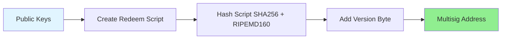
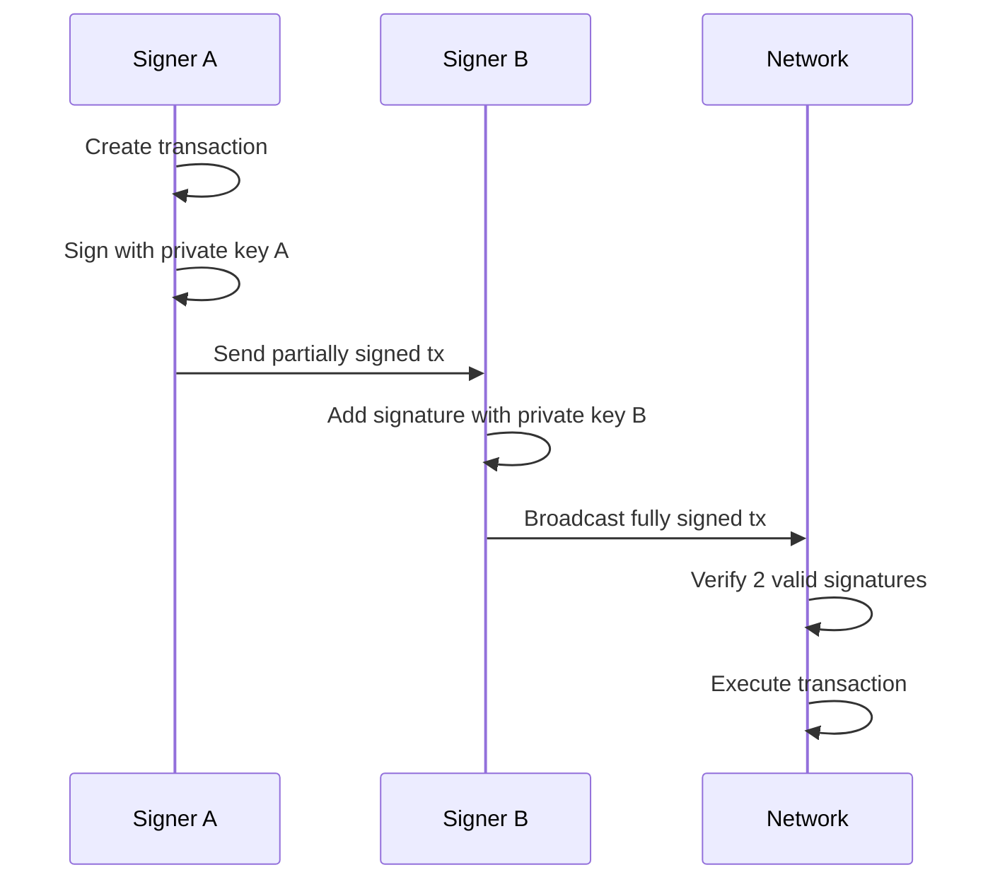
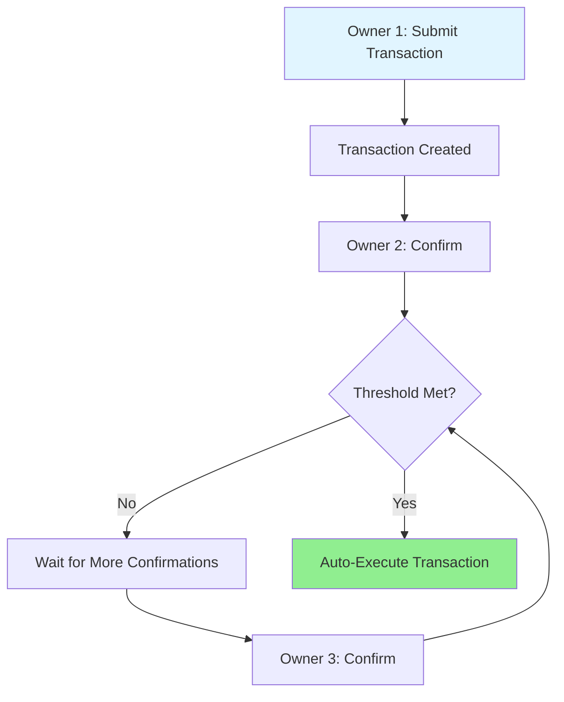
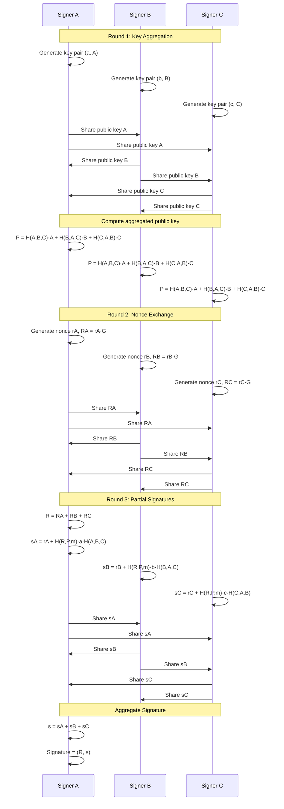
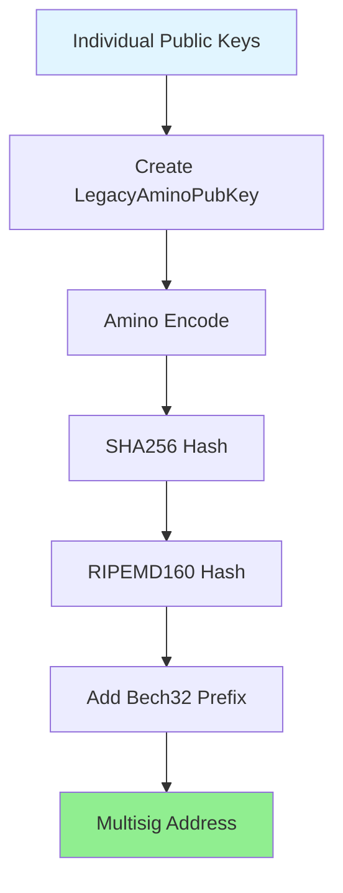

Multi-signature schemes require multiple parties to sign a transaction or message, providing enhanced security and distributed control.

## Overview

**Multi-signature (multisig)** requires $m$ out of $n$ signatures to authorize a transaction or validate a message.

**Notation**: $m$-of-$n$ multisig
- $n$ = total number of signers
- $m$ = minimum signatures required (threshold)
- Example: 2-of-3 means 2 out of 3 parties must sign

---

## Use Cases

### 1. Shared Control

**Scenario**: Company treasury requiring multiple executives to approve large transactions.

```text
3-of-5 multisig wallet
Signers: CEO, CFO, CTO, COO, Board Member
Any 3 must approve to spend funds
```

### 2. Escrow Services

```text
2-of-3 multisig
Parties: Buyer, Seller, Arbiter
- Normal case: Buyer + Seller sign (2 of 3)
- Dispute: Arbiter + Winner sign (2 of 3)
```

### 3. Personal Security

```text
2-of-3 multisig
Keys: Desktop, Mobile, Hardware Wallet
- Normal: Desktop + Mobile
- Lost device: Any 2 remaining keys
```

### 4. Inheritance Planning

```text
2-of-3 multisig
Keys: Owner (2 keys), Heir (1 key)
- Owner alive: Uses 2 keys
- Owner deceased: Heir + Lawyer/Executor
```

---

## Implementation Approaches

### 1. Bitcoin P2SH Multisig

**Pay-to-Script-Hash** embeds multisig logic in Bitcoin script.

#### Address Creation



#### Redeem Script Example (2-of-3)

```text
OP_2                    # Require 2 signatures
<pubkey1>               # First public key
<pubkey2>               # Second public key
<pubkey3>               # Third public key
OP_3                    # Total of 3 keys
OP_CHECKMULTISIG        # Verify signatures
```

#### Spending Process



#### Python Implementation (Conceptual)

```python
from hashlib import sha256
import ecdsa

class MultisigWallet:
    def __init__(self, m, public_keys):
        self.m = m  # Required signatures
        self.n = len(public_keys)  # Total keys
        self.public_keys = public_keys
        
    def create_address(self):
        """Create multisig address from public keys"""
        # Build redeem script
        script = f"OP_{self.m} "
        for pk in self.public_keys:
            script += f"{pk.hex()} "
        script += f"OP_{self.n} OP_CHECKMULTISIG"
        
        # Hash script to create address
        script_hash = sha256(script.encode()).digest()
        # Add version byte and checksum (simplified)
        address = "3" + script_hash[:20].hex()
        return address, script
    
    def sign_transaction(self, tx_data, private_key):
        """Sign transaction with one key"""
        sk = ecdsa.SigningKey.from_string(private_key, curve=ecdsa.SECP256k1)
        signature = sk.sign(tx_data)
        return signature
    
    def verify_multisig(self, tx_data, signatures):
        """Verify m-of-n signatures are valid"""
        valid_sigs = 0
        for sig, pubkey in zip(signatures, self.public_keys):
            vk = ecdsa.VerifyingKey.from_string(pubkey, curve=ecdsa.SECP256k1)
            try:
                if vk.verify(sig, tx_data):
                    valid_sigs += 1
            except:
                continue
        
        return valid_sigs >= self.m

# Example usage
pubkeys = [generate_pubkey() for _ in range(3)]
wallet = MultisigWallet(m=2, public_keys=pubkeys)
address, redeem_script = wallet.create_address()

# Sign with 2 keys
tx = b"transaction_data"
sig1 = wallet.sign_transaction(tx, private_key_1)
sig2 = wallet.sign_transaction(tx, private_key_2)

# Verify
is_valid = wallet.verify_multisig(tx, [sig1, sig2])
```

---

### 2. Ethereum Multisig Contract

Smart contract-based multisig with on-chain logic.

#### Contract Structure

```solidity
// SPDX-License-Identifier: MIT
pragma solidity ^0.8.0;

contract MultisigWallet {
    address[] public owners;
    uint256 public required;
    
    struct Transaction {
        address to;
        uint256 value;
        bytes data;
        bool executed;
        uint256 confirmations;
    }
    
    Transaction[] public transactions;
    mapping(uint256 => mapping(address => bool)) public confirmations;
    
    modifier onlyOwner() {
        require(isOwner(msg.sender), "Not owner");
        _;
    }
    
    constructor(address[] memory _owners, uint256 _required) {
        require(_owners.length > 0, "Owners required");
        require(_required > 0 && _required <= _owners.length, "Invalid required");
        
        owners = _owners;
        required = _required;
    }
    
    function submitTransaction(address _to, uint256 _value, bytes memory _data)
        public
        onlyOwner
        returns (uint256)
    {
        uint256 txId = transactions.length;
        transactions.push(Transaction({
            to: _to,
            value: _value,
            data: _data,
            executed: false,
            confirmations: 0
        }));
        
        return txId;
    }
    
    function confirmTransaction(uint256 _txId) public onlyOwner {
        require(!confirmations[_txId][msg.sender], "Already confirmed");
        
        confirmations[_txId][msg.sender] = true;
        transactions[_txId].confirmations++;
        
        if (transactions[_txId].confirmations >= required) {
            executeTransaction(_txId);
        }
    }
    
    function executeTransaction(uint256 _txId) internal {
        Transaction storage txn = transactions[_txId];
        require(!txn.executed, "Already executed");
        require(txn.confirmations >= required, "Not enough confirmations");
        
        txn.executed = true;
        (bool success, ) = txn.to.call{value: txn.value}(txn.data);
        require(success, "Transaction failed");
    }
    
    function isOwner(address _addr) public view returns (bool) {
        for (uint256 i = 0; i < owners.length; i++) {
            if (owners[i] == _addr) return true;
        }
        return false;
    }
}
```

#### Usage Flow



---

### 3. Schnorr Multisig (MuSig)

**MuSig** enables multiple signers to create a single aggregated signature indistinguishable from a single-key signature.

#### Advantages

- **Privacy**: Looks like single-sig on-chain
- **Efficiency**: One signature regardless of number of signers
- **Lower fees**: Smaller transaction size

#### Protocol Flow



#### Python Implementation (Simplified)

```python
from hashlib import sha256
import secrets

class MuSig:
    def __init__(self, G, n):
        self.G = G  # Generator point
        self.n = n  # Curve order
    
    def aggregate_pubkeys(self, pubkeys):
        """Aggregate public keys with coefficients"""
        L = sha256(b''.join(sorted([pk.to_bytes() for pk in pubkeys]))).digest()
        
        agg_key = None
        for pk in pubkeys:
            coef = int.from_bytes(sha256(L + pk.to_bytes()).digest(), 'big') % self.n
            weighted_pk = pk * coef
            agg_key = weighted_pk if agg_key is None else agg_key + weighted_pk
        
        return agg_key
    
    def sign_partial(self, private_key, nonce, R_agg, P_agg, message):
        """Generate partial signature"""
        e = int.from_bytes(sha256(
            R_agg.to_bytes() + P_agg.to_bytes() + message
        ).digest(), 'big') % self.n
        
        # Compute coefficient for this key
        L = sha256(b''.join(sorted([...]))).digest()
        a = int.from_bytes(sha256(L + (private_key * self.G).to_bytes()).digest(), 'big') % self.n
        
        s = (nonce + e * private_key * a) % self.n
        return s
    
    def aggregate_signatures(self, partial_sigs):
        """Combine partial signatures"""
        return sum(partial_sigs) % self.n
    
    def verify(self, signature, pubkey_agg, message):
        """Verify aggregated signature"""
        R, s = signature
        e = int.from_bytes(sha256(
            R.to_bytes() + pubkey_agg.to_bytes() + message
        ).digest(), 'big') % self.n
        
        # Check: s·G = R + e·P
        return s * self.G == R + e * pubkey_agg
```

---

## Security Considerations

### 1. Key Management

```text
✅ DO:
- Store keys in separate secure locations
- Use hardware wallets for high-value keys
- Document key holders and recovery procedures
- Regular key rotation for organizational multisig

❌ DON'T:
- Store all keys in one location
- Share private keys via insecure channels
- Use predictable key generation
- Forget backup procedures
```

### 2. Threshold Selection

| Threshold | Security | Availability | Use Case |
|-----------|----------|--------------|----------|
| **1-of-2** | Low | High | Convenience (not recommended) |
| **2-of-2** | High | Low | Both parties must be available |
| **2-of-3** | Good | Good | ✅ Recommended balance |
| **3-of-5** | High | Good | Organizations |
| **5-of-7** | Very High | Medium | High-security enterprises |

### 3. Attack Vectors

**Rogue Key Attack** (MuSig1):
- Attacker manipulates key aggregation
- **Mitigation**: Use MuSig2 with proof of possession

**Nonce Reuse**:
- Reusing nonce reveals private key
- **Mitigation**: Never reuse nonces, use deterministic nonce generation

**Partial Signature Leakage**:
- Revealing partial signatures before all collected
- **Mitigation**: Use commitment schemes in signing rounds

---

## Comparison Table

| Scheme | Privacy | Efficiency | Complexity | Blockchain Support |
|--------|---------|------------|------------|-------------------|
| **Bitcoin P2SH** | Low (visible on-chain) | Medium | Low | Bitcoin, Bitcoin-like |
| **Ethereum Contract** | Low (visible on-chain) | Low (gas costs) | Medium | Ethereum, EVM chains |
| **Schnorr/MuSig** | High (looks like single-sig) | High | High | Bitcoin (Taproot), newer chains |
| **BLS Multisig** | High | Very High | Medium | Ethereum 2.0, Cosmos |

---

## Real-World Examples

### Bitcoin Multisig Addresses

```text
P2SH Address (starts with 3):
3J98t1WpEZ73CNmYviecrnyiWrnqRhWNLy

Redeem Script:
OP_2 <pubkey1> <pubkey2> <pubkey3> OP_3 OP_CHECKMULTISIG
```

### Gnosis Safe (Ethereum)

Popular multisig wallet with:
- Configurable thresholds
- Transaction queue
- Module system
- Mobile + web interface

### Bitcoin Taproot (Schnorr)

```text
Single signature on-chain:
- Could be 1-of-1
- Could be 2-of-2 MuSig
- Could be 3-of-5 threshold
→ All look identical (privacy!)
```

---

## Best Practices

### Setup Checklist

```text
✅ Choose appropriate m-of-n threshold
✅ Generate keys on secure, offline devices
✅ Verify all public keys before creating address
✅ Test with small amounts first
✅ Document key locations and holders
✅ Create recovery procedures
✅ Regular security audits
✅ Plan for key holder unavailability
```

### Operational Security

```python
# Example: Secure multisig workflow
class SecureMultisigWorkflow:
    def __init__(self, threshold, total_keys):
        self.threshold = threshold
        self.total_keys = total_keys
        self.signatures = []
    
    def request_signature(self, tx_data, signer_id):
        """Request signature from specific signer"""
        # 1. Display transaction details clearly
        self.display_tx_details(tx_data)
        
        # 2. Require explicit confirmation
        confirmed = self.require_confirmation(signer_id)
        if not confirmed:
            return None
        
        # 3. Sign on secure device
        signature = self.sign_on_hardware_wallet(tx_data, signer_id)
        
        # 4. Verify signature immediately
        if self.verify_signature(signature, tx_data, signer_id):
            self.signatures.append(signature)
            return signature
        
        return None
    
    def can_execute(self):
        """Check if threshold met"""
        return len(self.signatures) >= self.threshold
```

---

## Cosmos SDK Multisig

Cosmos uses **traditional on-chain multisig** with secp256k1 signatures, similar to Bitcoin but with different encoding.

### Architecture



### Address Derivation

Cosmos multisig addresses are derived differently from regular accounts:

```python
from hashlib import sha256
import hashlib

class CosmosMultisig:
    def __init__(self, threshold, pubkeys):
        """
        Create Cosmos multisig account
        
        Args:
            threshold: Minimum signatures required
            pubkeys: List of secp256k1 public keys (33 bytes compressed)
        """
        self.threshold = threshold
        self.pubkeys = sorted(pubkeys)  # Sort for deterministic ordering
    
    def create_multisig_pubkey(self):
        """
        Create LegacyAminoPubKey structure
        
        Structure:
        {
          "@type": "/cosmos.crypto.multisig.LegacyAminoPubKey",
          "threshold": 2,
          "public_keys": [
            {"@type": "/cosmos.crypto.secp256k1.PubKey", "key": "base64..."},
            {"@type": "/cosmos.crypto.secp256k1.PubKey", "key": "base64..."},
            {"@type": "/cosmos.crypto.secp256k1.PubKey", "key": "base64..."}
          ]
        }
        """
        # Amino encoding for multisig pubkey
        amino_prefix = bytes([0x22, 0xC1, 0xF7, 0xE2])  # LegacyAminoPubKey prefix
        
        # Encode threshold (varint)
        threshold_bytes = self._encode_varint(self.threshold)
        
        # Encode each public key
        encoded_keys = []
        for pubkey in self.pubkeys:
            # secp256k1 pubkey amino prefix
            key_prefix = bytes([0xEB, 0x5A, 0xE9, 0x87, 0x21])
            # Length prefix + pubkey
            key_length = len(pubkey)
            encoded_key = key_prefix + bytes([key_length]) + pubkey
            encoded_keys.append(encoded_key)
        
        # Combine all
        multisig_data = amino_prefix + threshold_bytes
        for key in encoded_keys:
            multisig_data += key
        
        return multisig_data
    
    def derive_address(self, hrp="cosmos"):
        """
        Derive Cosmos multisig address
        
        Process:
        1. Create LegacyAminoPubKey
        2. SHA256 hash
        3. RIPEMD160 hash
        4. Bech32 encode with prefix
        
        Args:
            hrp: Human-readable part (e.g., "cosmos", "osmo", "juno")
        """
        # Get multisig pubkey
        multisig_pubkey = self.create_multisig_pubkey()
        
        # Hash: SHA256 then RIPEMD160
        sha_hash = sha256(multisig_pubkey).digest()
        ripemd = hashlib.new('ripemd160')
        ripemd.update(sha_hash)
        address_bytes = ripemd.digest()  # 20 bytes
        
        # Bech32 encode
        address = self._bech32_encode(hrp, address_bytes)
        
        return address
    
    def _encode_varint(self, n):
        """Encode integer as varint"""
        result = []
        while n > 0x7F:
            result.append((n & 0x7F) | 0x80)
            n >>= 7
        result.append(n & 0x7F)
        return bytes(result)
    
    def _bech32_encode(self, hrp, data):
        """Bech32 encoding (simplified)"""
        # In production, use proper bech32 library
        import bech32
        converted = bech32.convertbits(data, 8, 5)
        return bech32.bech32_encode(hrp, converted)

# Example usage
pubkeys = [
    bytes.fromhex("02a1633cafcc01ebfb6d78e39f687a1f0995c62fc95f51ead10a02ee0be551b5dc"),
    bytes.fromhex("03d31479e789014a96ba6dd60d50210045aa8292fe693f293d44615929f04cf57a"),
    bytes.fromhex("0223a10d3e55c2b8c9b7e3e4c9f8e7d6c5b4a39281706f5e4d3c2b1a09f8e7d6c5")
]

multisig = CosmosMultisig(threshold=2, pubkeys=pubkeys)
address = multisig.derive_address(hrp="cosmos")
print(f"Multisig address: {address}")
```

### CLI Example

```bash
# Create multisig account
gaiad keys add multisig_account \
    --multisig=alice,bob,charlie \
    --multisig-threshold=2

# Output:
# - address: cosmos1abc...xyz
# - pubkey: '{"@type":"/cosmos.crypto.multisig.LegacyAminoPubKey",...}'
# - type: multi

# Generate transaction
gaiad tx bank send multisig_account cosmos1recipient... 1000uatom \
    --from=multisig_account \
    --generate-only > unsigned.json

# Sign by first party
gaiad tx sign unsigned.json \
    --from=alice \
    --multisig=cosmos1abc...xyz \
    --sign-mode=amino-json \
    --output-document=alice_sig.json

# Sign by second party
gaiad tx sign unsigned.json \
    --from=bob \
    --multisig=cosmos1abc...xyz \
    --sign-mode=amino-json \
    --output-document=bob_sig.json

# Combine signatures
gaiad tx multisign unsigned.json multisig_account \
    alice_sig.json bob_sig.json > signed.json

# Broadcast
gaiad tx broadcast signed.json
```

### Signature Verification

```python
class CosmosMultisigVerifier:
    def __init__(self, multisig_pubkey, threshold):
        self.multisig_pubkey = multisig_pubkey
        self.threshold = threshold
    
    def verify_transaction(self, tx_bytes, signatures):
        """
        Verify multisig transaction
        
        Args:
            tx_bytes: Transaction bytes to verify
            signatures: List of (pubkey_index, signature) tuples
        
        Returns:
            bool: True if valid
        """
        if len(signatures) < self.threshold:
            return False
        
        # Verify each signature
        valid_sigs = 0
        seen_indices = set()
        
        for pubkey_index, signature in signatures:
            # Check no duplicate signers
            if pubkey_index in seen_indices:
                return False
            seen_indices.add(pubkey_index)
            
            # Get public key
            pubkey = self.multisig_pubkey.public_keys[pubkey_index]
            
            # Verify signature
            if self._verify_secp256k1(tx_bytes, signature, pubkey):
                valid_sigs += 1
        
        return valid_sigs >= self.threshold
    
    def _verify_secp256k1(self, message, signature, pubkey):
        """Verify secp256k1 signature"""
        import ecdsa
        
        # Parse signature (r, s)
        r = int.from_bytes(signature[:32], 'big')
        s = int.from_bytes(signature[32:64], 'big')
        
        # Verify
        vk = ecdsa.VerifyingKey.from_string(
            pubkey, 
            curve=ecdsa.SECP256k1,
            hashfunc=sha256
        )
        
        try:
            return vk.verify_digest(
                signature,
                sha256(message).digest()
            )
        except:
            return False
```

### Transaction Structure

```json
{
  "body": {
    "messages": [...],
    "memo": "",
    "timeout_height": "0",
    "extension_options": [],
    "non_critical_extension_options": []
  },
  "auth_info": {
    "signer_infos": [
      {
        "public_key": {
          "@type": "/cosmos.crypto.multisig.LegacyAminoPubKey",
          "threshold": 2,
          "public_keys": [
            {"@type": "/cosmos.crypto.secp256k1.PubKey", "key": "..."},
            {"@type": "/cosmos.crypto.secp256k1.PubKey", "key": "..."},
            {"@type": "/cosmos.crypto.secp256k1.PubKey", "key": "..."}
          ]
        },
        "mode_info": {
          "multi": {
            "bitarray": {
              "extra_bits_stored": 3,
              "elems": "Bg=="  // Bitarray indicating which keys signed
            },
            "mode_infos": [
              {"single": {"mode": "SIGN_MODE_LEGACY_AMINO_JSON"}},
              {"single": {"mode": "SIGN_MODE_LEGACY_AMINO_JSON"}}
            ]
          }
        },
        "sequence": "0"
      }
    ],
    "fee": {...}
  },
  "signatures": [
    "base64_signature_1",
    "base64_signature_2"
  ]
}
```

### Bitarray Encoding

The `bitarray` indicates which public keys signed:

```python
def create_bitarray(total_keys, signing_indices):
    """
    Create compact bitarray for multisig
    
    Args:
        total_keys: Total number of keys in multisig
        signing_indices: List of indices that signed (0-based)
    
    Returns:
        bytes: Compact bitarray
    """
    # Create bit array
    bits = ['0'] * total_keys
    for idx in signing_indices:
        bits[idx] = '1'
    
    # Convert to bytes (big-endian)
    bit_string = ''.join(bits)
    
    # Pad to byte boundary
    while len(bit_string) % 8 != 0:
        bit_string += '0'
    
    # Convert to bytes
    byte_array = []
    for i in range(0, len(bit_string), 8):
        byte = int(bit_string[i:i+8], 2)
        byte_array.append(byte)
    
    return bytes(byte_array)

# Example: 3 keys, indices 0 and 2 signed
# Bitarray: 101 -> 10100000 (padded) -> 0xA0
bitarray = create_bitarray(3, [0, 2])
print(f"Bitarray: {bitarray.hex()}")  # Output: a0
```

### Key Differences from Bitcoin

| Feature | Bitcoin P2SH | Cosmos Multisig |
|---------|--------------|-----------------|
| **Encoding** | Script (OP_CHECKMULTISIG) | Amino/Protobuf |
| **Address Format** | Base58 (starts with 3) | Bech32 (cosmos1...) |
| **Signature Order** | Must match pubkey order | Indicated by bitarray |
| **Key Sorting** | Not required | Sorted deterministically |
| **On-chain Storage** | Redeem script in output | Pubkey in auth_info |

### Security Considerations

```text
✅ DO:
- Always sort public keys deterministically
- Verify bitarray matches actual signatures
- Check for duplicate signers
- Validate threshold before accepting
- Use hardware wallets for signing

❌ DON'T:
- Reuse signatures across transactions
- Trust unverified multisig addresses
- Skip signature verification
- Allow threshold > total keys
```

### CosmWasm Alternative (CW3)

For more flexible multisig, Cosmos chains support CosmWasm smart contracts:

```rust
// CW3 Multisig Contract (simplified)
pub struct Config {
    pub threshold: Threshold,
    pub total_weight: u64,
    pub max_voting_period: Duration,
}

pub enum Threshold {
    AbsoluteCount { weight: u64 },
    AbsolutePercentage { percentage: Decimal },
    ThresholdQuorum { threshold: Decimal, quorum: Decimal },
}

// Proposal execution
pub fn execute_proposal(
    deps: DepsMut,
    info: MessageInfo,
    proposal_id: u64,
) -> Result<Response, ContractError> {
    let mut prop = proposals().load(deps.storage, proposal_id)?;
    
    // Check if threshold met
    if prop.votes.yes < config.threshold {
        return Err(ContractError::NotPassed {});
    }
    
    // Execute
    prop.status = Status::Passed;
    proposals().save(deps.storage, proposal_id, &prop)?;
    
    Ok(Response::new()
        .add_messages(prop.msgs)
        .add_attribute("action", "execute")
        .add_attribute("proposal_id", proposal_id.to_string()))
}
```

---

## Further Reading

- [Bitcoin BIP-11: M-of-N Standard Transactions](https://github.com/bitcoin/bips/blob/master/bip-0011.mediawiki)
- [Cosmos SDK Multisig Guide](https://docs.cosmos.network/main/user/run-node/multisig-guide)
- [Amino Encoding Specification](https://github.com/tendermint/go-amino)
- [CW3 Multisig Specification](https://github.com/CosmWasm/cw-plus/tree/main/packages/cw3)
- [MuSig2 Paper](https://eprint.iacr.org/2020/1261)
- [Gnosis Safe Documentation](https://docs.gnosis-safe.io/)
- [Taproot Multisig](https://bitcoinops.org/en/topics/multisignature/)

