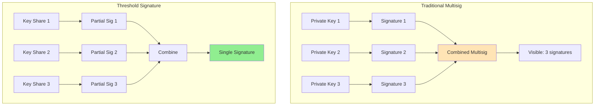
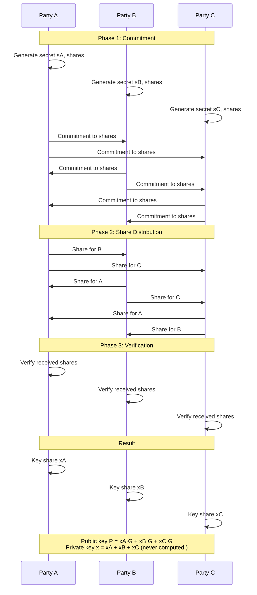
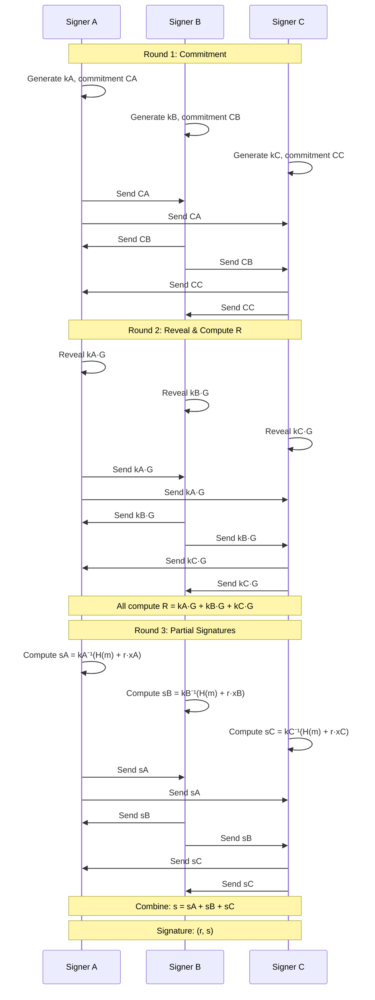
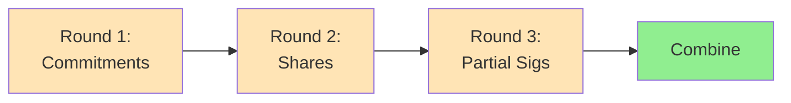

Threshold signatures enable a group to sign messages without ever reconstructing the private key, providing enhanced security over traditional multisig.

## Overview

**Threshold Signature Scheme (TSS)** allows $t$ out of $n$ parties to collaboratively sign a message without reconstructing the private key.

**Key Difference from Multisig:**
- **Multisig**: Multiple signatures combined, visible on-chain
- **Threshold Sig**: Single signature indistinguishable from regular signature

---

## Comparison: Multisig vs Threshold Signatures



| Feature | Multisig | Threshold Signature |
|---------|----------|---------------------|
| **On-chain appearance** | Multiple signatures | Single signature |
| **Privacy** | Reveals number of signers | Looks like 1-of-1 |
| **Transaction size** | Large (multiple sigs) | Small (one sig) |
| **Fees** | Higher | Lower |
| **Key reconstruction** | Not applicable | Never reconstructed |
| **Complexity** | Low | High |

---

## Key Properties

### 1. No Key Reconstruction

The private key is **never** assembled in one place:
- Generated in distributed manner (DKG)
- Signing uses key shares
- Secret remains distributed forever

### 2. Single Signature Output

```text
Regular signature: (r, s)
Threshold signature: (r, s)
→ Indistinguishable!
```

### 3. Threshold Flexibility

$(t, n)$ threshold:
- $t$ = minimum signers needed
- $n$ = total key share holders
- Example: $(2, 3)$ means any 2 out of 3 can sign

---

## Distributed Key Generation (DKG)

Generate key shares without ever creating the full private key.

### Protocol Flow



### Simplified DKG Implementation

```python
from hashlib import sha256
import secrets

class DistributedKeyGeneration:
    def __init__(self, threshold, num_parties, prime, generator):
        self.threshold = threshold
        self.num_parties = num_parties
        self.prime = prime
        self.G = generator
    
    def generate_key_shares(self):
        """
        Simulate DKG for threshold ECDSA
        In practice, this would involve secure multi-party computation
        """
        # Each party generates a secret and shares it using Shamir
        party_secrets = []
        all_shares = [[] for _ in range(self.num_parties)]
        
        for party_id in range(self.num_parties):
            # Generate secret for this party
            secret = secrets.randbelow(self.prime)
            party_secrets.append(secret)
            
            # Generate shares of this secret
            shares = self._shamir_share(secret, self.threshold, self.num_parties)
            
            # Distribute shares
            for i, share in enumerate(shares):
                all_shares[i].append(share)
        
        # Each party combines received shares to get their key share
        key_shares = []
        for party_shares in all_shares:
            key_share = sum(share[1] for share in party_shares) % self.prime
            key_shares.append(key_share)
        
        # Compute public key (sum of all secrets · G)
        total_secret = sum(party_secrets) % self.prime
        public_key = self._scalar_mult(self.G, total_secret)
        
        return key_shares, public_key
    
    def _shamir_share(self, secret, threshold, num_shares):
        """Generate Shamir shares"""
        # Generate random polynomial coefficients
        coeffs = [secret] + [secrets.randbelow(self.prime) 
                             for _ in range(threshold - 1)]
        
        # Evaluate polynomial at different points
        shares = []
        for x in range(1, num_shares + 1):
            y = sum(coef * pow(x, i, self.prime) 
                   for i, coef in enumerate(coeffs)) % self.prime
            shares.append((x, y))
        
        return shares
    
    def _scalar_mult(self, point, scalar):
        """Scalar multiplication on elliptic curve (simplified)"""
        # In practice, use proper EC library
        return (point[0] * scalar, point[1] * scalar)
```

---

## Threshold ECDSA Signing

Most complex threshold signature scheme due to ECDSA's non-linear structure.

### Signing Protocol



### Simplified Implementation

```python
class ThresholdECDSA:
    def __init__(self, curve_order, generator):
        self.n = curve_order
        self.G = generator
    
    def sign_partial(self, message, key_share, nonce_share, R, r):
        """
        Generate partial signature
        
        Args:
            message: Message to sign
            key_share: This party's share of private key
            nonce_share: This party's share of nonce k
            R: Combined nonce point
            r: x-coordinate of R
        """
        # Hash message
        h = int.from_bytes(sha256(message).digest(), 'big') % self.n
        
        # Compute k^(-1) for this share
        k_inv = self._mod_inverse(nonce_share, self.n)
        
        # Partial signature: s_i = k_i^(-1) * (H(m) + r * x_i)
        s_partial = (k_inv * (h + r * key_share)) % self.n
        
        return s_partial
    
    def combine_signatures(self, partial_sigs):
        """Combine partial signatures into final signature"""
        s = sum(partial_sigs) % self.n
        return s
    
    def verify(self, message, signature, public_key):
        """Verify threshold signature (same as regular ECDSA)"""
        r, s = signature
        h = int.from_bytes(sha256(message).digest(), 'big') % self.n
        
        # Compute u1 = H(m) * s^(-1), u2 = r * s^(-1)
        s_inv = self._mod_inverse(s, self.n)
        u1 = (h * s_inv) % self.n
        u2 = (r * s_inv) % self.n
        
        # Compute point: u1*G + u2*P
        point = self._add_points(
            self._scalar_mult(self.G, u1),
            self._scalar_mult(public_key, u2)
        )
        
        # Verify: x-coordinate of point equals r
        return point[0] % self.n == r
    
    def _mod_inverse(self, a, m):
        """Modular multiplicative inverse"""
        def extended_gcd(a, b):
            if a == 0:
                return b, 0, 1
            gcd, x1, y1 = extended_gcd(b % a, a)
            return gcd, y1 - (b // a) * x1, x1
        
        _, x, _ = extended_gcd(a % m, m)
        return (x % m + m) % m
    
    def _scalar_mult(self, point, scalar):
        """Scalar multiplication (use proper EC library in production)"""
        pass
    
    def _add_points(self, p1, p2):
        """Point addition (use proper EC library in production)"""
        pass
```

---

## Threshold Schnorr Signatures

Simpler than ECDSA due to Schnorr's linear structure.

### Signing Protocol (Simplified)

```python
class ThresholdSchnorr:
    def __init__(self, curve_order, generator):
        self.n = curve_order
        self.G = generator
    
    def sign_partial(self, message, key_share, nonce_share, R_agg):
        """
        Generate partial Schnorr signature
        
        Schnorr is linear: s = k + H(R,P,m)·x
        Threshold: s_i = k_i + H(R,P,m)·x_i
        """
        # Compute challenge
        challenge = self._compute_challenge(R_agg, message)
        
        # Partial signature: s_i = k_i + c * x_i
        s_partial = (nonce_share + challenge * key_share) % self.n
        
        return s_partial
    
    def combine_signatures(self, R_agg, partial_sigs):
        """Combine partial signatures"""
        s = sum(partial_sigs) % self.n
        return (R_agg, s)
    
    def verify(self, message, signature, public_key):
        """Verify Schnorr signature"""
        R, s = signature
        c = self._compute_challenge(R, message)
        
        # Verify: s·G = R + c·P
        left = self._scalar_mult(self.G, s)
        right = self._add_points(R, self._scalar_mult(public_key, c))
        
        return left == right
    
    def _compute_challenge(self, R, message):
        """Compute Fiat-Shamir challenge"""
        data = R.to_bytes() + message
        return int.from_bytes(sha256(data).digest(), 'big') % self.n
```

---

## BLS Threshold Signatures

**Boneh-Lynn-Shacham (BLS)** signatures have excellent aggregation properties.

### Key Advantages

1. **Simple aggregation**: Just add partial signatures
2. **Non-interactive**: No rounds of communication
3. **Compact**: Small signature size

### Protocol

```python
class ThresholdBLS:
    def __init__(self, pairing_group):
        self.group = pairing_group
    
    def sign_partial(self, message, key_share):
        """
        Generate partial BLS signature
        
        BLS signature: σ = H(m)^x
        Partial: σ_i = H(m)^(x_i)
        """
        # Hash message to curve point
        H_m = self._hash_to_curve(message)
        
        # Partial signature: σ_i = H(m)^(x_i)
        sigma_partial = H_m ** key_share
        
        return sigma_partial
    
    def combine_signatures(self, partial_sigs, lagrange_coeffs):
        """
        Combine partial signatures using Lagrange interpolation
        
        σ = ∏ σ_i^(λ_i)
        where λ_i are Lagrange coefficients
        """
        sigma = self.group.identity()
        
        for sigma_i, lambda_i in zip(partial_sigs, lagrange_coeffs):
            sigma = sigma * (sigma_i ** lambda_i)
        
        return sigma
    
    def verify(self, message, signature, public_key):
        """
        Verify BLS signature using pairing
        
        Check: e(σ, g) = e(H(m), P)
        """
        H_m = self._hash_to_curve(message)
        g = self.group.generator()
        
        # Pairing check
        left = self.group.pair(signature, g)
        right = self.group.pair(H_m, public_key)
        
        return left == right
    
    def _hash_to_curve(self, message):
        """Hash message to curve point (use proper hash-to-curve)"""
        pass
```

---

## Security Considerations

### 1. Nonce Generation

**Critical**: Nonce reuse or predictable nonces break security!

```python
# ✅ GOOD: Deterministic nonce (RFC 6979)
def generate_nonce_deterministic(private_key, message):
    """Generate deterministic nonce (simplified RFC 6979)"""
    h = sha256(private_key + message).digest()
    k = int.from_bytes(h, 'big')
    return k

# ❌ BAD: Random nonce (can be manipulated in MPC)
def generate_nonce_random():
    return secrets.randbelow(curve_order)
```

### 2. Malicious Parties

**Problem**: Adversary can manipulate protocol to learn secrets

**Solutions**:
- **Verifiable Secret Sharing (VSS)**: Prove shares are correct
- **Zero-Knowledge Proofs**: Prove correctness without revealing secrets
- **Abort on inconsistency**: Detect and stop malicious behavior

### 3. Communication Security

```text
✅ DO:
- Use authenticated channels
- Encrypt all communications
- Verify party identities
- Log all protocol messages

❌ DON'T:
- Send shares in plaintext
- Skip authentication
- Ignore protocol deviations
```

---

## Use Cases

### 1. Cryptocurrency Custody

```text
Problem: Single private key is single point of failure

Solution: (2, 3) threshold signature
- 3 key shares distributed
- Any 2 can sign transactions
- Private key never exists!
- On-chain: looks like regular transaction
```

### 2. Organizational Signing

```text
Company code signing key:
- (3, 5) threshold among executives
- No single person can sign
- Quorum required for releases
- Key never assembled
```

### 3. Decentralized Oracles

```text
Oracle network:
- (t, n) threshold signature
- t nodes must agree on data
- Single signature on-chain
- Gas efficient
```

### 4. Layer 2 Validators

```text
Rollup validators:
- (2/3, n) threshold
- 2/3 must sign state updates
- Single signature to L1
- Efficient verification
```

---

## Comparison of Schemes

| Scheme | Rounds | Complexity | Aggregation | Use Case |
|--------|--------|------------|-------------|----------|
| **Threshold ECDSA** | 3-5 | Very High | Complex | Bitcoin, Ethereum (legacy) |
| **Threshold Schnorr** | 2-3 | Medium | Simple | Bitcoin (Taproot), modern chains |
| **Threshold BLS** | 1 | Low | Very Simple | Ethereum 2.0, Cosmos |
| **Threshold EdDSA** | 2 | Medium | Simple | Monero, general purpose |

---

## Implementation Challenges

### 1. Round Complexity



**Challenge**: Network latency, failures
**Solution**: Preprocessing, async protocols

### 2. Participant Availability

```text
Problem: Need t parties online simultaneously

Solutions:
- Preprocessing: Generate nonces offline
- Async protocols: Parties contribute when available
- Backup shares: Rotate participants
```

### 3. State Management

```python
class ThresholdSigningSession:
    def __init__(self, session_id, threshold, participants):
        self.session_id = session_id
        self.threshold = threshold
        self.participants = participants
        self.round = 0
        self.commitments = {}
        self.shares = {}
        self.partial_sigs = {}
    
    def advance_round(self):
        """Move to next round after validation"""
        if len(self.get_current_round_data()) >= self.threshold:
            self.round += 1
            return True
        return False
    
    def get_current_round_data(self):
        """Get data for current round"""
        if self.round == 1:
            return self.commitments
        elif self.round == 2:
            return self.shares
        elif self.round == 3:
            return self.partial_sigs
```

---

## Best Practices

### Setup Phase

```text
✅ Use trusted DKG ceremony or secure MPC
✅ Verify all shares before accepting
✅ Test signing with small amounts first
✅ Document threshold and participants
✅ Establish communication protocols
✅ Plan for participant rotation
```

### Operational Phase

```text
✅ Authenticate all participants
✅ Encrypt all communications
✅ Validate each round before proceeding
✅ Log all protocol messages
✅ Monitor for malicious behavior
✅ Have abort procedures
```

### Recovery Phase

```text
✅ Plan for participant unavailability
✅ Have backup communication channels
✅ Document recovery procedures
✅ Test recovery regularly
```

---

## Production Libraries

### Threshold ECDSA

```text
- tss-lib (Binance): Go implementation
- multi-party-ecdsa (ZenGo): Rust implementation
- threshold-crypto: Rust BLS implementation
```

### Example: Using tss-lib

```go
import (
    "github.com/binance-chain/tss-lib/ecdsa/keygen"
    "github.com/binance-chain/tss-lib/ecdsa/signing"
)

// Key generation
parties := []*tss.PartyID{...}
params := tss.NewParameters(curve, ctx, partyID, parties, threshold, len(parties))
outCh := make(chan tss.Message, len(parties))
endCh := make(chan keygen.LocalPartySaveData, 1)

party := keygen.NewLocalParty(params, outCh, endCh)
go func() {
    if err := party.Start(); err != nil {
        // Handle error
    }
}()

// Signing
msg := []byte("message to sign")
signingParams := tss.NewParameters(curve, ctx, partyID, parties, threshold, len(parties))
signingParty := signing.NewLocalParty(msg, signingParams, key, outCh, endCh)
```

---

## Further Reading

- [ECDSA Threshold Signatures (GG20)](https://eprint.iacr.org/2020/540)
- [FROST: Flexible Round-Optimized Schnorr Threshold](https://eprint.iacr.org/2020/852)
- [BLS Threshold Signatures](https://crypto.stanford.edu/~dabo/pubs/papers/BLSmultisig.html)
- [TSS for Cryptocurrency Wallets](https://www.fireblocks.com/what-is-mpc/)

