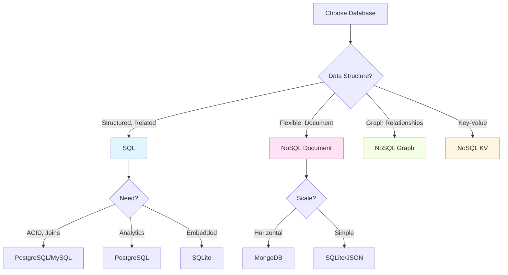

Database performance issues, solutions, and SQL vs NoSQL comparison.

---

## Common Performance Issues

### 1. Missing Indexes

```sql
-- ❌ Problem: Full table scan
SELECT * FROM users WHERE email = 'test@example.com';

-- ✅ Solution: Add index
CREATE INDEX idx_email ON users(email);

-- Verify index usage
EXPLAIN SELECT * FROM users WHERE email = 'test@example.com';
```

### 2. N+1 Queries

```python
# ❌ Problem: N+1 queries
users = User.query.all()
for user in users:
    orders = Order.query.filter_by(user_id=user.id).all()  # N queries

# ✅ Solution: Use JOIN or eager loading
users = User.query.options(joinedload(User.orders)).all()

# SQL equivalent
SELECT u.*, o.*
FROM users u
LEFT JOIN orders o ON u.id = o.user_id;
```

### 3. SELECT *

```sql
-- ❌ Problem: Fetching unnecessary data
SELECT * FROM users;

-- ✅ Solution: Select only needed columns
SELECT id, username, email FROM users;
```

### 4. Lack of Query Optimization

```sql
-- ❌ Problem: Inefficient query
SELECT * FROM orders 
WHERE YEAR(created_at) = 2024;

-- ✅ Solution: Use range query (can use index)
SELECT * FROM orders 
WHERE created_at >= '2024-01-01' 
  AND created_at < '2025-01-01';
```

### 5. No Connection Pooling

```python
# ❌ Problem: Creating new connection each time
def get_data():
    conn = psycopg2.connect(...)
    # query
    conn.close()

# ✅ Solution: Use connection pool
from psycopg2 import pool

connection_pool = pool.SimpleConnectionPool(1, 20, ...)

def get_data():
    conn = connection_pool.getconn()
    try:
        # query
    finally:
        connection_pool.putconn(conn)
```

---

## Index Strategies

### Types of Indexes

```sql
-- B-Tree Index (default, good for equality and range)
CREATE INDEX idx_age ON users(age);

-- Hash Index (only equality, faster than B-Tree)
CREATE INDEX idx_email_hash ON users USING HASH(email);

-- GIN Index (for arrays, JSONB, full-text)
CREATE INDEX idx_tags ON posts USING GIN(tags);

-- GiST Index (for geometric data, full-text)
CREATE INDEX idx_location ON places USING GIST(location);

-- Partial Index (index subset of rows)
CREATE INDEX idx_active_users ON users(email) WHERE active = true;

-- Expression Index
CREATE INDEX idx_lower_email ON users(LOWER(email));

-- Composite Index (multiple columns)
CREATE INDEX idx_name_email ON users(last_name, first_name, email);
```

### When to Use Indexes

```
✅ Use indexes for:
- Columns in WHERE clauses
- Columns in JOIN conditions
- Columns in ORDER BY
- Foreign keys
- Columns used in GROUP BY

❌ Don't over-index:
- Small tables (< 1000 rows)
- Columns with low cardinality (few distinct values)
- Frequently updated columns
- Wide columns (large text/blob)
```

---

## Query Optimization

### Use EXPLAIN

```sql
-- PostgreSQL
EXPLAIN ANALYZE
SELECT u.username, COUNT(o.id) AS order_count
FROM users u
LEFT JOIN orders o ON u.id = o.user_id
GROUP BY u.id, u.username;

-- Look for:
-- - Seq Scan (bad) vs Index Scan (good)
-- - High cost numbers
-- - Large row estimates
```

### Optimize JOINs

```sql
-- ❌ Inefficient: Multiple LEFT JOINs
SELECT *
FROM users u
LEFT JOIN orders o ON u.id = o.user_id
LEFT JOIN order_items oi ON o.id = oi.order_id
LEFT JOIN products p ON oi.product_id = p.id;

-- ✅ Better: Use subqueries or CTEs
WITH user_orders AS (
    SELECT user_id, COUNT(*) as order_count
    FROM orders
    GROUP BY user_id
)
SELECT u.*, uo.order_count
FROM users u
LEFT JOIN user_orders uo ON u.id = uo.user_id;
```

### Use Materialized Views

```sql
-- Create materialized view
CREATE MATERIALIZED VIEW user_stats AS
SELECT 
    u.id,
    u.username,
    COUNT(o.id) AS order_count,
    SUM(o.total) AS total_spent
FROM users u
LEFT JOIN orders o ON u.id = o.user_id
GROUP BY u.id, u.username;

-- Refresh periodically
REFRESH MATERIALIZED VIEW user_stats;

-- Query is now fast
SELECT * FROM user_stats WHERE order_count > 10;
```

---

## SQL vs NoSQL Comparison



### Feature Comparison

| Feature | SQL | NoSQL |
|---------|-----|-------|
| **Schema** | Fixed, predefined | Flexible, dynamic |
| **Scalability** | Vertical (scale up) | Horizontal (scale out) |
| **Transactions** | ACID guaranteed | Eventually consistent (usually) |
| **Joins** | Native support | Limited or application-level |
| **Query Language** | SQL (standardized) | Database-specific |
| **Use Case** | Complex queries, relationships | High throughput, flexible schema |
| **Data Integrity** | Strong | Weaker (trade-off for performance) |
| **Learning Curve** | Moderate | Varies by database |

### When to Use SQL

```
✅ Use SQL when:
- Data has clear relationships
- Need ACID transactions
- Complex queries with JOINs
- Data integrity is critical
- Schema is stable
- Need strong consistency

Examples:
- Banking systems
- E-commerce transactions
- CRM systems
- ERP systems
```

### When to Use NoSQL

```
✅ Use NoSQL when:
- Schema changes frequently
- Need horizontal scaling
- High write throughput
- Eventual consistency is acceptable
- Data is document-oriented or graph-based
- Need flexible data model

Examples:
- Real-time analytics
- Content management
- Social networks
- IoT data
- Caching layers
```

### Hybrid Approach

```
Many applications use both:

PostgreSQL (SQL):
- User accounts
- Orders
- Transactions
- Financial data

MongoDB (NoSQL):
- Product catalog
- User preferences
- Session data
- Logs

Redis (Cache):
- Session storage
- Rate limiting
- Real-time data

Neo4j (Graph):
- Social connections
- Recommendations
- Fraud detection
```

---

## Database-Specific Optimizations

### PostgreSQL

```sql
-- Vacuum (reclaim space)
VACUUM ANALYZE users;

-- Increase work_mem for complex queries
SET work_mem = '256MB';

-- Use parallel queries
SET max_parallel_workers_per_gather = 4;

-- Connection pooling (pgBouncer)
-- Use external tool for connection pooling

-- Partitioning
CREATE TABLE orders (
    id SERIAL,
    created_at TIMESTAMP
) PARTITION BY RANGE (created_at);
```

### MySQL

```sql
-- Optimize table
OPTIMIZE TABLE users;

-- Analyze table
ANALYZE TABLE users;

-- Query cache (MySQL 5.7)
SET GLOBAL query_cache_size = 1048576;

-- InnoDB buffer pool
SET GLOBAL innodb_buffer_pool_size = 2147483648;  -- 2GB
```

### MongoDB

```javascript
// Create indexes
db.users.createIndex({ email: 1 })

// Compound index
db.users.createIndex({ last_name: 1, first_name: 1 })

// Use aggregation pipeline efficiently
db.orders.aggregate([
    { $match: { status: 'completed' } },  // Filter early
    { $group: { _id: '$userId', total: { $sum: '$amount' } } }
])

// Use projection to limit fields
db.users.find({}, { name: 1, email: 1, _id: 0 })

// Enable profiling
db.setProfilingLevel(2)  // Log all operations
db.system.profile.find().sort({ ts: -1 }).limit(5)
```

---

## Monitoring & Tools

### PostgreSQL

```sql
-- Active queries
SELECT pid, query, state, query_start
FROM pg_stat_activity
WHERE state = 'active';

-- Table sizes
SELECT 
    schemaname,
    tablename,
    pg_size_pretty(pg_total_relation_size(schemaname||'.'||tablename)) AS size
FROM pg_tables
ORDER BY pg_total_relation_size(schemaname||'.'||tablename) DESC;

-- Index usage
SELECT 
    schemaname,
    tablename,
    indexname,
    idx_scan,
    idx_tup_read,
    idx_tup_fetch
FROM pg_stat_user_indexes
ORDER BY idx_scan ASC;

-- Cache hit ratio
SELECT 
    sum(heap_blks_read) as heap_read,
    sum(heap_blks_hit)  as heap_hit,
    sum(heap_blks_hit) / (sum(heap_blks_hit) + sum(heap_blks_read)) as ratio
FROM pg_statio_user_tables;
```

### MySQL

```sql
-- Show processlist
SHOW FULL PROCESSLIST;

-- Slow queries
SET GLOBAL slow_query_log = 'ON';
SET GLOBAL long_query_time = 2;

-- Table status
SHOW TABLE STATUS;

-- Index statistics
SHOW INDEX FROM users;
```

### MongoDB

```javascript
// Current operations
db.currentOp()

// Database stats
db.stats()

// Collection stats
db.users.stats()

// Explain query
db.users.find({ email: 'test@example.com' }).explain('executionStats')
```

---

## Best Practices Summary

```
✅ DO:
- Use indexes on frequently queried columns
- Use connection pooling
- Select only needed columns
- Use EXPLAIN to analyze queries
- Use appropriate data types
- Normalize data (SQL) or denormalize (NoSQL) appropriately
- Monitor slow queries
- Use caching (Redis, Memcached)
- Use read replicas for read-heavy workloads
- Partition large tables

❌ DON'T:
- Use SELECT *
- Create too many indexes
- Ignore query performance
- Store large BLOBs in database
- Use ORM without understanding generated SQL
- Ignore connection limits
- Skip backups
- Use database for session storage (use Redis)
```

---