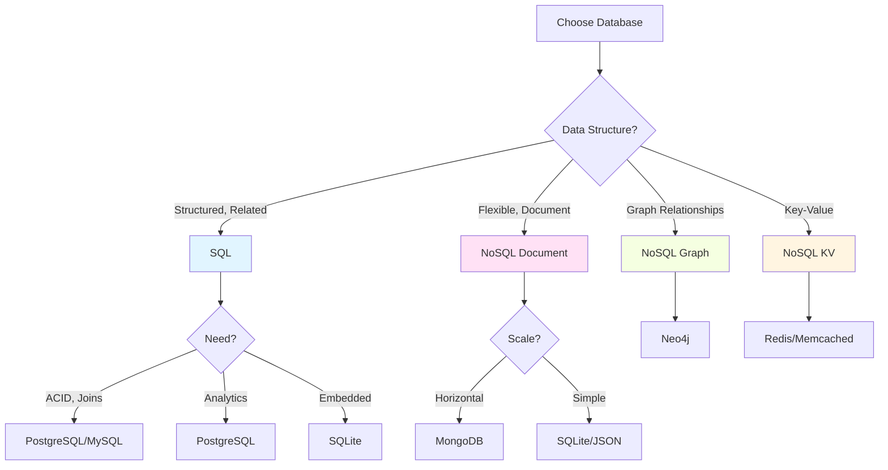
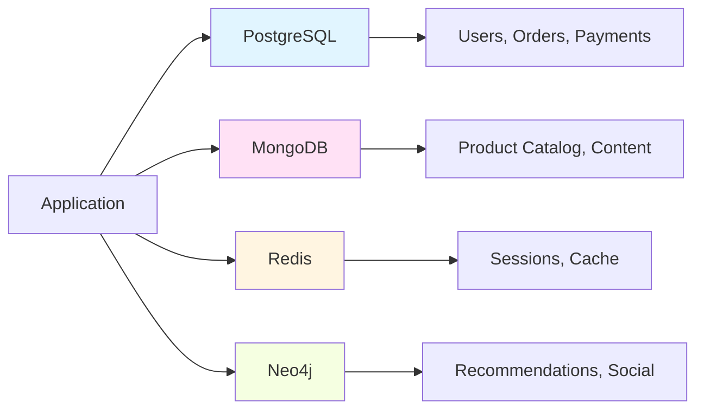

Comprehensive comparison of SQL and NoSQL databases to help choose the right database for your use case.

---

## Decision Tree



---

## Feature Comparison

| Feature | SQL | NoSQL |
|---------|-----|-------|
| **Schema** | Fixed, predefined | Flexible, dynamic |
| **Scalability** | Vertical (scale up) | Horizontal (scale out) |
| **Transactions** | ACID guaranteed | Eventually consistent (usually) |
| **Joins** | Native support | Limited or application-level |
| **Query Language** | SQL (standardized) | Database-specific |
| **Use Case** | Complex queries, relationships | High throughput, flexible schema |
| **Data Integrity** | Strong | Weaker (trade-off for performance) |
| **Learning Curve** | Moderate | Varies by database |
| **Maturity** | Very mature (40+ years) | Newer (10-15 years) |
| **ACID Compliance** | Full ACID | BASE (most), some support ACID |
| **Data Model** | Tables with rows/columns | Documents, key-value, graph, column-family |

---

## Detailed Comparison

### SQL Databases

**Examples**: PostgreSQL, MySQL, SQLite, Oracle, SQL Server

**Strengths:**
- ✅ Strong data consistency (ACID)
- ✅ Complex queries with JOINs
- ✅ Well-established patterns
- ✅ Standardized query language
- ✅ Data integrity constraints
- ✅ Mature ecosystem and tools
- ✅ Transaction support
- ✅ Referential integrity

**Weaknesses:**
- ❌ Vertical scaling (expensive)
- ❌ Schema changes can be difficult
- ❌ Fixed schema can be limiting
- ❌ Performance degrades with very large datasets
- ❌ Sharding is complex

**Best For:**
- Financial systems
- E-commerce transactions
- CRM systems
- ERP systems
- Data warehousing
- Applications requiring complex queries
- Multi-row transactions

---

### NoSQL Databases

#### Document Databases

**Examples**: MongoDB, CouchDB, RavenDB

**Strengths:**
- ✅ Flexible schema
- ✅ Easy horizontal scaling
- ✅ Fast reads/writes
- ✅ Natural data representation (JSON)
- ✅ Good for hierarchical data

**Weaknesses:**
- ❌ No JOINs (or limited)
- ❌ Data duplication
- ❌ Eventual consistency
- ❌ Complex queries are harder

**Best For:**
- Content management
- Product catalogs
- User profiles
- Real-time analytics
- Mobile applications

---

#### Key-Value Stores

**Examples**: Redis, Memcached, DynamoDB

**Strengths:**
- ✅ Extremely fast
- ✅ Simple data model
- ✅ Excellent for caching
- ✅ Horizontal scaling

**Weaknesses:**
- ❌ No complex queries
- ❌ No relationships
- ❌ Limited data types

**Best For:**
- Session storage
- Caching
- Real-time data
- Leaderboards
- Rate limiting

---

#### Graph Databases

**Examples**: Neo4j, ArangoDB, Amazon Neptune

**Strengths:**
- ✅ Excellent for relationships
- ✅ Fast graph traversals
- ✅ Natural for connected data
- ✅ Flexible schema

**Weaknesses:**
- ❌ Not for simple queries
- ❌ Specialized use case
- ❌ Smaller ecosystem

**Best For:**
- Social networks
- Recommendation engines
- Fraud detection
- Knowledge graphs
- Network analysis

---

#### Column-Family Stores

**Examples**: Cassandra, HBase, ScyllaDB

**Strengths:**
- ✅ Massive scalability
- ✅ High write throughput
- ✅ Good for time-series data
- ✅ Distributed by design

**Weaknesses:**
- ❌ Complex to manage
- ❌ Limited query flexibility
- ❌ Eventual consistency

**Best For:**
- Time-series data
- IoT data
- Log data
- Analytics
- High-volume writes

---

## When to Use SQL

```
✅ Use SQL when:

1. Data Integrity is Critical
   - Financial transactions
   - Medical records
   - Legal documents

2. Complex Relationships
   - Many-to-many relationships
   - Need for JOINs
   - Referential integrity

3. ACID Compliance Required
   - Banking systems
   - Inventory management
   - Booking systems

4. Structured Data
   - Well-defined schema
   - Predictable data model
   - Data rarely changes structure

5. Complex Queries
   - Aggregations
   - Multiple table joins
   - Reporting and analytics

6. Mature Ecosystem Needed
   - Established tools
   - Wide developer knowledge
   - Proven patterns
```

**Examples:**
- Banking and financial systems
- E-commerce order processing
- Inventory management
- CRM systems
- ERP systems
- Accounting software

---

## When to Use NoSQL

```
✅ Use NoSQL when:

1. Flexible Schema Needed
   - Rapidly evolving data model
   - Varied data structures
   - Schema-less requirements

2. Horizontal Scalability
   - Massive data volumes
   - High traffic
   - Distributed systems

3. High Write Throughput
   - Logging systems
   - IoT data collection
   - Real-time analytics

4. Eventual Consistency Acceptable
   - Social media feeds
   - Product catalogs
   - Content management

5. Simple Access Patterns
   - Key-based lookups
   - Document retrieval
   - No complex joins

6. Specific Data Models
   - Graph data (social networks)
   - Time-series data
   - Geospatial data
```

**Examples:**
- Social media platforms
- Real-time analytics
- Content management systems
- IoT data collection
- Gaming leaderboards
- Session storage
- Product catalogs

---

## Hybrid Approach

Many modern applications use **both** SQL and NoSQL databases:



**Example Architecture:**

```
PostgreSQL (SQL):
- User accounts and authentication
- Order transactions
- Payment processing
- Financial records

MongoDB (NoSQL Document):
- Product catalog
- User preferences
- Content management
- Activity logs

Redis (NoSQL Key-Value):
- Session storage
- Rate limiting
- Real-time data
- Caching layer

Neo4j (NoSQL Graph):
- Social connections
- Recommendation engine
- Fraud detection
- Network analysis
```

---

## Migration Considerations

### SQL to NoSQL

**Reasons:**
- Need horizontal scaling
- Schema flexibility required
- High write throughput needed

**Challenges:**
- Lose ACID guarantees
- No native JOINs
- Application complexity increases
- Data duplication

**Strategy:**
```
1. Identify bounded contexts
2. Start with read replicas
3. Migrate non-critical data first
4. Use event sourcing for sync
5. Gradual migration
```

---

### NoSQL to SQL

**Reasons:**
- Need ACID transactions
- Complex queries required
- Data integrity critical

**Challenges:**
- Define rigid schema
- Vertical scaling limits
- Migration complexity

**Strategy:**
```
1. Analyze data relationships
2. Design normalized schema
3. Create migration scripts
4. Implement dual-write pattern
5. Validate data integrity
6. Switch over gradually
```

---

## Performance Comparison

### Read Performance

| Database Type | Single Record | Range Query | Aggregation | Join Query |
|---------------|---------------|-------------|-------------|------------|
| **SQL (Indexed)** | Fast | Fast | Fast | Fast |
| **SQL (No Index)** | Slow | Slow | Slow | Slow |
| **Document DB** | Very Fast | Fast | Moderate | Slow |
| **Key-Value** | Extremely Fast | N/A | N/A | N/A |
| **Graph DB** | Fast | Fast | Moderate | Very Fast (relationships) |

### Write Performance

| Database Type | Single Insert | Bulk Insert | Update | Delete |
|---------------|---------------|-------------|--------|--------|
| **SQL** | Moderate | Moderate | Moderate | Moderate |
| **Document DB** | Fast | Very Fast | Fast | Fast |
| **Key-Value** | Extremely Fast | Extremely Fast | Extremely Fast | Extremely Fast |
| **Graph DB** | Moderate | Moderate | Moderate | Moderate |

---

## Cost Comparison

### SQL Databases

**Costs:**
- Vertical scaling (expensive hardware)
- Licensing (Oracle, SQL Server)
- Specialized DBAs
- Complex sharding setup

**Savings:**
- Mature tools (often free)
- Wide developer knowledge
- Proven patterns

---

### NoSQL Databases

**Costs:**
- Horizontal scaling (more servers)
- Cloud costs (storage + compute)
- Specialized knowledge
- Application complexity

**Savings:**
- Commodity hardware
- Auto-scaling
- Simpler operations (some)

---

## Quick Decision Guide

```
Choose SQL if:
□ Need ACID transactions
□ Complex relationships
□ Structured data
□ Complex queries
□ Data integrity critical
□ Mature ecosystem needed

Choose NoSQL if:
□ Flexible schema needed
□ Horizontal scaling required
□ High write throughput
□ Simple access patterns
□ Eventual consistency OK
□ Specific data model (graph, time-series)

Use Both if:
□ Large application
□ Different data needs
□ Microservices architecture
□ Need best of both worlds
```

---

## Real-World Examples

### E-Commerce Platform

```
SQL (PostgreSQL):
- Users, authentication
- Orders, payments
- Inventory
- Transactions

NoSQL (MongoDB):
- Product catalog
- User reviews
- Shopping cart
- Session data

NoSQL (Redis):
- Cache
- Real-time inventory
- Rate limiting

NoSQL (Neo4j):
- Product recommendations
- "Customers also bought"
```

### Social Media Platform

```
SQL (PostgreSQL):
- User accounts
- Billing
- Analytics

NoSQL (MongoDB):
- Posts, comments
- User profiles
- Media metadata

NoSQL (Redis):
- Feed cache
- Online users
- Notifications

NoSQL (Neo4j):
- Social graph
- Friend recommendations
- Trending topics
```

---