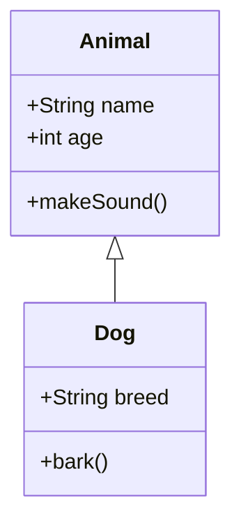
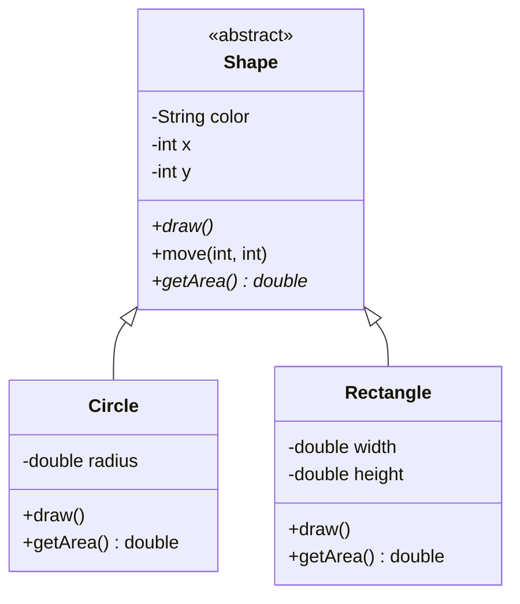
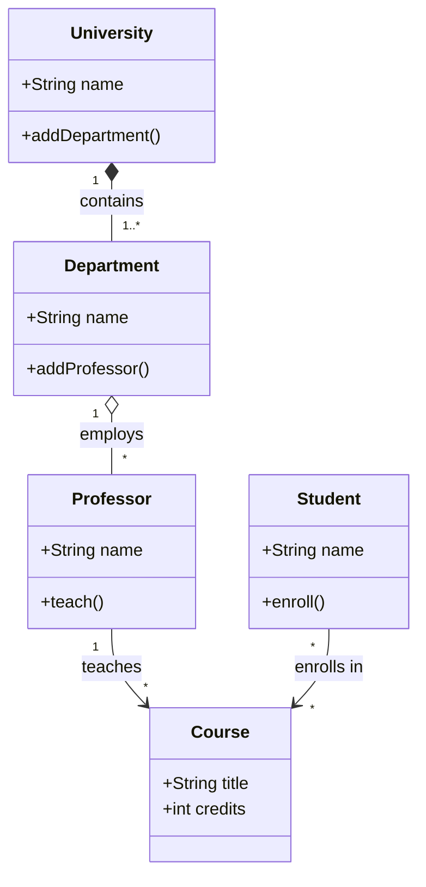
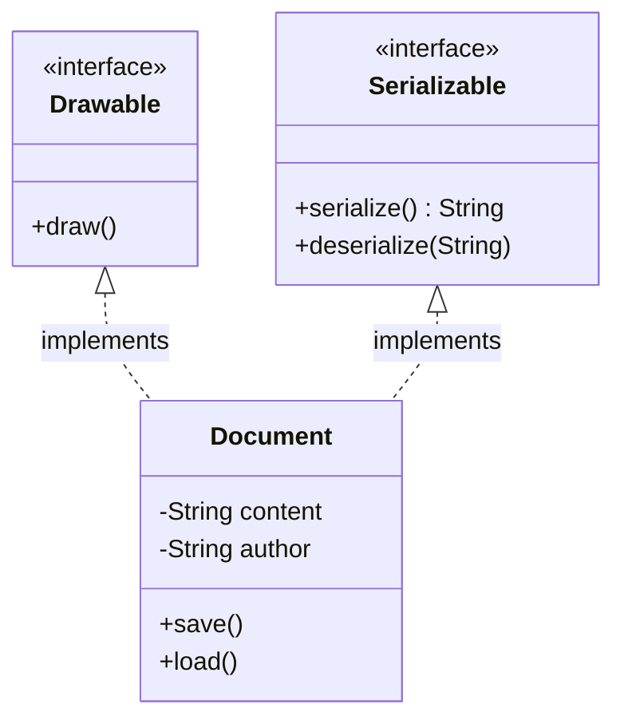
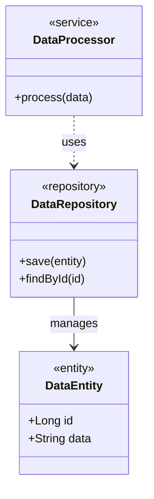
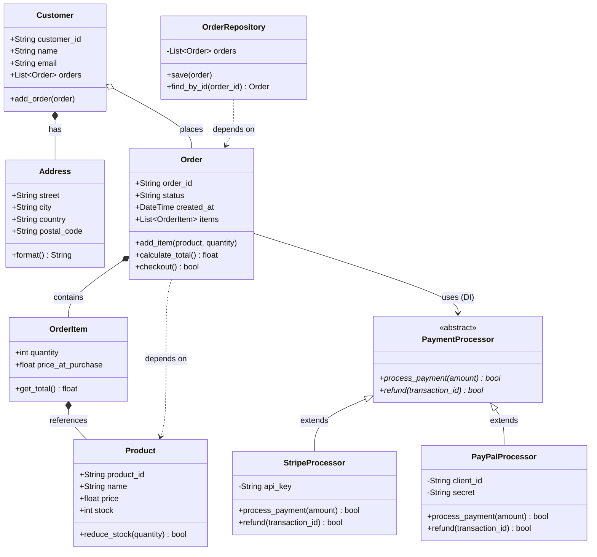

UML class diagrams show the structure of a system by displaying classes, their attributes, methods, and relationships. Essential for documenting object-oriented designs and system architecture.

## Use Case

Use class diagrams when you need to:
- Document system architecture
- Show class relationships and hierarchies
- Design object-oriented systems
- Communicate structure to team members

## UML Symbol Reference

### Class Structure
```
┌─────────────────┐
│   ClassName     │  ← Class name
├─────────────────┤
│ - privateAttr   │  ← Attributes (- private, + public, # protected, ~ package)
│ + publicAttr    │
├─────────────────┤
│ + method()      │  ← Methods
│ - helper()      │
└─────────────────┘
```

### Relationships

| Symbol | Meaning | Description |
|--------|---------|-------------|
| `<\|--` | Inheritance | "extends" or "is-a" relationship |
| `*--` | Composition | Strong ownership, part cannot exist without whole |
| `o--` | Aggregation | Weak ownership, part can exist independently |
| `-->` | Association | General relationship |
| `..\|>` | Realization | Implements interface |
| `..>` | Dependency | Uses or depends on |

### Multiplicity

| Symbol | Meaning |
|--------|---------|
| `"1"` | Exactly one |
| `"0..1"` | Zero or one |
| `"1..*"` | One or more |
| `"*"` | Zero or more |
| `"n"` | Exactly n |

## Code

````markdown

````

## Explanation

- `class ClassName` - Define a class
- `+` - Public visibility
- `-` - Private visibility
- `#` - Protected visibility
- `~` - Package/Internal visibility
- `<|--` - Inheritance arrow
- `*--` - Composition
- `o--` - Aggregation

## Examples

### Example 1: Basic Class Hierarchy

````markdown

````

**Result:**


### Example 2: Relationships and Multiplicity

````markdown

````

**Result:**


### Example 3: Interfaces and Implementation

````markdown

````

**Result:**


### Example 4: Stereotypes and Annotations

````markdown

````

**Result:**


## Notes

- Use `<<stereotype>>` for annotations (abstract, interface, service, etc.)
- `*` after method name indicates abstract method
- Return types can be specified after method: `getArea() double`
- Use meaningful relationship labels for clarity

## Gotchas/Warnings

- ⚠️ **Complexity**: Large diagrams become hard to read - break into multiple diagrams
- ⚠️ **Layout**: Mermaid auto-layouts - you can't control exact positioning
- ⚠️ **Generics**: Generic types like `List<T>` need special handling
- ⚠️ **Bidirectional**: Show only one direction for bidirectional relationships

## Practical Example: Python E-Commerce System

### Python Code

```python
from abc import ABC, abstractmethod
from typing import List, Optional
from datetime import datetime

# Abstract base class (inheritance)
class PaymentProcessor(ABC):
    """Abstract payment processor - demonstrates inheritance"""
    
    @abstractmethod
    def process_payment(self, amount: float) -> bool:
        pass
    
    @abstractmethod
    def refund(self, transaction_id: str) -> bool:
        pass

# Concrete implementations
class StripeProcessor(PaymentProcessor):
    def __init__(self, api_key: str):
        self.api_key = api_key
    
    def process_payment(self, amount: float) -> bool:
        print(f"Processing ${amount} via Stripe")
        return True
    
    def refund(self, transaction_id: str) -> bool:
        print(f"Refunding transaction {transaction_id}")
        return True

class PayPalProcessor(PaymentProcessor):
    def __init__(self, client_id: str, secret: str):
        self.client_id = client_id
        self.secret = secret
    
    def process_payment(self, amount: float) -> bool:
        print(f"Processing ${amount} via PayPal")
        return True
    
    def refund(self, transaction_id: str) -> bool:
        print(f"Refunding transaction {transaction_id}")
        return True

# Value object (composition)
class Address:
    """Address value object - demonstrates composition"""
    
    def __init__(self, street: str, city: str, country: str, postal_code: str):
        self.street = street
        self.city = city
        self.country = country
        self.postal_code = postal_code
    
    def format(self) -> str:
        return f"{self.street}, {self.city}, {self.country} {self.postal_code}"

# Entity with composition
class Customer:
    """Customer entity - demonstrates composition"""
    
    def __init__(self, customer_id: str, name: str, email: str, address: Address):
        self.customer_id = customer_id
        self.name = name
        self.email = email
        self.address = address  # Composition: Customer HAS-A Address
        self.orders: List['Order'] = []
    
    def add_order(self, order: 'Order'):
        self.orders.append(order)

# Product entity
class Product:
    """Product entity"""
    
    def __init__(self, product_id: str, name: str, price: float, stock: int):
        self.product_id = product_id
        self.name = name
        self.price = price
        self.stock = stock
    
    def reduce_stock(self, quantity: int) -> bool:
        if self.stock >= quantity:
            self.stock -= quantity
            return True
        return False

# Order item (composition)
class OrderItem:
    """Order item - demonstrates composition"""
    
    def __init__(self, product: Product, quantity: int):
        self.product = product  # Composition
        self.quantity = quantity
        self.price_at_purchase = product.price
    
    def get_total(self) -> float:
        return self.price_at_purchase * self.quantity

# Main aggregate (dependency injection + composition)
class Order:
    """Order aggregate - demonstrates DI and composition"""
    
    def __init__(self, order_id: str, customer: Customer, 
                 payment_processor: PaymentProcessor):  # Dependency Injection
        self.order_id = order_id
        self.customer = customer  # Composition
        self.items: List[OrderItem] = []  # Composition
        self.payment_processor = payment_processor  # DI (Dependency Inversion)
        self.status = "pending"
        self.created_at = datetime.now()
    
    def add_item(self, product: Product, quantity: int):
        """Depends on Product (dependency)"""
        if product.reduce_stock(quantity):
            item = OrderItem(product, quantity)
            self.items.append(item)
    
    def calculate_total(self) -> float:
        return sum(item.get_total() for item in self.items)
    
    def checkout(self) -> bool:
        """Uses injected payment processor (Dependency Inversion)"""
        total = self.calculate_total()
        if self.payment_processor.process_payment(total):
            self.status = "paid"
            return True
        return False

# Repository (depends on Order)
class OrderRepository:
    """Repository - demonstrates dependency"""
    
    def __init__(self):
        self.orders: List[Order] = []
    
    def save(self, order: Order):  # Depends on Order
        self.orders.append(order)
    
    def find_by_id(self, order_id: str) -> Optional[Order]:
        return next((o for o in self.orders if o.order_id == order_id), None)

# Usage example
if __name__ == "__main__":
    # Create payment processor (can be swapped - Dependency Inversion)
    payment = StripeProcessor(api_key="sk_test_123")
    
    # Create customer with address (Composition)
    address = Address("123 Main St", "New York", "USA", "10001")
    customer = Customer("C001", "John Doe", "john@example.com", address)
    
    # Create products
    laptop = Product("P001", "Laptop", 999.99, 10)
    mouse = Product("P002", "Mouse", 29.99, 50)
    
    # Create order with DI
    order = Order("O001", customer, payment)
    order.add_item(laptop, 1)
    order.add_item(mouse, 2)
    
    # Process order
    order.checkout()
    
    # Save to repository
    repo = OrderRepository()
    repo.save(order)
```

### UML Diagram

````markdown

````

**Result:**


### Relationship Explanations

1. **Inheritance (`<|--`)**: `StripeProcessor` and `PayPalProcessor` extend `PaymentProcessor`
   - IS-A relationship
   - Subclasses inherit abstract methods

2. **Composition (`*--`)**: Strong ownership, lifecycle dependent
   - `Customer` *has* `Address` - address can't exist without customer
   - `Order` *contains* `OrderItem` - items can't exist without order
   - `OrderItem` *references* `Product` - captures product state

3. **Aggregation (`o--`)**: Weak ownership, independent lifecycle
   - `Customer` places `Order` - orders can exist independently

4. **Dependency Injection (`-->`)**: `Order` uses `PaymentProcessor` interface
   - Dependency Inversion Principle
   - Order depends on abstraction, not concrete implementation
   - Payment processor can be swapped at runtime

5. **Dependency (`..>`)**: Uses but doesn't own
   - `OrderRepository` depends on `Order` - needs it to function
   - `Order` depends on `Product` - uses it but doesn't own it

This example demonstrates **SOLID principles**:
- **S**ingle Responsibility: Each class has one job
- **O**pen/Closed: Can add new payment processors without modifying Order
- **L**iskov Substitution: Any PaymentProcessor can be used
- **I**nterface Segregation: PaymentProcessor has focused interface
- **D**ependency Inversion: Order depends on PaymentProcessor abstraction