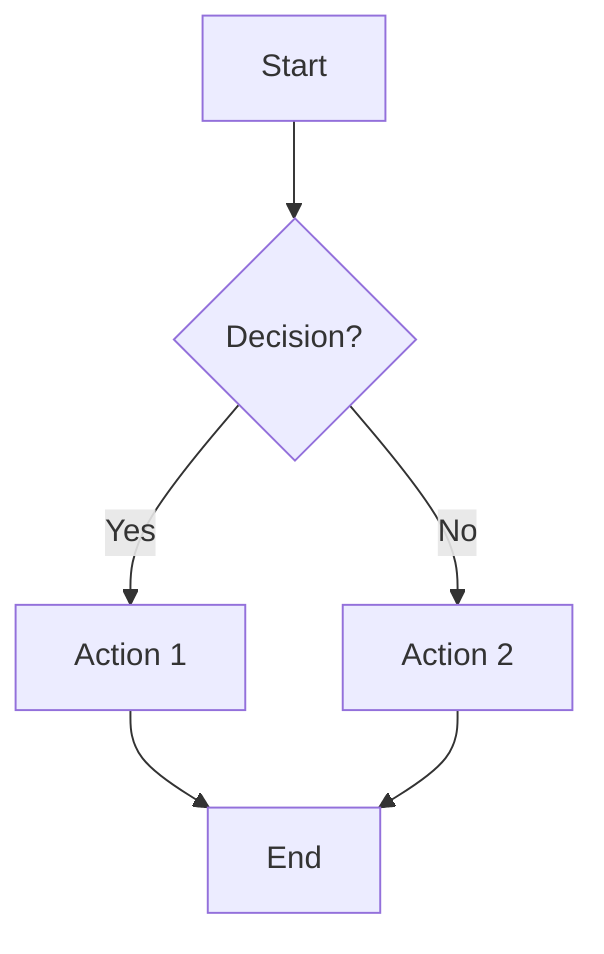
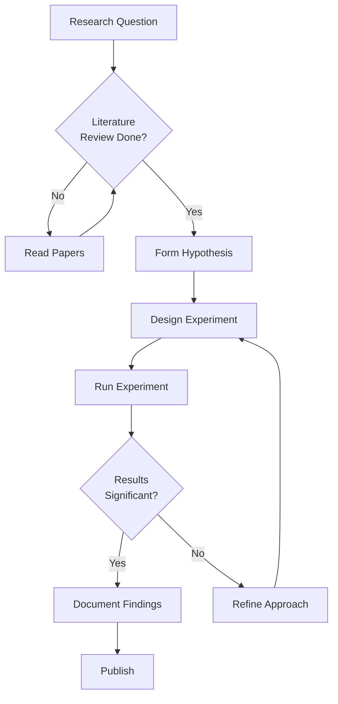
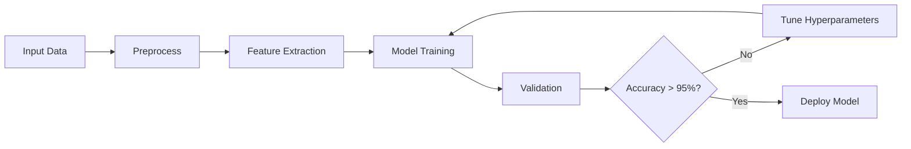
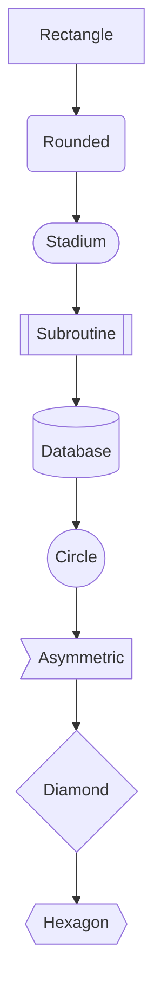

Mermaid flowcharts are perfect for visualizing processes, algorithms, and decision trees. They're text-based, version-control friendly, and render beautifully.

## Use Case

Use flowcharts when you need to:
- Document algorithms or processes
- Show decision logic
- Map out workflows
- Visualize state transitions

## Code

````markdown

````

## Explanation

- `graph TD` - Top-down flowchart (use `LR` for left-right, `BT` for bottom-top)
- `[]` - Rectangle node
- `{}` - Diamond (decision) node
- `()` - Rounded rectangle
- `-->` - Arrow
- `-->|text|` - Arrow with label

## Examples

### Example 1: Research Process

````markdown

````

**Result:**


### Example 2: Algorithm Flow

````markdown

````

**Result:**


### Example 3: Node Shapes

````markdown

````

**Result:**


## Notes

- Use `<br/>` for line breaks in node text
- Keep node IDs simple (A, B, C or descriptive names)
- Use subgraphs for grouping related nodes
- Test complex diagrams at https://mermaid.live/

## Gotchas/Warnings

- ⚠️ **Special characters**: Avoid quotes in node text, use `#quot;` if needed
- ⚠️ **Spacing**: Extra spaces in node IDs can cause issues
- ⚠️ **Circular references**: Be careful with loops, they can make diagrams hard to read
- ⚠️ **Complexity**: Very large flowcharts become hard to maintain - consider breaking them up