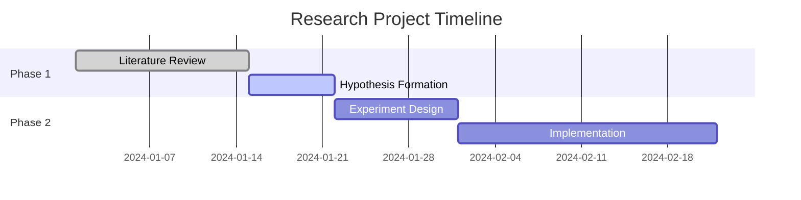
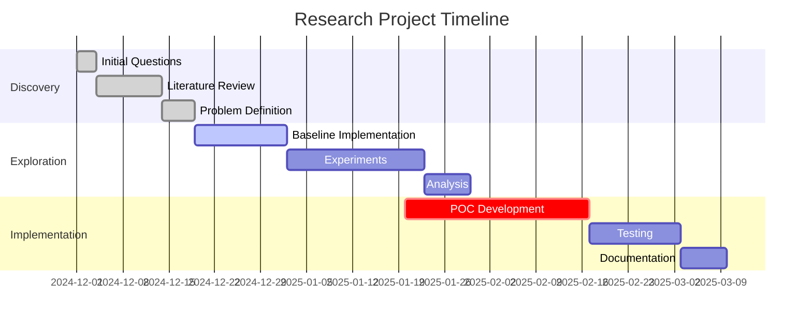
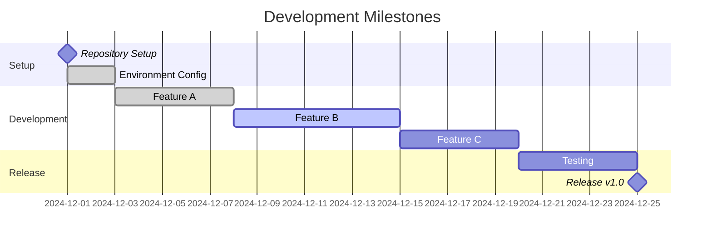

Gantt charts visualize project timelines, showing tasks, durations, and dependencies. Perfect for planning research phases and tracking progress.

## Use Case

Use Gantt charts when you need to:
- Plan research phases and milestones
- Visualize project timelines
- Show task dependencies
- Track progress over time

## Code

````markdown

````

## Explanation

- `dateFormat` - Date format for tasks (YYYY-MM-DD recommended)
- `section` - Group related tasks
- Task format: `Name :status, start, duration`
- Status: `done`, `active`, `crit` (critical), or empty
- Duration: `Xd` (days), `Xw` (weeks), or end date

## Examples

### Example 1: Research Timeline

````markdown

````

**Result:**


### Example 2: Milestone-Based

````markdown

````

**Result:**


## Notes

- Use `milestone` for zero-duration events
- `crit` highlights critical path tasks
- Task IDs (like `disc1`) enable `after` dependencies
- Sections help organize related tasks

## Gotchas/Warnings

- ⚠️ **Date format**: Must match `dateFormat` exactly
- ⚠️ **Dependencies**: Use task IDs with `after` for dependencies
- ⚠️ **Duration**: Can use days (d), weeks (w), or end dates
- ⚠️ **Updates**: Remember to update status as project progresses