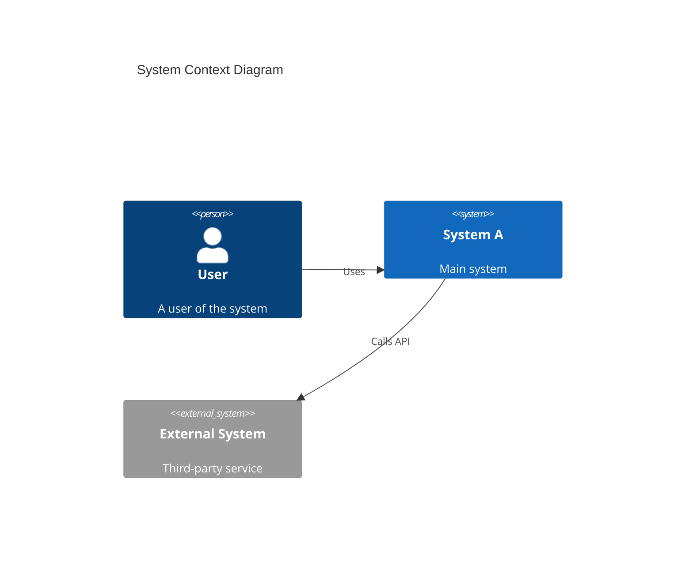
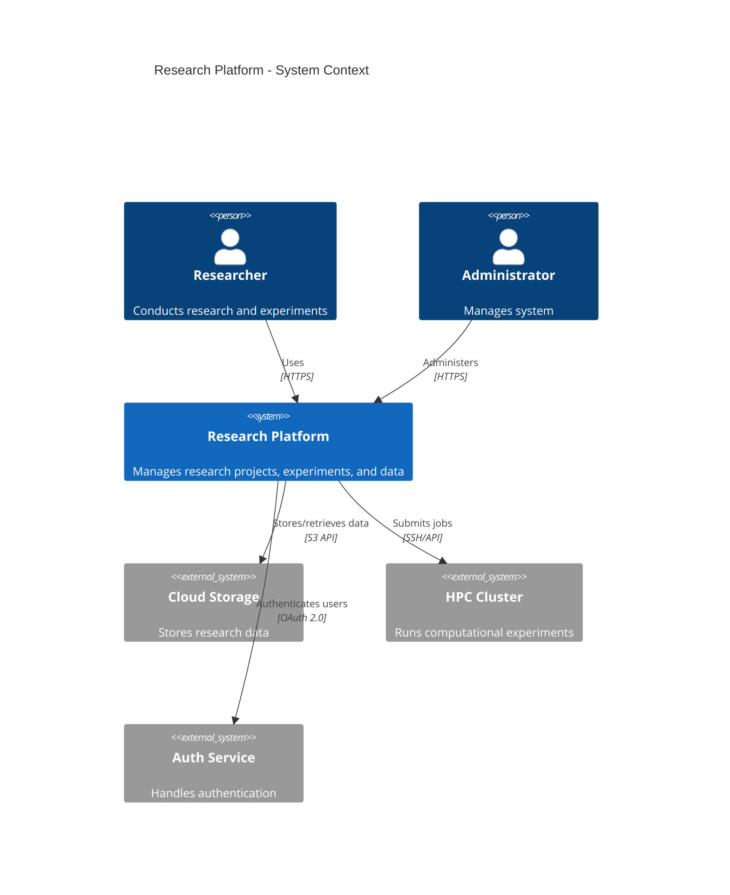
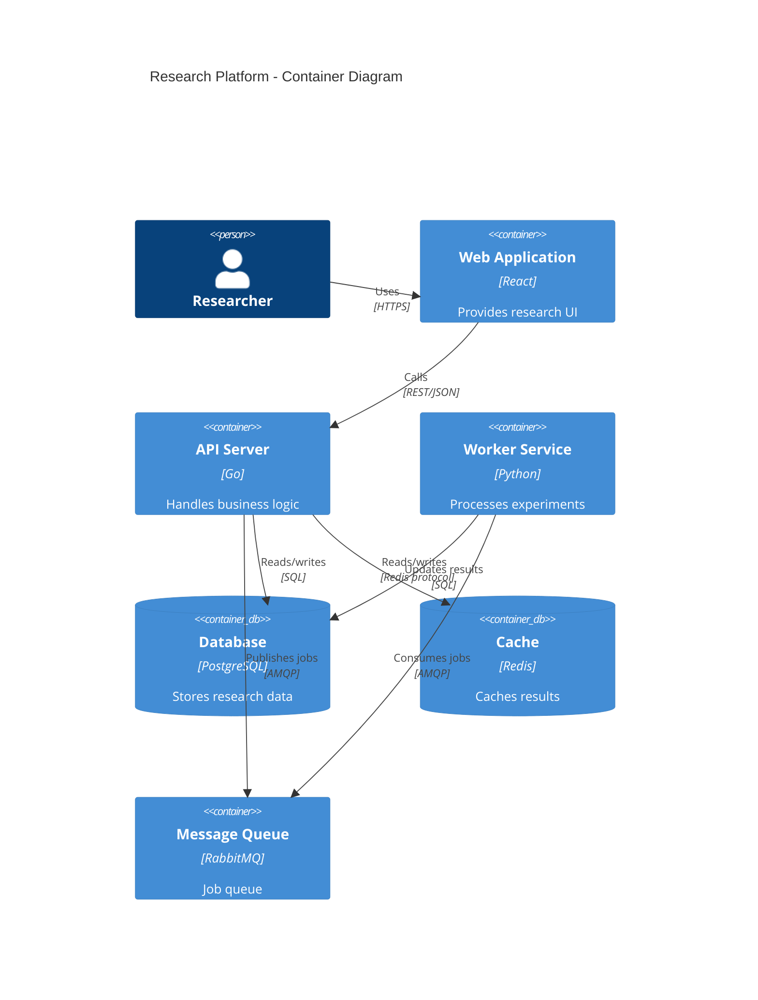
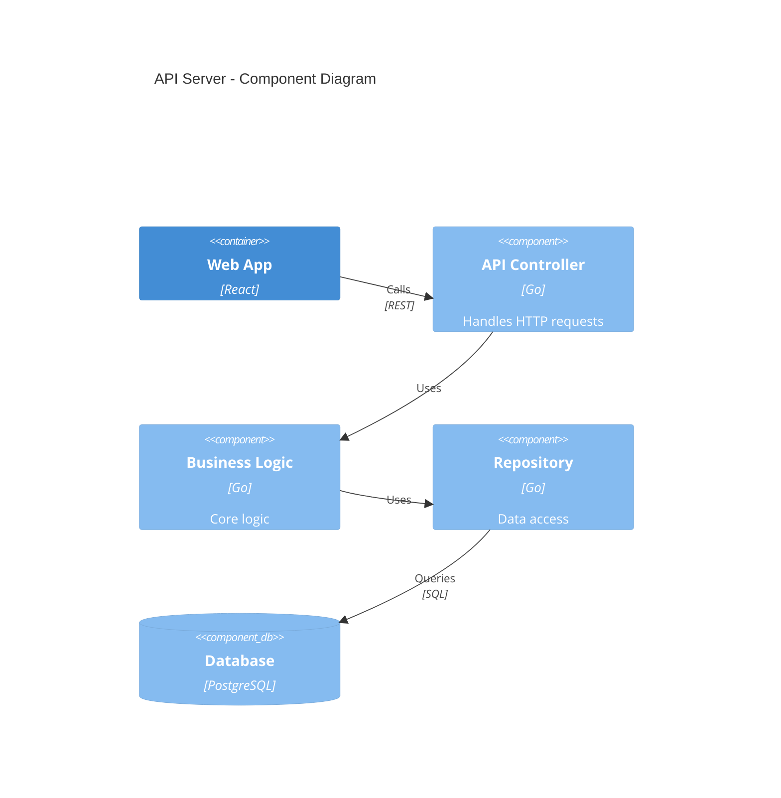
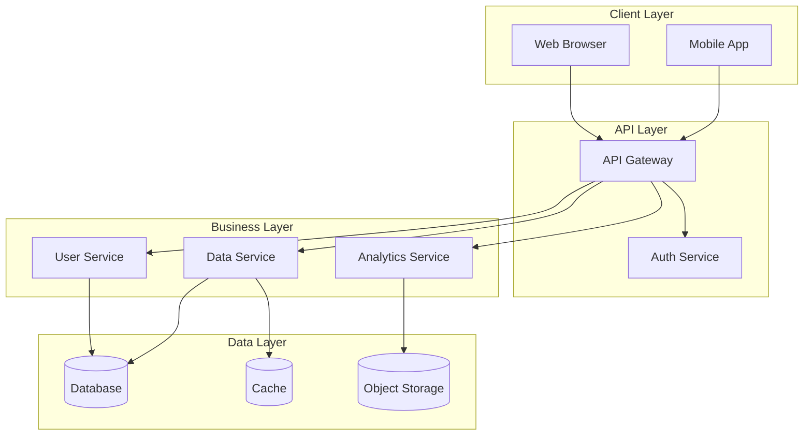

The C4 model provides a hierarchical way to visualize software architecture at different levels of abstraction: Context, Containers, Components, and Code. Perfect for documenting system architecture.

## Use Case

Use architecture diagrams when you need to:
- Document system architecture
- Show system boundaries and interactions
- Communicate design to stakeholders
- Plan system components and their relationships

## C4 Model Levels

1. **Context** - System in its environment (users, external systems)
2. **Container** - High-level technology choices (apps, databases, services)
3. **Component** - Components within a container
4. **Code** - Class diagrams (covered in UML snippet)

## Code

````markdown

````

**Result:**


## Explanation

- `Person()` - User or actor
- `System()` - Internal system
- `System_Ext()` - External system
- `Container()` - Application, database, etc.
- `Component()` - Internal component
- `Rel()` - Relationship with label

## Examples

### Example 1: System Context

````markdown

````

**Result:**


### Example 2: Container Diagram

````markdown

````

**Result:**


### Example 3: Component Diagram

````markdown

````

**Result:**


### Example 4: Simple Architecture with Flowchart

For simpler architectures, you can use flowcharts:

````markdown

````

**Result:**


## Notes

- Start with Context diagram for high-level view
- Use Container diagram for deployment architecture
- Component diagram for detailed internal structure
- Keep diagrams focused - one diagram per level

## Gotchas/Warnings

- ⚠️ **Level mixing**: Don't mix C4 levels in one diagram
- ⚠️ **Too detailed**: Keep appropriate level of abstraction
- ⚠️ **Technology**: Include technology choices in descriptions
- ⚠️ **Boundaries**: Clearly show system boundaries