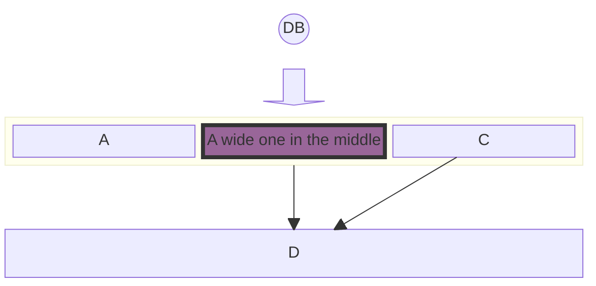

Block diagrams show system components as blocks with connections. Perfect for visualizing system architecture, data flow, and component relationships.

## Use Case

Use block diagrams when you need to:
- Show system architecture
- Visualize component relationships
- Document data flow
- Design system components
- Communicate system structure

## Code (Basic)

````markdown
```mermaid
block-beta
    columns 2

    block:Left
      A[Component A]
      B["Component B"]
    end

    block:Right
      C[Component C]
      D[Component D]
    end

    A --> B
    B --> C
    C --> D
```
````

**Result:**

```mermaid
block-beta
    columns 2

    block:Left
      A[Component A]
      B["Component B"]
    end

    block:Right
      C[Component C]
      D[Component D]
    end

    A --> B
    B --> C
    C --> D
```

## Explanation

- `block-beta` - Start block diagram (beta syntax)
- `columns N` - Optional, defines column layout
- `block:ID` / `end` - Define a vertical block region with an identifier
- Inside a block you place regular nodes like `A[Label]`
- `-->` - Connection between nodes (same as in flowcharts)

## Examples

### Example 1: System Layout with Columns and Space

````markdown

````

**Result:**


### Example 2: Simple System Architecture

````markdown
```mermaid
block-beta
    columns 2

    block:ClientSide
      Client[Web Client]
    end

    block:ServerSide
      API[API Gateway]
      Auth[Auth Service]
      DB[(Database)]
    end

    Client --> API
    API --> Auth
    API --> DB
```
````

**Result:**

```mermaid
block-beta
    columns 2

    block:ClientSide
      Client[Web Client]
    end

    block:ServerSide
      API[API Gateway]
      Auth[Auth Service]
      DB[(Database)]
    end

    Client --> API
    API --> Auth
    API --> DB
```

## Block Elements & Styling

- `[Label]` - Rectangle
- `(Label)` - Rounded rectangle
- `([Label])` - Stadium shape
- `[[Label]]` - Double rectangle
- `[(Label)]` - Cylinder (database)
- `block:ID` - Logical group of vertically stacked nodes
- `space` - Adds horizontal space between blocks
- `style ID ...` - Apply CSS-like style to a node or block

## Notes

- Use `block-beta` for modern block diagrams
- Combine `columns`, `block:ID`, `space`, and arrows to control layout
- Connections use `-->` for directed edges
- Layout is still mostly automatic; you influence it via columns and blocks

## Gotchas/Warnings

- ⚠️ **Indentation**: Block contents must be consistently indented under `block:ID`
- ⚠️ **IDs**: `block:ID` defines an identifier you can later connect from/to
- ⚠️ **HTML**: If you use `&nbsp;` inside labels, be sure your renderer passes it through correctly
- ⚠️ **Beta**: `block-beta` is still evolving; check Mermaid docs if syntax changes

