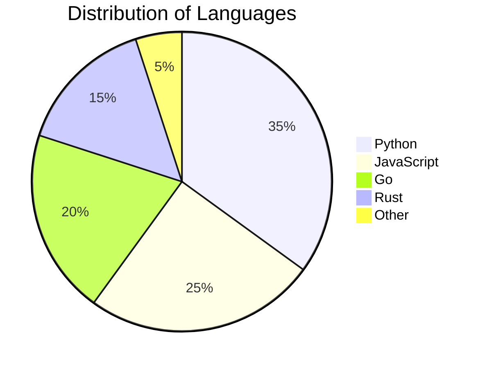
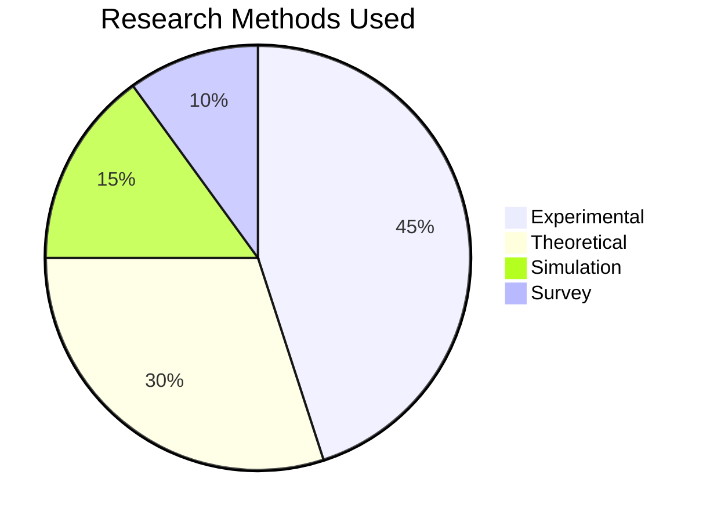
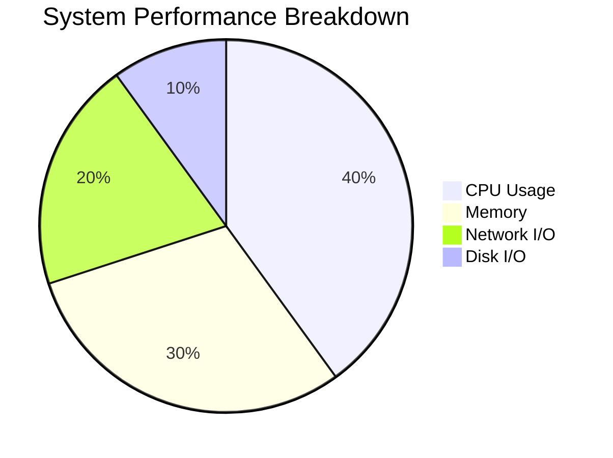
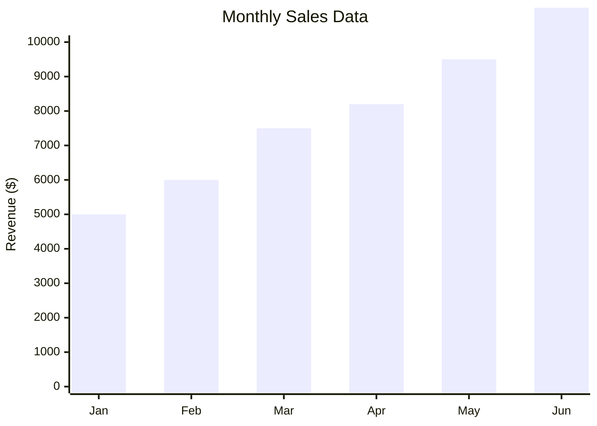
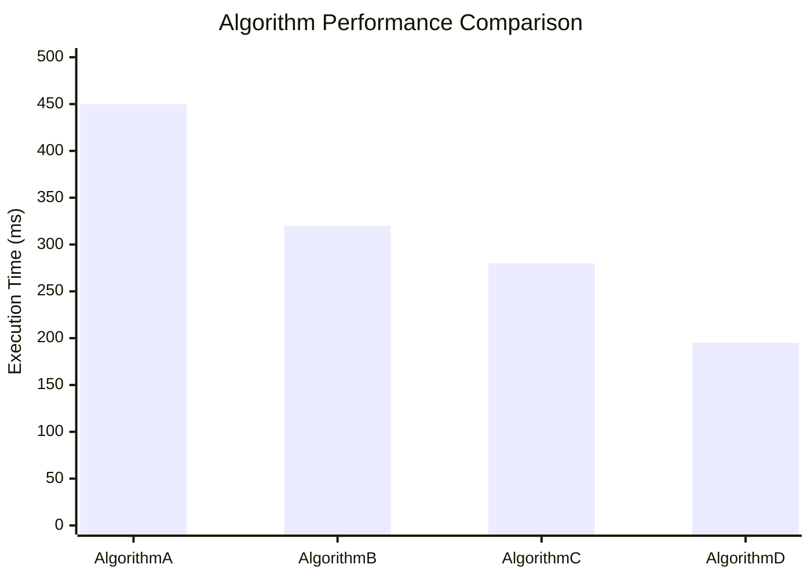
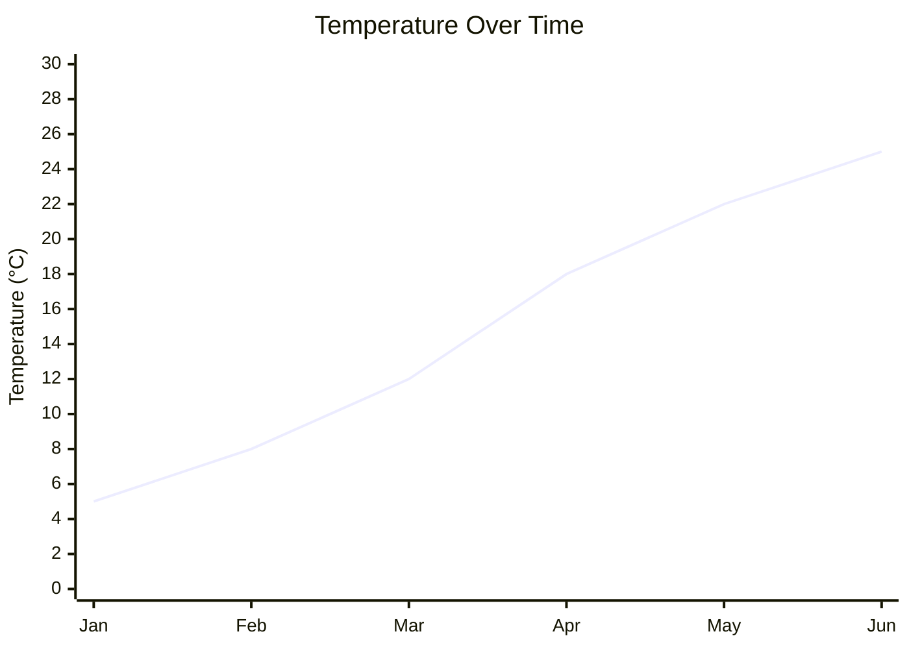
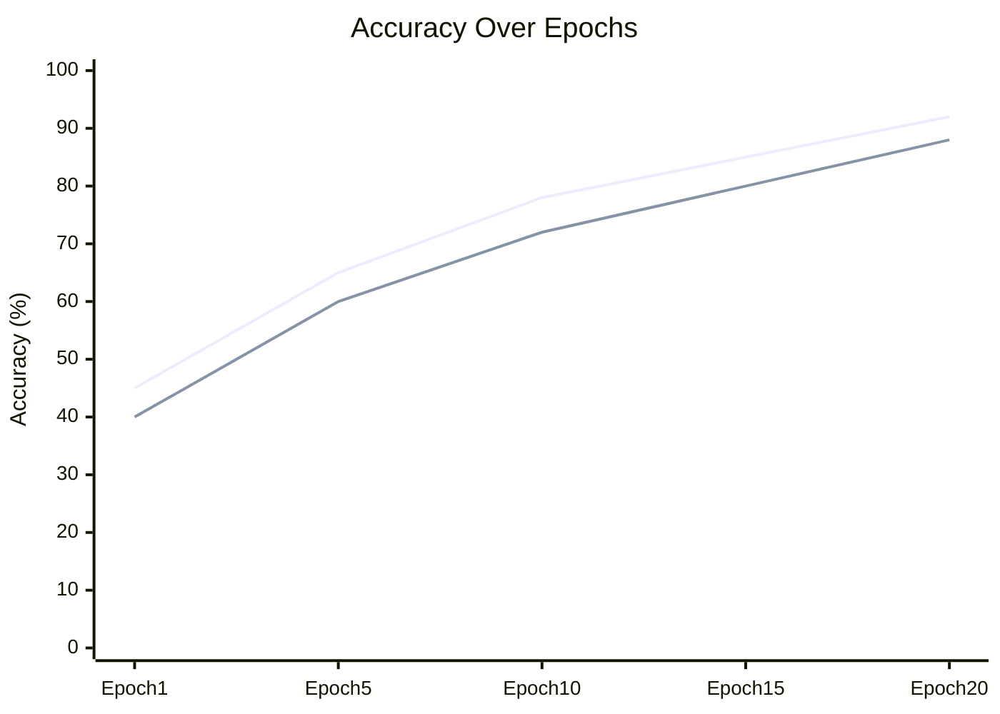
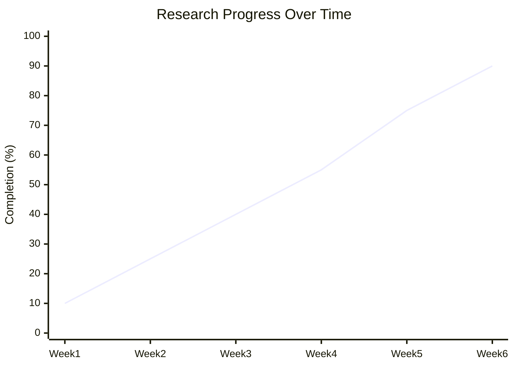
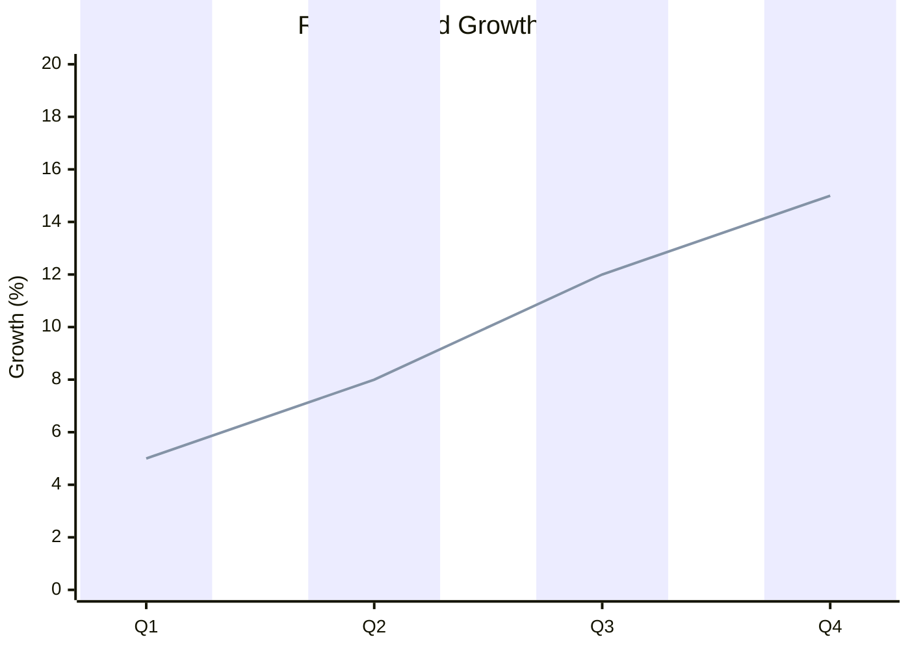

Mermaid supports various chart types including pie charts, bar charts, and line charts. Perfect for visualizing data and statistics in documentation.

## Use Case

Use Mermaid charts when you need to:
- Visualize data distributions (pie charts)
- Compare values across categories (bar charts)
- Show trends over time (line charts)
- Create simple, text-based data visualizations

## Pie Charts

Pie charts show proportional data as slices of a circle.

### Basic Pie Chart

````markdown

````

**Result:**


### Example 1: Research Methods Distribution

````markdown

````

**Result:**


### Example 2: Performance Metrics

````markdown

````

**Result:**


## Bar Charts (GitGraph Style)

Mermaid bar charts use the `gitgraph` syntax for creating bar-like visualizations, or you can use `xychart-beta` for more traditional bar charts.

### XY Chart Bar

````markdown

````

**Result:**


### Example 1: Performance Comparison

````markdown

````

**Result:**


## Line Charts

Line charts show trends over time using the `xychart-beta` syntax.

### Basic Line Chart

````markdown

````

**Result:**


### Example 1: Multiple Series

````markdown

````

**Result:**


### Example 2: Research Progress

````markdown

````

**Result:**


## Combined Charts

You can combine bar and line charts in a single visualization.

### Example: Bar and Line Combination

````markdown

````

**Result:**


## Syntax Reference

### Pie Chart Syntax

```
pie title "Chart Title"
    "Label 1" : value1
    "Label 2" : value2
    "Label 3" : value3
```

### XY Chart Syntax

```
xychart-beta
    title "Chart Title"
    x-axis [label1, label2, label3, ...]
    y-axis "Y-axis Label" min --> max
    bar [value1, value2, value3, ...]
    line [value1, value2, value3, ...]
```

## Notes

- Pie charts automatically calculate percentages from values
- XY charts support multiple series (multiple `bar` or `line` declarations)
- Use descriptive titles and axis labels
- Ensure data arrays match x-axis labels in length
- XY charts are in beta - syntax may change

## Gotchas/Warnings

- ⚠️ **XY Chart Beta**: `xychart-beta` is experimental - check Mermaid docs for updates
- ⚠️ **Data Length**: X-axis labels and data arrays must have matching lengths
- ⚠️ **Pie Values**: Values are relative - Mermaid calculates percentages automatically
- ⚠️ **Multiple Series**: Each `bar` or `line` declaration creates a new series
- ⚠️ **Axis Range**: Set appropriate min/max for y-axis to show data clearly

