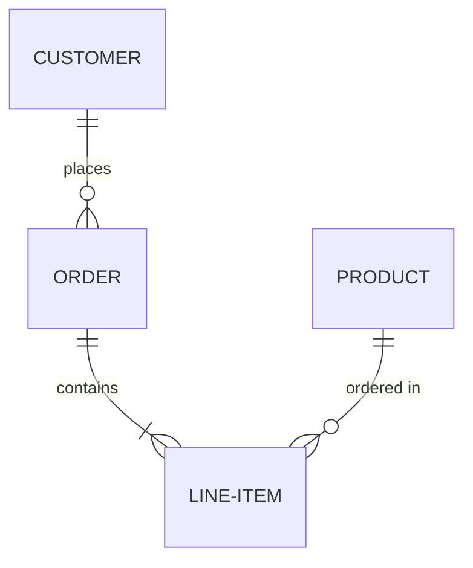
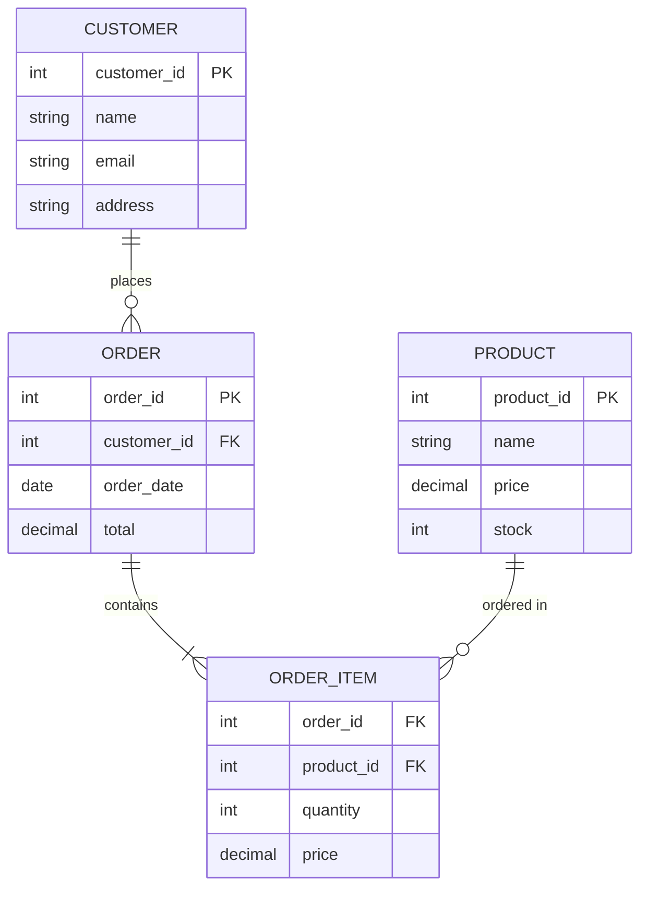
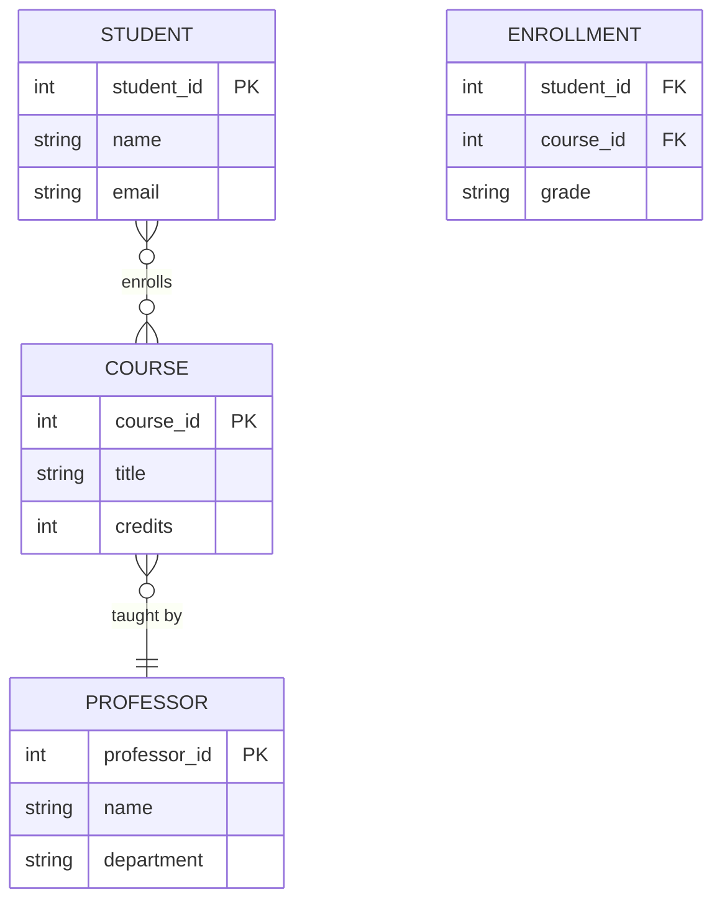

Entity Relationship Diagrams (ERD) visualize database schemas, showing entities, their attributes, and relationships. Perfect for database design and documentation.

## Use Case

Use ER diagrams when you need to:
- Design database schemas
- Document database structure
- Show relationships between entities
- Visualize data models
- Communicate database architecture

## Code

````markdown

````

**Result:**


## Explanation

- `erDiagram` - Start ER diagram
- Entity names in UPPERCASE
- Relationship syntax: `Entity1 ||--o{ Entity2 : label`
- Cardinality symbols:
  - `||--||` : One to one
  - `}o--||` : Many to one
  - `}o--o{` : Many to many
  - `||--o{` : One to many
  - `}o--|{` : One or more to many

## Examples

### Example 1: E-Commerce Database

````markdown

````

**Result:**


### Example 2: University Database

````markdown

````

**Result:**


## Relationship Cardinality

| Symbol | Meaning | Description |
|--------|---------|-------------|
| `||--||` | One to One | Each entity relates to exactly one other |
| `}o--||` | Many to One | Many entities relate to one |
| `||--o{` | One to Many | One entity relates to many |
| `}o--o{` | Many to Many | Many entities relate to many |
| `}o--|{` | One or More to Many | At least one relates to many |

## Notes

- Entity names should be in UPPERCASE
- Attributes are defined inside curly braces
- PK = Primary Key, FK = Foreign Key
- Relationship labels are optional but recommended
- Use descriptive relationship names

## Gotchas/Warnings

- ⚠️ **Entity Names**: Must be uppercase and use hyphens for multi-word names
- ⚠️ **Attributes**: Define inside entity blocks with type and constraints
- ⚠️ **Relationships**: Cardinality symbols must match the relationship direction
- ⚠️ **Complexity**: Large ER diagrams can become hard to read - break into modules

