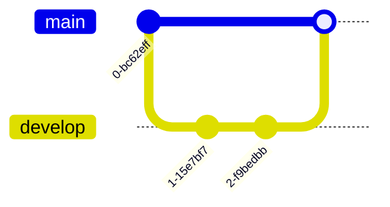

Git diagrams visualize Git workflows, branches, and commit history. Perfect for documenting branching strategies, release workflows, and Git operations.

## Use Case

Use Git diagrams when you need to:
- Document branching strategies
- Show Git workflows
- Visualize commit history
- Explain merge strategies
- Design release processes

## Code (Basic)

````markdown

````

**Result:**


## Explanation

- `gitGraph` - Start Git diagram (note the capital **G**)
- `commit` - Create a commit
- `branch` - Create a branch
- `checkout` - Switch to a branch
- `merge` - Merge branches

## Examples

### Example 1: Feature Branch Workflow

````markdown

````

**Result:**


### Example 2: Git Flow

````markdown

````

**Result:**


## Commands

- `commit` or `commit id: "message"` - Create commit (with optional label)
- `branch name` - Create branch
- `checkout name` - Switch to branch
- `merge name` - Merge branch into current
- `cherry-pick id: "message"` - Cherry-pick commit

## Notes

- Commits must have `id:` label
- Branch names should be descriptive
- Use `checkout` before committing to set branch
- Merge creates a merge commit

## Gotchas/Warnings

- ⚠️ **Commits**: Must include `id:` in commit command
- ⚠️ **Order**: Commits must be in chronological order
- ⚠️ **Branches**: Create branch before checking out
- ⚠️ **Merges**: Must checkout target branch before merging

