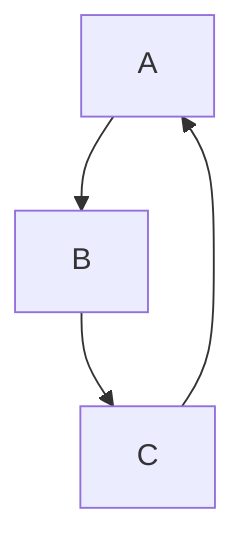
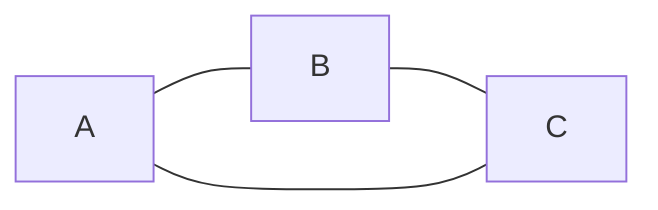
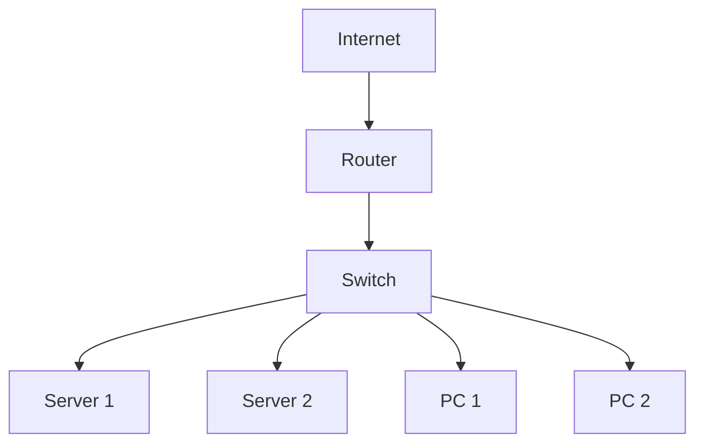
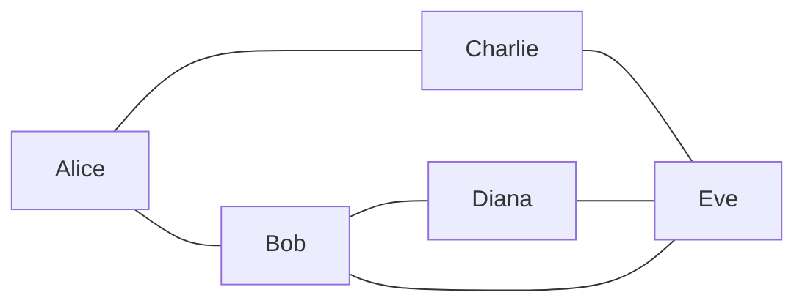
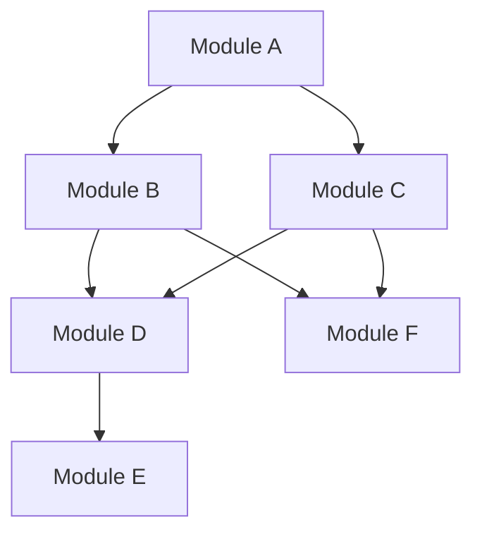
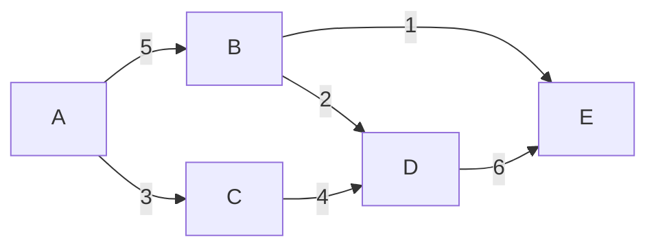
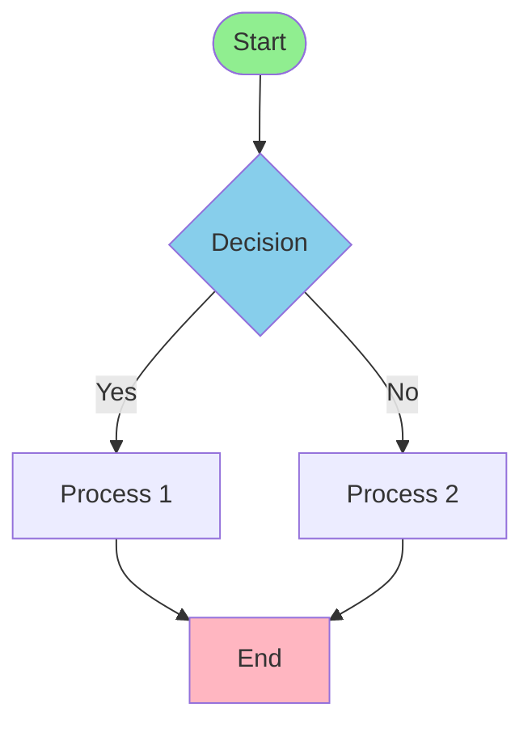
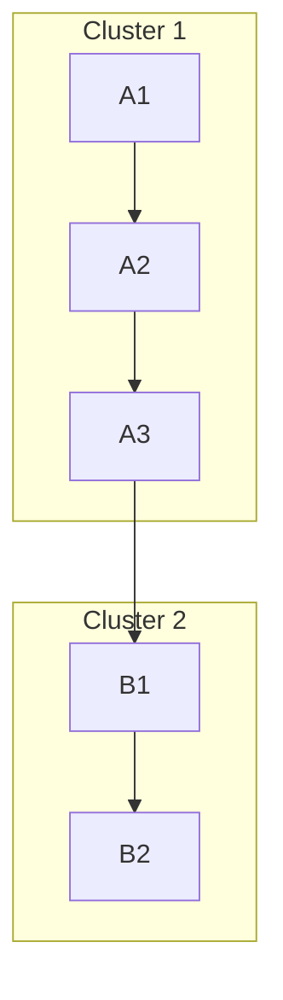
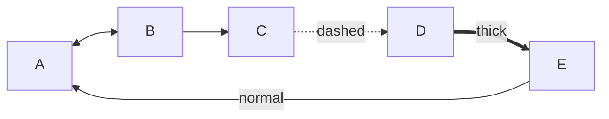
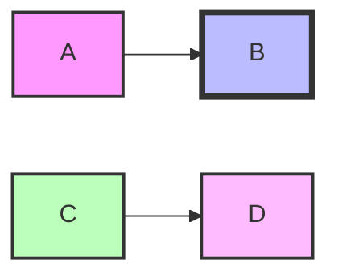

Mermaid supports creating arbitrary graphs (both directed and undirected) for visualizing networks, relationships, and complex graph structures. Perfect for network topologies, social graphs, dependency graphs, and any graph-based visualization.

## Use Case

Use Mermaid graphs when you need to:
- Visualize network topologies
- Show relationships between entities
- Create dependency graphs
- Model social networks
- Display graph data structures
- Show arbitrary connections between nodes

## Basic Syntax

### Directed Graph

````markdown

````

**Result:**


### Undirected Graph

````markdown

````

**Result:**


## Examples

### Example 1: Network Topology

````markdown

````

**Result:**


### Example 2: Social Network Graph

````markdown

````

**Result:**


### Example 3: Dependency Graph

````markdown

````

**Result:**


### Example 4: Weighted Graph

````markdown

````

**Result:**


### Example 5: Complex Graph with Styling

````markdown

````

**Result:**


### Example 6: Graph with Subgraphs

````markdown

````

**Result:**


### Example 7: Multi-directional Graph

````markdown

````

**Result:**


## Edge Types

### Directed Edges

- `A --> B` - Solid arrow
- `A ==> B` - Thick arrow
- `A -.-> B` - Dashed arrow
- `A -..-> B` - Dotted arrow

### Undirected Edges

- `A --- B` - Solid line
- `A === B` - Thick line
- `A -.- B` - Dashed line
- `A -..- B` - Dotted line

### Bidirectional

- `A <--> B` - Bidirectional solid
- `A <==> B` - Bidirectional thick

### With Labels

- `A -->|label| B` - Edge with label
- `A ---|label| B` - Undirected edge with label

## Node Shapes

- `A[Rectangle]` - Rectangle
- `A(Rounded)` - Rounded rectangle
- `A([Stadium])` - Stadium shape
- `A[[Subroutine]]` - Double rectangle
- `A[(Database)]` - Cylinder
- `A((Circle))` - Circle
- `A>Asymmetric]` - Asymmetric shape
- `A{Diamond}` - Diamond
- `A{{Hexagon}}` - Hexagon

## Graph Directions

- `graph TD` - Top to bottom
- `graph TB` - Top to bottom (same as TD)
- `graph BT` - Bottom to top
- `graph LR` - Left to right
- `graph RL` - Right to left

## Styling

### Node Styling

````markdown

````

**Result:**


### Class-based Styling

````markdown
```mermaid
graph TD
    A[Node A] --> B[Node B]
    C[Node C] --> D[Node D]
    
    classDef default fill:#f9f9f9,stroke:#333,stroke-width:2px
    classDef highlight fill:#ff6,stroke:#333,stroke-width:4px
    
    class A,C highlight
```
````

**Result:**

```mermaid
graph TD
    A[Node A] --> B[Node B]
    C[Node C] --> D[Node D]
    
    classDef default fill:#f9f9f9,stroke:#333,stroke-width:2px
    classDef highlight fill:#ff6,stroke:#333,stroke-width:4px
    
    class A,C highlight
```

## Notes

- Graphs automatically layout nodes - you can't control exact positions
- Use subgraphs to group related nodes visually
- Edge labels can contain text and some HTML
- Styling supports CSS color formats (hex, rgb, named colors)
- Complex graphs may need optimization for readability

## Gotchas/Warnings

- ⚠️ **Layout**: Automatic layout - nodes position themselves
- ⚠️ **Complexity**: Very large graphs can be slow to render
- ⚠️ **Node IDs**: Must be unique and simple (alphanumeric, no spaces)
- ⚠️ **Edge Labels**: Keep labels short for readability
- ⚠️ **Subgraphs**: Must start with `subgraph` keyword
- ⚠️ **Styling**: CSS color names work, but hex is more reliable

