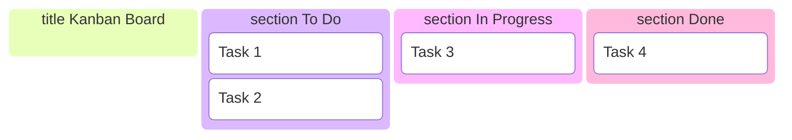
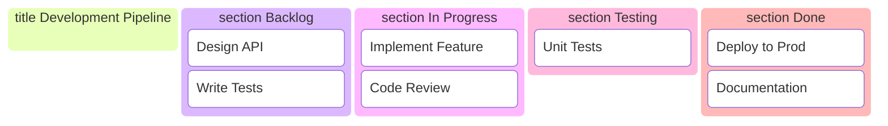
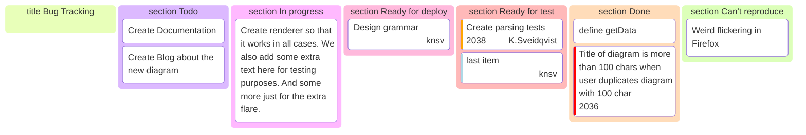

Kanban boards visualize work items across different stages. Perfect for project management, task tracking, and workflow visualization.

## Use Case

Use Kanban boards when you need to:
- Track project tasks
- Visualize workflow stages
- Manage agile sprints
- Show work in progress
- Document process stages

## Code (Basic)

````markdown

````

**Result:**


## Examples

### Example 1: Development Workflow

````markdown

````

**Result:**


### Example 2: Bug Tracking (with IDs and metadata)

````markdown

````

**Result:**


## Notes

- `title` - Optional board title
- `section` - Defines a column/stage
- Tasks can be plain text or `id[Label]` with optional `@{ ... }` metadata
- Keep task names concise

## Gotchas/Warnings

- ⚠️ **Indentation**: Tasks must be indented under their `section`
- ⚠️ **Sections**: Must define sections before tasks
- ⚠️ **IDs**: Use unique IDs when you add metadata (`@{ ... }`)
- ⚠️ **Complexity**: Too many tasks can clutter the board

