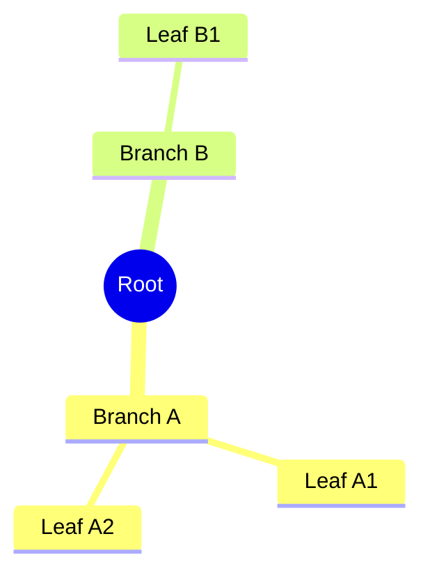
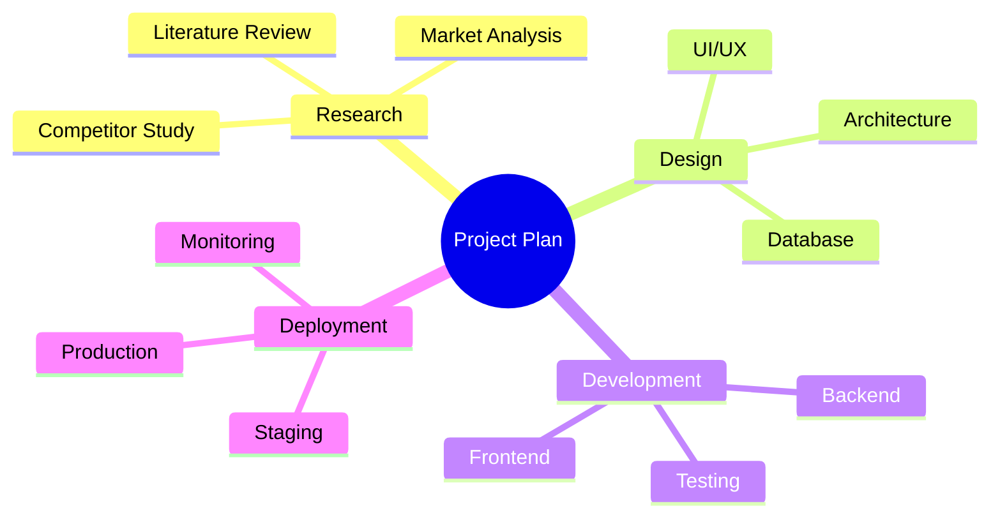
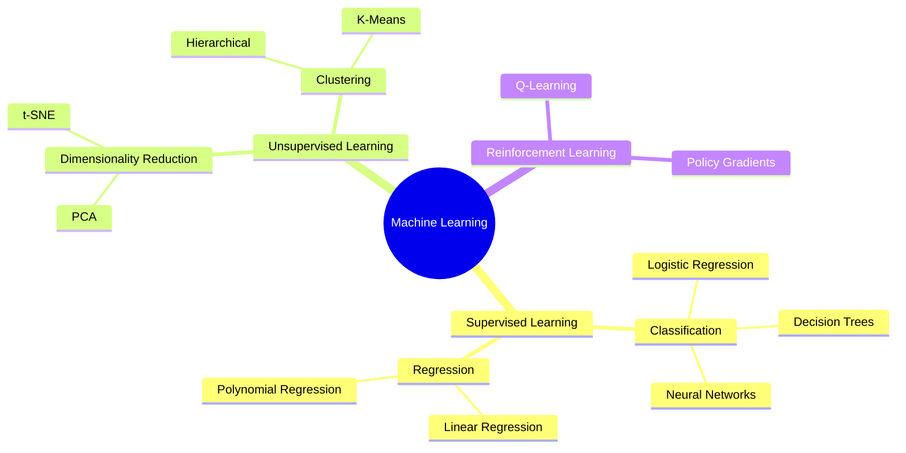

Mindmaps visualize hierarchical information in a radial tree structure. Perfect for brainstorming, organizing ideas, and showing relationships between concepts.

## Use Case

Use mindmaps when you need to:
- Brainstorm ideas
- Organize information hierarchically
- Show concept relationships
- Create knowledge maps
- Visualize topic breakdowns

## Code

````markdown

````

**Result:**


## Explanation

- `mindmap` - Start mindmap diagram
- `((text))` - Root node (double parentheses)
- Indentation creates hierarchy
- Each level is a child of the previous

## Examples

### Example 1: Project Planning

````markdown

````

**Result:**


### Example 2: Learning Path

````markdown

````

**Result:**


## Notes

- Root node uses double parentheses: `((Root))`
- Indentation determines hierarchy (2 spaces per level)
- Keep node names concise
- Can nest multiple levels deep

## Gotchas/Warnings

- ⚠️ **Indentation**: Must be consistent (spaces, not tabs)
- ⚠️ **Root Node**: Must use double parentheses
- ⚠️ **Depth**: Very deep hierarchies can be hard to read
- ⚠️ **Node Names**: Keep short for better visualization

