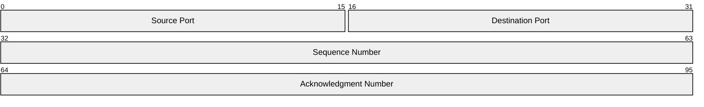
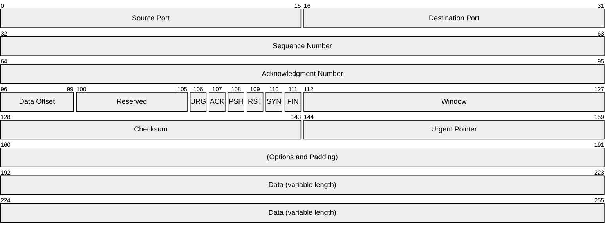
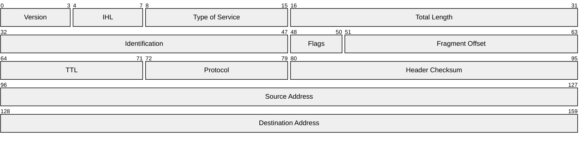
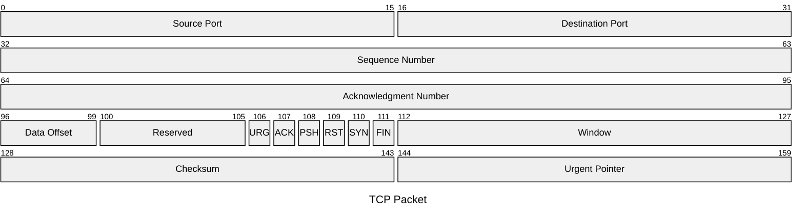

Packet diagrams visualize network packet structures and protocol layers. Perfect for documenting network protocols, packet formats, and communication protocols.

## Use Case

Use packet diagrams when you need to:
- Document network protocols
- Show packet structures
- Visualize protocol layers
- Explain packet formats
- Design communication protocols

## Code

````markdown

````

**Result:**


## Explanation

- `packet` - Start packet diagram
- Format: `start-end: "Field Name"` for bit ranges
- Format: `position: "Field Name"` for single bits
- Field labels must be in quotes
- Fields listed in order from top to bottom

## Examples

### Example 1: TCP Header

````markdown

````

**Result:**


### Example 2: IP Header

````markdown

````

**Result:**


### Example 3: With Title

````markdown

````

**Result:**


## Notes

- Use `packet` keyword (not `packet-beta`)
- Format: `start-end: "Field Name"` for bit ranges
- Format: `position: "Field Name"` for single bits
- Field labels must be in double quotes
- Fields listed in order from top to bottom
- Can include title using frontmatter syntax `---\ntitle: "Title"\n---`

## Gotchas/Warnings

- ⚠️ **Syntax**: Use `packet` (not `packet-beta`)
- ⚠️ **Quotes**: Field labels must be in double quotes
- ⚠️ **Format**: Use `start-end: "name"` for ranges, `position: "name"` for single bits
- ⚠️ **Order**: Fields should be listed sequentially from top to bottom
