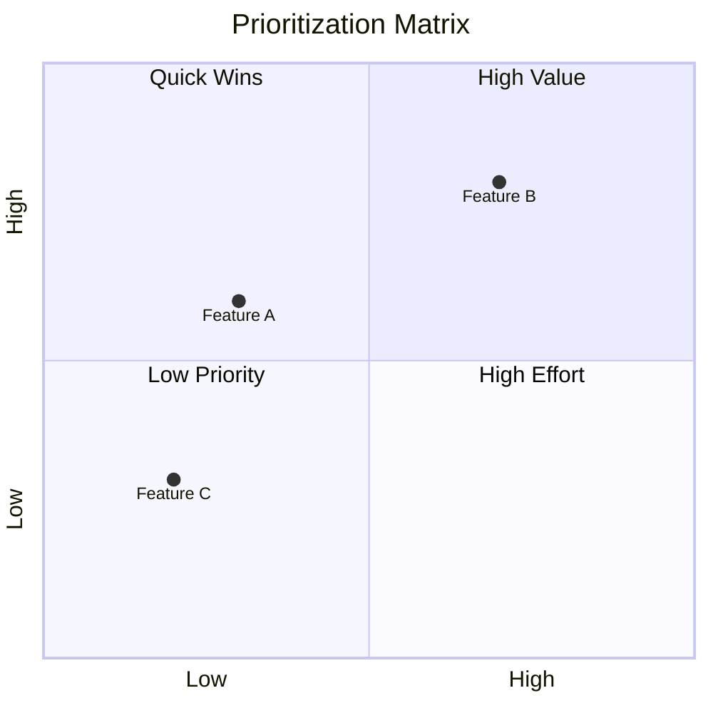
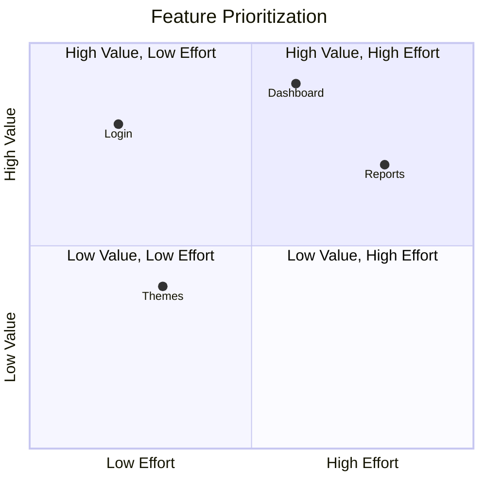
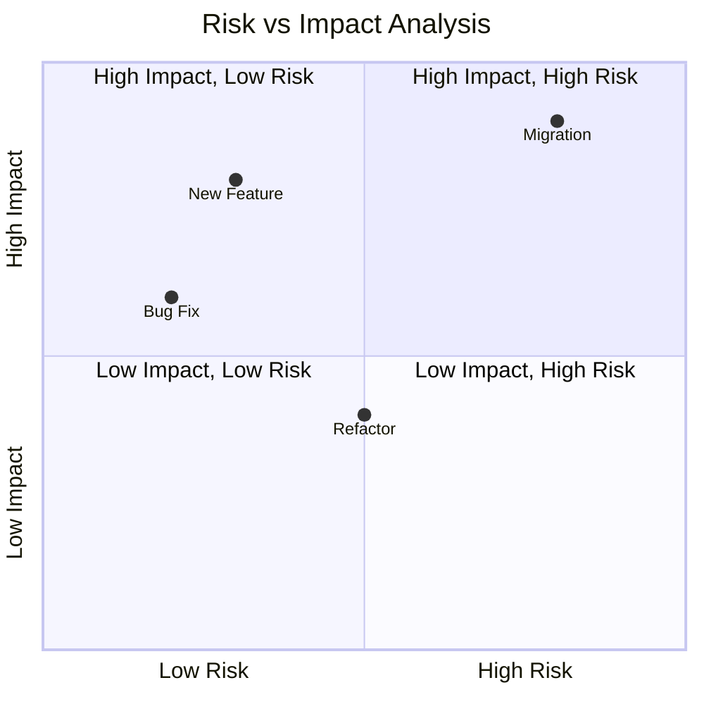

Quadrant charts divide items into four quadrants based on two criteria. Perfect for prioritization matrices, feature planning, and decision-making frameworks.

## Use Case

Use quadrant charts when you need to:
- Prioritize features or tasks
- Create 2x2 decision matrices
- Classify items by two criteria
- Visualize trade-offs
- Make strategic decisions

## Code

````markdown

````

**Result:**


## Examples

### Example 1: Feature Prioritization

````markdown

````

**Result:**


### Example 2: Risk vs Impact

````markdown

````

**Result:**


## Notes

- Coordinates: `[x, y]` where values are 0.0 to 1.0
- Quadrants numbered 1-4 (top-right, top-left, bottom-left, bottom-right)
- Axis labels define the criteria
- Quadrant labels describe each section

## Gotchas/Warnings

- ⚠️ **Coordinates**: Values must be 0.0 to 1.0
- ⚠️ **Quadrants**: Numbered 1-4 starting top-right, clockwise
- ⚠️ **Axes**: Must define both x-axis and y-axis
- ⚠️ **Labels**: Keep quadrant labels concise

