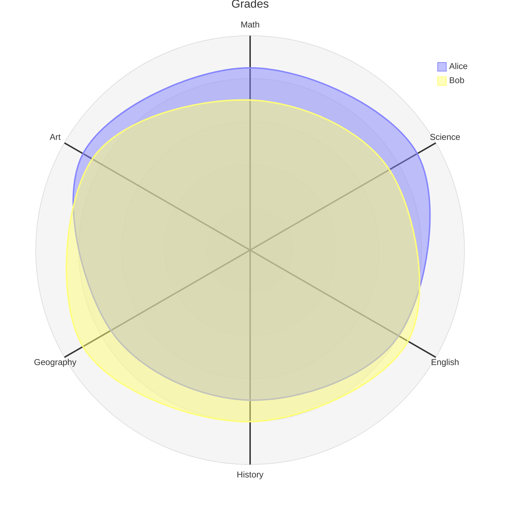

Radar charts (spider charts) compare multiple variables across different categories. Perfect for skill assessments, performance reviews, and multi-dimensional comparisons.

## Use Case

Use radar charts when you need to:
- Compare multiple dimensions
- Show skill profiles
- Visualize performance metrics
- Display multi-attribute comparisons
- Assess capabilities

## Code (Mermaid `radar-beta`)

````markdown

````

**Result:**


## Explanation

- `radar-beta` - Start radar chart (beta diagram type)
- `axis id["Label"]` - Define axes with identifiers and labels
- `curve id["Label"]{v1, v2, ...}` - Define data series with values for each axis
- `max` / `min` - Set numeric range for the chart

## Alternative: Using Chart.js for Radar

If your Mermaid version does not yet support `radar`/`radar-beta`, you can fall back to Chart.js:

```chart
{
  "type": "radar",
  "data": {
    "labels": ["Frontend", "Backend", "DevOps", "Design", "Testing"],
    "datasets": [{
      "label": "Developer A",
      "data": [8, 6, 4, 7, 5],
      "backgroundColor": "rgba(54, 162, 235, 0.2)",
      "borderColor": "rgba(54, 162, 235, 1)"
    }, {
      "label": "Developer B",
      "data": [3, 9, 7, 4, 8],
      "backgroundColor": "rgba(255, 99, 132, 0.2)",
      "borderColor": "rgba(255, 99, 132, 1)"
    }]
  },
  "options": {
    "scales": {
      "r": {
        "beginAtZero": true,
        "max": 10
      }
    }
  }
}
```

## Notes

- `radar` / `radar-beta` are relatively new in Mermaid; make sure you run a recent version
- Axis order must match the value order inside each `curve`
- Use `max`/`min` to keep values in a sensible range

## Gotchas/Warnings

- ⚠️ **Version**: Older Mermaid versions will not recognize `radar`/`radar-beta`
- ⚠️ **Values**: Each `curve` must provide one value per axis
- ⚠️ **Axes**: Axis identifiers must be unique

