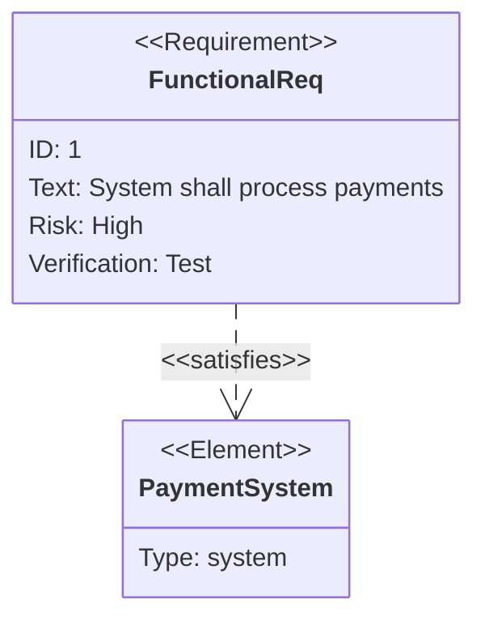

Requirement diagrams visualize system requirements and their relationships. Perfect for documenting functional requirements, tracing requirements, and showing requirement dependencies.

## Use Case

Use requirement diagrams when you need to:
- Document system requirements
- Show requirement relationships
- Trace requirements to design
- Visualize requirement dependencies
- Manage requirement coverage

## Code

````markdown

````

**Result:**


## Examples

### Example 1: System Requirements

````markdown
```mermaid
requirementDiagram
    requirement Req1 {
        id: 1
        text: User authentication required
        risk: high
        verifymethod: test
    }
    
    requirement Req2 {
        id: 2
        text: Data encryption at rest
        risk: high
        verifymethod: inspection
    }
    
    requirement Req3 {
        id: 3
        text: API response time < 200ms
        risk: medium
        verifymethod: test
    }
    
    element AuthSystem {
        type: system
    }
    
    element Database {
        type: system
    }
    
    Req1 - satisfies -> AuthSystem
    Req2 - satisfies -> Database
    Req3 - satisfies -> AuthSystem
```
````

**Result:**

```mermaid
requirementDiagram
    requirement Req1 {
        id: 1
        text: User authentication required
        risk: high
        verifymethod: test
    }
    
    requirement Req2 {
        id: 2
        text: Data encryption at rest
        risk: high
        verifymethod: inspection
    }
    
    requirement Req3 {
        id: 3
        text: API response time < 200ms
        risk: medium
        verifymethod: test
    }
    
    element AuthSystem {
        type: system
    }
    
    element Database {
        type: system
    }
    
    Req1 - satisfies -> AuthSystem
    Req2 - satisfies -> Database
    Req3 - satisfies -> AuthSystem
```

## Requirement Properties

- `id` - Requirement identifier
- `text` - Requirement description
- `risk` - Risk level (high, medium, low)
- `verifymethod` - Verification method (test, inspection, analysis, demonstration)

## Relationship Types

- `- satisfies ->` - Requirement satisfies element
- `- contains ->` - Requirement contains sub-requirement
- `- derives ->` - Requirement derives from another
- `- refines ->` - Requirement refines another

## Notes

- Requirements must have `id` and `text`
- Elements represent system components
- Relationships show requirement traceability
- Use descriptive requirement text

## Gotchas/Warnings

- ⚠️ **Properties**: Must include `id` and `text` in requirements
- ⚠️ **Risk**: Use consistent risk levels
- ⚠️ **Relationships**: Use appropriate relationship types
- ⚠️ **Complexity**: Large requirement diagrams can be hard to maintain

