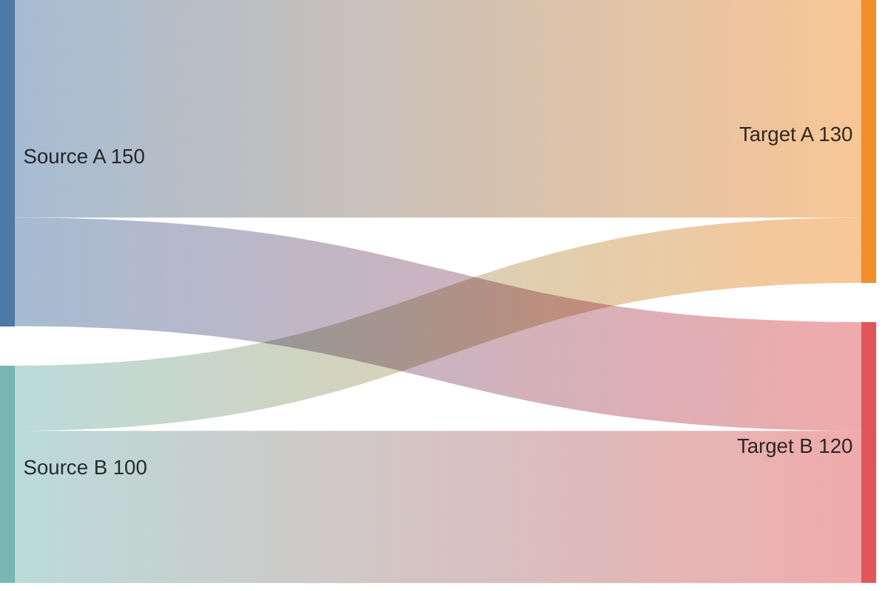
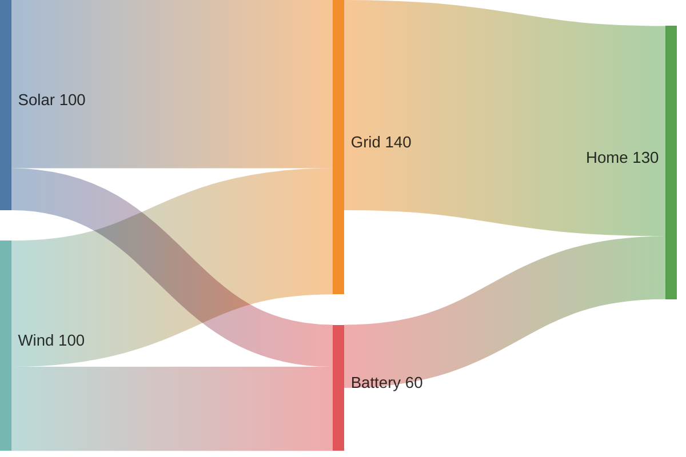
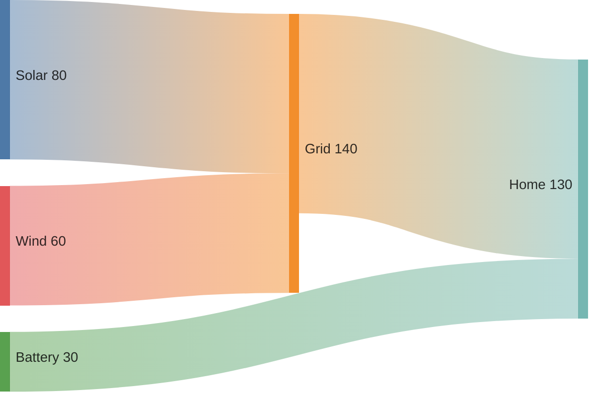
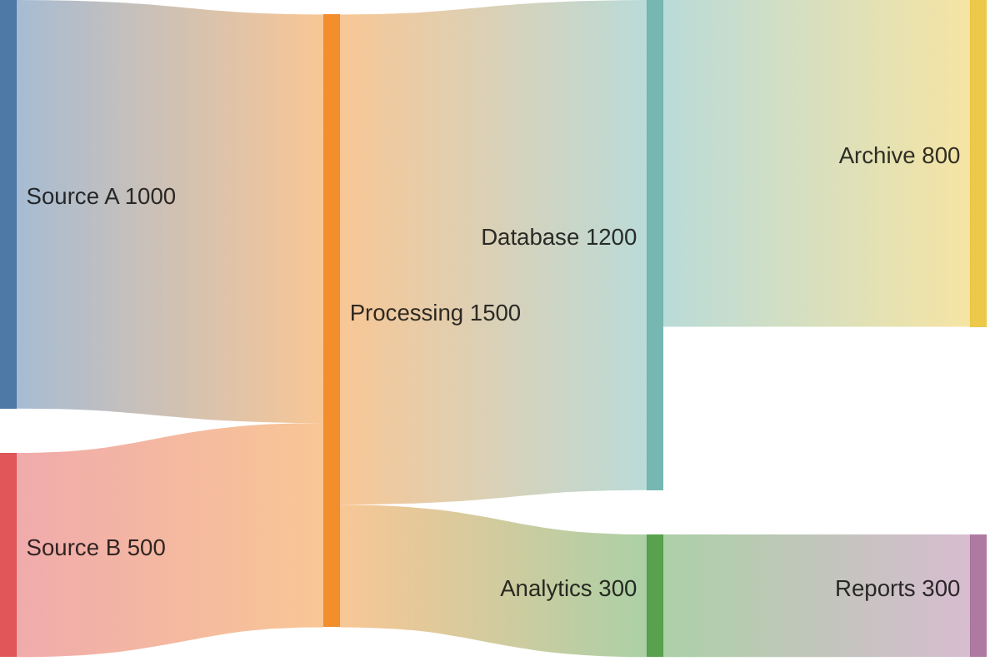
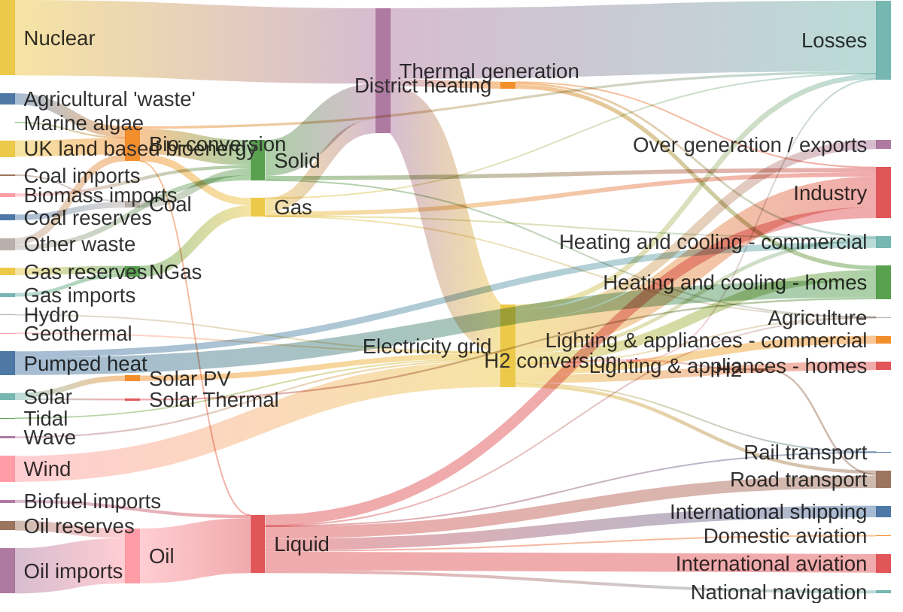

Sankey diagrams show flow between nodes, with link width proportional to flow quantity. Perfect for visualizing energy flows, data transfers, and resource movements.

## Use Case

Use Sankey diagrams when you need to:
- Visualize flow quantities
- Show energy or resource flows
- Display data transfers
- Map process flows
- Visualize conversions

## Code

````markdown

````

**Result:**


## Examples

### Example 1: Energy Flow

````markdown

````

**Result:**



### Example 2: Data Pipeline

````markdown

````

**Result:**


### Example 3: Large Energy System Sankey with Config

You can also provide a diagram-specific config in the frontmatter to control Sankey behaviour, for example to hide numeric values on the links:

````markdown

````

**Result:**


## Notes

- Format: `Source,Target,Value`
- Link width proportional to value
- Nodes auto-created from connections
- Values should be positive numbers
- You can control Sankey behaviour via `config.sankey` frontmatter (for example, `showValues: false` to hide numeric labels)

## Gotchas/Warnings

- ⚠️ **Syntax**: Use `sankey-beta` (experimental)
- ⚠️ **Format**: Must be `Source,Target,Value` (comma-separated)
- ⚠️ **Values**: Should be positive numbers
- ⚠️ **Config**: Frontmatter `config` support depends on your Mermaid integration
- ⚠️ **Beta**: Feature is in beta - syntax may change

