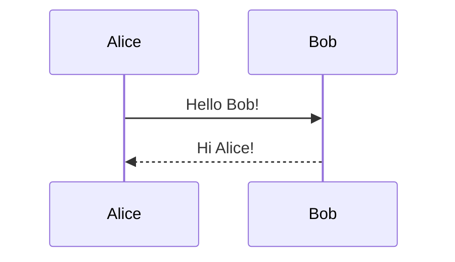
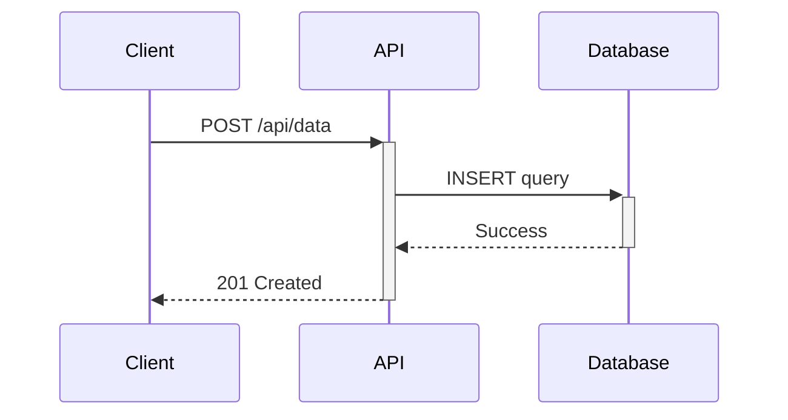
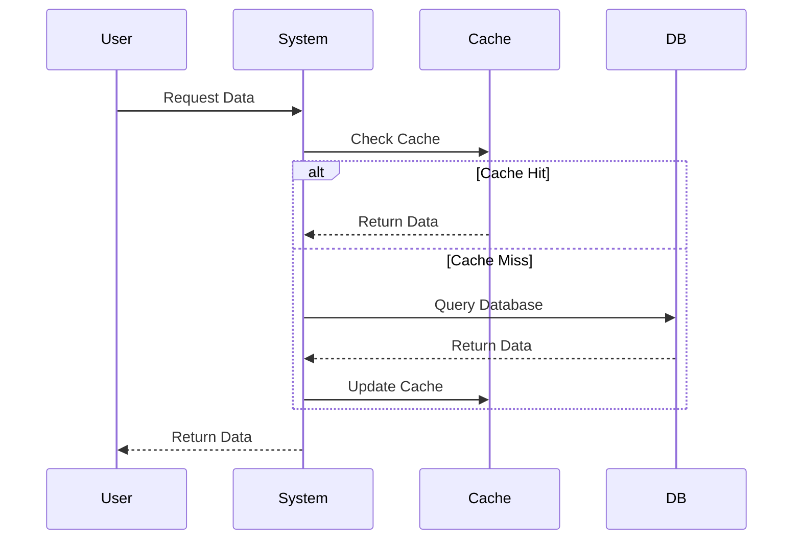
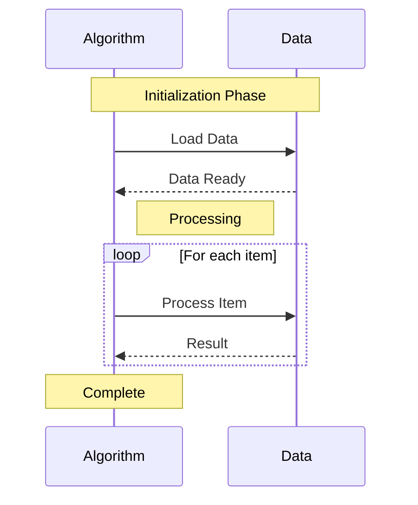

Sequence diagrams show interactions between different components over time. Perfect for documenting API calls, system interactions, and message flows.

## Use Case

Use sequence diagrams when you need to:
- Document API interactions
- Show message passing between components
- Visualize request/response flows
- Map out system communication patterns

## Code

````markdown

````

**Result:**


## Explanation

- `participant` - Define participants (optional, auto-detected)
- `->>` - Solid arrow (synchronous call)
- `-->>` - Dashed arrow (asynchronous return)
- `->>+` - Activate lifeline
- `-->>-` - Deactivate lifeline

## Examples

### Example 1: API Request Flow

````markdown

````

**Result:**


### Example 2: With Loops and Alt

````markdown

````

**Result:**


### Example 3: With Notes

````markdown

````

**Result:**


## Notes

- Use `participant X as Name` for readable aliases
- `Note over A,B: Text` spans multiple participants
- `Note left/right of A: Text` for single participant notes
- Supports `loop`, `alt`, `opt`, `par` blocks

## Gotchas/Warnings

- ⚠️ **Arrow types**: `->>` (solid) vs `-->>` (dashed) - use consistently
- ⚠️ **Activation**: `+` and `-` must be balanced
- ⚠️ **Participant order**: Defined order determines left-to-right placement
- ⚠️ **Long text**: Break long messages into multiple lines with `<br/>`