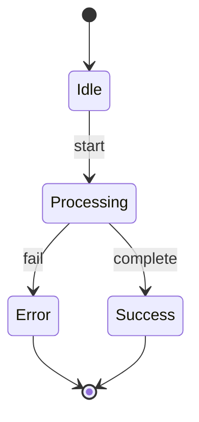
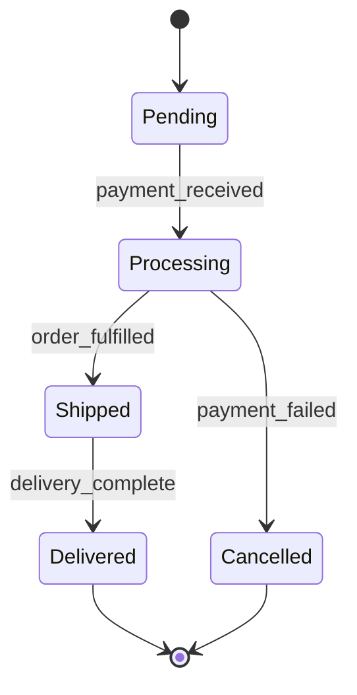
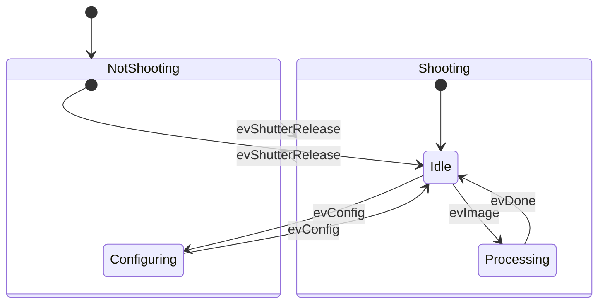
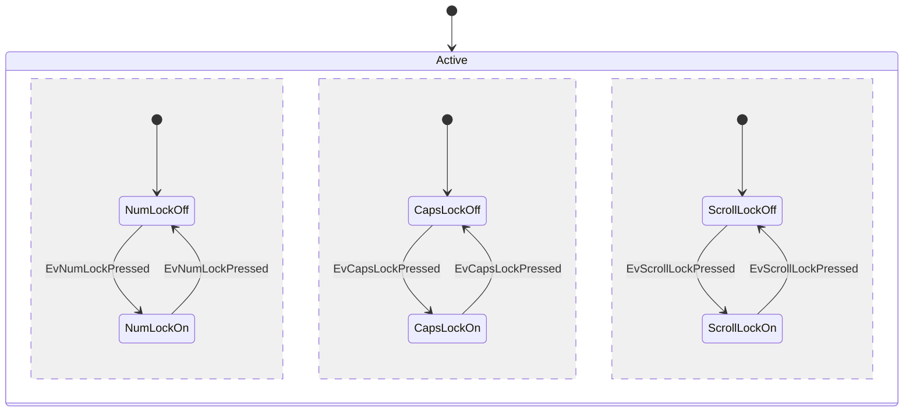

State diagrams visualize the states of a system and transitions between them. Perfect for modeling state machines, workflows, and system behavior.

## Use Case

Use state diagrams when you need to:
- Model state machines
- Document system states and transitions
- Show workflow states
- Visualize state transitions
- Design finite state automata

## Code

````markdown

````

**Result:**


## Explanation

- `stateDiagram-v2` - Modern state diagram syntax
- `[*]` - Start/End state
- `-->` - State transition
- `: label` - Transition label
- States can be simple or composite

## Examples

### Example 1: Order Processing State Machine

````markdown

````

**Result:**


### Example 2: Composite States

````markdown

````

**Result:**


### Example 3: Concurrent States

````markdown

````

**Result:**


## Notes

- Use `stateDiagram-v2` for modern syntax (recommended)
- `[*]` represents start/end states
- Composite states use `state StateName { ... }`
- Concurrent regions use `--` separator
- Transition labels are optional

## Gotchas/Warnings

- ⚠️ **Syntax**: Use `stateDiagram-v2` not `stateDiagram` (deprecated)
- ⚠️ **Start/End**: `[*]` must be used for initial/final states
- ⚠️ **Labels**: Transition labels come after the colon
- ⚠️ **Complexity**: Deeply nested states can be hard to read

