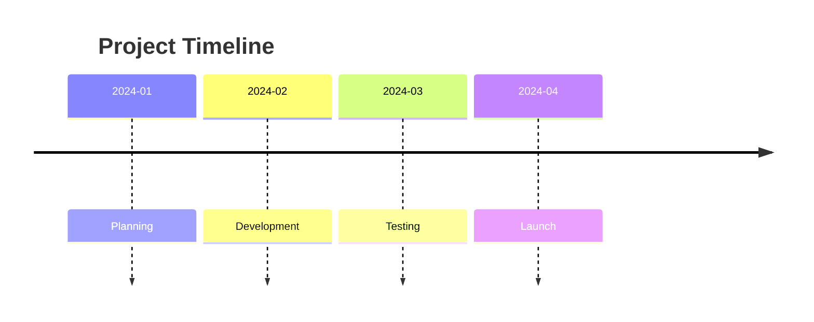
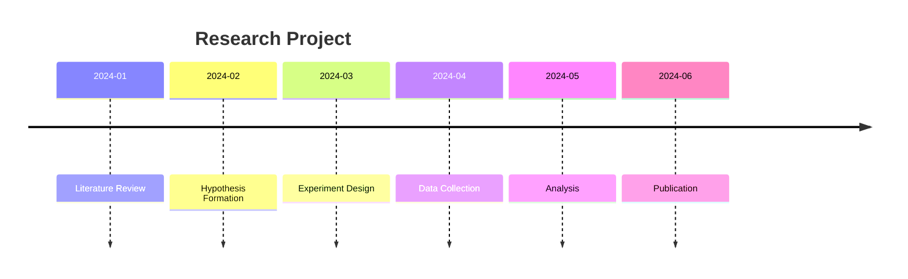
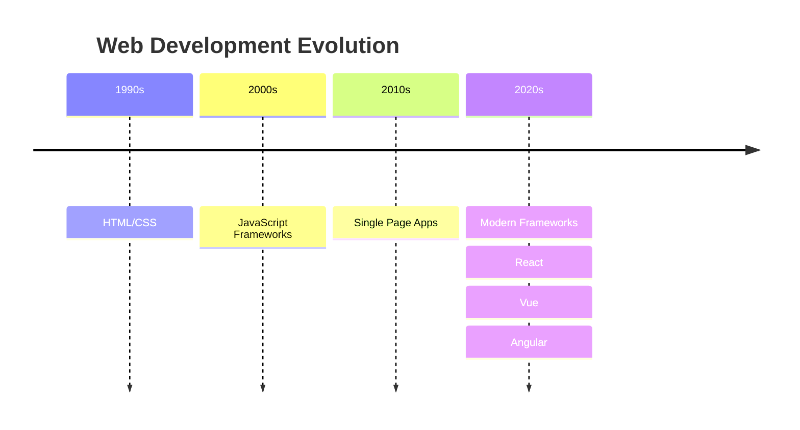

Timeline diagrams show events in chronological order. Perfect for documenting history, project milestones, and event sequences.

## Use Case

Use timelines when you need to:
- Show chronological events
- Document project milestones
- Visualize history
- Track event sequences
- Display temporal relationships

## Code

````markdown

````

**Result:**


## Examples

### Example 1: Project Milestones

````markdown

````

**Result:**


### Example 2: Technology Evolution

````markdown

````

**Result:**


## Notes

- `title` - Optional timeline title
- Format: `Date/Time : Event`
- Can nest events under time periods
- Use indentation for sub-events

## Gotchas/Warnings

- ⚠️ **Format**: Must use `Date : Event` format
- ⚠️ **Chronology**: Events should be in chronological order
- ⚠️ **Nesting**: Use indentation for sub-events
- ⚠️ **Dates**: Can use various date formats

