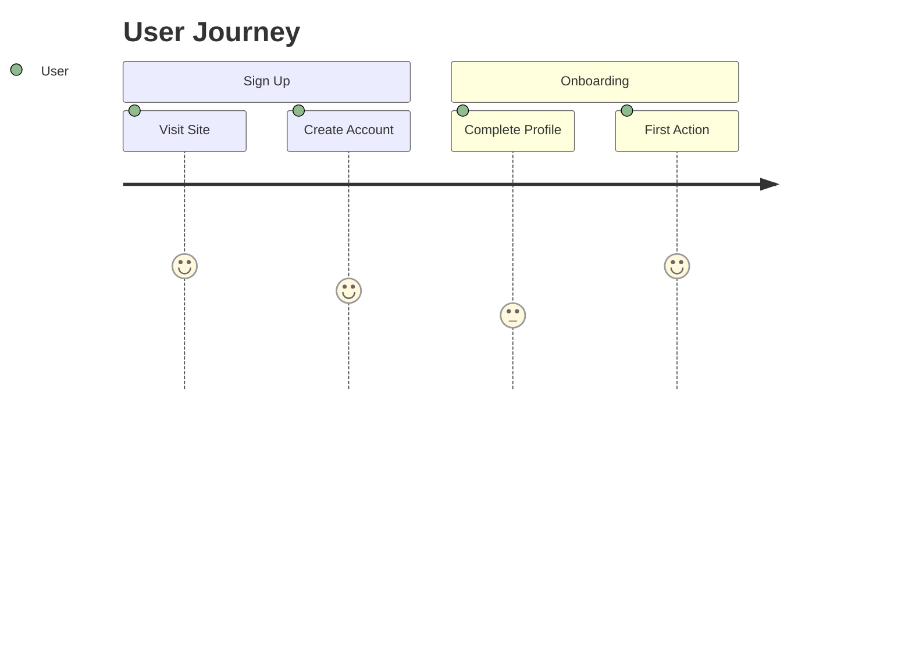
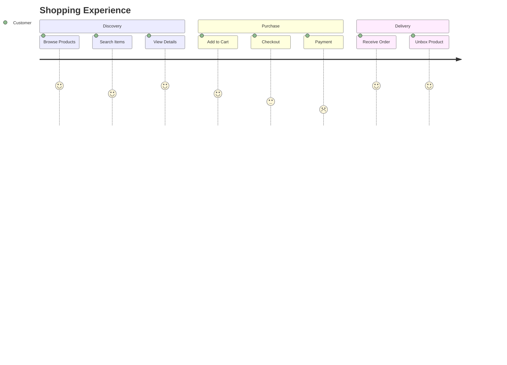
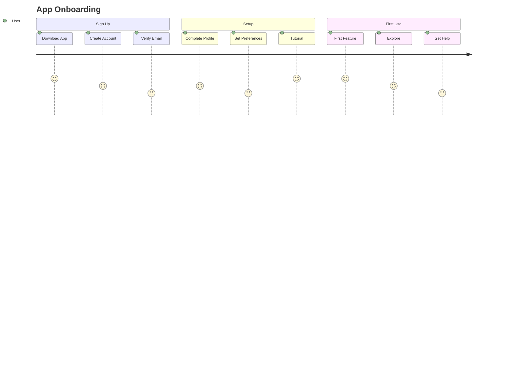

User journey diagrams map the user's experience through a process or system. Perfect for UX design, customer experience mapping, and process optimization.

## Use Case

Use user journey diagrams when you need to:
- Map user experiences
- Design UX flows
- Document customer journeys
- Identify pain points
- Optimize user flows

## Code

````markdown

````

**Result:**


## Explanation

- `journey` - Start user journey diagram
- `title` - Journey title
- `section` - Major phase of journey
- `Task: Score: Actor` - Task format
- Score: 1-5 (satisfaction/importance)

## Examples

### Example 1: E-Commerce Purchase

````markdown

````

**Result:**


### Example 2: Application Onboarding

````markdown

````

**Result:**


## Notes

- Score range: 1-5 (typically satisfaction or importance)
- Actor identifies who performs the task
- Sections group related tasks
- Use descriptive task names

## Gotchas/Warnings

- ⚠️ **Format**: Must use `Task: Score: Actor` format
- ⚠️ **Score**: Must be 1-5 (integer)
- ⚠️ **Sections**: Group related tasks logically
- ⚠️ **Actor**: Keep actor names consistent

