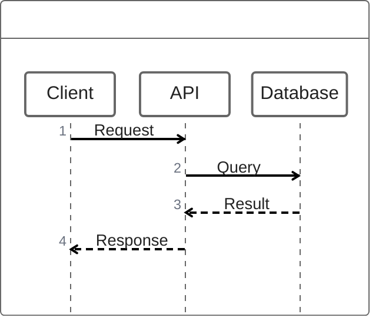
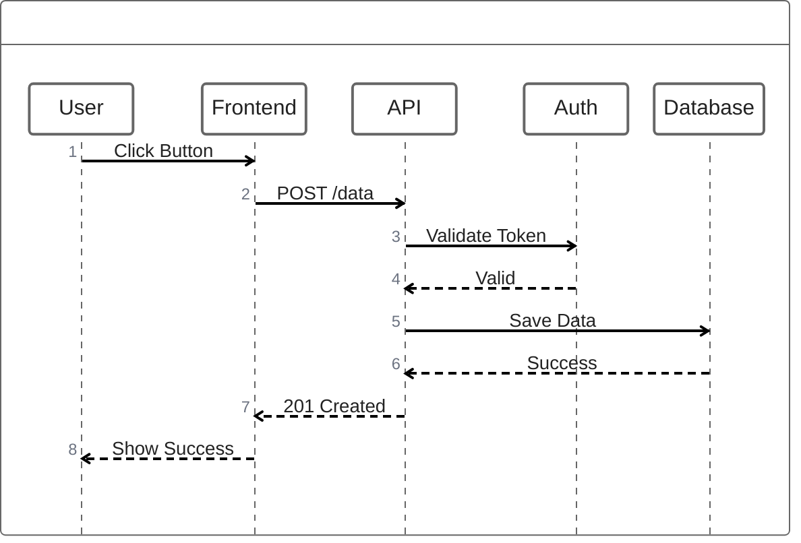
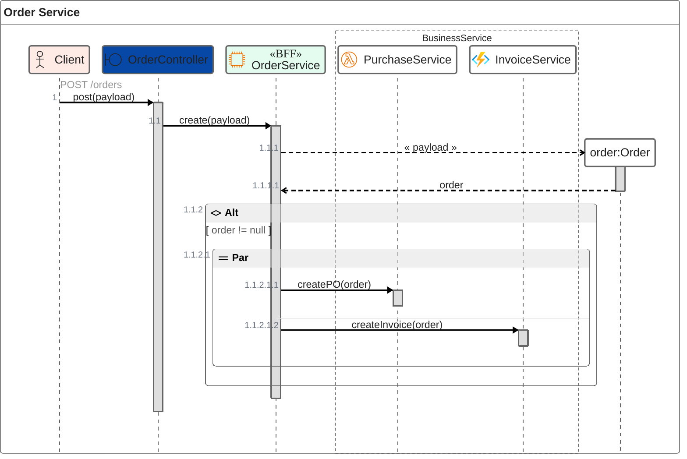

ZenUML provides an alternative syntax for sequence diagrams, offering more concise notation. Perfect for complex sequence diagrams with less verbosity.

## Use Case

Use ZenUML when you need to:
- Create concise sequence diagrams
- Show complex interactions
- Document API flows
- Visualize method calls
- Use alternative sequence syntax

## Code

````markdown

````

**Result:**


## Examples

### Example 1: API Flow

````markdown

````

**Result:**


### Example 2: Decorators, Groups, and Blocks

````markdown

````

**Result:**


## Notes

- `zenuml` - Start ZenUML diagram
- `->` - Synchronous call, `-->` - Return/response
- `title` - Diagram title
- Decorators like `@Actor`, `@Boundary`, `@EC2`, `@Lambda`, `@AzureFunction` declare participants with types and optional colors
- `group Name { ... }` - Logical group of related participants
- `@Starter(Participant)` - Entry point
- Blocks (`{ ... }`), `if (...) { ... }`, and `par { ... }` describe control flow, conditions, and parallel execution

## Gotchas/Warnings

- ⚠️ **Syntax**: ZenUML syntax differs significantly from standard Mermaid `sequenceDiagram`
- ⚠️ **Support**: ZenUML support in Mermaid may be limited or behind a feature flag in some versions
- ⚠️ **Fallback**: Use standard `sequenceDiagram` if `zenuml` does not render in your environment
- ⚠️ **Versioning**: Check current Mermaid / ZenUML docs for any syntax changes

