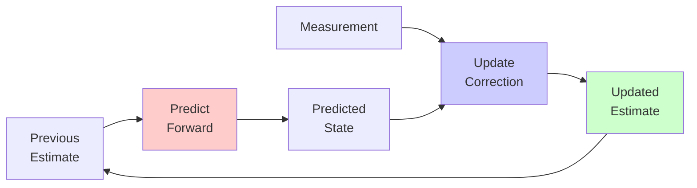

Visual guide to the Kalman Filter - optimal recursive estimator for linear systems with Gaussian noise.

---

## Intuition

The Kalman Filter combines two sources of information:
1. **Prediction** from a model (physics/dynamics)
2. **Measurement** from sensors (noisy observations)

It finds the optimal balance between trusting the model vs trusting the sensors.



---

## Two-Step Process

### Step 1: Predict (Time Update)

Use physics/model to predict where we'll be next.

```p5js
sketch.setup = function() {
  sketch.createCanvas(800, 400);
  sketch.noLoop();
}

sketch.draw = function() {
  sketch.background(255);
  
  // Title
  sketch.fill(0);
  sketch.textSize(18);
  sketch.textAlign(sketch.CENTER);
  sketch.text('Step 1: PREDICT - Use Model to Forecast', sketch.width/2, 30);
  
  const y = sketch.height / 2;
  const x1 = 150;
  const x2 = 400;
  const x3 = 650;
  
  // Previous estimate (tight uncertainty)
  drawGaussian(x1, y, 30, [0, 200, 0], 'Previous\nEstimate\n(t-1)');
  
  // Arrow
  sketch.stroke(0);
  sketch.strokeWeight(2);
  sketch.fill(0);
  arrow(x1 + 80, y, x2 - 80, y);
  
  // Model prediction
  sketch.fill(0);
  sketch.noStroke();
  sketch.textSize(14);
  sketch.text('Apply Model\nF·x + noise', (x1 + x2) / 2, y - 60);
  
  // Predicted estimate (wider uncertainty)
  drawGaussian(x2, y, 50, [255, 0, 0], 'Predicted\nEstimate\n(t|t-1)');
  
  // Explanation
  sketch.fill(100);
  sketch.textSize(13);
  sketch.textAlign(sketch.CENTER);
  sketch.text('Uncertainty INCREASES (model is imperfect)', sketch.width/2, sketch.height - 40);
  sketch.text('Prediction: x̂ₖ|ₖ₋₁ = F·x̂ₖ₋₁ + B·uₖ', sketch.width/2, sketch.height - 20);
}

function drawGaussian(x, y, sigma, color, label) {
  // Draw bell curve
  sketch.fill(...color, 100);
  sketch.stroke(...color);
  sketch.strokeWeight(2);
  sketch.beginShape();
  for (let i = -100; i <= 100; i++) {
    let dx = i;
    let dy = 80 * Math.exp(-(dx * dx) / (2 * sigma * sigma));
    sketch.vertex(x + dx, y - dy);
  }
  sketch.vertex(x + 100, y);
  sketch.vertex(x - 100, y);
  sketch.endShape(sketch.CLOSE);
  
  // Center line
  sketch.stroke(...color);
  sketch.strokeWeight(2);
  sketch.line(x, y - 85, x, y);
  
  // Label
  sketch.fill(0);
  sketch.noStroke();
  sketch.textSize(12);
  sketch.textAlign(sketch.CENTER);
  let lines = label.split('\n');
  for (let i = 0; i < lines.length; i++) {
    sketch.text(lines[i], x, y + 30 + i * 15);
  }
}

function arrow(x1, y1, x2, y2) {
  sketch.line(x1, y1, x2, y2);
  sketch.push();
  sketch.translate(x2, y2);
  let angle = sketch.atan2(y2 - y1, x2 - x1);
  sketch.rotate(angle);
  sketch.line(0, 0, -10, -5);
  sketch.line(0, 0, -10, 5);
  sketch.pop();
}
```

### Step 2: Update (Measurement Update)

Correct prediction using sensor measurement.

```p5js
sketch.setup = function() {
  sketch.createCanvas(800, 450);
  sketch.noLoop();
}

sketch.draw = function() {
  sketch.background(255);
  
  // Title
  sketch.fill(0);
  sketch.textSize(18);
  sketch.textAlign(sketch.CENTER);
  sketch.text('Step 2: UPDATE - Correct with Measurement', sketch.width/2, 30);
  
  const y = sketch.height / 2;
  const x1 = 120;
  const x2 = 300;
  const x3 = 550;
  
  // Prediction (wide uncertainty)
  drawGaussian(x1, y, 50, [255, 0, 0], 'Prediction\n(Model)');
  
  // Measurement (different mean, medium uncertainty)
  drawGaussian(x2, y - 20, 35, [0, 0, 255], 'Measurement\n(Sensor)');
  
  // Plus sign
  sketch.fill(0);
  sketch.noStroke();
  sketch.textSize(24);
  sketch.text('+', (x1 + x2) / 2, y - 20);
  
  // Arrow
  sketch.stroke(0);
  sketch.strokeWeight(2);
  sketch.fill(0);
  arrow(x2 + 80, y, x3 - 80, y);
  
  // Updated estimate (tighter uncertainty, between the two)
  drawGaussian(x3, y - 10, 25, [0, 200, 0], 'Updated\nEstimate');
  
  // Kalman gain explanation
  sketch.fill(100);
  sketch.textSize(13);
  sketch.textAlign(sketch.CENTER);
  sketch.text('Kalman Gain K determines how much to trust measurement vs prediction', sketch.width/2, sketch.height - 60);
  sketch.text('Uncertainty DECREASES (we have more information)', sketch.width/2, sketch.height - 40);
  sketch.text('Update: x̂ₖ|ₖ = x̂ₖ|ₖ₋₁ + K·(zₖ - H·x̂ₖ|ₖ₋₁)', sketch.width/2, sketch.height - 20);
}

function drawGaussian(x, y, sigma, color, label) {
  sketch.fill(...color, 100);
  sketch.stroke(...color);
  sketch.strokeWeight(2);
  sketch.beginShape();
  for (let i = -100; i <= 100; i++) {
    let dx = i;
    let dy = 80 * Math.exp(-(dx * dx) / (2 * sigma * sigma));
    sketch.vertex(x + dx, y - dy);
  }
  sketch.vertex(x + 100, y);
  sketch.vertex(x - 100, y);
  sketch.endShape(sketch.CLOSE);
  
  sketch.stroke(...color);
  sketch.strokeWeight(2);
  sketch.line(x, y - 85, x, y);
  
  sketch.fill(0);
  sketch.noStroke();
  sketch.textSize(12);
  sketch.textAlign(sketch.CENTER);
  let lines = label.split('\n');
  for (let i = 0; i < lines.length; i++) {
    sketch.text(lines[i], x, y + 30 + i * 15);
  }
}

function arrow(x1, y1, x2, y2) {
  sketch.line(x1, y1, x2, y2);
  sketch.push();
  sketch.translate(x2, y2);
  let angle = sketch.atan2(y2 - y1, x2 - x1);
  sketch.rotate(angle);
  sketch.line(0, 0, -10, -5);
  sketch.line(0, 0, -10, 5);
  sketch.pop();
}
```

---

## Interactive Simulation: 1D Position Tracking

```p5js
let truePos = 0;
let trueVel = 2;
let estPos = 0;
let estVel = 2;
let P = [[100, 0], [0, 100]];  // Covariance matrix
let time = 0;
let history = [];
let running = false;

// Kalman filter parameters
const dt = 0.1;
const processNoise = 0.1;
const measurementNoise = 5;

sketch.setup = function() {
  sketch.createCanvas(800, 600);
  
  let startBtn = sketch.createButton('Start');
  startBtn.position(20, 620);
  startBtn.mousePressed(() => { running = true; sketch.loop(); });
  
  let pauseBtn = sketch.createButton('Pause');
  pauseBtn.position(100, 620);
  pauseBtn.mousePressed(() => { running = false; sketch.noLoop(); });
  
  let resetBtn = sketch.createButton('Reset');
  resetBtn.position(170, 620);
  resetBtn.mousePressed(reset);
  
  sketch.frameRate(10);
  sketch.noLoop();
}

function reset() {
  truePos = 0;
  trueVel = 2;
  estPos = 0;
  estVel = 2;
  P = [[100, 0], [0, 100]];
  time = 0;
  history = [];
  running = false;
}

sketch.draw = function() {
  sketch.background(255);
  
  if (running) {
    // Update true position (with some random acceleration)
    trueVel += sketch.randomGaussian(0, 0.1);
    truePos += trueVel * dt;
    
    // Kalman Filter: PREDICT
    let predPos = estPos + estVel * dt;
    let predVel = estVel;
    
    // Predict covariance
    let F = [[1, dt], [0, 1]];
    let Q = [[processNoise, 0], [0, processNoise]];
    P = matAdd(matMult(matMult(F, P), transpose(F)), Q);
    
    // Simulate noisy measurement
    let measurement = truePos + sketch.randomGaussian(0, measurementNoise);
    
    // Kalman Filter: UPDATE
    let H = [[1, 0]];
    let R = [[measurementNoise * measurementNoise]];
    
    // Innovation
    let y = measurement - predPos;
    
    // Innovation covariance
    let S = matAdd(matMult(matMult(H, P), transpose(H)), R)[0][0];
    
    // Kalman gain
    let K = [[P[0][0] / S], [P[1][0] / S]];
    
    // Update estimate
    estPos = predPos + K[0][0] * y;
    estVel = predVel + K[1][0] * y;
    
    // Update covariance
    let I = [[1, 0], [0, 1]];
    let KH = [[K[0][0], 0], [K[1][0], 0]];
    P = matMult(matSub(I, KH), P);
    
    // Store history
    history.push({
      time: time,
      true: truePos,
      measured: measurement,
      estimated: estPos,
      uncertainty: sketch.sqrt(P[0][0])
    });
    
    if (history.length > 300) {
      history.shift();
    }
    
    time += dt;
  }
  
  // Draw graph
  drawGraph();
  
  // Draw current state
  drawCurrentState();
}

function drawGraph() {
  const margin = 50;
  const w = sketch.width - 2 * margin;
  const h = 350;
  
  // Axes
  sketch.stroke(0);
  sketch.strokeWeight(1);
  sketch.line(margin, margin + h, margin + w, margin + h);
  sketch.line(margin, margin, margin, margin + h);
  
  // Labels
  sketch.fill(0);
  sketch.noStroke();
  sketch.textSize(14);
  sketch.textAlign(sketch.CENTER);
  sketch.text('Position over Time', sketch.width/2, 30);
  sketch.text('Time', sketch.width/2, margin + h + 35);
  
  if (history.length < 2) return;
  
  // Find range
  let minPos = sketch.min(history.map(h => h.true));
  let maxPos = sketch.max(history.map(h => h.true));
  let range = maxPos - minPos;
  if (range < 10) range = 10;
  
  // Draw uncertainty band
  sketch.fill(0, 255, 0, 30);
  sketch.noStroke();
  sketch.beginShape();
  for (let i = 0; i < history.length; i++) {
    let x = margin + (i / history.length) * w;
    let y = margin + h - ((history[i].estimated + history[i].uncertainty - minPos) / range) * h;
    sketch.vertex(x, y);
  }
  for (let i = history.length - 1; i >= 0; i--) {
    let x = margin + (i / history.length) * w;
    let y = margin + h - ((history[i].estimated - history[i].uncertainty - minPos) / range) * h;
    sketch.vertex(x, y);
  }
  sketch.endShape(sketch.CLOSE);
  
  // Draw lines
  // True position
  sketch.stroke(0, 0, 255);
  sketch.strokeWeight(2);
  sketch.noFill();
  sketch.beginShape();
  for (let i = 0; i < history.length; i++) {
    let x = margin + (i / history.length) * w;
    let y = margin + h - ((history[i].true - minPos) / range) * h;
    sketch.vertex(x, y);
  }
  sketch.endShape();
  
  // Measurements (noisy)
  sketch.stroke(255, 0, 0, 100);
  sketch.strokeWeight(1);
  for (let i = 0; i < history.length; i++) {
    let x = margin + (i / history.length) * w;
    let y = margin + h - ((history[i].measured - minPos) / range) * h;
    sketch.point(x, y);
  }
  
  // Kalman estimate
  sketch.stroke(0, 200, 0);
  sketch.strokeWeight(3);
  sketch.noFill();
  sketch.beginShape();
  for (let i = 0; i < history.length; i++) {
    let x = margin + (i / history.length) * w;
    let y = margin + h - ((history[i].estimated - minPos) / range) * h;
    sketch.vertex(x, y);
  }
  sketch.endShape();
  
  // Legend
  sketch.noStroke();
  sketch.fill(0, 0, 255);
  sketch.rect(margin, margin + h + 50, 20, 3);
  sketch.fill(0);
  sketch.textAlign(sketch.LEFT);
  sketch.text('True Position', margin + 25, margin + h + 53);
  
  sketch.fill(255, 0, 0);
  sketch.rect(margin + 150, margin + h + 50, 20, 3);
  sketch.fill(0);
  sketch.text('Noisy Measurements', margin + 175, margin + h + 53);
  
  sketch.fill(0, 200, 0);
  sketch.rect(margin + 350, margin + h + 50, 20, 3);
  sketch.fill(0);
  sketch.text('Kalman Estimate', margin + 375, margin + h + 53);
  
  sketch.fill(0, 255, 0, 100);
  sketch.rect(margin + 550, margin + h + 50, 20, 10);
  sketch.fill(0);
  sketch.text('Uncertainty', margin + 575, margin + h + 53);
}

function drawCurrentState() {
  const y = 480;
  
  sketch.fill(0);
  sketch.noStroke();
  sketch.textSize(14);
  sketch.textAlign(sketch.LEFT);
  sketch.text(`Time: ${time.toFixed(1)}s`, 50, y);
  sketch.text(`True Pos: ${truePos.toFixed(2)}`, 50, y + 20);
  sketch.text(`Est. Pos: ${estPos.toFixed(2)}`, 50, y + 40);
  sketch.text(`Error: ${sketch.abs(truePos - estPos).toFixed(2)}`, 50, y + 60);
  sketch.text(`Uncertainty (σ): ${sketch.sqrt(P[0][0]).toFixed(2)}`, 50, y + 80);
  
  sketch.text(`True Vel: ${trueVel.toFixed(2)}`, 300, y + 20);
  sketch.text(`Est. Vel: ${estVel.toFixed(2)}`, 300, y + 40);
}

// Matrix operations
function matMult(A, B) {
  let result = [];
  for (let i = 0; i < A.length; i++) {
    result[i] = [];
    for (let j = 0; j < B[0].length; j++) {
      let sum = 0;
      for (let k = 0; k < B.length; k++) {
        sum += A[i][k] * B[k][j];
      }
      result[i][j] = sum;
    }
  }
  return result;
}

function matAdd(A, B) {
  let result = [];
  for (let i = 0; i < A.length; i++) {
    result[i] = [];
    for (let j = 0; j < A[0].length; j++) {
      result[i][j] = A[i][j] + B[i][j];
    }
  }
  return result;
}

function matSub(A, B) {
  let result = [];
  for (let i = 0; i < A.length; i++) {
    result[i] = [];
    for (let j = 0; j < A[0].length; j++) {
      result[i][j] = A[i][j] - B[i][j];
    }
  }
  return result;
}

function transpose(A) {
  let result = [];
  for (let j = 0; j < A[0].length; j++) {
    result[j] = [];
    for (let i = 0; i < A.length; i++) {
      result[j][i] = A[i][j];
    }
  }
  return result;
}
```

---

## State Space Model

**Prediction**:
$$
\hat{x}_{k|k-1} = F_k \hat{x}_{k-1|k-1} + B_k u_k
$$

$$
P_{k|k-1} = F_k P_{k-1|k-1} F_k^T + Q_k
$$

**Update**:
$$
K_k = P_{k|k-1} H_k^T (H_k P_{k|k-1} H_k^T + R_k)^{-1}
$$

$$
\hat{x}_{k|k} = \hat{x}_{k|k-1} + K_k (z_k - H_k \hat{x}_{k|k-1})
$$

$$
P_{k|k} = (I - K_k H_k) P_{k|k-1}
$$

## Python Implementation

```python
import numpy as np

class KalmanFilter:
    def __init__(self, F, H, Q, R, x0, P0):
        """
        F: State transition matrix
        H: Observation matrix
        Q: Process noise covariance
        R: Measurement noise covariance
        x0: Initial state estimate
        P0: Initial covariance estimate
        """
        self.F = F
        self.H = H
        self.Q = Q
        self.R = R
        self.x = x0
        self.P = P0
    
    def predict(self, u=None):
        """Prediction step"""
        self.x = self.F @ self.x
        if u is not None:
            self.x += self.B @ u
        self.P = self.F @ self.P @ self.F.T + self.Q
    
    def update(self, z):
        """Update step with measurement z"""
        # Innovation
        y = z - self.H @ self.x
        
        # Innovation covariance
        S = self.H @ self.P @ self.H.T + self.R
        
        # Kalman gain
        K = self.P @ self.H.T @ np.linalg.inv(S)
        
        # Update state
        self.x = self.x + K @ y
        
        # Update covariance
        self.P = (np.eye(len(self.x)) - K @ self.H) @ self.P
        
        return self.x

# Example: 1D position tracking
dt = 0.1
F = np.array([[1, dt], [0, 1]])  # [position, velocity]
H = np.array([[1, 0]])  # Measure position only
Q = np.eye(2) * 0.01  # Process noise
R = np.array([[1.0]])  # Measurement noise

kf = KalmanFilter(F, H, Q, R, x0=np.array([0, 0]), P0=np.eye(2))

# Process measurements
for measurement in measurements:
    kf.predict()
    estimate = kf.update(measurement)
```

## Applications

- GPS/IMU sensor fusion
- Object tracking
- Robot localization
- Economic forecasting

## Further Reading

- [Kalman Filter - Wikipedia](https://en.wikipedia.org/wiki/Kalman_filter)
- [Extended Kalman Filter](https://en.wikipedia.org/wiki/Extended_Kalman_filter) for non-linear systems

