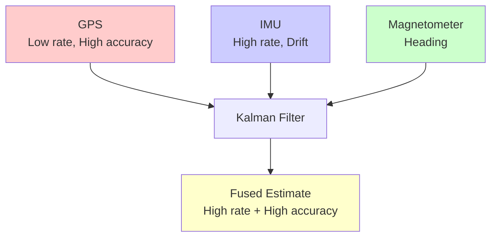
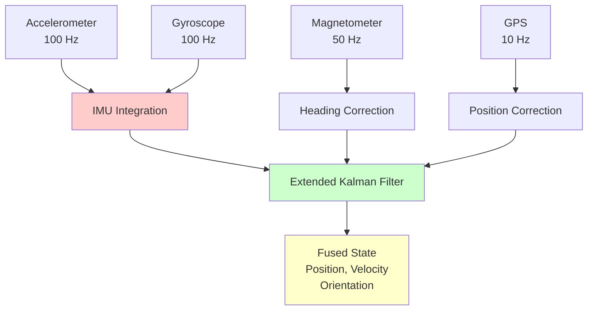

Comprehensive guide to sensor fusion using Kalman filters for combining data from multiple sensors.

---

## What is Sensor Fusion?

**Sensor Fusion**: Combining data from multiple sensors to produce more accurate, reliable, and complete information than any single sensor alone.



---

## Why Fuse Sensors?

### Individual Sensor Limitations

| Sensor | Advantages | Disadvantages |
|--------|------------|---------------|
| **GPS** | Absolute position, No drift | Low rate (1-10 Hz), Noisy, Dropouts |
| **IMU** | High rate (100+ Hz), Smooth | Drift over time, No absolute reference |
| **Magnetometer** | Absolute heading | Magnetic interference |
| **Barometer** | Altitude | Affected by weather |

### Fusion Benefits

- **Complementary strengths**: Each sensor compensates for others' weaknesses
- **Increased accuracy**: Statistical combination reduces noise
- **Robustness**: System works even if one sensor fails
- **Higher update rate**: Fast sensors fill gaps from slow sensors

---

## GPS + IMU Fusion

Most common sensor fusion application: combining GPS (slow, accurate) with IMU (fast, drifting).

### State Vector

$$
\mathbf{x} = \begin{bmatrix}
p_x \\ p_y \\ p_z \\
v_x \\ v_y \\ v_z \\
\phi \\ \theta \\ \psi
\end{bmatrix}
\quad
\begin{aligned}
&\text{Position} \\
&\text{Velocity} \\
&\text{Orientation (roll, pitch, yaw)}
\end{aligned}
$$

### Prediction (IMU)

Use accelerometer and gyroscope at high rate (100-1000 Hz):

$$
\begin{aligned}
\mathbf{p}_{k+1} &= \mathbf{p}_k + \mathbf{v}_k \Delta t + \frac{1}{2}\mathbf{a}_k \Delta t^2 \\
\mathbf{v}_{k+1} &= \mathbf{v}_k + \mathbf{a}_k \Delta t \\
\boldsymbol{\theta}_{k+1} &= \boldsymbol{\theta}_k + \boldsymbol{\omega}_k \Delta t
\end{aligned}
$$

### Update (GPS)

Correct with GPS at low rate (1-10 Hz):

$$
\mathbf{z}_{GPS} = \begin{bmatrix} p_x \\ p_y \\ p_z \end{bmatrix}
$$

---

## Interactive GPS+IMU Fusion

```p5js
let truePos, trueVel;
let estPos, estVel;
let P;
let time = 0;
let history = [];
let running = false;

// Parameters
const dt = 0.01;  // 100 Hz IMU
const gpsRate = 10;  // 10 Hz GPS (every 10 IMU steps)
let gpsCounter = 0;

// Noise parameters
const imuAccelNoise = 0.5;
const imuGyroNoise = 0.1;
const gpsNoise = 2.0;
const processNoise = 0.1;

sketch.setup = function() {
  sketch.createCanvas(800, 650);
  
  let startBtn = sketch.createButton('Start');
  startBtn.position(20, 670);
  startBtn.mousePressed(() => { running = true; sketch.loop(); });
  
  let pauseBtn = sketch.createButton('Pause');
  pauseBtn.position(100, 670);
  pauseBtn.mousePressed(() => { running = false; sketch.noLoop(); });
  
  let resetBtn = sketch.createButton('Reset');
  resetBtn.position(170, 670);
  resetBtn.mousePressed(reset);
  
  reset();
  sketch.frameRate(50);
  sketch.noLoop();
}

function reset() {
  truePos = sketch.createVector(50, 300);
  trueVel = sketch.createVector(2, 0);
  estPos = sketch.createVector(50, 300);
  estVel = sketch.createVector(2, 0);
  
  // Covariance matrix (position and velocity)
  P = [
    [100, 0, 0, 0],
    [0, 100, 0, 0],
    [0, 0, 10, 0],
    [0, 0, 0, 10]
  ];
  
  time = 0;
  gpsCounter = 0;
  history = [];
  running = false;
}

sketch.draw = function() {
  sketch.background(255);
  
  if (running) {
    // Simulate true motion with some random acceleration
    let accel = sketch.createVector(sketch.randomGaussian(0, 0.2), sketch.randomGaussian(0, 0.2));
    trueVel.add(p5.Vector.mult(accel, dt));
    truePos.add(p5.Vector.mult(trueVel, dt));
    
    // Bounce off walls
    if (truePos.x < 50 || truePos.x > 750) trueVel.x *= -1;
    if (truePos.y < 50 || truePos.y > 550) trueVel.y *= -1;
    
    // IMU PREDICTION (high rate)
    let imuAccel = p5.Vector.add(accel, sketch.createVector(
      sketch.randomGaussian(0, imuAccelNoise),
      sketch.randomGaussian(0, imuAccelNoise)
    ));
    
    // Predict position and velocity
    let predPos = p5.Vector.add(estPos, p5.Vector.mult(estVel, dt));
    predPos.add(p5.Vector.mult(imuAccel, 0.5 * dt * dt));
    let predVel = p5.Vector.add(estVel, p5.Vector.mult(imuAccel, dt));
    
    // Predict covariance (simplified)
    let F = [
      [1, 0, dt, 0],
      [0, 1, 0, dt],
      [0, 0, 1, 0],
      [0, 0, 0, 1]
    ];
    
    P = matAdd(matMult(matMult(F, P), transpose(F)), [
      [processNoise, 0, 0, 0],
      [0, processNoise, 0, 0],
      [0, 0, processNoise, 0],
      [0, 0, 0, processNoise]
    ]);
    
    estPos = predPos;
    estVel = predVel;
    
    // GPS UPDATE (low rate)
    gpsCounter++;
    let gpsUpdate = false;
    if (gpsCounter >= gpsRate) {
      gpsCounter = 0;
      gpsUpdate = true;
      
      // Noisy GPS measurement
      let gpsMeas = p5.Vector.add(truePos, sketch.createVector(
        sketch.randomGaussian(0, gpsNoise),
        sketch.randomGaussian(0, gpsNoise)
      ));
      
      // Kalman update
      let H = [
        [1, 0, 0, 0],
        [0, 1, 0, 0]
      ];
      
      let R = [
        [gpsNoise * gpsNoise, 0],
        [0, gpsNoise * gpsNoise]
      ];
      
      // Innovation
      let y = [gpsMeas.x - estPos.x, gpsMeas.y - estPos.y];
      
      // Innovation covariance
      let S = matAdd(matMult(matMult(H, P), transpose(H)), R);
      let Sinv = matInv2x2(S);
      
      // Kalman gain
      let K = matMult(matMult(P, transpose(H)), Sinv);
      
      // Update state
      let correction = matVecMult(K, y);
      estPos.x += correction[0];
      estPos.y += correction[1];
      estVel.x += correction[2];
      estVel.y += correction[3];
      
      // Update covariance
      let I = [[1,0,0,0],[0,1,0,0],[0,0,1,0],[0,0,0,1]];
      P = matMult(matSub(I, matMult(K, H)), P);
    }
    
    // Store history
    history.push({
      time: time,
      true: truePos.copy(),
      est: estPos.copy(),
      gpsUpdate: gpsUpdate
    });
    
    if (history.length > 500) {
      history.shift();
    }
    
    time += dt;
  }
  
  // Draw trajectory
  drawTrajectory();
  
  // Draw current state
  drawCurrentState();
  
  // Draw info
  drawInfo();
}

function drawTrajectory() {
  // True path
  sketch.stroke(0, 0, 255, 100);
  sketch.strokeWeight(2);
  sketch.noFill();
  sketch.beginShape();
  for (let h of history) {
    sketch.vertex(h.true.x, h.true.y);
  }
  sketch.endShape();
  
  // Estimated path
  sketch.stroke(0, 200, 0);
  sketch.strokeWeight(2);
  sketch.beginShape();
  for (let h of history) {
    sketch.vertex(h.est.x, h.est.y);
  }
  sketch.endShape();
  
  // GPS update markers
  for (let h of history) {
    if (h.gpsUpdate) {
      sketch.fill(255, 0, 0);
      sketch.noStroke();
      sketch.circle(h.est.x, h.est.y, 6);
    }
  }
  
  // Current positions
  sketch.fill(0, 0, 255);
  sketch.noStroke();
  sketch.circle(truePos.x, truePos.y, 10);
  
  sketch.fill(0, 200, 0);
  sketch.circle(estPos.x, estPos.y, 10);
  
  // Uncertainty ellipse
  sketch.noFill();
  sketch.stroke(0, 200, 0, 100);
  sketch.strokeWeight(2);
  let sigma_x = sketch.sqrt(P[0][0]);
  let sigma_y = sketch.sqrt(P[1][1]);
  sketch.ellipse(estPos.x, estPos.y, sigma_x * 4, sigma_y * 4);
}

function drawCurrentState() {
  sketch.fill(0);
  sketch.noStroke();
  sketch.textSize(14);
  sketch.textAlign(sketch.LEFT);
  
  sketch.text(`Time: ${time.toFixed(2)}s`, 20, 580);
  sketch.text(`True Pos: (${truePos.x.toFixed(1)}, ${truePos.y.toFixed(1)})`, 20, 600);
  sketch.text(`Est Pos: (${estPos.x.toFixed(1)}, ${estPos.y.toFixed(1)})`, 20, 620);
  
  let error = p5.Vector.dist(truePos, estPos);
  sketch.text(`Error: ${error.toFixed(2)}`, 20, 640);
}

function drawInfo() {
  sketch.fill(0);
  sketch.noStroke();
  sketch.textSize(12);
  sketch.textAlign(sketch.RIGHT);
  
  sketch.text('Blue: True position', sketch.width - 20, 580);
  sketch.text('Green: Kalman estimate', sketch.width - 20, 600);
  sketch.text('Red dots: GPS updates (10 Hz)', sketch.width - 20, 620);
  sketch.text('Green ellipse: Uncertainty', sketch.width - 20, 640);
}

// Matrix operations (simplified for 2D case)
function matMult(A, B) {
  let result = [];
  for (let i = 0; i < A.length; i++) {
    result[i] = [];
    for (let j = 0; j < B[0].length; j++) {
      let sum = 0;
      for (let k = 0; k < B.length; k++) {
        sum += A[i][k] * B[k][j];
      }
      result[i][j] = sum;
    }
  }
  return result;
}

function matAdd(A, B) {
  let result = [];
  for (let i = 0; i < A.length; i++) {
    result[i] = [];
    for (let j = 0; j < A[0].length; j++) {
      result[i][j] = A[i][j] + B[i][j];
    }
  }
  return result;
}

function matSub(A, B) {
  let result = [];
  for (let i = 0; i < A.length; i++) {
    result[i] = [];
    for (let j = 0; j < A[0].length; j++) {
      result[i][j] = A[i][j] - B[i][j];
    }
  }
  return result;
}

function transpose(A) {
  let result = [];
  for (let j = 0; j < A[0].length; j++) {
    result[j] = [];
    for (let i = 0; i < A.length; i++) {
      result[j][i] = A[i][j];
    }
  }
  return result;
}

function matInv2x2(A) {
  let det = A[0][0] * A[1][1] - A[0][1] * A[1][0];
  return [
    [A[1][1] / det, -A[0][1] / det],
    [-A[1][0] / det, A[0][0] / det]
  ];
}

function matVecMult(A, v) {
  let result = [];
  for (let i = 0; i < A.length; i++) {
    let sum = 0;
    for (let j = 0; j < v.length; j++) {
      sum += A[i][j] * v[j];
    }
    result[i] = sum;
  }
  return result;
}
```

---

## Multi-Sensor Fusion Architecture



---

## Extended Kalman Filter (EKF)

For non-linear systems (like orientation), use EKF:

### Non-Linear State Transition

$$
\mathbf{x}_{k+1} = f(\mathbf{x}_k, \mathbf{u}_k) + \mathbf{w}_k
$$

### Linearization

$$
F_k = \frac{\partial f}{\partial \mathbf{x}}\bigg|_{\hat{\mathbf{x}}_k}
$$

### EKF Prediction

$$
\begin{aligned}
\hat{\mathbf{x}}_{k|k-1} &= f(\hat{\mathbf{x}}_{k-1|k-1}, \mathbf{u}_k) \\
P_{k|k-1} &= F_k P_{k-1|k-1} F_k^T + Q_k
\end{aligned}
$$

### EKF Update

Same as standard Kalman filter, but with linearized observation model.

---

## Complementary Filter (Simplified Alternative)

For simple applications, a complementary filter can work well:

$$
\hat{\theta} = \alpha \cdot (\hat{\theta} + \omega \Delta t) + (1 - \alpha) \cdot \theta_{accel}
$$

- $\alpha \approx 0.98$: Trust gyroscope (high frequency)
- $1 - \alpha \approx 0.02$: Trust accelerometer (low frequency, corrects drift)

```python
import numpy as np

class ComplementaryFilter:
    def __init__(self, alpha=0.98):
        self.alpha = alpha
        self.angle = 0.0
    
    def update(self, gyro, accel, dt):
        """
        gyro: angular velocity (rad/s)
        accel: acceleration vector (for angle estimation)
        dt: time step
        """
        # Integrate gyroscope
        self.angle = self.angle + gyro * dt
        
        # Estimate angle from accelerometer
        accel_angle = np.arctan2(accel[1], accel[0])
        
        # Complementary filter
        self.angle = self.alpha * self.angle + (1 - self.alpha) * accel_angle
        
        return self.angle
```

---

## Sensor Fusion Best Practices

1. **Understand sensor characteristics**
   - Update rates
   - Noise levels
   - Drift characteristics
   - Failure modes

2. **Tune process and measurement noise**
   - $Q$: How much you trust the model
   - $R$: How much you trust the sensors
   - Higher $Q$ → trust sensors more
   - Higher $R$ → trust model more

3. **Handle outliers**
   - Check innovation (measurement - prediction)
   - Reject measurements with large innovation
   - Use robust estimation (M-estimators)

4. **Synchronization**
   - Time-stamp all measurements
   - Interpolate/extrapolate when needed
   - Handle variable update rates

5. **Initialization**
   - Start with reasonable initial state
   - Use large initial covariance for uncertainty
   - Allow filter to converge

---

## Common Applications

### 1. Drone/UAV Navigation
- GPS + IMU + Barometer + Magnetometer
- High-rate attitude estimation
- Robust to GPS dropouts

### 2. Autonomous Vehicles
- GPS + IMU + Wheel odometry + LIDAR
- Lane keeping and navigation
- Redundancy for safety

### 3. Smartphones
- Accelerometer + Gyroscope + Magnetometer
- Screen rotation
- Step counting
- Augmented reality

### 4. Robotics
- Wheel encoders + IMU + Camera
- SLAM (Simultaneous Localization and Mapping)
- Path following

---

## Further Reading

- [Sensor Fusion - Wikipedia](https://en.wikipedia.org/wiki/Sensor_fusion)
- [Extended Kalman Filter](https://en.wikipedia.org/wiki/Extended_Kalman_filter)
- See also: Kalman Filter, Madgwick Filter, Mahony Filter

