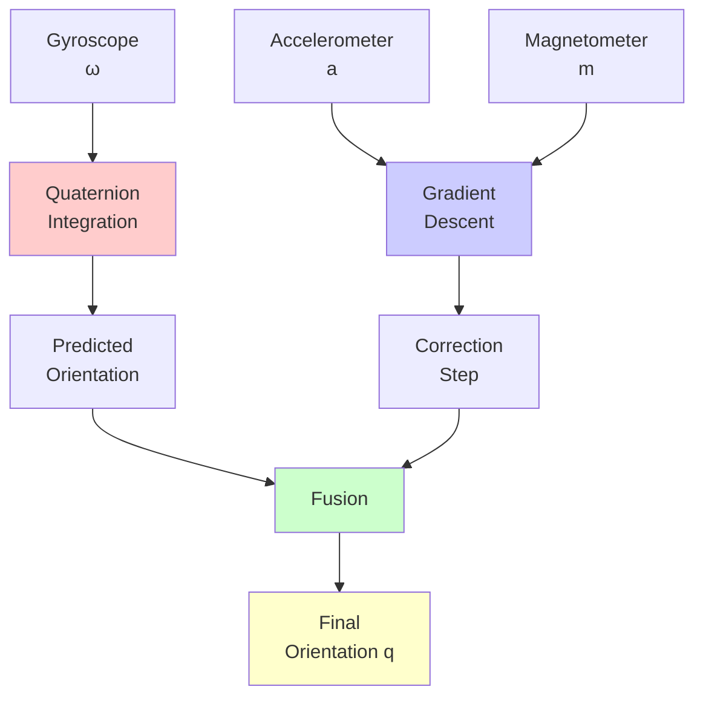

Comprehensive guide to the Madgwick filter - an efficient gradient descent algorithm for IMU orientation estimation.

---

## Overview

The **Madgwick filter** is an orientation estimation algorithm that fuses:
- **Gyroscope** (angular velocity)
- **Accelerometer** (gravity direction)
- **Magnetometer** (magnetic north) - optional

**Key Innovation**: Uses gradient descent to find the orientation that best aligns sensor measurements with expected values.



---

## Quaternion Representation

Orientation is represented as a unit quaternion:

$$
\mathbf{q} = \begin{bmatrix} q_0 \\ q_1 \\ q_2 \\ q_3 \end{bmatrix} = \begin{bmatrix} q_w \\ q_x \\ q_y \\ q_z \end{bmatrix}
$$

**Constraint**: $|\mathbf{q}| = \sqrt{q_0^2 + q_1^2 + q_2^2 + q_3^2} = 1$

### Why Quaternions?

- **No gimbal lock** (unlike Euler angles)
- **Efficient** (4 parameters vs 9 for rotation matrix)
- **Smooth interpolation** (SLERP)
- **Easy composition** (quaternion multiplication)

---

## Algorithm Steps

### Step 1: Gyroscope Integration

Predict orientation from angular velocity:

$$
\dot{\mathbf{q}}_\omega = \frac{1}{2} \mathbf{q} \otimes \begin{bmatrix} 0 \\ \omega_x \\ \omega_y \\ \omega_z \end{bmatrix}
$$

$$
\mathbf{q}_{k+1} = \mathbf{q}_k + \dot{\mathbf{q}}_\omega \Delta t
$$

### Step 2: Gradient Descent Correction

Find the orientation that minimizes the error between:
- **Measured** accelerometer/magnetometer
- **Expected** values in body frame

**Objective Function** (accelerometer only):

$$
f(\mathbf{q}, \mathbf{a}) = \begin{bmatrix}
2(q_1 q_3 - q_0 q_2) - a_x \\
2(q_0 q_1 + q_2 q_3) - a_y \\
2(\frac{1}{2} - q_1^2 - q_2^2) - a_z
\end{bmatrix}
$$

**Gradient**:

$$
\nabla f = J^T f
$$

where $J$ is the Jacobian matrix.

**Correction Step**:

$$
\dot{\mathbf{q}}_\nabla = -\beta \frac{\nabla f}{|\nabla f|}
$$

### Step 3: Fusion

$$
\dot{\mathbf{q}} = \dot{\mathbf{q}}_\omega + \dot{\mathbf{q}}_\nabla
$$

$$
\mathbf{q}_{k+1} = \mathbf{q}_k + \dot{\mathbf{q}} \Delta t
$$

**Normalize**: $\mathbf{q}_{k+1} = \frac{\mathbf{q}_{k+1}}{|\mathbf{q}_{k+1}|}$

---

## Visual Explanation

```p5js
sketch.setup = function() {
  sketch.createCanvas(800, 600);
  sketch.noLoop();
}

sketch.draw = function() {
  sketch.background(255);
  
  // Title
  sketch.fill(0);
  sketch.textSize(18);
  sketch.textAlign(sketch.CENTER);
  sketch.text('Madgwick Filter: Gradient Descent Correction', sketch.width/2, 30);
  
  const centerX = sketch.width / 2;
  const centerY = 300;
  
  // Draw 3D coordinate system (simplified 2D projection)
  drawCoordinateSystem(centerX - 250, centerY, 'Earth Frame');
  drawCoordinateSystem(centerX + 250, centerY, 'Body Frame');
  
  // Expected gravity in earth frame
  sketch.stroke(0, 200, 0);
  sketch.strokeWeight(3);
  sketch.line(centerX - 250, centerY, centerX - 250, centerY + 100);
  sketch.fill(0, 200, 0);
  sketch.noStroke();
  sketch.text('Expected', centerX - 250, centerY + 120);
  sketch.text('Gravity', centerX - 250, centerY + 135);
  
  // Measured acceleration (tilted)
  sketch.stroke(255, 0, 0);
  sketch.strokeWeight(3);
  let angle = sketch.PI / 6;
  let measX = centerX + 250 + sketch.sin(angle) * 100;
  let measY = centerY + sketch.cos(angle) * 100;
  sketch.line(centerX + 250, centerY, measX, measY);
  sketch.fill(255, 0, 0);
  sketch.noStroke();
  sketch.text('Measured', measX + 20, measY);
  sketch.text('Accel', measX + 20, measY + 15);
  
  // Error vector
  sketch.stroke(255, 150, 0);
  sketch.strokeWeight(2);
  drawArrow(centerX - 250, centerY + 100, measX, measY);
  
  sketch.fill(255, 150, 0);
  sketch.noStroke();
  sketch.textSize(14);
  sketch.text('Error', centerX, centerY - 50);
  sketch.text('(Gradient descent minimizes this)', centerX, centerY - 30);
  
  // Explanation
  sketch.fill(0);
  sketch.textSize(13);
  sketch.text('Gradient descent rotates body frame to align measured with expected', sketch.width/2, sketch.height - 80);
  sketch.text('β parameter controls correction rate', sketch.width/2, sketch.height - 60);
  sketch.text('Higher β = faster correction but more noise', sketch.width/2, sketch.height - 40);
  sketch.text('Lower β = slower correction but smoother', sketch.width/2, sketch.height - 20);
}

function drawCoordinateSystem(x, y, label) {
  // X axis (red)
  sketch.stroke(255, 0, 0);
  sketch.strokeWeight(2);
  sketch.line(x, y, x + 60, y);
  sketch.fill(255, 0, 0);
  sketch.noStroke();
  sketch.textSize(12);
  sketch.text('X', x + 70, y + 5);
  
  // Y axis (green)
  sketch.stroke(0, 255, 0);
  sketch.strokeWeight(2);
  sketch.line(x, y, x, y - 60);
  sketch.fill(0, 255, 0);
  sketch.noStroke();
  sketch.text('Y', x + 5, y - 65);
  
  // Z axis (blue) - into page
  sketch.fill(0, 0, 255);
  sketch.circle(x, y, 8);
  sketch.text('Z', x + 15, y + 5);
  
  // Label
  sketch.fill(0);
  sketch.textSize(14);
  sketch.text(label, x, y + 80);
}

function drawArrow(x1, y1, x2, y2) {
  sketch.line(x1, y1, x2, y2);
  sketch.push();
  sketch.translate(x2, y2);
  let angle = sketch.atan2(y2 - y1, x2 - x1);
  sketch.rotate(angle);
  sketch.line(0, 0, -10, -5);
  sketch.line(0, 0, -10, 5);
  sketch.pop();
}
```

---

## Interactive 3D Orientation Visualization

```p5js
let quat = [1, 0, 0, 0];  // w, x, y, z
let gyro = [0, 0, 0];
let accel = [0, 0, 1];  // Gravity pointing down
let beta = 0.1;
let dt = 0.01;

let gyroSlider, betaSlider;
let rotX = 0, rotY = 0;

sketch.setup = function() {
  sketch.createCanvas(800, 650, sketch.WEBGL);
  
  // Sliders
  gyroSlider = sketch.createSlider(-2, 2, 0, 0.1);
  gyroSlider.position(150, 670);
  gyroSlider.style('width', '150px');
  
  betaSlider = sketch.createSlider(0, 1, 0.1, 0.01);
  betaSlider.position(500, 670);
  betaSlider.style('width', '150px');
  
  sketch.frameRate(60);
}

sketch.draw = function() {
  sketch.background(220);
  
  // Update parameters
  gyro[1] = gyroSlider.value();  // Pitch rate
  beta = betaSlider.value();
  
  // Simulate accelerometer (gravity in earth frame)
  accel = [0, 0, 1];
  
  // Run Madgwick filter
  madgwickUpdate(gyro, accel, dt);
  
  // Convert quaternion to Euler for display
  let euler = quaternionToEuler(quat);
  
  // Camera
  sketch.camera(0, -300, 500, 0, 0, 0, 0, 1, 0);
  
  // Lighting
  sketch.ambientLight(100);
  sketch.directionalLight(255, 255, 255, 0, 1, -1);
  
  // Draw reference frame
  sketch.push();
  sketch.strokeWeight(3);
  
  // X axis (red)
  sketch.stroke(255, 0, 0);
  sketch.line(0, 0, 0, 150, 0, 0);
  
  // Y axis (green)
  sketch.stroke(0, 255, 0);
  sketch.line(0, 0, 0, 0, 150, 0);
  
  // Z axis (blue)
  sketch.stroke(0, 0, 255);
  sketch.line(0, 0, 0, 0, 0, 150);
  sketch.pop();
  
  // Draw oriented box
  sketch.push();
  
  // Apply quaternion rotation
  let axis = quaternionToAxisAngle(quat);
  sketch.rotate(axis.angle, axis.axis);
  
  // Box
  sketch.fill(100, 150, 255, 200);
  sketch.stroke(0);
  sketch.strokeWeight(2);
  sketch.box(100, 50, 200);
  
  // Body axes
  sketch.strokeWeight(3);
  
  // X (red)
  sketch.stroke(255, 0, 0);
  sketch.line(0, 0, 0, 80, 0, 0);
  
  // Y (green)
  sketch.stroke(0, 255, 0);
  sketch.line(0, 0, 0, 0, 80, 0);
  
  // Z (blue)
  sketch.stroke(0, 0, 255);
  sketch.line(0, 0, 0, 0, 0, 120);
  
  sketch.pop();
  
  // Display info
  sketch.camera(0, 0, 800, 0, 0, 0, 0, 1, 0);
  
  sketch.fill(0);
  sketch.noStroke();
  sketch.textSize(14);
  sketch.textAlign(sketch.LEFT);
  sketch.text(`Quaternion: [${quat[0].toFixed(3)}, ${quat[1].toFixed(3)}, ${quat[2].toFixed(3)}, ${quat[3].toFixed(3)}]`, -380, -280);
  sketch.text(`Euler (deg): Roll=${sketch.degrees(euler.roll).toFixed(1)}°, Pitch=${sketch.degrees(euler.pitch).toFixed(1)}°, Yaw=${sketch.degrees(euler.yaw).toFixed(1)}°`, -380, -260);
  sketch.text(`Gyro Y (pitch rate): ${gyro[1].toFixed(2)} rad/s`, -380, -240);
  sketch.text(`Beta (correction gain): ${beta.toFixed(2)}`, -380, -220);
  
  // Slider labels
  sketch.textSize(12);
  sketch.text('Gyro Rate', -380, 310);
  sketch.text('Beta Gain', 30, 310);
}

function madgwickUpdate(gyro, accel, dt) {
  // Normalize accelerometer
  let aNorm = sketch.sqrt(accel[0]**2 + accel[1]**2 + accel[2]**2);
  accel = accel.map(a => a / aNorm);
  
  // Quaternion derivative from gyroscope
  let qDot_omega = quaternionMultiply(quat, [0, gyro[0], gyro[1], gyro[2]]);
  qDot_omega = qDot_omega.map(q => 0.5 * q);
  
  // Gradient descent correction
  let [q0, q1, q2, q3] = quat;
  let [ax, ay, az] = accel;
  
  // Objective function (gravity direction)
  let f = [
    2*(q1*q3 - q0*q2) - ax,
    2*(q0*q1 + q2*q3) - ay,
    2*(0.5 - q1*q1 - q2*q2) - az
  ];
  
  // Jacobian
  let J = [
    [-2*q2, 2*q3, -2*q0, 2*q1],
    [2*q1, 2*q0, 2*q3, 2*q2],
    [0, -4*q1, -4*q2, 0]
  ];
  
  // Gradient
  let grad = [0, 0, 0, 0];
  for (let i = 0; i < 4; i++) {
    for (let j = 0; j < 3; j++) {
      grad[i] += J[j][i] * f[j];
    }
  }
  
  // Normalize gradient
  let gradNorm = sketch.sqrt(grad.reduce((sum, g) => sum + g*g, 0));
  if (gradNorm > 0) {
    grad = grad.map(g => g / gradNorm);
  }
  
  // Correction step
  let qDot_correction = grad.map(g => -beta * g);
  
  // Fusion
  let qDot = qDot_omega.map((q, i) => q + qDot_correction[i]);
  
  // Integrate
  quat = quat.map((q, i) => q + qDot[i] * dt);
  
  // Normalize
  let qNorm = sketch.sqrt(quat.reduce((sum, q) => sum + q*q, 0));
  quat = quat.map(q => q / qNorm);
}

function quaternionMultiply(q1, q2) {
  return [
    q1[0]*q2[0] - q1[1]*q2[1] - q1[2]*q2[2] - q1[3]*q2[3],
    q1[0]*q2[1] + q1[1]*q2[0] + q1[2]*q2[3] - q1[3]*q2[2],
    q1[0]*q2[2] - q1[1]*q2[3] + q1[2]*q2[0] + q1[3]*q2[1],
    q1[0]*q2[3] + q1[1]*q2[2] - q1[2]*q2[1] + q1[3]*q2[0]
  ];
}

function quaternionToEuler(q) {
  let [w, x, y, z] = q;
  
  // Roll (x-axis rotation)
  let sinr_cosp = 2 * (w * x + y * z);
  let cosr_cosp = 1 - 2 * (x * x + y * y);
  let roll = sketch.atan2(sinr_cosp, cosr_cosp);
  
  // Pitch (y-axis rotation)
  let sinp = 2 * (w * y - z * x);
  let pitch = sketch.abs(sinp) >= 1 ? (sinp >= 0 ? sketch.HALF_PI : -sketch.HALF_PI) : sketch.asin(sinp);
  
  // Yaw (z-axis rotation)
  let siny_cosp = 2 * (w * z + x * y);
  let cosy_cosp = 1 - 2 * (y * y + z * z);
  let yaw = sketch.atan2(siny_cosp, cosy_cosp);
  
  return { roll, pitch, yaw };
}

function quaternionToAxisAngle(q) {
  let angle = 2 * sketch.acos(q[0]);
  let s = sketch.sqrt(1 - q[0] * q[0]);
  
  let axis;
  if (s < 0.001) {
    axis = [1, 0, 0];
  } else {
    axis = [q[1] / s, q[2] / s, q[3] / s];
  }
  
  return { angle, axis: sketch.createVector(...axis) };
}
```

---

## Mathematical Details

### Quaternion Kinematics

$$
\dot{\mathbf{q}} = \frac{1}{2} \mathbf{q} \otimes \boldsymbol{\omega}
$$

where $\boldsymbol{\omega} = [0, \omega_x, \omega_y, \omega_z]^T$

### Quaternion Multiplication

$$
\mathbf{q}_1 \otimes \mathbf{q}_2 = \begin{bmatrix}
q_{1w}q_{2w} - q_{1x}q_{2x} - q_{1y}q_{2y} - q_{1z}q_{2z} \\
q_{1w}q_{2x} + q_{1x}q_{2w} + q_{1y}q_{2z} - q_{1z}q_{2y} \\
q_{1w}q_{2y} - q_{1x}q_{2z} + q_{1y}q_{2w} + q_{1z}q_{2x} \\
q_{1w}q_{2z} + q_{1x}q_{2y} - q_{1y}q_{2x} + q_{1z}q_{2w}
\end{bmatrix}
$$

### Gravity in Body Frame

Expected gravity direction in body frame:

$$
\mathbf{g}^b = \begin{bmatrix}
2(q_1 q_3 - q_0 q_2) \\
2(q_0 q_1 + q_2 q_3) \\
2(\frac{1}{2} - q_1^2 - q_2^2)
\end{bmatrix}
$$

---

## Parameter Tuning

### Beta (β)

**Correction gain** - controls how much to trust accelerometer vs gyroscope.

- **High β (0.5-1.0)**: Fast correction, more noise sensitivity
- **Medium β (0.1-0.3)**: Balanced (recommended)
- **Low β (0.01-0.05)**: Slow correction, smoother output

**Rule of thumb**: $\beta \approx \sqrt{3/4} \cdot \text{gyro\_noise}$

### Sample Rate

- **High rate (>100 Hz)**: More accurate integration
- **Low rate (<50 Hz)**: May miss fast motions

---

## Python Implementation

```python
import numpy as np

class MadgwickFilter:
    def __init__(self, beta=0.1, sample_period=0.01):
        self.beta = beta
        self.sample_period = sample_period
        self.q = np.array([1.0, 0.0, 0.0, 0.0])  # w, x, y, z
    
    def update(self, gyro, accel, mag=None):
        """
        gyro: [gx, gy, gz] in rad/s
        accel: [ax, ay, az] in m/s^2
        mag: [mx, my, mz] (optional)
        """
        q = self.q
        
        # Normalize accelerometer
        accel = accel / np.linalg.norm(accel)
        
        # Gyroscope quaternion derivative
        qDot_omega = 0.5 * self.quaternion_multiply(q, [0, *gyro])
        
        # Gradient descent correction
        f = np.array([
            2*(q[1]*q[3] - q[0]*q[2]) - accel[0],
            2*(q[0]*q[1] + q[2]*q[3]) - accel[1],
            2*(0.5 - q[1]**2 - q[2]**2) - accel[2]
        ])
        
        J = np.array([
            [-2*q[2], 2*q[3], -2*q[0], 2*q[1]],
            [2*q[1], 2*q[0], 2*q[3], 2*q[2]],
            [0, -4*q[1], -4*q[2], 0]
        ])
        
        gradient = J.T @ f
        gradient = gradient / np.linalg.norm(gradient)
        
        qDot_correction = -self.beta * gradient
        
        # Fusion
        qDot = qDot_omega + qDot_correction
        
        # Integrate
        self.q = self.q + qDot * self.sample_period
        
        # Normalize
        self.q = self.q / np.linalg.norm(self.q)
        
        return self.q
    
    def quaternion_multiply(self, q1, q2):
        w1, x1, y1, z1 = q1
        w2, x2, y2, z2 = q2
        return np.array([
            w1*w2 - x1*x2 - y1*y2 - z1*z2,
            w1*x2 + x1*w2 + y1*z2 - z1*y2,
            w1*y2 - x1*z2 + y1*w2 + z1*x2,
            w1*z2 + x1*y2 - y1*x2 + z1*w2
        ])
    
    def get_euler(self):
        """Convert quaternion to Euler angles (roll, pitch, yaw)"""
        w, x, y, z = self.q
        
        # Roll
        sinr_cosp = 2 * (w * x + y * z)
        cosr_cosp = 1 - 2 * (x**2 + y**2)
        roll = np.arctan2(sinr_cosp, cosr_cosp)
        
        # Pitch
        sinp = 2 * (w * y - z * x)
        pitch = np.arcsin(np.clip(sinp, -1, 1))
        
        # Yaw
        siny_cosp = 2 * (w * z + x * y)
        cosy_cosp = 1 - 2 * (y**2 + z**2)
        yaw = np.arctan2(siny_cosp, cosy_cosp)
        
        return roll, pitch, yaw

# Usage
filter = MadgwickFilter(beta=0.1, sample_period=0.01)

# Simulate IMU data
gyro = np.array([0.1, 0.0, 0.0])  # rad/s
accel = np.array([0.0, 0.0, 9.81])  # m/s^2

for _ in range(1000):
    q = filter.update(gyro, accel)
    roll, pitch, yaw = filter.get_euler()
    print(f"Roll: {np.degrees(roll):.1f}°, Pitch: {np.degrees(pitch):.1f}°, Yaw: {np.degrees(yaw):.1f}°")
```

---

## Advantages

1. **Computationally efficient** - No matrix inversions
2. **No gimbal lock** - Uses quaternions
3. **Handles missing sensors** - Works with gyro+accel or gyro+accel+mag
4. **Single parameter** - Only β needs tuning
5. **Real-time capable** - Fast enough for embedded systems

---

## Limitations

1. **Assumes constant gravity** - Doesn't work during acceleration
2. **Magnetic interference** - Magnetometer can be unreliable
3. **Drift in yaw** - Without magnetometer, yaw drifts over time
4. **Parameter tuning** - β needs adjustment for different applications

---

## Applications

- **Drones/Quadcopters** - Attitude estimation
- **VR/AR Headsets** - Head tracking
- **Smartphones** - Screen rotation, gaming
- **Wearables** - Activity tracking
- **Robotics** - IMU-based navigation

---

## Further Reading

- [Madgwick's Original Paper](https://x-io.co.uk/res/doc/madgwick_internal_report.pdf)
- [Quaternions - Wikipedia](https://en.wikipedia.org/wiki/Quaternion)
- See also: Mahony Filter, Kalman Filter, Complementary Filter

