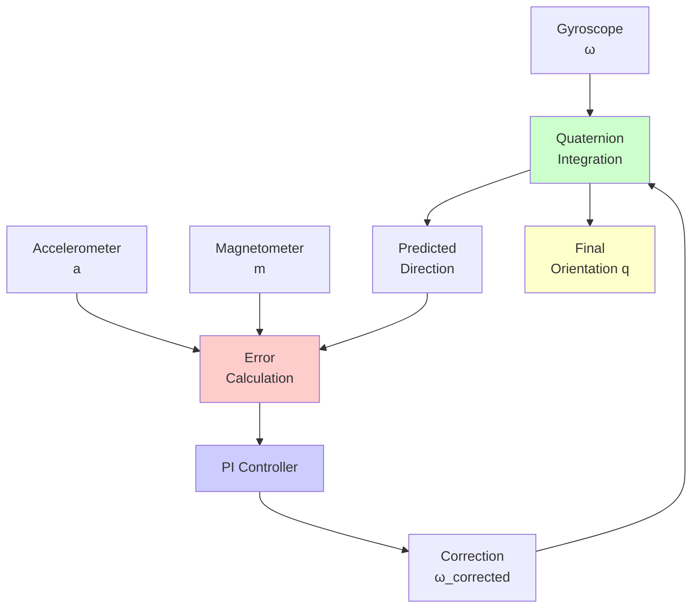

Comprehensive guide to the Mahony filter - a complementary filter with PI feedback for IMU orientation estimation.

---

## Overview

The **Mahony filter** is an orientation estimation algorithm that uses a **complementary filter** approach with **PI (Proportional-Integral) feedback** to fuse:
- **Gyroscope** (angular velocity)
- **Accelerometer** (gravity direction)
- **Magnetometer** (magnetic north) - optional

**Key Innovation**: Uses cross-product error between measured and estimated directions, corrected with PI controller.



---

## Core Concept

### Complementary Filter

High-pass filter gyroscope (no drift accumulation) + Low-pass filter accelerometer (smooth out noise):

$$
\text{Orientation} = \alpha \cdot \text{Gyro} + (1-\alpha) \cdot \text{Accel/Mag}
$$

### PI Controller

**Proportional** term: Immediate correction
**Integral** term: Compensates for gyroscope bias over time

$$
\omega_{corrected} = \omega_{gyro} + K_p \cdot e + K_i \cdot \int e \, dt
$$

---

## Algorithm Steps

### Step 1: Calculate Error

Compute cross-product between measured and estimated directions:

**Accelerometer Error**:

$$
\mathbf{e}_a = \hat{\mathbf{g}}^b \times \mathbf{a}_{measured}
$$

where $\hat{\mathbf{g}}^b$ is the estimated gravity direction in body frame.

**Magnetometer Error** (if available):

$$
\mathbf{e}_m = \hat{\mathbf{b}}^b \times \mathbf{m}_{measured}
$$

**Total Error**:

$$
\mathbf{e} = \mathbf{e}_a + \mathbf{e}_m
$$

### Step 2: PI Correction

**Proportional**:

$$
\omega_p = K_p \cdot \mathbf{e}
$$

**Integral** (bias compensation):

$$
\mathbf{b}_{k+1} = \mathbf{b}_k + K_i \cdot \mathbf{e} \cdot \Delta t
$$

$$
\omega_i = \mathbf{b}
$$

**Corrected Angular Velocity**:

$$
\omega_{corrected} = \omega_{gyro} + \omega_p + \omega_i
$$

### Step 3: Quaternion Integration

$$
\dot{\mathbf{q}} = \frac{1}{2} \mathbf{q} \otimes \begin{bmatrix} 0 \\ \omega_{corrected} \end{bmatrix}
$$

$$
\mathbf{q}_{k+1} = \mathbf{q}_k + \dot{\mathbf{q}} \Delta t
$$

**Normalize**: $\mathbf{q}_{k+1} = \frac{\mathbf{q}_{k+1}}{|\mathbf{q}_{k+1}|}$

---

## Visual Explanation

```p5js
sketch.setup = function() {
  sketch.createCanvas(800, 600);
  sketch.noLoop();
}

sketch.draw = function() {
  sketch.background(255);
  
  // Title
  sketch.fill(0);
  sketch.textSize(18);
  sketch.textAlign(sketch.CENTER);
  sketch.text('Mahony Filter: PI Controller Correction', sketch.width/2, 30);
  
  // Draw system diagram
  const boxW = 120;
  const boxH = 60;
  
  // Gyroscope
  drawBox(150, 150, boxW, boxH, 'Gyroscope\nω', [255, 200, 200]);
  
  // Accel/Mag
  drawBox(150, 350, boxW, boxH, 'Accel/Mag\na, m', [200, 200, 255]);
  
  // Error calculation
  drawBox(400, 250, boxW, boxH, 'Error\ne = ĝ × a', [255, 255, 200]);
  
  // PI Controller
  drawBox(400, 400, boxW, boxH, 'PI Controller\nKp·e + Ki·∫e', [200, 255, 200]);
  
  // Quaternion integration
  drawBox(650, 150, boxW, boxH, 'Quaternion\nIntegration', [200, 255, 255]);
  
  // Arrows
  sketch.stroke(0);
  sketch.strokeWeight(2);
  drawArrow(270, 180, 380, 180);
  drawArrow(270, 380, 380, 380);
  drawArrow(520, 280, 630, 180);
  drawArrow(520, 430, 590, 430);
  drawArrow(590, 430, 590, 210);
  drawArrow(590, 210, 630, 180);
  
  // Feedback
  drawArrow(710, 220, 710, 480);
  drawArrow(710, 480, 380, 480);
  drawArrow(380, 480, 380, 310);
  
  // Labels
  sketch.fill(0);
  sketch.noStroke();
  sketch.textSize(12);
  sketch.text('ω_gyro', 325, 170);
  sketch.text('Measured', 325, 370);
  sketch.text('ω_corrected', 570, 170);
  sketch.text('Correction', 555, 420);
  sketch.text('Predicted ĝ', 650, 500);
  
  // Explanation
  sketch.textSize(14);
  sketch.text('Proportional (Kp): Immediate correction based on current error', sketch.width/2, sketch.height - 80);
  sketch.text('Integral (Ki): Compensates for gyroscope bias over time', sketch.width/2, sketch.height - 60);
  sketch.text('Higher Kp = faster response, Higher Ki = better bias compensation', sketch.width/2, sketch.height - 40);
}

function drawBox(x, y, w, h, label, color) {
  sketch.fill(...color);
  sketch.stroke(0);
  sketch.strokeWeight(2);
  sketch.rect(x - w/2, y - h/2, w, h);
  
  sketch.fill(0);
  sketch.noStroke();
  sketch.textSize(12);
  sketch.textAlign(sketch.CENTER, sketch.CENTER);
  let lines = label.split('\n');
  for (let i = 0; i < lines.length; i++) {
    sketch.text(lines[i], x, y - 10 + i * 15);
  }
}

function drawArrow(x1, y1, x2, y2) {
  sketch.line(x1, y1, x2, y2);
  sketch.push();
  sketch.translate(x2, y2);
  let angle = sketch.atan2(y2 - y1, x2 - x1);
  sketch.rotate(angle);
  sketch.line(0, 0, -10, -5);
  sketch.line(0, 0, -10, 5);
  sketch.pop();
}
```

---

## Interactive 3D Visualization

```p5js
let quat = [1, 0, 0, 0];  // w, x, y, z
let gyro = [0, 0, 0];
let gyroBias = [0, 0, 0];
let accel = [0, 0, 1];
let Kp = 2.0;
let Ki = 0.01;
let dt = 0.01;

let kpSlider, kiSlider, gyroSlider;

sketch.setup = function() {
  sketch.createCanvas(800, 700, sketch.WEBGL);
  
  // Sliders
  kpSlider = sketch.createSlider(0, 5, 2, 0.1);
  kpSlider.position(150, 720);
  kpSlider.style('width', '150px');
  
  kiSlider = sketch.createSlider(0, 0.1, 0.01, 0.001);
  kiSlider.position(400, 720);
  kiSlider.style('width', '150px');
  
  gyroSlider = sketch.createSlider(-2, 2, 0, 0.1);
  gyroSlider.position(650, 720);
  gyroSlider.style('width', '150px');
  
  sketch.frameRate(60);
}

sketch.draw = function() {
  sketch.background(220);
  
  // Update parameters
  Kp = kpSlider.value();
  Ki = kiSlider.value();
  gyro[1] = gyroSlider.value();  // Pitch rate
  
  // Simulate accelerometer (gravity)
  accel = [0, 0, 1];
  
  // Run Mahony filter
  mahonyUpdate(gyro, accel, dt);
  
  // Convert to Euler
  let euler = quaternionToEuler(quat);
  
  // Camera
  sketch.camera(0, -300, 500, 0, 0, 0, 0, 1, 0);
  
  // Lighting
  sketch.ambientLight(100);
  sketch.directionalLight(255, 255, 255, 0, 1, -1);
  
  // Draw reference frame
  sketch.push();
  sketch.strokeWeight(3);
  
  // X (red), Y (green), Z (blue)
  sketch.stroke(255, 0, 0);
  sketch.line(0, 0, 0, 150, 0, 0);
  sketch.stroke(0, 255, 0);
  sketch.line(0, 0, 0, 0, 150, 0);
  sketch.stroke(0, 0, 255);
  sketch.line(0, 0, 0, 0, 0, 150);
  sketch.pop();
  
  // Draw oriented box
  sketch.push();
  
  // Apply quaternion rotation
  let axis = quaternionToAxisAngle(quat);
  sketch.rotate(axis.angle, axis.axis);
  
  // Box (IMU body)
  sketch.fill(100, 150, 255, 200);
  sketch.stroke(0);
  sketch.strokeWeight(2);
  sketch.box(100, 50, 200);
  
  // Body axes
  sketch.strokeWeight(3);
  sketch.stroke(255, 0, 0);
  sketch.line(0, 0, 0, 80, 0, 0);
  sketch.stroke(0, 255, 0);
  sketch.line(0, 0, 0, 0, 80, 0);
  sketch.stroke(0, 0, 255);
  sketch.line(0, 0, 0, 0, 0, 120);
  
  // Gravity vector (yellow)
  sketch.stroke(255, 255, 0);
  sketch.strokeWeight(4);
  let g = rotateVectorByQuaternion([0, 0, 1], quaternionConjugate(quat));
  sketch.line(0, 0, 0, g[0] * 100, g[1] * 100, g[2] * 100);
  
  sketch.pop();
  
  // Display info
  sketch.camera(0, 0, 800, 0, 0, 0, 0, 1, 0);
  
  sketch.fill(0);
  sketch.noStroke();
  sketch.textSize(14);
  sketch.textAlign(sketch.LEFT);
  sketch.text(`Quaternion: [${quat[0].toFixed(3)}, ${quat[1].toFixed(3)}, ${quat[2].toFixed(3)}, ${quat[3].toFixed(3)}]`, -380, -320);
  sketch.text(`Euler: Roll=${sketch.degrees(euler.roll).toFixed(1)}°, Pitch=${sketch.degrees(euler.pitch).toFixed(1)}°, Yaw=${sketch.degrees(euler.yaw).toFixed(1)}°`, -380, -300);
  sketch.text(`Gyro Bias: [${gyroBias[0].toFixed(4)}, ${gyroBias[1].toFixed(4)}, ${gyroBias[2].toFixed(4)}]`, -380, -280);
  sketch.text(`Kp (Proportional): ${Kp.toFixed(2)}`, -380, -260);
  sketch.text(`Ki (Integral): ${Ki.toFixed(3)}`, -380, -240);
  
  // Slider labels
  sketch.textSize(12);
  sketch.text('Kp Gain', -380, 350);
  sketch.text('Ki Gain', -130, 350);
  sketch.text('Gyro Rate', 120, 350);
}

function mahonyUpdate(gyro, accel, dt) {
  // Normalize accelerometer
  let aNorm = sketch.sqrt(accel[0]**2 + accel[1]**2 + accel[2]**2);
  if (aNorm === 0) return;
  accel = accel.map(a => a / aNorm);
  
  // Estimated gravity direction in body frame
  let [q0, q1, q2, q3] = quat;
  let vx = 2*(q1*q3 - q0*q2);
  let vy = 2*(q0*q1 + q2*q3);
  let vz = q0*q0 - q1*q1 - q2*q2 + q3*q3;
  
  // Error: cross product between estimated and measured
  let ex = (vy * accel[2] - vz * accel[1]);
  let ey = (vz * accel[0] - vx * accel[2]);
  let ez = (vx * accel[1] - vy * accel[0]);
  
  // Integral feedback (bias compensation)
  if (Ki > 0) {
    gyroBias[0] += Ki * ex * dt;
    gyroBias[1] += Ki * ey * dt;
    gyroBias[2] += Ki * ez * dt;
  }
  
  // Corrected gyroscope
  let gx = gyro[0] + Kp * ex + gyroBias[0];
  let gy = gyro[1] + Kp * ey + gyroBias[1];
  let gz = gyro[2] + Kp * ez + gyroBias[2];
  
  // Quaternion derivative
  let qDot = [
    0.5 * (-q1*gx - q2*gy - q3*gz),
    0.5 * (q0*gx + q2*gz - q3*gy),
    0.5 * (q0*gy - q1*gz + q3*gx),
    0.5 * (q0*gz + q1*gy - q2*gx)
  ];
  
  // Integrate
  quat = quat.map((q, i) => q + qDot[i] * dt);
  
  // Normalize
  let qNorm = sketch.sqrt(quat.reduce((sum, q) => sum + q*q, 0));
  quat = quat.map(q => q / qNorm);
}

function quaternionToEuler(q) {
  let [w, x, y, z] = q;
  
  let sinr_cosp = 2 * (w * x + y * z);
  let cosr_cosp = 1 - 2 * (x * x + y * y);
  let roll = sketch.atan2(sinr_cosp, cosr_cosp);
  
  let sinp = 2 * (w * y - z * x);
  let pitch = sketch.abs(sinp) >= 1 ? (sinp >= 0 ? sketch.HALF_PI : -sketch.HALF_PI) : sketch.asin(sinp);
  
  let siny_cosp = 2 * (w * z + x * y);
  let cosy_cosp = 1 - 2 * (y * y + z * z);
  let yaw = sketch.atan2(siny_cosp, cosy_cosp);
  
  return { roll, pitch, yaw };
}

function quaternionToAxisAngle(q) {
  let angle = 2 * sketch.acos(q[0]);
  let s = sketch.sqrt(1 - q[0] * q[0]);
  
  let axis;
  if (s < 0.001) {
    axis = [1, 0, 0];
  } else {
    axis = [q[1] / s, q[2] / s, q[3] / s];
  }
  
  return { angle, axis: sketch.createVector(...axis) };
}

function quaternionConjugate(q) {
  return [q[0], -q[1], -q[2], -q[3]];
}

function rotateVectorByQuaternion(v, q) {
  let qv = [0, ...v];
  let qConj = quaternionConjugate(q);
  let result = quaternionMultiply(quaternionMultiply(q, qv), qConj);
  return [result[1], result[2], result[3]];
}

function quaternionMultiply(q1, q2) {
  return [
    q1[0]*q2[0] - q1[1]*q2[1] - q1[2]*q2[2] - q1[3]*q2[3],
    q1[0]*q2[1] + q1[1]*q2[0] + q1[2]*q2[3] - q1[3]*q2[2],
    q1[0]*q2[2] - q1[1]*q2[3] + q1[2]*q2[0] + q1[3]*q2[1],
    q1[0]*q2[3] + q1[1]*q2[2] - q1[2]*q2[1] + q1[3]*q2[0]
  ];
}
```

---

## Mathematical Details

### Error Calculation

The cross product between estimated and measured directions gives the rotation axis:

$$
\mathbf{e} = \hat{\mathbf{v}} \times \mathbf{v}_{measured}
$$

**Magnitude**: Proportional to sine of angle between vectors
**Direction**: Axis of rotation needed to align them

### PI Controller

**Proportional Term** ($K_p$):

$$
\omega_p = K_p \cdot \mathbf{e}
$$

- Immediate correction
- Higher $K_p$ = faster response, more noise

**Integral Term** ($K_i$):

$$
\mathbf{b}_{k+1} = \mathbf{b}_k + K_i \cdot \mathbf{e} \cdot \Delta t
$$

- Accumulates error over time
- Compensates for gyroscope bias
- Higher $K_i$ = better bias compensation, slower convergence

### Corrected Angular Velocity

$$
\boldsymbol{\omega}_{corrected} = \boldsymbol{\omega}_{gyro} + K_p \cdot \mathbf{e} + \mathbf{b}
$$

---

## Parameter Tuning

### Kp (Proportional Gain)

**Effect**: Controls response speed to orientation errors

- **High Kp (5-10)**: Fast correction, sensitive to noise
- **Medium Kp (1-3)**: Balanced (recommended)
- **Low Kp (0.1-0.5)**: Slow correction, smooth output

**Rule of thumb**: $K_p \approx 2 \times \text{expected\_angular\_velocity}$

### Ki (Integral Gain)

**Effect**: Controls gyroscope bias compensation

- **High Ki (0.1-1)**: Fast bias compensation, can overshoot
- **Medium Ki (0.01-0.05)**: Balanced (recommended)
- **Low Ki (0.001-0.01)**: Slow bias compensation, stable
- **Zero Ki**: No bias compensation (like complementary filter)

**Rule of thumb**: $K_i \approx 0.1 \times K_p$

---

## Python Implementation

```python
import numpy as np

class MahonyFilter:
    def __init__(self, Kp=2.0, Ki=0.01, sample_period=0.01):
        self.Kp = Kp
        self.Ki = Ki
        self.sample_period = sample_period
        self.q = np.array([1.0, 0.0, 0.0, 0.0])  # w, x, y, z
        self.integral_error = np.array([0.0, 0.0, 0.0])
    
    def update(self, gyro, accel, mag=None):
        """
        gyro: [gx, gy, gz] in rad/s
        accel: [ax, ay, az] in m/s^2
        mag: [mx, my, mz] (optional)
        """
        q = self.q
        
        # Normalize accelerometer
        accel_norm = np.linalg.norm(accel)
        if accel_norm == 0:
            return self.q
        accel = accel / accel_norm
        
        # Estimated gravity direction in body frame
        vx = 2 * (q[1]*q[3] - q[0]*q[2])
        vy = 2 * (q[0]*q[1] + q[2]*q[3])
        vz = q[0]**2 - q[1]**2 - q[2]**2 + q[3]**2
        
        # Error: cross product
        ex = vy * accel[2] - vz * accel[1]
        ey = vz * accel[0] - vx * accel[2]
        ez = vx * accel[1] - vy * accel[0]
        
        # Integral feedback
        if self.Ki > 0:
            self.integral_error += np.array([ex, ey, ez]) * self.sample_period
        
        # Corrected gyroscope
        gyro_corrected = gyro + self.Kp * np.array([ex, ey, ez]) + self.integral_error
        
        # Quaternion derivative
        qDot = 0.5 * self.quaternion_multiply(q, [0, *gyro_corrected])
        
        # Integrate
        self.q = self.q + qDot * self.sample_period
        
        # Normalize
        self.q = self.q / np.linalg.norm(self.q)
        
        return self.q
    
    def quaternion_multiply(self, q1, q2):
        w1, x1, y1, z1 = q1
        w2, x2, y2, z2 = q2
        return np.array([
            w1*w2 - x1*x2 - y1*y2 - z1*z2,
            w1*x2 + x1*w2 + y1*z2 - z1*y2,
            w1*y2 - x1*z2 + y1*w2 + z1*x2,
            w1*z2 + x1*y2 - y1*x2 + z1*w2
        ])
    
    def get_euler(self):
        """Convert quaternion to Euler angles"""
        w, x, y, z = self.q
        
        # Roll
        sinr_cosp = 2 * (w * x + y * z)
        cosr_cosp = 1 - 2 * (x**2 + y**2)
        roll = np.arctan2(sinr_cosp, cosr_cosp)
        
        # Pitch
        sinp = 2 * (w * y - z * x)
        pitch = np.arcsin(np.clip(sinp, -1, 1))
        
        # Yaw
        siny_cosp = 2 * (w * z + x * y)
        cosy_cosp = 1 - 2 * (y**2 + z**2)
        yaw = np.arctan2(siny_cosp, cosy_cosp)
        
        return roll, pitch, yaw
    
    def reset_integral(self):
        """Reset integral error (useful after large disturbances)"""
        self.integral_error = np.array([0.0, 0.0, 0.0])

# Usage
filter = MahonyFilter(Kp=2.0, Ki=0.01, sample_period=0.01)

# Simulate IMU data
gyro = np.array([0.1, 0.0, 0.0])  # rad/s
accel = np.array([0.0, 0.0, 9.81])  # m/s^2

for _ in range(1000):
    q = filter.update(gyro, accel)
    roll, pitch, yaw = filter.get_euler()
    print(f"Roll: {np.degrees(roll):.1f}°, Pitch: {np.degrees(pitch):.1f}°, Yaw: {np.degrees(yaw):.1f}°")
```

---

## Comparison: Mahony vs Madgwick

| Feature | Mahony | Madgwick |
|---------|--------|----------|
| **Approach** | Complementary filter + PI | Gradient descent |
| **Parameters** | Kp, Ki (2 params) | β (1 param) |
| **Bias Compensation** | Yes (integral term) | No |
| **Computational Cost** | Lower | Slightly higher |
| **Tuning Complexity** | Moderate | Easier |
| **Convergence** | Faster with good Ki | Depends on β |
| **Stability** | Very stable | Stable |

---

## Advantages

1. **Gyroscope bias compensation** - Integral term removes drift
2. **Computationally efficient** - No matrix operations
3. **Stable** - PI controller is well-understood
4. **Flexible** - Can disable Ki for pure complementary filter
5. **Real-time capable** - Fast enough for embedded systems

---

## Limitations

1. **Two parameters** - Kp and Ki need tuning (vs Madgwick's single β)
2. **Assumes constant gravity** - Doesn't work during acceleration
3. **Integral windup** - Ki can accumulate error during prolonged disturbances
4. **Yaw drift** - Without magnetometer, yaw drifts over time

---

## Applications

- **Drones/Quadcopters** - Attitude control with bias compensation
- **Robotics** - IMU-based navigation
- **VR/AR** - Head tracking with drift correction
- **Wearables** - Activity and motion tracking
- **Stabilization** - Camera gimbals, platforms

---

## Best Practices

1. **Start with Kp only** - Set Ki=0, tune Kp for desired response
2. **Add Ki gradually** - Increase Ki until bias is compensated
3. **Monitor integral error** - Reset if it grows too large
4. **Calibrate sensors** - Remove static bias before filtering
5. **Handle saturation** - Limit integral error accumulation
6. **Test with motion** - Verify performance during actual use

---

## Further Reading

- [Mahony's Original Paper](https://hal.archives-ouvertes.fr/hal-00488376/document)
- [Complementary Filter - Wikipedia](https://en.wikipedia.org/wiki/Complementary_filter)
- [PID Controller - Wikipedia](https://en.wikipedia.org/wiki/PID_controller)
- See also: Madgwick Filter, Kalman Filter, Complementary Filter

