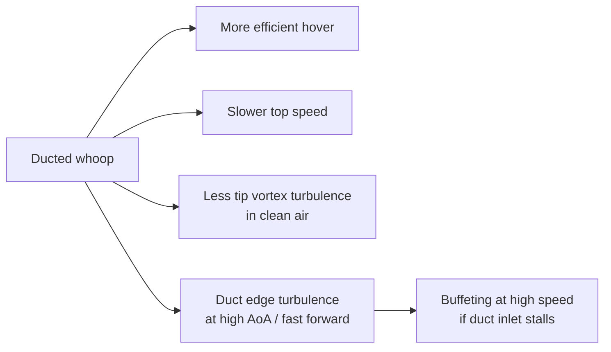

Duct'as (gaubtas) aplink propelerį pakeičia, kaip oras įteka ir išteka pro diską — ir stipriai pakeičia efektyvumą, traukos/dydžio santykį bei valdymą. Tiny whoop'ai (Mobula, BetaFPV Meteor, Pavo20) duct'us naudoja pirmiausia propams apsaugoti, bet aerodinaminiai efektai yra realūs ir lemia, kaip šie rėmai skrenda, palyginus su analogiškais open-prop dizainais. (Ilgai maniau, kad duct'as — vien apsauga nuo sienų. Klydau.)

---

## Ką duct'as daro oro srautui

Be duct'o mentelės gale susidaro blade tip vortex'ai: slėgio skirtumas tarp mentelės viršaus ir apačios prasiveržia radialiai gale, susisukdamas į sūkurį, kuris sumažina efektyvų disko plotą ir švaisto energiją. Duct'as tai panaikina — jis palaiko ašinį oro kelią, atgauna galo nuostolį ir dar veikia kaip venturi: šiek tiek pagreitina įtekantį orą ties duct'o lūpa.

<div style="display:flex;justify-content:center;margin:2rem 0;">
<canvas id="duct-compare-canvas" width="560" height="380" style="border-radius:8px;background:#111;display:block;"></canvas>
</div>
<script src="https://cdnjs.cloudflare.com/ajax/libs/p5.js/1.9.4/p5.min.js" onerror="void(0)"></script>
<script>
(function(){
  var sk = function(p){
    var W=560,H=380;
    var particles=[], vortexParticles=[];
    var NUM=70, VNUM=40;

    function makeOpen(p,init){
      var side=p.random()<0.5?-1:1;
      var r=p.random(4,65);
      return {
        x:140+side*r, y:init?p.random(30,H-60):70+p.random(-8,8),
        vy:p.random(1.2,2.5), vx:side*p.random(0,0.3),
        age:init?p.random(0,100):0, maxAge:p.random(80,150),
        type:'open'
      };
    }

    function makeVortex(p,init){
      var side=p.random()<0.5?-1:1;
      return {
        x:140+side*p.random(60,85), y:init?p.random(70,200):85+p.random(-5,5),
        vx:side*p.random(0.8,2.0), vy:p.random(-0.5,0.5),
        age:init?p.random(0,50):0, maxAge:p.random(30,70), type:'vortex'
      };
    }

    function makeDucted(p,init){
      var r=p.random(4,58);
      var side=p.random()<0.5?-1:1;
      return {
        x:420+side*r, y:init?p.random(20,H-60):50+p.random(-5,5),
        vy:p.random(1.8,3.2), vx:side*p.random(0,0.1),
        age:init?p.random(0,100):0, maxAge:p.random(80,160),
        type:'ducted'
      };
    }

    p.setup=function(){
      p.createCanvas(W,H);
      p.textFont('monospace');
      for(var i=0;i<NUM;i++){
        particles.push(makeOpen(p,true));
        particles.push(makeDucted(p,true));
      }
      for(var i=0;i<VNUM;i++) vortexParticles.push(makeVortex(p,true));
    };

    p.draw=function(){
      p.background(17,17,17,55);

      // --- LEFT: Open prop ---
      // Prop disk zone
      p.stroke(100,180,255,40); p.strokeWeight(1); p.noFill();
      p.ellipse(140,85,140,16);
      // Prop
      p.stroke(100,180,255); p.strokeWeight(3);
      var t=p.frameCount*0.12;
      p.push(); p.translate(140,85); p.rotate(t); p.line(-62,0,62,0); p.pop();

      // Tip vortex spirals (static illustration)
      p.noFill(); p.strokeWeight(1.5);
      for(var s=0;s<2;s++){
        var sx=s===0?202:78;
        var sy=85;
        p.stroke(255,80,80,120);
        p.beginShape();
        for(var a=0;a<p.TWO_PI*2;a+=0.15){
          var rx=(s===0?1:-1)*a*7;
          var ry=a*12;
          p.curveVertex(sx+rx*0.5, sy+ry);
        }
        p.endShape();
      }

      // Open flow particles
      for(var i=particles.length-1;i>=0;i--){
        var pt=particles[i];
        if(pt.type!=='open') continue;
        var spread=(pt.y-85)/H*0.8;
        pt.vx+=(pt.x<140?-1:1)*spread*0.02;
        pt.x+=pt.vx; pt.y+=pt.vy; pt.age++;
        var frac=pt.age/pt.maxAge;
        p.noStroke(); p.fill(80,160,255,180*(1-frac));
        p.ellipse(pt.x,pt.y,3.5,3.5);
        if(pt.age>pt.maxAge||pt.y>H-20) particles[i]=makeOpen(p,false);
      }

      // Tip vortex particles
      for(var i=vortexParticles.length-1;i>=0;i--){
        var vp=vortexParticles[i];
        vp.x+=vp.vx; vp.y+=vp.vy+(vp.age*0.01); vp.age++;
        var frac2=vp.age/vp.maxAge;
        p.noStroke(); p.fill(255,80,80,200*(1-frac2));
        p.ellipse(vp.x,vp.y,4,4);
        if(vp.age>vp.maxAge) vortexParticles[i]=makeVortex(p,false);
      }

      // Left label
      p.fill(200); p.noStroke(); p.textSize(12); p.textAlign(p.CENTER);
      p.text("Open prop", 140, H-8);
      p.fill(255,80,80); p.textSize(10);
      p.text("tip vortex loss", 140, H-24);

      // --- DIVIDER ---
      p.stroke(50); p.strokeWeight(1);
      p.line(W/2,20,W/2,H-20);

      // --- RIGHT: Ducted ---
      var dcx=420, dcy=70, drad=68, ductH=110;
      // Duct walls
      p.stroke(140,160,180); p.strokeWeight(4); p.noFill();
      // Left wall
      p.beginShape();
      p.vertex(dcx-drad-4, dcy-20);
      p.vertex(dcx-drad, dcy);
      p.vertex(dcx-drad, dcy+ductH);
      p.vertex(dcx-drad-4, dcy+ductH+16);
      p.endShape();
      // Right wall
      p.beginShape();
      p.vertex(dcx+drad+4, dcy-20);
      p.vertex(dcx+drad, dcy);
      p.vertex(dcx+drad, dcy+ductH);
      p.vertex(dcx+drad+4, dcy+ductH+16);
      p.endShape();

      // Duct lip highlight
      p.stroke(180,220,255,80); p.strokeWeight(8);
      p.line(dcx-drad,dcy,dcx+drad,dcy);

      // Prop inside duct
      p.stroke(100,180,255); p.strokeWeight(3);
      p.push(); p.translate(dcx,dcy+15); p.rotate(-t*1.1);
      p.line(-62,0,62,0); p.pop();

      // Ducted flow particles — more collimated, faster
      for(var i=particles.length-1;i>=0;i--){
        var pt=particles[i];
        if(pt.type!=='ducted') continue;
        // Force alignment inside duct
        if(pt.y<dcy+ductH){
          pt.vx*=0.88;
        } else {
          // Exit: slight spread
          pt.vx+=(pt.x<dcx?-1:1)*0.06;
        }
        pt.x+=pt.vx; pt.y+=pt.vy; pt.age++;
        var frac=pt.age/pt.maxAge;
        p.noStroke(); p.fill(80,220,120,180*(1-frac));
        p.ellipse(pt.x,pt.y,3.5,3.5);
        if(pt.age>pt.maxAge||pt.y>H-20) particles[i]=makeDucted(p,false);
      }

      // Inflow acceleration arrows at lip
      p.stroke(180,255,180,100); p.strokeWeight(1.5); p.fill(180,255,180,120);
      for(var side2=-1;side2<=1;side2+=2){
        var ax=dcx+side2*(drad-20);
        for(var ay=dcy-45;ay<=dcy-5;ay+=18){
          p.line(ax,ay,ax,ay+12);
          p.triangle(ax,ay+16,ax-4,ay+9,ax+4,ay+9);
        }
      }

      p.fill(200); p.noStroke(); p.textSize(12); p.textAlign(p.CENTER);
      p.text("Ducted (shroud)", dcx, H-8);
      p.fill(80,220,120); p.textSize(10);
      p.text("collimated exit, no tip vortex", dcx, H-24);
    };
  };
  new p5(sk, 'duct-compare-host');
})();
</script>
<div id="duct-compare-host" style="display:none"></div>

**Kairė (open):** tip vortex nuotėkis (raudona) pabėga radialiai ties mentelių galais — švaistoma energija. Srautas išsisklaido. **Dešinė (ducted):** duct'o sienelė neleidžia orui pabėgti ties galu, srautas lieka ašinis, o ištekėjimo greitis prie tos pačios galios yra didesnis.

---

## Venturi efektas ties duct'o lūpa

Duct'o įėjimas projektuojamas su suapvalinta priekine briauna (**lūpa**). Ji pagreitina įtekantį orą tiesiai prieš rotoriaus diską — klasikinis venturi efektas: siaurėjantis skerspjūvis → didesnis greitis → mažesnis slėgis, kuris įtraukia orą. Rezultatas — didesnis efektyvus masės srautas nei atviro propo, esant tam pačiam skersmeniui ir tiems patiems RPM.

```mermaid
flowchart LR
    A[Ambient air] -->|approaches duct lip| B[Lip accelerates<br/>inflow — Bernoulli]
    B --> C[Rotor disk<br/>high pressure differential]
    C --> D[Collimated exit<br/>high velocity jet]
    D --> E[Thrust]
    style B fill:#1a3a1a,stroke:#4a8a4a
    style D fill:#1a3a1a,stroke:#4a8a4a
```



---

## Efektyvumas vs open prop

Duct'o nauda kritiškai priklauso nuo **tarpo (gap) dydžio** — atstumo tarp mentelės galo ir duct'o sienelės. Kuo tarpas mažesnis, tuo labiau slopinamas galo nuostolis.

```chart
{
  "type": "bar",
  "data": {
    "labels": ["Open prop", "Duct gap 5% chord", "Duct gap 2% chord", "Duct gap <1% chord"],
    "datasets": [
      {
        "label": "Relative thrust per watt (hover)",
        "data": [100, 105, 112, 118],
        "backgroundColor": ["rgba(100,150,255,0.7)","rgba(80,200,120,0.5)","rgba(80,200,120,0.7)","rgba(80,220,120,0.9)"],
        "borderColor": ["rgba(100,150,255,1)","rgba(80,200,120,1)","rgba(80,200,120,1)","rgba(80,220,120,1)"],
        "borderWidth": 1.5
      }
    ]
  },
  "options": {
    "responsive": true,
    "plugins": {
      "title": { "display": true, "text": "Duct gap clearance vs relative hover efficiency (open = 100)" },
      "legend": { "display": false }
    },
    "scales": {
      "y": {
        "min": 90,
        "title": { "display": true, "text": "Relative efficiency (%)" }
      }
    }
  }
}
```

Liejimo (injection-molded) whoop'ų duct'ai turi santykinai didelius tarpus (3–5% chord), nes gamybos tolerancija riboja galo tarpą. Custom 3D spausdinti ir carbon duct'ai gali būti gerokai ankštesni.

---

## Kompromisai vs open props

| Savybė | Open | Ducted |
|----------|------|--------|
| Hover efektyvumas (tas pats skersmuo, ta pati galia) | Bazinis | +5–18% priklausomai nuo tarpo |
| Maksimalus greitis | Didesnis — nėra duct'o pasipriešinimo greityje | Mažesnis — duct'as prideda pasipriešinimo skrendant į priekį |
| Propwash turbulencija | Reikšminga (platus išsklidimas) | Sumažinta — ištekėjimo srovė labiau nukreipta |
| Atsparumas smūgiams | Propai atviri | Propai apsaugoti |
| Svoris | Mažesnis | +duct'o rėmo masė |
| Triukšmas | Vidutinis | Dažnai tylesnis (sumažintas tip vortex) |
| Mastelio keitimas (scaling) | Gerai skaliuojasi | Nauda mažėja prie didelio skersmens |

Hover'e gautas efektyvumo pranašumas apsiverčia skrendant greitai į priekį — tada duct'as tampa pasipriešinimo paviršiumi. Būtent todėl racing dronai visi yra open-prop: daugumą energijos jie leidžia greityje, o ne kabodami.

---

## Ką tai reiškia tiny whoop'ams

Pavo20 Pro II ir panašūs ducted whoop'ai skrenda tokiame režime, kur hover efektyvumas svarbus — skrydis patalpose, proximity, lėta kinematografija. Duct'as taip pat laiko propus atokiau nuo kliūčių, o tai ir yra pagrindinis dizaino veiksnys prie <100g.

Tačiau ta pati duct'o geometrija, kuri padeda hover'e, sukuria skirtingą skrydžio pojūtį, palyginus su open-prop dronais:



**Duct inlet stall** (duct'o įėjimo srauto atplyšimas) įvyksta, kai dronas skrenda į priekį pakankamai greitai, kad duct'o priekinę briauną pasiektų didelis atakos kampas — lūpa nebesklandžiai greitina įtekantį orą, o vietoj to sukuria srauto atsiskyrimą. Tai paprastai jaučiama kaip staigus kilimo galios kritimas per greitus perėjimus skrendant į priekį.

---

## Galo tarpas (tip clearance) nudėvėtuose whoop'uose

Mentelių galai po apkrova šiek tiek lankstosi. Propams senstant ir atsirandant mikroįtrūkimams, galo nukrypimas didėja. Jei galas kad ir trumpam paliečia duct'o sienelę, rezultatas — garsus trakštelėjimas, propo pažeidimas ir galimai krašas. Prieš skrydį patikrink propų galus ir vidines duct'o sieneles dėl nusidėvėjimo žymių — lengvas įbrėžimas normalu, gilios vagos reiškia, kad propus laikas keisti.

---

## Susiję

- [Propwash](../propwash/)
- [Preflight Checklist](../../setup-safety/preflight-checklist/)
- [INAV vs Betaflight](../../reference/inav-vs-betaflight/)
