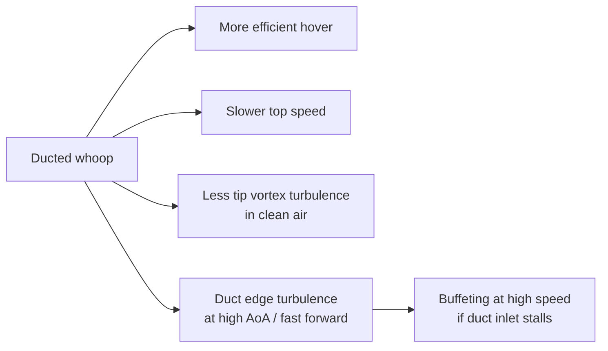

Duct'as (gaubtas) aplink propelerį pakeičia, kaip oras įteka ir išteka pro diską — ir stipriai pakeičia efektyvumą, traukos/dydžio santykį bei valdymą. Tiny whoop'ai (Mobula, BetaFPV Meteor — 1S, 65–75 mm) ir didesni ducted cinewhoop'ai (BetaFPV 2.2" Pavo20, 3S) duct'us naudoja pirmiausia propams apsaugoti, bet aerodinaminiai efektai yra realūs ir lemia, kaip šie rėmai skrenda, palyginus su analogiškais open-prop dizainais. (Ilgai maniau, kad duct'as — vien apsauga nuo sienų. Klydau.)

---

## Ką duct'as daro oro srautui

Propeleris sukasi horizontalioje plokštumoje ir traukia orą žemyn pro diską. Ant atviro propo slėgio skirtumas tarp mentelės viršaus ir apačios prasiveržia aplink **galą**, susisukdamas į paskui tempiamą sūkurį, kuris nusisuka nuo krašto — jis sumažina efektyvų diską, švaisto energiją ir kelia triukšmą. Duct'as su ankštu galo tarpu tą nuotėkį užkerta: srautas lieka ašinis, galo nuostolis atgaunamas, o suapvalinta įėjimo lūpa pagreitina įtekantį orą lyg venturi.

```p5js
const p = sketch;
// Two rotors seen from the side (edge-on horizontal disk). Left = open prop:
// air leaks around the tips into trailing vortices. Right = ducted: the wall
// blocks the leak, flow stays collimated. Blades sweep the disk in perspective.
const W = 560, H = 380;
const xL = 140, xR = 420, diskY = 92, R = 60, eh = 9;
let flow = [], vort = [];
let bladeA = 0;

function axial(open, init) {
  const cx = open ? xL : xR;
  return { open, x: cx + p.random(-R * 0.9, R * 0.9),
           y: init ? p.random(15, H - 60) : p.random(12, 40),
           vx: 0, vy: p.random(1.4, 2.3), age: 0, life: p.random(130, 210) };
}
function vortex(side, init) {
  return { side, a: p.random(p.TWO_PI), age: init ? p.random(0, 60) : 0, life: p.random(70, 120) };
}

p.setup = function () {
  p.createCanvas(W, H);
  p.textFont('monospace');
  for (let i = 0; i < 80; i++) { flow.push(axial(true, true)); flow.push(axial(false, true)); }
  for (let i = 0; i < 26; i++) { vort.push(vortex(-1, true)); vort.push(vortex(1, true)); }
};

p.draw = function () {
  p.background(17, 17, 17, 60);
  bladeA += 0.16;

  disk(xL, 1);
  duct();
  disk(xR, -1);

  for (let i = flow.length - 1; i >= 0; i--) {
    const f = flow[i];
    const cx = f.open ? xL : xR;
    const below = f.y > diskY;
    if (f.open) {
      if (below) f.vx += (f.x - cx) * 0.0016;      // tip loss spreads the wake
      f.y += f.vy + (below ? 0.6 : 0);
      p.fill(80, 160, 255, 170 * (1 - f.age / f.life));
    } else {
      if (f.y < diskY + 150) f.vx *= 0.8; else f.vx += (f.x - cx) * 0.0006;
      f.y += f.vy + (below ? 1.0 : 0);             // faster, collimated exit
      p.fill(80, 220, 130, 170 * (1 - f.age / f.life));
    }
    f.x += f.vx; f.age++;
    p.noStroke(); p.ellipse(f.x, f.y, 3.4, 3.4);
    if (f.age > f.life || f.y > H - 18) flow[i] = axial(f.open, false);
  }

  // open-prop tip vortices: rolling cores shed off each tip, trailing downstream
  for (let i = vort.length - 1; i >= 0; i--) {
    const v = vort[i];
    v.a += 0.26; v.age++;
    const cx = xL + v.side * R + v.side * (3 + v.age * 0.16);
    const cy = diskY + v.age * 1.5;
    const ro = 5 + v.age * 0.06;
    const px = cx + Math.cos(v.a) * ro * v.side;
    const py = cy + Math.sin(v.a) * ro * 0.7;
    p.noStroke(); p.fill(255, 85, 80, 190 * (1 - v.age / v.life));
    p.ellipse(px, py, 3.6, 3.6);
    if (v.age > v.life || py > H - 22) vort[i] = vortex(v.side, false);
  }

  p.stroke(255, 90, 80, 150); p.strokeWeight(1.5);   // radial tip leak
  for (const s of [-1, 1]) {
    const ax = xL + s * (R + 3);
    p.line(ax, diskY, ax + s * 15, diskY - 3);
    p.line(ax + s * 15, diskY - 3, ax + s * 10, diskY - 7);
    p.line(ax + s * 15, diskY - 3, ax + s * 10, diskY + 1);
  }

  overlay();
};

function disk(cx, dir) {
  p.noFill(); p.stroke(100, 170, 255, 50); p.strokeWeight(1);
  p.ellipse(cx, diskY, R * 2, eh * 2);
  p.stroke(120, 190, 255); p.strokeWeight(3);
  const bx = Math.cos(bladeA * dir) * R, by = Math.sin(bladeA * dir) * eh;
  p.line(cx - bx, diskY - by, cx + bx, diskY + by);
  p.strokeWeight(2); p.stroke(120, 190, 255, 150);
  const b2 = bladeA * dir + p.PI / 2;
  p.line(cx - Math.cos(b2) * R * 0.55, diskY - Math.sin(b2) * eh * 0.55,
         cx + Math.cos(b2) * R * 0.55, diskY + Math.sin(b2) * eh * 0.55);
  p.noStroke(); p.fill(90, 90, 100); p.ellipse(cx, diskY, 12, 8);
}

function duct() {
  const drad = R + 6, top = diskY - 22, ductH = 130;
  p.stroke(150, 165, 185); p.strokeWeight(4); p.noFill();
  for (const s of [-1, 1]) {
    p.beginShape();
    p.vertex(xR + s * (drad + 4), top);
    p.vertex(xR + s * drad, top + 22);
    p.vertex(xR + s * drad, top + ductH);
    p.vertex(xR + s * (drad + 5), top + ductH + 16);
    p.endShape();
  }
  p.stroke(150, 235, 160, 160); p.strokeWeight(1.6);
  for (const s of [-1, 1]) {
    const ax = xR + s * (drad - 6);
    for (let ay = top - 34; ay <= top - 6; ay += 14) {
      p.line(ax, ay, ax, ay + 9);
      p.line(ax, ay + 11, ax - 3, ay + 6);
      p.line(ax, ay + 11, ax + 3, ay + 6);
    }
  }
}

function overlay() {
  p.stroke(50); p.strokeWeight(1); p.line(W / 2, 18, W / 2, H - 18);
  p.noStroke(); p.textAlign(p.CENTER);
  p.fill(210); p.textSize(12);
  p.text("Open prop", xL, H - 8);
  p.text("Ducted (shroud)", xR, H - 8);
  p.fill(255, 90, 80); p.textSize(10); p.text("tip vortex + radial leak", xL, H - 24);
  p.fill(90, 220, 130); p.text("collimated, no tip vortex", xR, H - 24);
}
```

**Kairė (open):** oras prasiveržia aplink mentelių galus ir susisuka į paskui tempiamus sūkurius (raudona), kurie nusisuka žemyn — švaistoma energija, o pėdsakas išsisklaido. **Dešinė (ducted):** sienelė sustabdo galo nuotėkį, tad srautas lieka ašinis ir išteka kaip greitesnė, sukolimuota srovė prie tos pačios galios.

---

## Duct'as — tai ne prop guard

Lengva pamanyti, kad bet koks žiedas aplink propą yra duct'as. Nėra. **Prop guard** — tai atviras lankas, kurio vienintelis darbas neleisti mentelėms atsitrenkti į daiktus: jis stovi gerokai atokiau nuo galų, neturi formuotos įėjimo lūpos ir nėra ištisinė sienelė — tad aerodinamiškai jis nieko naudingo nedaro. Jis negali nei atgauti galo sūkurio, nei pagreitinti įtekančio oro. Tik sėdi pėdsake, pridėdamas pasipriešinimo ir svorio.

**Duct'as** savo vardą užsitarnauja per tris dalykus, kurių guard'as neturi: suapvalinta **įėjimo lūpa**, **ištisinė sienelė** ir *sąmoningai ankštas* **galo tarpas**. Būtent jie paverčia buferį aerodinaminiu paviršiumi — užkerta galo nuotėkį ir pagreitina įtekantį orą. Atleisk toleranciją — ir duct'as degraduoja atgal į brangų prop guard'ą: tarpas praleidžia, galo sūkurys atsikuria, o efektyvumo priedas išgaruoja (žr. tarpo grafiką žemiau).

| | Prop guard | Duct |
|---|-----------|------|
| Galo tarpas | didelis, nekontroliuojamas | ankštas (siek <5% chord) |
| Įėjimo lūpa | nėra | suapvalinta / formuota |
| Sienelė | atviras lankas | ištisinis gaubtas |
| Aerodinaminis efektas | jokio — vien pasipriešinimas | galo nuostolio atgavimas + venturi |
| Paskirtis | apsauga per krašą | apsauga **ir** efektyvumas |

Ir guard'as, ir duct'as prideda pasipriešinimo, palyginus su pliku open propu — tai ir yra kompromisas. Mainai maksimalų greitį ir šiek tiek svorio arba į apsaugą per krašą (guard), arba į hover efektyvumą plius apsaugą (duct).

---

## Ducted propai — tai ne open propai

Mentelės sekcijos skirtinguose spinduliuose juda labai skirtingu greičiu — galas lekia daug greičiau nei šaknis (`V = Ω·r`), tad išorinė mentelės dalis atlieka daugiausiai darbo *ir* meta stipriausią sūkurį. Open propas priverstas **nukrauti savo galą** — susiaurinti chord ir sumažinti pitch prie pabaigos — kad suvaldytų tą sūkurį, jo nuostolius ir triukšmą.

Duct'e galo sūkurys nuslopintas, tad projektavimo apribojimas apsiverčia: ducted propas gali turėti **platesnį, labiau apkrautą galą**, nes už jį nebemoka sūkurio baudos. Tas papildomas galo plotas — tai *dirbantis* plotas, tad efektyvumas kyla dar labiau. Visas mentelės profilis — chord pasiskirstymas, pitch, galo forma — tikrai skiriasi nuo open propo, suderintas su gaubtu. Įmetęs open propą į duct'ą gausi tik dalį naudos; duct'ui pritaikytas propas duoda likusią.

```mermaid
flowchart LR
    T[Blade tip: fastest section<br/>V grows with radius] --> O[Open prop<br/>must unload the tip<br/>to tame the vortex]
    T --> D[Ducted prop<br/>vortex suppressed by wall<br/>can load a broad tip]
    D --> E[More working tip area<br/>higher hover efficiency]
    style D fill:#1a3a1a,stroke:#4a8a4a
    style E fill:#1a3a1a,stroke:#4a8a4a
```



---

## Venturi efektas ties duct'o lūpa

Duct'o įėjimas projektuojamas su suapvalinta priekine briauna (**lūpa**). Ji pagreitina įtekantį orą tiesiai prieš rotoriaus diską — klasikinis venturi efektas: siaurėjantis skerspjūvis → didesnis greitis → mažesnis slėgis, kuris įtraukia orą. Rezultatas — didesnis efektyvus masės srautas nei atviro propo, esant tam pačiam skersmeniui ir tiems patiems RPM.

```mermaid
flowchart LR
    A[Ambient air] -->|approaches duct lip| B[Lip accelerates<br/>inflow — Bernoulli]
    B --> C[Rotor disk<br/>high pressure differential]
    C --> D[Collimated exit<br/>high velocity jet]
    D --> E[Thrust]
    style B fill:#1a3a1a,stroke:#4a8a4a
    style D fill:#1a3a1a,stroke:#4a8a4a
```



---

## Efektyvumas vs open prop

Duct'o nauda kritiškai priklauso nuo **tarpo (gap) dydžio** — atstumo tarp mentelės galo ir duct'o sienelės. Kuo tarpas mažesnis, tuo labiau slopinamas galo nuostolis.

```chart
{
  "type": "bar",
  "data": {
    "labels": ["Open prop", "Duct gap 5% chord", "Duct gap 2% chord", "Duct gap <1% chord"],
    "datasets": [
      {
        "label": "Relative thrust per watt (hover)",
        "data": [100, 105, 112, 118],
        "backgroundColor": ["rgba(100,150,255,0.7)","rgba(80,200,120,0.5)","rgba(80,200,120,0.7)","rgba(80,220,120,0.9)"],
        "borderColor": ["rgba(100,150,255,1)","rgba(80,200,120,1)","rgba(80,200,120,1)","rgba(80,220,120,1)"],
        "borderWidth": 1.5
      }
    ]
  },
  "options": {
    "responsive": true,
    "plugins": {
      "title": { "display": true, "text": "Duct gap clearance vs relative hover efficiency (open = 100)" },
      "legend": { "display": false }
    },
    "scales": {
      "y": {
        "min": 90,
        "title": { "display": true, "text": "Relative efficiency (%)" }
      }
    }
  }
}
```

Liejimo (injection-molded) whoop'ų duct'ai turi santykinai didelius tarpus (3–5% chord), nes gamybos tolerancija riboja galo tarpą. Custom 3D spausdinti ir carbon duct'ai gali būti gerokai ankštesni.

---

## Kompromisai vs open props

| Savybė | Open | Ducted |
|----------|------|--------|
| Hover efektyvumas (tas pats skersmuo, ta pati galia) | Bazinis | +5–18% priklausomai nuo tarpo |
| Maksimalus greitis | Didesnis — nėra duct'o pasipriešinimo greityje | Mažesnis — duct'as prideda pasipriešinimo skrendant į priekį |
| Propwash turbulencija | Reikšminga (platus išsklidimas) | Sumažinta — ištekėjimo srovė labiau nukreipta |
| Atsparumas smūgiams | Propai atviri | Propai apsaugoti |
| Svoris | Mažesnis | +duct'o rėmo masė |
| Triukšmas | Vidutinis | Dažnai tylesnis (sumažintas tip vortex) |
| Mastelio keitimas (scaling) | Gerai skaliuojasi | Nauda mažėja prie didelio skersmens |

Hover'e gautas efektyvumo pranašumas apsiverčia skrendant greitai į priekį — tada duct'as tampa pasipriešinimo paviršiumi. Būtent todėl racing dronai visi yra open-prop: daugumą energijos jie leidžia greityje, o ne kabodami.

---

## Ką tai reiškia ducted whoop'ams

Pavo20 Pro II ir panašūs 2.2" ducted cinewhoop'ai skrenda tokiame režime, kur hover efektyvumas svarbus — skrydis patalpose, proximity, lėta kinematografija. Duct'as taip pat laiko propus atokiau nuo kliūčių, o tai ir yra pagrindinis dizaino veiksnys šioje ~70–110 g klasėje.

Tačiau ta pati duct'o geometrija, kuri padeda hover'e, sukuria skirtingą skrydžio pojūtį, palyginus su open-prop dronais:



**Duct inlet stall** (duct'o įėjimo srauto atplyšimas) įvyksta, kai dronas skrenda į priekį pakankamai greitai, kad duct'o priekinę briauną pasiektų didelis atakos kampas — lūpa nebesklandžiai greitina įtekantį orą, o vietoj to sukuria srauto atsiskyrimą. Tai paprastai jaučiama kaip staigus kilimo galios kritimas per greitus perėjimus skrendant į priekį.

---

## Galo tarpas (tip clearance) nudėvėtuose whoop'uose

Mentelių galai po apkrova šiek tiek lankstosi. Propams senstant ir atsirandant mikroįtrūkimams, galo nukrypimas didėja. Jei galas kad ir trumpam paliečia duct'o sienelę, rezultatas — garsus trakštelėjimas, propo pažeidimas ir galimai krašas. Prieš skrydį patikrink propų galus ir vidines duct'o sieneles dėl nusidėvėjimo žymių — lengvas įbrėžimas normalu, gilios vagos reiškia, kad propus laikas keisti.

---

## Susiję

- [Propwash](../propwash/)
- [KV ir propelerių derinimas](../../motors-esc/kv-prop-matcher/)
- [Preflight Checklist](../../setup-safety/preflight-checklist/)
- [INAV vs Betaflight](../../reference/inav-vs-betaflight/)
