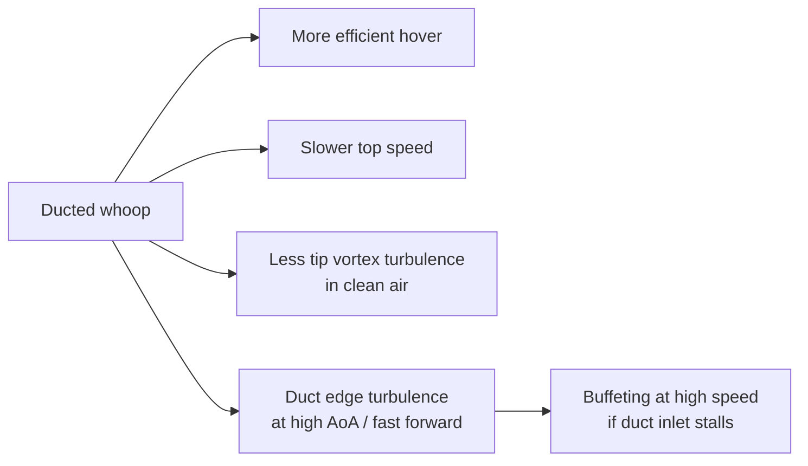

A duct (shroud) around a propeller changes how air enters and exits the disk — and significantly changes efficiency, thrust-to-size ratio, and handling. Tiny whoops (Mobula, BetaFPV Meteor — 1S, 65–75 mm) and larger ducted cinewhoops (BetaFPV's 2.2" Pavo20, 3S) use ducts primarily for prop protection, but the aerodynamic effects are real and shape how these frames fly vs equivalent open-prop designs.

---

## What a Duct Does to Airflow

The prop spins in the horizontal plane and pulls air down through the disk. On an open prop the pressure difference between the top and bottom of each blade leaks around the **tip**, rolling into a trailing vortex that spins off the edge — it shrinks the effective disk, wastes energy, and makes noise. A duct with tight tip clearance blocks that leak: the flow stays axial, the tip loss is recovered, and the rounded inlet lip accelerates inflow like a venturi.

```p5js
const p = sketch;
// Two rotors seen from the side (edge-on horizontal disk). Left = open prop:
// air leaks around the tips into trailing vortices. Right = ducted: the wall
// blocks the leak, flow stays collimated. Blades sweep the disk in perspective.
const W = 560, H = 380;
const xL = 140, xR = 420, diskY = 92, R = 60, eh = 9;
let flow = [], vort = [];
let bladeA = 0;

function axial(open, init) {
  const cx = open ? xL : xR;
  return { open, x: cx + p.random(-R * 0.9, R * 0.9),
           y: init ? p.random(15, H - 60) : p.random(12, 40),
           vx: 0, vy: p.random(1.4, 2.3), age: 0, life: p.random(130, 210) };
}
function vortex(side, init) {
  return { side, a: p.random(p.TWO_PI), age: init ? p.random(0, 60) : 0, life: p.random(70, 120) };
}

p.setup = function () {
  p.createCanvas(W, H);
  p.textFont('monospace');
  for (let i = 0; i < 80; i++) { flow.push(axial(true, true)); flow.push(axial(false, true)); }
  for (let i = 0; i < 26; i++) { vort.push(vortex(-1, true)); vort.push(vortex(1, true)); }
};

p.draw = function () {
  p.background(17, 17, 17, 60);
  bladeA += 0.16;

  disk(xL, 1);
  duct();
  disk(xR, -1);

  for (let i = flow.length - 1; i >= 0; i--) {
    const f = flow[i];
    const cx = f.open ? xL : xR;
    const below = f.y > diskY;
    if (f.open) {
      if (below) f.vx += (f.x - cx) * 0.0016;      // tip loss spreads the wake
      f.y += f.vy + (below ? 0.6 : 0);
      p.fill(80, 160, 255, 170 * (1 - f.age / f.life));
    } else {
      if (f.y < diskY + 150) f.vx *= 0.8; else f.vx += (f.x - cx) * 0.0006;
      f.y += f.vy + (below ? 1.0 : 0);             // faster, collimated exit
      p.fill(80, 220, 130, 170 * (1 - f.age / f.life));
    }
    f.x += f.vx; f.age++;
    p.noStroke(); p.ellipse(f.x, f.y, 3.4, 3.4);
    if (f.age > f.life || f.y > H - 18) flow[i] = axial(f.open, false);
  }

  // open-prop tip vortices: rolling cores shed off each tip, trailing downstream
  for (let i = vort.length - 1; i >= 0; i--) {
    const v = vort[i];
    v.a += 0.26; v.age++;
    const cx = xL + v.side * R + v.side * (3 + v.age * 0.16);
    const cy = diskY + v.age * 1.5;
    const ro = 5 + v.age * 0.06;
    const px = cx + Math.cos(v.a) * ro * v.side;
    const py = cy + Math.sin(v.a) * ro * 0.7;
    p.noStroke(); p.fill(255, 85, 80, 190 * (1 - v.age / v.life));
    p.ellipse(px, py, 3.6, 3.6);
    if (v.age > v.life || py > H - 22) vort[i] = vortex(v.side, false);
  }

  p.stroke(255, 90, 80, 150); p.strokeWeight(1.5);   // radial tip leak
  for (const s of [-1, 1]) {
    const ax = xL + s * (R + 3);
    p.line(ax, diskY, ax + s * 15, diskY - 3);
    p.line(ax + s * 15, diskY - 3, ax + s * 10, diskY - 7);
    p.line(ax + s * 15, diskY - 3, ax + s * 10, diskY + 1);
  }

  overlay();
};

function disk(cx, dir) {
  p.noFill(); p.stroke(100, 170, 255, 50); p.strokeWeight(1);
  p.ellipse(cx, diskY, R * 2, eh * 2);
  p.stroke(120, 190, 255); p.strokeWeight(3);
  const bx = Math.cos(bladeA * dir) * R, by = Math.sin(bladeA * dir) * eh;
  p.line(cx - bx, diskY - by, cx + bx, diskY + by);
  p.strokeWeight(2); p.stroke(120, 190, 255, 150);
  const b2 = bladeA * dir + p.PI / 2;
  p.line(cx - Math.cos(b2) * R * 0.55, diskY - Math.sin(b2) * eh * 0.55,
         cx + Math.cos(b2) * R * 0.55, diskY + Math.sin(b2) * eh * 0.55);
  p.noStroke(); p.fill(90, 90, 100); p.ellipse(cx, diskY, 12, 8);
}

function duct() {
  const drad = R + 6, top = diskY - 22, ductH = 130;
  p.stroke(150, 165, 185); p.strokeWeight(4); p.noFill();
  for (const s of [-1, 1]) {
    p.beginShape();
    p.vertex(xR + s * (drad + 4), top);
    p.vertex(xR + s * drad, top + 22);
    p.vertex(xR + s * drad, top + ductH);
    p.vertex(xR + s * (drad + 5), top + ductH + 16);
    p.endShape();
  }
  p.stroke(150, 235, 160, 160); p.strokeWeight(1.6);
  for (const s of [-1, 1]) {
    const ax = xR + s * (drad - 6);
    for (let ay = top - 34; ay <= top - 6; ay += 14) {
      p.line(ax, ay, ax, ay + 9);
      p.line(ax, ay + 11, ax - 3, ay + 6);
      p.line(ax, ay + 11, ax + 3, ay + 6);
    }
  }
}

function overlay() {
  p.stroke(50); p.strokeWeight(1); p.line(W / 2, 18, W / 2, H - 18);
  p.noStroke(); p.textAlign(p.CENTER);
  p.fill(210); p.textSize(12);
  p.text("Open prop", xL, H - 8);
  p.text("Ducted (shroud)", xR, H - 8);
  p.fill(255, 90, 80); p.textSize(10); p.text("tip vortex + radial leak", xL, H - 24);
  p.fill(90, 220, 130); p.text("collimated, no tip vortex", xR, H - 24);
}
```

**Left (open):** air leaks around the blade tips and rolls into trailing vortices (red) that spin off downstream — wasted energy, and the wake spreads. **Right (ducted):** the wall stops the tip leak, so the flow stays axial and exits as a faster, collimated jet for the same power.

---

## A Duct Is Not a Prop Guard

It is tempting to assume any ring around a prop is a duct. It is not. A **prop guard** is an open hoop whose only job is to stop the blades hitting things: it sits well clear of the tips, has no shaped inlet, and is not a continuous wall — so aerodynamically it does nothing useful. It cannot recover the tip vortex or accelerate inflow. It just sits in the wake adding drag and weight.

A **duct** earns its name through three things a guard lacks: a rounded **inlet lip**, a **continuous wall**, and a *deliberately tight* **tip clearance**. Those are what turn a bumper into an aerodynamic surface — killing the tip leak and accelerating inflow. Slacken the tolerance and a duct degrades right back into an expensive prop guard: the gap leaks, the tip vortex reforms, and the efficiency gain evaporates (see the gap chart below).

| | Prop guard | Duct |
|---|-----------|------|
| Tip clearance | large, uncontrolled | tight (aim <5% chord) |
| Inlet lip | none | rounded / shaped |
| Wall | open hoop | continuous shroud |
| Aerodynamic effect | none — pure drag | tip-loss recovery + venturi inflow |
| Purpose | crash protection | protection **and** efficiency |

Both a guard and a duct add drag compared with a bare open prop — that is the compromise. You trade top-end speed and a little weight for either crash protection (guard) or hover efficiency plus protection (duct).

---

## Ducted Props Are Not Open Props

Blade sections at different radii move at wildly different speeds — the tip travels far faster than the root (`V = Ω·r`), so the outer blade does most of the work *and* sheds the strongest vortex. An open prop has to **unload its tip** — taper the chord and wash out the pitch near the end — to keep that vortex, and its losses and noise, under control.

Inside a duct the tip vortex is suppressed, which flips the design constraint: a ducted prop can carry a **broader, more loaded tip** because it no longer pays the vortex penalty for it. That extra tip area is *working* area, so it pushes efficiency up even further. The whole blade profile — chord distribution, pitch, tip shape — is genuinely different from an open prop, tuned to the shroud. Dropping an open prop into a duct captures only part of the gain; a duct-matched prop captures the rest.

```mermaid
flowchart LR
    T[Blade tip: fastest section<br/>V grows with radius] --> O[Open prop<br/>must unload the tip<br/>to tame the vortex]
    T --> D[Ducted prop<br/>vortex suppressed by wall<br/>can load a broad tip]
    D --> E[More working tip area<br/>higher hover efficiency]
    style D fill:#1a3a1a,stroke:#4a8a4a
    style E fill:#1a3a1a,stroke:#4a8a4a
```



---

## Venturi Effect at the Duct Lip

The duct inlet is designed with a rounded leading edge (the **lip**). This accelerates inflow just before the rotor disk — the classic venturi effect: narrowing cross-section → higher velocity → lower pressure, which draws air in. The result is a higher effective mass flow rate than an open prop of the same diameter spinning at the same RPM.

```mermaid
flowchart LR
    A[Ambient air] -->|approaches duct lip| B[Lip accelerates<br/>inflow — Bernoulli]
    B --> C[Rotor disk<br/>high pressure differential]
    C --> D[Collimated exit<br/>high velocity jet]
    D --> E[Thrust]
    style B fill:#1a3a1a,stroke:#4a8a4a
    style D fill:#1a3a1a,stroke:#4a8a4a
```



---

## Efficiency vs Open Prop

The duct's benefit depends critically on **gap clearance** — the distance between blade tip and duct wall. The tighter the gap, the more tip loss is suppressed.

```chart
{
  "type": "bar",
  "data": {
    "labels": ["Open prop", "Duct gap 5% chord", "Duct gap 2% chord", "Duct gap <1% chord"],
    "datasets": [
      {
        "label": "Relative thrust per watt (hover)",
        "data": [100, 105, 112, 118],
        "backgroundColor": ["rgba(100,150,255,0.7)","rgba(80,200,120,0.5)","rgba(80,200,120,0.7)","rgba(80,220,120,0.9)"],
        "borderColor": ["rgba(100,150,255,1)","rgba(80,200,120,1)","rgba(80,200,120,1)","rgba(80,220,120,1)"],
        "borderWidth": 1.5
      }
    ]
  },
  "options": {
    "responsive": true,
    "plugins": {
      "title": { "display": true, "text": "Duct gap clearance vs relative hover efficiency (open = 100)" },
      "legend": { "display": false }
    },
    "scales": {
      "y": {
        "min": 90,
        "title": { "display": true, "text": "Relative efficiency (%)" }
      }
    }
  }
}
```

Injection-molded whoop ducts have relatively large gaps (3–5% chord) because manufacturing tolerance limits tip clearance. Custom 3D-printed and carbon ducts can get much tighter.

---

## Trade-offs vs Open Props

| Property | Open | Ducted |
|----------|------|--------|
| Hover efficiency (same diameter, same power) | Baseline | +5–18% depending on gap |
| Peak speed | Higher — no duct drag at speed | Lower — duct adds drag in forward flight |
| Prop wash turbulence | Significant (wide spread) | Reduced — exit jet is more directed |
| Impact resistance | Props exposed | Props protected |
| Weight | Lower | +duct frame mass |
| Noise | Moderate | Often quieter (tip vortex reduced) |
| Scaling | Scales well | Benefit decreases at large diameter |

The efficiency gain at hover reverses in fast forward flight — the duct becomes a drag surface. This is why racing quads are all open-prop: they spend most of their energy at speed, not hovering.

---

## What This Means for Ducted Whoops

The Pavo20 Pro II and similar 2.2" ducted cinewhoops fly in a regime where hover efficiency matters — indoor flight, close-proximity, slow cinematics. The duct also keeps props away from obstacles, which is the primary design driver in this ~70–110 g class.

However the same duct geometry that helps at hover creates a flight characteristic difference from open-prop quads:



**Duct inlet stall** occurs when the craft flies forward fast enough that the duct leading edge sees a high angle of attack — the lip no longer smoothly accelerates inflow and instead generates separation. This is typically felt as a sudden reduction in climb authority during fast forward flight transitions.

---

## Tip Clearance on Worn Whoops

Blade tips flex slightly under load. As props age and develop micro-cracks, tip deflection increases. If the tip contacts the duct wall even transiently, the result is a loud crack, prop damage, and potentially a crash. Check prop tips and duct inner walls for wear marks during preflight — light scuffing is normal, deep grooves mean the props need replacement.

---

## Related

- [Propwash](../propwash/)
- [KV & Prop Matching](../../motors-esc/kv-prop-matcher/)
- [Preflight Checklist](../../setup-safety/preflight-checklist/)
- [INAV vs Betaflight](../../reference/inav-vs-betaflight/)
