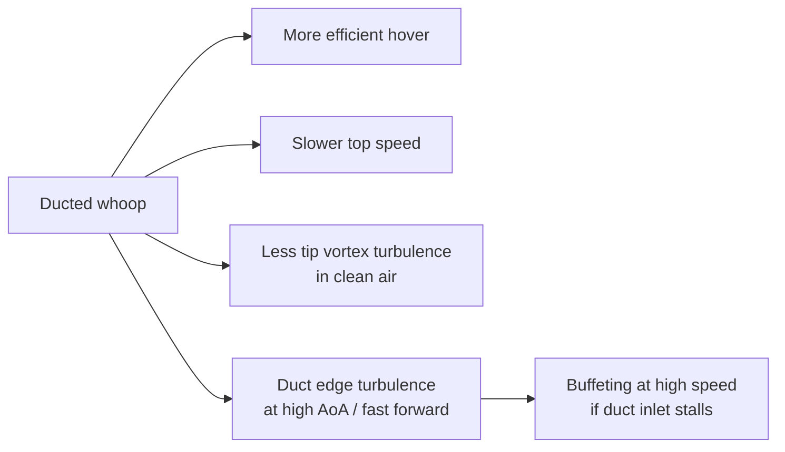

A duct (shroud) around a propeller changes how air enters and exits the disk — and significantly changes efficiency, thrust-to-size ratio, and handling. Tiny whoops (Mobula, BetaFPV Meteor, Pavo20) use ducts primarily for prop protection, but the aerodynamic effects are real and shape how these frames fly vs equivalent open-prop designs.

---

## What a Duct Does to Airflow

Without a duct, blade tip vortices form at the prop tip: the pressure differential between top and bottom of the blade leaks radially outward at the tip, rolling into a vortex that reduces effective disk area and wastes energy. The duct eliminates this — it keeps the air path axial, recovers the tip loss, and also acts as a venturi: slightly accelerating inflow at the duct lip.

```p5js
const p = sketch;
    var W=560,H=380;
    var particles=[], vortexParticles=[];
    var NUM=70, VNUM=40;

    function makeOpen(p,init){
      var side=p.random()<0.5?-1:1;
      var r=p.random(4,65);
      return {
        x:140+side*r, y:init?p.random(30,H-60):70+p.random(-8,8),
        vy:p.random(1.2,2.5), vx:side*p.random(0,0.3),
        age:init?p.random(0,100):0, maxAge:p.random(80,150),
        type:'open'
      };
    }

    function makeVortex(p,init){
      var side=p.random()<0.5?-1:1;
      return {
        x:140+side*p.random(60,85), y:init?p.random(70,200):85+p.random(-5,5),
        vx:side*p.random(0.8,2.0), vy:p.random(-0.5,0.5),
        age:init?p.random(0,50):0, maxAge:p.random(30,70), type:'vortex'
      };
    }

    function makeDucted(p,init){
      var r=p.random(4,58);
      var side=p.random()<0.5?-1:1;
      return {
        x:420+side*r, y:init?p.random(20,H-60):50+p.random(-5,5),
        vy:p.random(1.8,3.2), vx:side*p.random(0,0.1),
        age:init?p.random(0,100):0, maxAge:p.random(80,160),
        type:'ducted'
      };
    }

    p.setup=function(){
      p.createCanvas(W,H);
      p.textFont('monospace');
      for(var i=0;i<NUM;i++){
        particles.push(makeOpen(p,true));
        particles.push(makeDucted(p,true));
      }
      for(var i=0;i<VNUM;i++) vortexParticles.push(makeVortex(p,true));
    };

    p.draw=function(){
      p.background(17,17,17,55);

      // --- LEFT: Open prop ---
      // Prop disk zone
      p.stroke(100,180,255,40); p.strokeWeight(1); p.noFill();
      p.ellipse(140,85,140,16);
      // Prop
      p.stroke(100,180,255); p.strokeWeight(3);
      var t=p.frameCount*0.12;
      p.push(); p.translate(140,85); p.rotate(t); p.line(-62,0,62,0); p.pop();

      // Tip vortex spirals (static illustration)
      p.noFill(); p.strokeWeight(1.5);
      for(var s=0;s<2;s++){
        var sx=s===0?202:78;
        var sy=85;
        p.stroke(255,80,80,120);
        p.beginShape();
        for(var a=0;a<p.TWO_PI*2;a+=0.15){
          var rx=(s===0?1:-1)*a*7;
          var ry=a*12;
          p.curveVertex(sx+rx*0.5, sy+ry);
        }
        p.endShape();
      }

      // Open flow particles
      for(var i=particles.length-1;i>=0;i--){
        var pt=particles[i];
        if(pt.type!=='open') continue;
        var spread=(pt.y-85)/H*0.8;
        pt.vx+=(pt.x<140?-1:1)*spread*0.02;
        pt.x+=pt.vx; pt.y+=pt.vy; pt.age++;
        var frac=pt.age/pt.maxAge;
        p.noStroke(); p.fill(80,160,255,180*(1-frac));
        p.ellipse(pt.x,pt.y,3.5,3.5);
        if(pt.age>pt.maxAge||pt.y>H-20) particles[i]=makeOpen(p,false);
      }

      // Tip vortex particles
      for(var i=vortexParticles.length-1;i>=0;i--){
        var vp=vortexParticles[i];
        vp.x+=vp.vx; vp.y+=vp.vy+(vp.age*0.01); vp.age++;
        var frac2=vp.age/vp.maxAge;
        p.noStroke(); p.fill(255,80,80,200*(1-frac2));
        p.ellipse(vp.x,vp.y,4,4);
        if(vp.age>vp.maxAge) vortexParticles[i]=makeVortex(p,false);
      }

      // Left label
      p.fill(200); p.noStroke(); p.textSize(12); p.textAlign(p.CENTER);
      p.text("Open prop", 140, H-8);
      p.fill(255,80,80); p.textSize(10);
      p.text("tip vortex loss", 140, H-24);

      // --- DIVIDER ---
      p.stroke(50); p.strokeWeight(1);
      p.line(W/2,20,W/2,H-20);

      // --- RIGHT: Ducted ---
      var dcx=420, dcy=70, drad=68, ductH=110;
      // Duct walls
      p.stroke(140,160,180); p.strokeWeight(4); p.noFill();
      // Left wall
      p.beginShape();
      p.vertex(dcx-drad-4, dcy-20);
      p.vertex(dcx-drad, dcy);
      p.vertex(dcx-drad, dcy+ductH);
      p.vertex(dcx-drad-4, dcy+ductH+16);
      p.endShape();
      // Right wall
      p.beginShape();
      p.vertex(dcx+drad+4, dcy-20);
      p.vertex(dcx+drad, dcy);
      p.vertex(dcx+drad, dcy+ductH);
      p.vertex(dcx+drad+4, dcy+ductH+16);
      p.endShape();

      // Duct lip highlight
      p.stroke(180,220,255,80); p.strokeWeight(8);
      p.line(dcx-drad,dcy,dcx+drad,dcy);

      // Prop inside duct
      p.stroke(100,180,255); p.strokeWeight(3);
      p.push(); p.translate(dcx,dcy+15); p.rotate(-t*1.1);
      p.line(-62,0,62,0); p.pop();

      // Ducted flow particles — more collimated, faster
      for(var i=particles.length-1;i>=0;i--){
        var pt=particles[i];
        if(pt.type!=='ducted') continue;
        // Force alignment inside duct
        if(pt.y<dcy+ductH){
          pt.vx*=0.88;
        } else {
          // Exit: slight spread
          pt.vx+=(pt.x<dcx?-1:1)*0.06;
        }
        pt.x+=pt.vx; pt.y+=pt.vy; pt.age++;
        var frac=pt.age/pt.maxAge;
        p.noStroke(); p.fill(80,220,120,180*(1-frac));
        p.ellipse(pt.x,pt.y,3.5,3.5);
        if(pt.age>pt.maxAge||pt.y>H-20) particles[i]=makeDucted(p,false);
      }

      // Inflow acceleration arrows at lip
      p.stroke(180,255,180,100); p.strokeWeight(1.5); p.fill(180,255,180,120);
      for(var side2=-1;side2<=1;side2+=2){
        var ax=dcx+side2*(drad-20);
        for(var ay=dcy-45;ay<=dcy-5;ay+=18){
          p.line(ax,ay,ax,ay+12);
          p.triangle(ax,ay+16,ax-4,ay+9,ax+4,ay+9);
        }
      }

      p.fill(200); p.noStroke(); p.textSize(12); p.textAlign(p.CENTER);
      p.text("Ducted (shroud)", dcx, H-8);
      p.fill(80,220,120); p.textSize(10);
      p.text("collimated exit, no tip vortex", dcx, H-24);
    };
```

**Left (open):** tip vortex leakage (red) escapes radially at the blade tips — wasted energy. Flow spreads. **Right (ducted):** duct wall prevents tip escape, flow stays axial, exit velocity is higher for the same power.

---

## Venturi Effect at the Duct Lip

The duct inlet is designed with a rounded leading edge (the **lip**). This accelerates inflow just before the rotor disk — the classic venturi effect: narrowing cross-section → higher velocity → lower pressure, which draws air in. The result is a higher effective mass flow rate than an open prop of the same diameter spinning at the same RPM.

```mermaid
flowchart LR
    A[Ambient air] -->|approaches duct lip| B[Lip accelerates<br/>inflow — Bernoulli]
    B --> C[Rotor disk<br/>high pressure differential]
    C --> D[Collimated exit<br/>high velocity jet]
    D --> E[Thrust]
    style B fill:#1a3a1a,stroke:#4a8a4a
    style D fill:#1a3a1a,stroke:#4a8a4a
```



---

## Efficiency vs Open Prop

The duct's benefit depends critically on **gap clearance** — the distance between blade tip and duct wall. The tighter the gap, the more tip loss is suppressed.

```chart
{
  "type": "bar",
  "data": {
    "labels": ["Open prop", "Duct gap 5% chord", "Duct gap 2% chord", "Duct gap <1% chord"],
    "datasets": [
      {
        "label": "Relative thrust per watt (hover)",
        "data": [100, 105, 112, 118],
        "backgroundColor": ["rgba(100,150,255,0.7)","rgba(80,200,120,0.5)","rgba(80,200,120,0.7)","rgba(80,220,120,0.9)"],
        "borderColor": ["rgba(100,150,255,1)","rgba(80,200,120,1)","rgba(80,200,120,1)","rgba(80,220,120,1)"],
        "borderWidth": 1.5
      }
    ]
  },
  "options": {
    "responsive": true,
    "plugins": {
      "title": { "display": true, "text": "Duct gap clearance vs relative hover efficiency (open = 100)" },
      "legend": { "display": false }
    },
    "scales": {
      "y": {
        "min": 90,
        "title": { "display": true, "text": "Relative efficiency (%)" }
      }
    }
  }
}
```

Injection-molded whoop ducts have relatively large gaps (3–5% chord) because manufacturing tolerance limits tip clearance. Custom 3D-printed and carbon ducts can get much tighter.

---

## Trade-offs vs Open Props

| Property | Open | Ducted |
|----------|------|--------|
| Hover efficiency (same diameter, same power) | Baseline | +5–18% depending on gap |
| Peak speed | Higher — no duct drag at speed | Lower — duct adds drag in forward flight |
| Prop wash turbulence | Significant (wide spread) | Reduced — exit jet is more directed |
| Impact resistance | Props exposed | Props protected |
| Weight | Lower | +duct frame mass |
| Noise | Moderate | Often quieter (tip vortex reduced) |
| Scaling | Scales well | Benefit decreases at large diameter |

The efficiency gain at hover reverses in fast forward flight — the duct becomes a drag surface. This is why racing quads are all open-prop: they spend most of their energy at speed, not hovering.

---

## What This Means for Tiny Whoops

The Pavo20 Pro II and similar ducted whoops fly in a regime where hover efficiency matters — indoor flight, close-proximity, slow cinematics. The duct also keeps props away from obstacles, which is the primary design driver at <100g.

However the same duct geometry that helps at hover creates a flight characteristic difference from open-prop quads:



**Duct inlet stall** occurs when the craft flies forward fast enough that the duct leading edge sees a high angle of attack — the lip no longer smoothly accelerates inflow and instead generates separation. This is typically felt as a sudden reduction in climb authority during fast forward flight transitions.

---

## Tip Clearance on Worn Whoops

Blade tips flex slightly under load. As props age and develop micro-cracks, tip deflection increases. If the tip contacts the duct wall even transiently, the result is a loud crack, prop damage, and potentially a crash. Check prop tips and duct inner walls for wear marks during preflight — light scuffing is normal, deep grooves mean the props need replacement.

---

## Related

- [Propwash](../propwash/)
- [Preflight Checklist](../../setup-safety/preflight-checklist/)
- [INAV vs Betaflight](../../reference/inav-vs-betaflight/)
